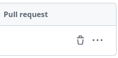

# How to Combine Local and Remote Branches
- Created: 2024-12-11 (Wed)
- Updated: 2025-02-10 (Mon)

## Problem
On my local machine, `git push` and `git pull` failed due to divergent branches.

### `git push`
```bash
$ git push
```
```bash
   ...
 ! [rejected]        main -> main (fetch first)
error: failed to push some refs to 'https://github.com/aimldl/vertex-ai.git'
hint: Updates were rejected because the remote contains work that you do
hint: not have locally. This is usually caused by another repository pushing
hint: to the same ref. You may want to first integrate the remote changes
hint: (e.g., 'git pull ...') before pushing again.
hint: See the 'Note about fast-forwards' in 'git push --help' for details.
$
```

As the message says
```bash
 ! [rejected]        main -> main (fetch first)
```
fetch first
```bash
$ git pull
```
```bash
remote: Enumerating objects: 8, done.
remote: Counting objects: 100% (8/8), done.
remote: Compressing objects: 100% (6/6), done.
remote: Total 6 (delta 4), reused 0 (delta 0), pack-reused 0 (from 0)
Unpacking objects: 100% (6/6), 1.90 KiB | 647.00 KiB/s, done.
From https://github.com/aimldl/vertex-ai
   8cc81fe..58ccdcf  main       -> origin/main
hint: You have divergent branches and need to specify how to reconcile them.
hint: You can do so by running one of the following commands sometime before
hint: your next pull:
hint: 
hint:   git config pull.rebase false  # merge
hint:   git config pull.rebase true   # rebase
hint:   git config pull.ff only       # fast-forward only
hint: 
hint: You can replace "git config" with "git config --global" to set a default
hint: preference for all repositories. You can also pass --rebase, --no-rebase,
hint: or --ff-only on the command line to override the configured default per
hint: invocation.
fatal: Need to specify how to reconcile divergent branches.
$
```
You have divergent branches and need to specify how to reconcile them.
You can do so by running one of the following commands sometime before your next pull:

```bash
  git config pull.rebase false  # merge
  git config pull.rebase true   # rebase
  git config pull.ff only       # fast-forward only
```

## Hint
Specify how to combine the changes in both branches.

### Check the existing branches
Use the web browser and go to the repository. And click `main` to see the following pull down menu.


Click `View all branches`.


Note the two branches are `gh-pages` under `Your branches` and `Active branches`. These branches are automatically created by Jupyter Book and a branch can be created again as long as the source codes in the `main` branch exist.

## Solution
### Delete the the two branches.
Click the delete button and delete the two branches.



`main` is the only branch left.


### Note: Deleting them won't fix the problem
Run `git pull` and
```bash
~/github/vertex-ai$ git pull
```
```bash
hint: You have divergent branches and need to specify how to reconcile them.
hint: You can do so by running one of the following commands sometime before
hint: your next pull:
hint: 
hint:   git config pull.rebase false  # merge
hint:   git config pull.rebase true   # rebase
hint:   git config pull.ff only       # fast-forward only
hint: 
hint: You can replace "git config" with "git config --global" to set a default
hint: preference for all repositories. You can also pass --rebase, --no-rebase,
hint: or --ff-only on the command line to override the configured default per
hint: invocation.
fatal: Need to specify how to reconcile divergent branches.
~/github/vertex-ai$
```

`git push` to check if the problem is fixed.

```bash
~/github/vertex-ai$ git push
```
```bash
  ...
To https://github.com/aimldl/vertex-ai.git
 ! [rejected]        main -> main (non-fast-forward)
error: failed to push some refs to 'https://github.com/aimldl/vertex-ai.git'
hint: Updates were rejected because the tip of your current branch is behind
hint: its remote counterpart. Integrate the remote changes (e.g.
hint: 'git pull ...') before pushing again.
hint: See the 'Note about fast-forwards' in 'git push --help' for details.
~/github/vertex-ai$
```
Nope.

### `git config pull.[seleccted option]` will solve the problem.
In the same directory `~/github/vertex-ai`, run
```bash
$ git config pull.rebase false
$
```
to merge the remote branch and the local one.

Run `git pull` and `git push`. And in this case, the problem has been fixed!
```bash
$ git pull
```
```bash
Merge made by the 'ort' strategy.
 README.md | 35 ++++++++++++++++-------------------
 1 file changed, 16 insertions(+), 19 deletions(-)
$
```
```bash
$ git push
```

```bash
  ...
Enumerating objects: 115, done.
Counting objects: 100% (83/83), done.
Delta compression using up to 12 threads
Compressing objects: 100% (49/49), done.
Writing objects: 100% (49/49), 48.61 KiB | 4.86 MiB/s, done.
Total 49 (delta 36), reused 0 (delta 0), pack-reused 0
remote: Resolving deltas: 100% (36/36), completed with 24 local objects.
To https://github.com/aimldl/vertex-ai.git
   58ccdcf..6fcd63e  main -> main
$
```

## Gemini Advanced
Ask Gemini:
```
Explain the following commands.
git config pull.rebase false # merge
git config pull.rebase true # rebase
git config pull.ff only # fast-forward only
```
and the answer is:
```
Let's break down these `git config` commands related to how `git pull` updates your local branch with changes from a remote branch.  They control the behavior when your local branch has diverged from the remote.

*   **`git config pull.rebase false` (Merge):** This is the default behavior. When you run `git pull`, and your local branch has diverged from the remote, Git will create a *merge commit*.  This commit has two parents: the tip of your local branch before the pull, and the tip of the remote branch you're pulling from.  This explicitly shows the point where the branches diverged and were rejoined.  It preserves the history of both branches in a more visually distinct way, but can lead to a more complex history with many merge commits.

*   **`git config pull.rebase true` (Rebase):**  This option changes `git pull` to use rebasing instead of merging.  When you run `git pull`, Git will take your local commits that are not yet on the remote branch, temporarily "set them aside," update your local branch to match the remote, and then apply your saved commits on top of the updated remote branch.  The result is a linear, cleaner history as if you had branched from the latest remote state.  However, rebasing rewrites history, which can be problematic if you've already pushed your local commits to a shared repository.  It can cause confusion and issues for collaborators.

*   **`git config pull.ff only` (Fast-forward only):** This tells `git pull` to only update your local branch if the remote branch can be fast-forwarded. A fast-forward is possible if the remote branch is a direct ancestor of your local branch (i.e., the remote has no new commits since you last synced).  If a fast-forward is not possible (because the remote has new commits), the pull command will fail. This option is useful for ensuring a linear history without any merge commits or rebasing. It prevents accidental non-fast-forward merges.

**In summary:**

| Command                  | Action                                                                   | Pros                                                                    | Cons                                                                               |
| ------------------------ | ------------------------------------------------------------------------- | ----------------------------------------------------------------------- | --------------------------------------------------------------------------------- |
| `git config pull.rebase false` | Merge (Default)                                                           | Preserves complete branch history, visually distinct divergence points.     | Can lead to a complex history with many merge commits.                             |
| `git config pull.rebase true`  | Rebase                                                                  | Creates a linear, cleaner history.                                       | Rewrites history, can cause issues if commits have been pushed to a shared repository. |
| `git config pull.ff only`   | Fast-forward only                                                       | Ensures a linear history, prevents accidental non-fast-forward merges. | Pull fails if a fast-forward is not possible.                                     |

Choosing the right option depends on your workflow and team conventions.  Rebasing is often preferred for personal branches before merging into a shared branch, while merging or fast-forward only are safer for shared branches to avoid rewriting history that others might have based their work on.
```

