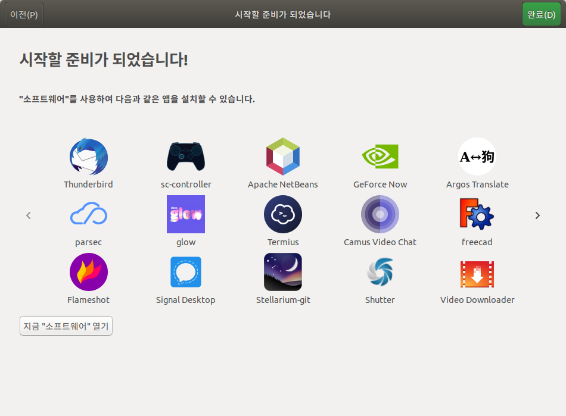

* Rev.1: 2020-11-14 (Sat)
* Draft: 2020-01-01 (Wed)

# 우분투 리눅스 (Ubuntu Linux)
* 공식 홈페이지: https://ubuntu.com/
* [우분투 (운영 체제)](https://ko.wikipedia.org/wiki/%EC%9A%B0%EB%B6%84%ED%88%AC_(%EC%9A%B4%EC%98%81_%EC%B2%B4%EC%A0%9C)), Wikipedia

## 설치하기
[우분투 리눅스 설치하기 (How to Install Ubuntu Linux)](INSTALL.md)를 참고하세요. 

## 우분투 추천 프로그램 리스트

## TODO

