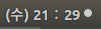
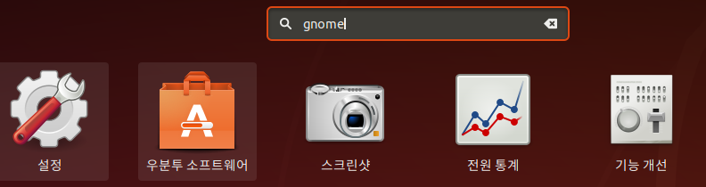
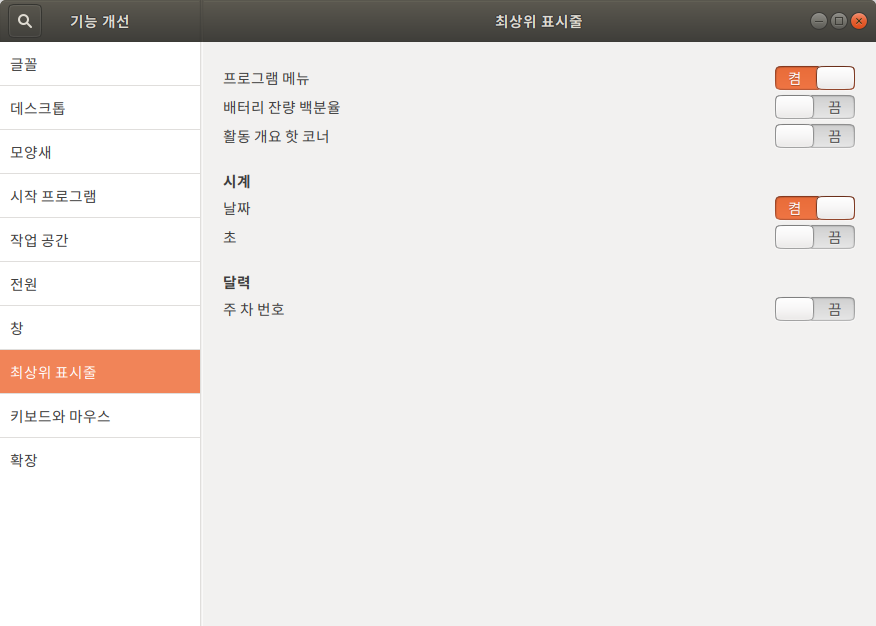

* Draft: 2021-01-27 (Wed)

# `최상위 표시줄`에 날씨 표시하는 방법

## 개요

우분투 18.04의 `최상위 표시줄 (Top bar)`에는 시간만 보입니다.



여기에 날짜도 같이 보여주고 싶습니다.


`GNOME Tweak Tool`로 설정을 변경하는 방법을 알아봅니다.

`GNOME Tweak Tool`에 대한 보다 다양한 정보는 [10 Ways to Customize Your Linux Desktop With GNOME Tweaks Tool](https://itsfoss.com/gnome-tweak-tool/)를 참고하세요.

## 변경하는 방법

### Step 1. `GNOME Tweak Tool`을 설치합니다.

```bash
$ sudo add-apt-repository universe
[sudo] aimldl의 암호: 
$ sudo apt install -y gnome-tweak-tool
```

### Step 2. 설치 후 실행합니다.

`Gnome Tweak Tool`을 찾아서



 실행합니다. 첫 화면은 아래와 같습니다.


### Step 3. 설정을 변경합니다.

`최상위 표시줄` 탭의 `시계`의 `날짜`가 `끔`으로 설정되어 있습니다.


마우스를 클릭해서 `켬`으로 변경합니다.



### Step 4. 변경사항을 확인합니다.

화면 위쪽에 있는 `최상위 표시줄`에 날짜도 같이 표시됨 확인합니다.


