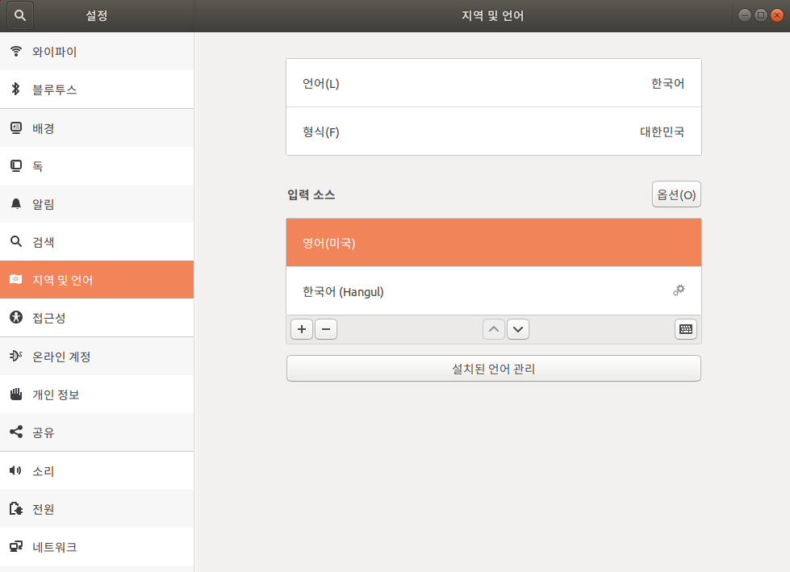

* Draft: 2021-08-06 (Fri)

# How to Configure to Use Korean on Ubuntu (18.04)

Step 1. Install Korean Language Packs
```bash
sudo apt update
sudo apt install -y language-pack-ko
sudo apt install -y korean*
```

Step 2. Add Input Source




Note: `IBUS` is selected.

Step 3. Switch to Korean
* `Super+Space` switches the language "mode" to Korean.
* Caution: this is not enough!
  * In the Korean "mode", you can switch back and forth between English (default) to Korean.
* Enter the `한/영` key to switch to the Korean input system within the Korean "mode".


Source: [언어 입력 키](https://ko.m.wikipedia.org/wiki/%EC%96%B8%EC%96%B4_%EC%9E%85%EB%A0%A5_%ED%82%A4#%ED%95%9C/%EC%98%81_%ED%82%A4), Wikipedia

