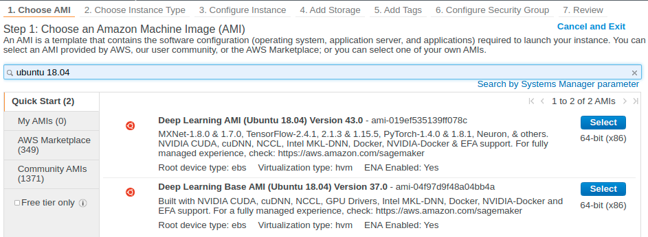
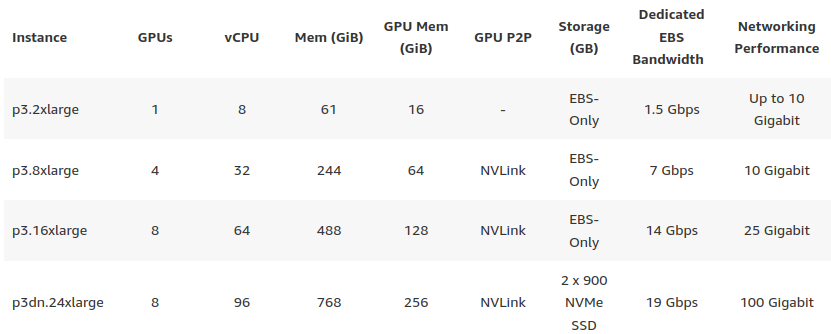
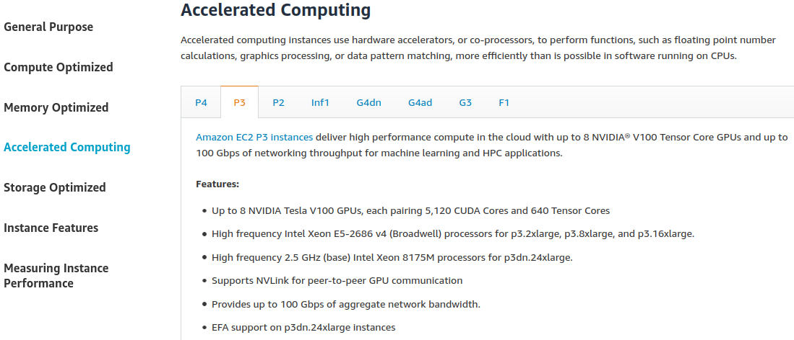
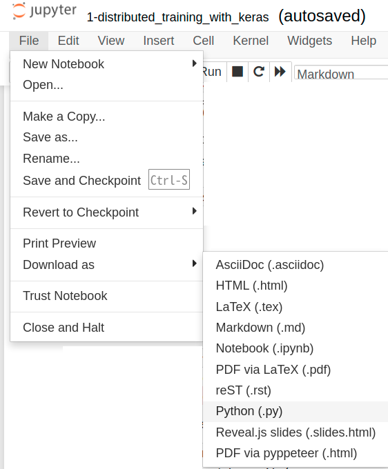

* Draft: 2021-05-25 (Tue)

## How to Set up Computing Environment for TensorFlow Distributed Computing on AWS

## 1. Purpose

* Run a Keras code for distributed computing on Amazon EC2 instance
  * [TensorFlow](https://www.tensorflow.org/) > Learn > TensorFlow Core > Tutorials > [Distributed training with Keras](https://www.tensorflow.org/tutorials/distribute/keras)
  * MNIST dataset with CNN
  * distributed computing strategy is data parallel
* The target instance is one with NVIDIA V100 GPUs.
* The original code in the example cannot be run on the EC2 instance as it is 
  * because an IPython notebook (`.ipynb`) is provided.
  * Converting it to `.py` code results in a sequence of errors due to
    * a series of `ModuleNotFoundError` and `NameError`
      * ModuleNotFoundError: No module named 'tensorflow_datasets'
      * NameError: name 'get_ipython' is not defined
* To run the Keras example code properly, several changes must be made.
* This document shows an example to set it up correctly.

## 2. Amazon EC2 instance setup

* AMI: `Deep Learning AMI (Ubuntu 18.04) Version 43.0`



* Instance: `p3.8xlarge`



* General information about the `p`-type instances



For details, refer to [Amazon EC2 Instance Types](https://aws.amazon.com/ec2/instance-types/)

### Setting up the created EC2 instance

The EC2 instance with Deep Learning AMI comes with Conda virtual environments.

```bash
$ conda info -e
# conda environments:
#
base                  *  /home/ubuntu/anaconda3
amazonei_mxnet_p36       /home/ubuntu/anaconda3/envs/amazonei_mxnet_p36
aws_neuron_mxnet_p36     /home/ubuntu/anaconda3/envs/aws_neuron_mxnet_p36
aws_neuron_pytorch_p36     /home/ubuntu/anaconda3/envs/aws_neuron_pytorch_p36
aws_neuron_tensorflow_p36     /home/ubuntu/anaconda3/envs/aws_neuron_tensorflow_p36
mxnet_latest_p37         /home/ubuntu/anaconda3/envs/mxnet_latest_p37
mxnet_p36                /home/ubuntu/anaconda3/envs/mxnet_p36
python3                  /home/ubuntu/anaconda3/envs/python3
pytorch_latest_p37       /home/ubuntu/anaconda3/envs/pytorch_latest_p37
pytorch_p36              /home/ubuntu/anaconda3/envs/pytorch_p36
tensorflow2_latest_p37     /home/ubuntu/anaconda3/envs/tensorflow2_latest_p37
tensorflow2_p36          /home/ubuntu/anaconda3/envs/tensorflow2_p36
tensorflow_p37           /home/ubuntu/anaconda3/envs/tensorflow_p37
$
```

Notice there are two Conda environments for TensorFlow 2.x.

* tensorflow2_latest_p37
* tensorflow2_p36

`tensorflow_p37` is for TensorFlow 1.x

## 3. Changing the Keras example code

* If you download the Keras example code, the file name is `keras.ipynb`.
* Export the Jupyter Notebook as a Python code.
  * File > Download as > Python (.py)
  * The `.ipynb` extension is changed to `.py`.



* Change a part of the Python code
  * from `get_ipython()`
  * to `os`
* There are two parts in the `.py` file. Changing these parts cures the `NameError`.

```python
# part 1
#get_ipython().system('ls {checkpoint_dir}')
os.system('ls {checkpoint_dir}')

# part 2
#get_ipython().system('ls -sh ./logs')
os.system('ls -sh ./logs')
```

* For readability, I've deleted some comments starting with `#`.
  * This doesn't affect the code itself.

## 4. Remote-access to the created EC2 instance

* Now the machine and Python code are ready. Let's run the code on the prepared machine.
* Remote-access the created EC2 instance with an `ssh` client program.
* The prompt looks something like this.

```bash
ubuntu@node0-4gpus:~$ 
```

For simplicity, the above prompt is abbreviated as

```bash
$
```

Just for your information, I've changed the host name to `node0-4gpus`.

Copy the files to the EC2 instance.

```bash
ubuntu@node0-4gpus:~$ ls
1-distributed_training_with_keras-mnist_cnn.py  keras.ipynb  keras.py
ubuntu@node0-4gpus:~$
```

| File name                                        | Description                                                  | Does this code run? |
| ------------------------------------------------ | ------------------------------------------------------------ | ------------------- |
| `keras.ipynb`                                    | the original IPython notebook downloaded from the tutorial   | No                  |
| `keras.py`                                       | exported as `.py` code                                       | No                  |
| `1-distributed_training_with_keras-mnist_cnn.py` | `keras.py` is edited to make it executable and renamed to `1-distributed*.py` | Yes                 |

## 5. Conda virtual environment setup

* Conda virtual environment is used in this document.
  * It is a good practice to use an isolated environment such as Conda virtual environment or Docker container.

* If you run the code without the virtual environment, the error is as follows:

```bash
$ python keras.py 
Traceback (most recent call last):
  File "keras.py", line 34, in <module>
    import tensorflow_datasets as tfds
ModuleNotFoundError: No module named 'tensorflow_datasets'
$
```

### tensorflow2_latest_p37

Activate the Conda virtual environment `tensorflow2_latest_p37`

```bash
$ conda activate tensorflow2_latest_p37
Installing TensorFlow optimized for your Amazon EC2 instance......
Env where framework will be re-installed: tensorflow2_latest_p37
Installation complete.
(tensorflow2_latest_p37) $
```

#### Problem 1

When the Python code is executed,`ModuleNotFound` error  occurs.

```bash
(tensorflow2_latest_p37) $ python keras.py 
Traceback (most recent call last):
  File "keras.py", line 64, in <module>
    import tensorflow_datasets as tfds
ModuleNotFoundError: No module named 'tensorflow_datasets'
(tensorflow2_latest_p37) $
```

#### Solution 1

```bash
$ pip install tensorflow_datasets
  ...
Successfully installed future-0.18.2 googleapis-common-protos-1.53.0 importlib-resources-5.1.4 promise-2.3 tensorflow-datasets-4.3.0 tensorflow-metadata-1.0.0
$
```

The error disappears and the code runs for a while.

#### Problem 2

The `.py` code should run properly 

* if you have changed `get_ipython` to `os` in the source code.

```bash
$ python keras.py 
2.4.1
  ...
```

Otherwise you will see the following error.

```bash
Traceback (most recent call last):
  File "keras.py", line 244, in <module>
    get_ipython().system('ls {checkpoint_dir}')
NameError: name 'get_ipython' is not defined
$
```

#### Solution 3

If you haven't made the changes, go back to the previous step and change the `.py` code.

> For your convenience, the corresponding step is shown below. (If the previous step is changed and doesn't match the following part, this part is out-dated.)
>
> * Change a part of the Python code
>   * from `get_ipython()`
>   * to `os`
> * There are two parts in the `.py` file. Changing these parts cures the `NameError`.
>
> ```bash
> # part 1
> #get_ipython().system('ls {checkpoint_dir}')
> os.system('ls {checkpoint_dir}')
> 
> # part 2
> #get_ipython().system('ls -sh ./logs')
> os.system('ls -sh ./logs')
> ```

## 6. Run the code

* Everything must be ready by now.
* The code must run till the end as follows.

```bash
$ python 1-distributed_training_with_keras-mnist_cnn.py
2.4.1
Downloading and preparing dataset 11.06 MiB (download: 11.06 MiB, generated: 21.00 MiB, total: 32.06 MiB) to /home/ubuntu/tensorflow_datasets/mnist/3.0.1...
Dl Completed...: 100%|█████████████████████████████████████████████████| 4/4 [00:02<00:00,  1.96 file/s]
Dataset mnist downloaded and prepared to /home/ubuntu/tensorflow_datasets/mnist/3.0.1. Subsequent calls will reuse this data.
Number of devices: 4
Epoch 1/12
  5/235 [..............................] - ETA: 2:22 - loss: 2.1742 - accuracy: 0.3038WARNING:tensorflow:Callback method `on_train_batch_begin` is slow compared to the batch time (batch time: 0.0402s vs `on_train_batch_begin` time: 0.3043s). Check your callbacks.
WARNING:tensorflow:Callback method `on_train_batch_begin` is slow compared to the batch time (batch time: 0.0402s vs `on_train_batch_begin` time: 0.3043s). Check your callbacks.
WARNING:tensorflow:Callback method `on_train_batch_end` is slow compared to the batch time (batch time: 0.0402s vs `on_train_batch_end` time: 0.0812s). Check your callbacks.
WARNING:tensorflow:Callback method `on_train_batch_end` is slow compared to the batch time (batch time: 0.0402s vs `on_train_batch_end` time: 0.0812s). Check your callbacks.
235/235 [==============================] - 36s 30ms/step - loss: 0.6618 - accuracy: 0.8240

Learning rate for epoch 1 is 0.0010000000474974513
Epoch 2/12
235/235 [==============================] - 2s 6ms/step - loss: 0.1328 - accuracy: 0.9624

Learning rate for epoch 2 is 0.0010000000474974513
Epoch 3/12
235/235 [==============================] - 2s 6ms/step - loss: 0.0805 - accuracy: 0.9771

Learning rate for epoch 3 is 0.0010000000474974513
Epoch 4/12
235/235 [==============================] - 2s 6ms/step - loss: 0.0535 - accuracy: 0.9851

Learning rate for epoch 4 is 9.999999747378752e-05
Epoch 5/12In the EC2 instance, activate a virtual environment `tensorflow2_p36`.
235/235 [==============================] - 2s 6ms/step - loss: 0.0500 - accuracy: 0.9863

Learning rate for epoch 5 is 9.999999747378752e-05
Epoch 6/12
235/235 [==============================] - 2s 6ms/step - loss: 0.0483 - accuracy: 0.9865

Learning rate for epoch 6 is 9.999999747378752e-05
Epoch 7/12
235/235 [==============================] - 2s 6ms/step - loss: 0.0470 - accuracy: 0.9867

Learning rate for epoch 7 is 9.999999747378752e-051-distributed_training_with_keras-mnist_cnn.py
Epoch 8/12
235/235 [==============================] - 2s 6ms/step - loss: 0.0446 - accuracy: 0.98851-distributed_training_with_keras-mnist_cnn.py

Learning rate for epoch 8 is 9.999999747378752e-06
Epoch 9/12
235/235 [==============================] - 2s 6ms/step - loss: 0.0443 - accuracy: 0.9882
ain_batch_end` time: 0.0812s). Check your callbacks.
WARNING:tensorflow:Callback method `on_train_batch_end` is slow compared to the batch time (batch time: 0.0402s vs `on_train_batch_end` time: 0.0812s). Check your callbacks.
235/235 [==============================] - 36s 30ms/step - loss: 0.6618 - accuracy: 0.8240

Learning rate for epoch 1 is 0.0010000000474974513
Epoch 2/12
235/235 [==============================] - 2s 6ms/step - loss: 0.1328 - accuracy: 0.9624

Learning rate for epoch 2 is 0.0010000000474974513
Epoch 3/12
235/235 [==============================] - 2s 6ms/step - loss: 0.0805 - accuracy: 0.9771

Learning rate for epoch 3 is 0.0010000000474974513
Epoch 4/12
235/235 [==============================] - 2s 6ms/step - loss: 0.0535 - accuracy: 0.9851

Learning rate for epoch 4 is 9.999999747378752e-05
Epoch 5/12In the EC2 instance, activate a virtual environment `tensorflow2_p36`.
235/235 [==============================] - 2s 6ms/step - loss: 0.0500 - accuracy: 0.9863


Learning rate for epoch 9 is 9.999999747378752e-06
Epoch 10/12
235/235 [==============================] - 2s 6ms/step - loss: 0.0443 - accuracy: 0.9881

Learning rate for epoch 10 is 9.999999747378752e-06
Epoch 11/12
235/235 [==============================] - 2s 6ms/step - loss: 0.0450 - accuracy: 0.9876

Learning rate for epoch 11 is 9.999999747378752e-06
Epoch 12/12
235/235 [==============================] - 2s 6ms/step - loss: 0.0436 - accuracy: 0.9880

Learning rate for epoch 12 is 9.999999747378752e-06
$
```

The code successfully downloads the dataset and finishes the training.

## 7. Memo

### Files created after the training

```bash
$ ls
1-distributed_training_with_keras-mnist_cnn.py  keras.py  saved_model
keras.ipynb                                     logs      training_checkpoints
$
```

The `tree` command shows the entire directory and file structure in a neat manner.

(I have created a directory `distributed_training-tensorflow` and all the works done above are stored in this directory.)

```bash
~$ tree distributed_training-tensorflow/
distributed_training-tensorflow/
├── 1-distributed_training_with_keras-mnist_cnn.py
├── keras.ipynb
├── keras.py
├── logs
│   └── train
│       ├── events.out.tfevents.1621922574.node1-4gpus.5369.506.v2
│       ├── events.out.tfevents.1621922880.node1-4gpus.6327.494.v2
│       ├── events.out.tfevents.1621922897.node1-4gpus.profile-empty
│       └── plugins
│           └── profile
│               └── 2021_05_25_06_08_17
│                   ├── node1-4gpus.input_pipeline.pb
│                   ├── node1-4gpus.kernel_stats.pb
│                   ├── node1-4gpus.memory_profile.json.gz
│                   ├── node1-4gpus.overview_page.pb
│                   ├── node1-4gpus.tensorflow_stats.pb
│                   ├── node1-4gpus.trace.json.gz
│                   └── node1-4gpus.xplane.pb
├── saved_model
│   ├── assets
│   ├── saved_model.pb
│   └── variables
│       ├── variables.data-00000-of-00001
│       └── variables.index
└── training_checkpoints
    ├── checkpoint
    ├── ckpt_1.data-00000-of-00001
    ├── ckpt_1.index
    ├── ckpt_10.data-00000-of-00001
    ├── ckpt_10.index
    ├── ckpt_11.data-00000-of-00001
    ├── ckpt_11.index
    ├── ckpt_12.data-00000-of-00001
    ├── ckpt_12.index
    ├── ckpt_2.data-00000-of-00001
    ├── ckpt_2.index
    ├── ckpt_3.data-00000-of-00001
    ├── ckpt_3.index
    ├── ckpt_4.data-00000-of-00001
    ├── ckpt_4.index
    ├── ckpt_5.data-00000-of-00001
    ├── ckpt_5.index
    ├── ckpt_6.data-00000-of-00001
    ├── ckpt_6.index
    ├── ckpt_7.data-00000-of-00001
    ├── ckpt_7.index
    ├── ckpt_8.data-00000-of-00001
    ├── ckpt_8.index
    ├── ckpt_9.data-00000-of-00001
    └── ckpt_9.index

9 directories, 41 files
~$
```

### Running `pip install tensorflow_datasets` again

Notice `tensorflow_datasets` must be installed again every time the Conda virtual environment is activated.

```bash
$ conda activate tensorflow2_latest_p37
(tensorflow2_latest_p37) $ pip install tensorflow_datasets
  ...
$
```

* AWS has a policy to provide a clean virtual environment every time. 
* So the virtual environment is reset every single time.
* Installing `tensorflow_datasets` does not take a lot of time.
  * So I will not talk about how to make this change permanent.

## Appendix. Creating a custom Conda virtual environment

`conda create` failed in the EC2 instance.

```bash
$ conda create -n tf2 python=3 anaconda
Collecting package metadata (current_repodata.json): done
Solving environment: failed with repodata from current_repodata.json, will retry with next repodata source.
Collecting package metadata (repodata.json): done
Solving environment: \ failed
```

To exit, enter `Ctrl+C` twice.

```bash
CondaError: KeyboardInterrupt
$
```

## Appendix. Why tensorflow2_p36 can not be used?

* In the end, `tensorflow2_p36` results in incompatibility issue with the latest `tensorflow.io`. 
* I'm sure this problem can be solved easily by setting the proper version.
* What's the reason to go through this hassle when `tensorflow2_latest_p37` works easily, right?

### tensorflow2_p36

In the EC2 instance, activate a virtual environment `tensorflow2_p36`.

```bash
$ conda activate tensorflow2_p36
WARNING: First activation might take some time (1+ min).
Installing TensorFlow optimized for your Amazon EC2 instance......
Env where framework will be re-installed: tensorflow2_p36
Installation complete.
(tensorflow2_p36) $
```

#### Problem 1

Running the Python code results in `ModuleNotFoundError`.

```bash
(tensorflow2_p36) $ python keras.py 
Traceback (most recent call last):
  File "keras.py", line 64, in <module>
    import tensorflow_datasets as tfds
ModuleNotFoundError: No module named 'tensorflow_datasets'
(tensorflow2_p36) $
```

#### Solution 1

The missing Python modules are manually installed.

```bash
$ pip install tensorflow_datasets
  ...
Successfully installed future-0.18.2 googleapis-common-protos-1.53.0 importlib-resources-5.1.4 promise-2.3 tensorflow-datasets-4.3.0 tensorflow-metadata-1.0.0
$
```

#### Problem 2

The error disappears, but another error occurs.

```bash
$ python keras.py
   ...
ModuleNotFoundError: No module named 'tensorflow.io'
$
```

```bash
$ pip install tensorflow.io
  ...
ERROR: pip's dependency resolver does not currently take into account all the packages that are installed. This behaviour is the source of the following dependency conflicts.
tensorflow-serving-api 2.1.0 requires tensorflow~=2.1.0, but you have tensorflow 2.5.0 which is incompatible.
tensorflow-gpu 2.1.3 requires gast==0.2.2, but you have gast 0.4.0 which is incompatible.
tensorflow-gpu 2.1.3 requires h5py<=2.10.0, but you have h5py 3.1.0 which is incompatible.
tensorflow-gpu 2.1.3 requires keras-preprocessing==1.1.0, but you have keras-preprocessing 1.1.2 which is incompatible.
tensorflow-gpu 2.1.3 requires numpy<1.19.0,>=1.16.0, but you have numpy 1.19.5 which is incompatible.
tensorflow-gpu 2.1.3 requires tensorboard<2.2.0,>=2.1.0, but you have tensorboard 2.5.0 which is incompatible.
tensorflow-gpu 2.1.3 requires tensorflow-estimator<2.2.0,>=2.1.0rc0, but you have tensorflow-estimator 2.5.0 which is incompatible.
Successfully installed astunparse-1.6.3 flatbuffers-1.12 gast-0.4.0 grpcio-1.34.1 h5py-3.1.0 keras-nightly-2.5.0.dev2021032900 keras-preprocessing-1.1.2 numpy-1.19.5 tensorboard-2.5.0 tensorboard-data-server-0.6.1 tensorboard-plugin-wit-1.8.0 tensorflow-2.5.0 tensorflow-estimator-2.5.0 tensorflow-io-gcs-filesystem-0.18.0 tensorflow.io
$
```

Of course, running the Python code fails as follows.

```bash
(tensorflow2_p36) $ python 1-distributed_training_with_keras-mnist_cnn.py 
2.5.0
Downloading and preparing dataset 11.06 MiB (download: 11.06 MiB, generated: 21.00 MiB, total: 32.06 MiB) to /home/ubuntu/tensorflow_datasets/mnist/3.0.1...
Dl Completed...: 100%|██████████████████████████████████████████████████| 4/4 [00:02<00:00,  1.97 file/s]
Dataset mnist downloaded and prepared to /home/ubuntu/tensorflow_datasets/mnist/3.0.1. Subsequent calls will reuse this data.
WARNING:tensorflow:Collective ops is not configured at program startup. Some performance features may not be enabled.
WARNING:tensorflow:Collective ops is not configured at program startup. Some performance features may not be enabled.
Number of devices: 4
2021-05-25 06:02:54.663418: E tensorflow/core/profiler/internal/gpu/cupti_tracer.cc:1661] function cupti_interface_->Subscribe( &subscriber_, (CUpti_CallbackFunc)ApiCallback, this)failed with error CUPTI_ERROR_INSUFFICIENT_PRIVILEGES
Epoch 1/12
2021-05-25 06:03:00.016734: E tensorflow/stream_executor/cuda/cuda_dnn.cc:352] Loaded runtime CuDNN library: 8.0.5 but source was compiled with: 8.1.0.  CuDNN library needs to have matching major version and equal or higher minor version. If using a binary install, upgrade your CuDNN library.  If building from sources, make sure the library loaded at runtime is compatible with the version specified during compile configuration.
2021-05-25 06:03:00.087061: E tensorflow/stream_executor/cuda/cuda_dnn.cc:352] Loaded runtime CuDNN library: 8.0.5 but source was compiled with: 8.1.0.  CuDNN library needs to have matching major version and equal or higher minor version. If using a binary install, upgrade your CuDNN library.  If building from sources, make sure the library loaded at runtime is compatible with the version specified during compile configuration.
2021-05-25 06:03:00.375948: E tensorflow/stream_executor/cuda/cuda_dnn.cc:352] Loaded runtime CuDNN library: 8.0.5 but source was compiled with: 8.1.0.  CuDNN library needs to have matching major version and equal or higher minor version. If using a binary install, upgrade your CuDNN library.  If building from sources, make sure the library loaded at runtime is compatible with the version specified during compile configuration.
2021-05-25 06:03:00.428835: E tensorflow/stream_executor/cuda/cuda_dnn.cc:352] Loaded runtime CuDNN library: 8.0.5 but source was compiled with: 8.1.0.  CuDNN library needs to have matching major version and equal or higher minor version. If using a binary install, upgrade your CuDNN library.  If building from sources, make sure the library loaded at runtime is compatible with the version specified during compile configuration.
2021-05-25 06:03:00.724766: E tensorflow/stream_executor/cuda/cuda_dnn.cc:352] Loaded runtime CuDNN library: 8.0.5 but source was compiled with: 8.1.0.  CuDNN library needs to have matching major version and equal or higher minor version. If using a binary install, upgrade your CuDNN library.  If building from sources, make sure the library loaded at runtime is compatible with the version specified during compile configuration.
2021-05-25 06:03:00.794222: E tensorflow/stream_executor/cuda/cuda_dnn.cc:352] Loaded runtime CuDNN library: 8.0.5 but source was compiled with: 8.1.0.  CuDNN library needs to have matching major version and equal or higher minor version. If using a binary install, upgrade your CuDNN library.  If building from sources, make sure the library loaded at runtime is compatible with the version specified during compile configuration.
2021-05-25 06:03:01.054334: E tensorflow/stream_executor/cuda/cuda_dnn.cc:352] Loaded runtime CuDNN library: 8.0.5 but source was compiled with: 8.1.0.  CuDNN library needs to have matching major version and equal or higher minor version. If using a binary install, upgrade your CuDNN library.  If building from sources, make sure the library loaded at runtime is compatible with the version specified during compile configuration.
2021-05-25 06:03:01.060748: E tensorflow/stream_executor/cuda/cuda_dnn.cc:352] Loaded runtime CuDNN library: 8.0.5 but source was compiled with: 8.1.0.  CuDNN library needs to have matching major version and equal or higher minor version. If using a binary install, upgrade your CuDNN library.  If building from sources, make sure the library loaded at runtime is compatible with the version specified during compile configuration.
Traceback (most recent call last):
  File "1-distributed_training_with_keras-mnist_cnn.py", line 127, in <module>
    model.fit(train_dataset, epochs=12, callbacks=callbacks)
  File "/home/ubuntu/anaconda3/envs/tensorflow2_p36/lib/python3.6/site-packages/tensorflow/python/keras/engine/training.py", line 1183, in fit
    tmp_logs = self.train_function(iterator)
  File "/home/ubuntu/anaconda3/envs/tensorflow2_p36/lib/python3.6/site-packages/tensorflow/python/eager/def_function.py", line 889, in __call__
    result = self._call(*args, **kwds)
  File "/home/ubuntu/anaconda3/envs/tensorflow2_p36/lib/python3.6/site-packages/tensorflow/python/eager/def_function.py", line 950, in _call
    return self._stateless_fn(*args, **kwds)
  File "/home/ubuntu/anaconda3/envs/tensorflow2_p36/lib/python3.6/site-packages/tensorflow/python/eager/function.py", line 3024, in __call__
    filtered_flat_args, captured_inputs=graph_function.captured_inputs)  # pylint: disable=protected-access
  File "/home/ubuntu/anaconda3/envs/tensorflow2_p36/lib/python3.6/site-packages/tensorflow/python/eager/function.py", line 1961, in _call_flat
    ctx, args, cancellation_manager=cancellation_manager))
  File "/home/ubuntu/anaconda3/envs/tensorflow2_p36/lib/python3.6/site-packages/tensorflow/python/eager/function.py", line 596, in call
    ctx=ctx)
  File "/home/ubuntu/anaconda3/envs/tensorflow2_p36/lib/python3.6/site-packages/tensorflow/python/eager/execute.py", line 60, in quick_execute
    inputs, attrs, num_outputs)
tensorflow.python.framework.errors_impl.UnknownError: 5 root error(s) found.
  (0) Unknown:  Failed to get convolution algorithm. This is probably because cuDNN failed to initialize, so try looking to see if a warning log message was printed above.
	 [[node replica_3/sequential/conv2d/Conv2D (defined at /home/ubuntu/anaconda3/envs/tensorflow2_p36/lib/python3.6/threading.py:916) ]]
	 [[div_no_nan_1/ReadVariableOp_4/_102]]
  (1) Unknown:  Failed to get convolution algorithm. This is probably because cuDNN failed to initialize, so try looking to see if a warning log message was printed above.
	 [[node replica_3/sequential/conv2d/Conv2D (defined at /home/ubuntu/anaconda3/envs/tensorflow2_p36/lib/python3.6/threading.py:916) ]]
  (2) Unknown:  Failed to get convolution algorithm. This is probably because cuDNN failed to initialize, so try looking to see if a warning log message was printed above.
	 [[node replica_3/sequential/conv2d/Conv2D (defined at /home/ubuntu/anaconda3/envs/tensorflow2_p36/lib/python3.6/threading.py:916) ]]
	 [[group_deps/_159]]
  (3) Unknown:  Failed to get convolution algorithm. This is probably because cuDNN failed to initialize, so try looking to see if a warning log message was printed above.
	 [[node replica_3/sequential/conv2d/Conv2D (defined at /home/ubuntu/anaconda3/envs/tensorflow2_p36/lib/python3.6/threading.py:916) ]]
	 [[div_no_nan_1/_119]]
  (4) Unknown:  Failed to get convolution algorithm. This is probably because cuDNN failed to initialize, so try looking to see if a warning log message was printed above.
	 [[node replica_3/sequential/conv2d/Conv2D (defined at /home/ubuntu/anaconda3/envs/tensorflow2_p36/lib/python3.6/threading.py:916) ]]
	 [[Adam/Adam/group_deps/NoOp_3/_179]]
0 successful operations.
0 derived errors ignored. [Op:__inference_train_function_4054]

Errors may have originated from an input operation.
Input Source operations connected to node replica_3/sequential/conv2d/Conv2D:
 cond_7/Identity (defined at 1-distributed_training_with_keras-mnist_cnn.py:127)

Input Source operations connected to node replica_3/sequential/conv2d/Conv2D:
 cond_7/Identity (defined at 1-distributed_training_with_keras-mnist_cnn.py:127)

Input Source operations connected to node replica_3/sequential/conv2d/Conv2D:
 cond_7/Identity (defined at 1-distributed_training_with_keras-mnist_cnn.py:127)

Input Source operations connected to node replica_3/sequential/conv2d/Conv2D:
 cond_7/Identity (defined at 1-distributed_training_with_keras-mnist_cnn.py:127)

Input Source operations connected to node replica_3/sequential/conv2d/Conv2D:
 cond_7/Identity (defined at 1-distributed_training_with_keras-mnist_cnn.py:127)

Function call stack:
train_function -> train_function -> train_function -> train_function -> train_function
(tensorflow2_p36) $
```