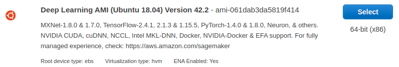

* Draft: 2021-04-22 (Thu)

# How to Use PyTorch with Deep Learning AMI (Ubuntu 18.04) Version 42.4


## Situation

When an EC2 instance is created, I've selected Deep Learning AMI.



This instance has the built-in support of the described deep learning environment.

## Problem

After connecting to the EC2 instance remotely with ssh,

```bash
Last login: Wed Apr 21 23:23:48 2021 from 218.145.184.85
ubuntu@ip-123-45-6-789:~$
```

one of the deep learning environment can not be used as the following error message shows.

```bash
ubuntu@ip-123-45-6-789:~$ python -c "import torch; print(torch.__version__)"
Traceback (most recent call last):
  File "<string>", line 1, in <module>
ModuleNotFoundError: No module named 'torch'
ubuntu@ip-123-45-6-789:~$
```

The above message shows that PyTorch is NOT available. What's wrong?

## Hint

Open `README` in the user home directory.

```bash
~$ vi README
```

The README shows the commands to activate virtual environments for the supported deep learning frameworks.

```bash
=============================================================================
       __|  __|_  )
       _|  (     /   Deep Learning AMI (Ubuntu 18.04) Version 42.1
      ___|\___|___|
=============================================================================

Welcome to Ubuntu 18.04.5 LTS (GNU/Linux 5.4.0-1041-aws x86_64v)

Please use one of the following commands to start the required environment with the framework of your choice:
for AWS MX 1.7 (+Keras2) with Python3 (CUDA 10.1 and Intel MKL-DNN) _______________________________ source activate mxnet_p36
for AWS MX 1.8 (+Keras2) with Python3 (CUDA + and Intel MKL-DNN) ___________________________ source activate mxnet_latest_p37
for AWS MX(+AWS Neuron) with Python3 ___________________________________________________ source activate aws_neuron_mxnet_p36
for AWS MX(+Amazon Elastic Inference) with Python3 _______________________________________ source activate amazonei_mxnet_p36
for TensorFlow(+Keras2) with Python3 (CUDA + and Intel MKL-DNN) _____________________________ source activate tensorflow_p37
for Tensorflow(+AWS Neuron) with Python3 _________________________________________ source activate aws_neuron_tensorflow_p36
for TensorFlow 2(+Keras2) with Python3 (CUDA 10.1 and Intel MKL-DNN) _______________________ source activate tensorflow2_p36
for TensorFlow 2.3 with Python3.7 (CUDA + and Intel MKL-DNN) ________________________ source activate tensorflow2_latest_p37
for PyTorch 1.4 with Python3 (CUDA 10.1 and Intel MKL) _________________________________________ source activate pytorch_p36
for PyTorch 1.7.1 with Python3.7 (CUDA 11.1 and Intel MKL) ________________________________ source activate pytorch_latest_p37
for PyTorch (+AWS Neuron) with Python3 ______________________________________________ source activate aws_neuron_pytorch_p36
for base Python3 (CUDA 10.0) _______________________________________________________________________ source activate python3

To automatically activate base conda environment upon login, run: 'conda config --set auto_activate_base true'
Official Conda User Guide: https://docs.conda.io/projects/conda/en/latest/user-guide/
AWS Deep Learning AMI Homepage: https://aws.amazon.com/machine-learning/amis/
Developer Guide and Release Notes: https://docs.aws.amazon.com/dlami/latest/devguide/what-is-dlami.html
Support: https://forums.aws.amazon.com/forum.jspa?forumID=263
For a fully managed experience, check out Amazon SageMaker at https://aws.amazon.com/sagemaker
When using INF1 type instances, please update regularly using the instructions at: https://github.com/aws/aws-neuron-sdk/tree/master/release-notes
=============================================================================
```

## Solution

For example, the latest PyTorch virtual environment can be activated by the following command.

```bash
$ source activate pytorch_latest_p37
```

The following part shows the command in action. Notice the change of the prompt

* from `ubuntu@ip-123-45-6-789:~$`
* to `(pytorch_latest_p37) ubuntu@ip-123-45-6-789:~$`

```bash
ubuntu@ip-123-45-6-789:~$ source activate pytorch_latest_p37
(pytorch_latest_p37) ubuntu@ip-123-45-6-789:~$
```

The leading prompt `(pytorch_latest_p37)` shows that the EC2 instance has the latest PyTorch ready. Let's double-check with the same command which resulted in an error: `ModuleNotFoundError: No module named 'torch'`.

```bash
(pytorch_latest_p37) ubuntu@ip-123-45-6-789:~$ python -c "import torch; print(torch.__version__)"
1.4.0
(pytorch_latest_p37) ubuntu@ip-123-45-6-789:~$
```

TODO: Fix this.

## Problem2

The instance got a hang! This happened when I ran `main.py` requiring PyTorch. I see the same phenomenon with this simple command. What's wrong?

```bash
(pytorch_latest_p37) ubuntu@ip-123-45-6-789:~$ python -c "import torch; print(torch.__version__)"


^C^C^C^CTraceback (most recent call last):
  File "<string>", line 1, in <module>
  File "/home/ubuntu/anaconda3/envs/pytorch_latest_p37/lib/python3.7/site-packages/torch/__init__.py", line 196, in <module>
    from torch._C import *
RuntimeError: KeyboardInterrupt: 


```

```bash
$ source activate pytorch_p36
(pytorch_p36) ubuntu@ip-123-45-6-789:~$ python -c "import torch; print(torch.__version__)"
1.4.0
(pytorch_p36) ubuntu@ip-123-45-6-789:~$ 

```

