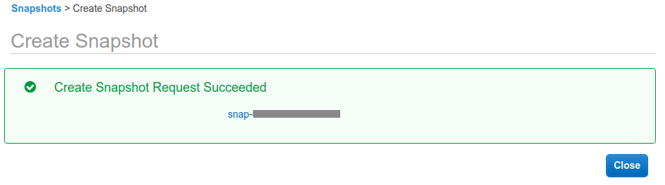
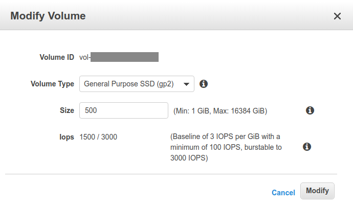
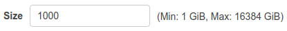
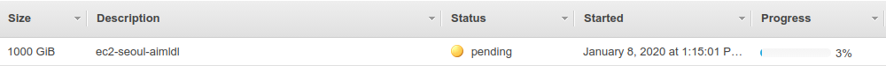

* Rev.1: 2020-0324 (Tue)
* Draft: 2020-0108 (Wed)

## How to Change the Volume Size on Amazon EC2
### Summary
This article describes how to change the volume size on an EC2 instance. The volume size can be changed with no downtime. The steps are summarized below.
```
Step 1. Connect the AWS Console.
Step 2. (Optionally) Take a snapshot of the current volume in the Console.
Step 3. The EBS volume is extended in the Console.
Step 4. Extend the partition in the terminal.
Step 5. Extend the file system in the terminal.
(In my case, the partition had to be extended first in order to extend the file system. )
```

### 1. Example
#### 1.1. Problem
On the terminal, the "No space left on device" error has occurred.
```bash
(pytorch) ubuntu@ec2-seoul-aimldl:~/wav2vec$ ls
dataset  downloads  notebooks  src
(pytorch) ubuntu@ec2-seoul-aimldl:~/wav2vec$ cd data-bash: cannot create temp file for here-document: No space left on device

-bash: cd: data: No such file or directory
```

### 2. Excerpt from a Tutorial & AWS Official Document
* Google search: ec2 how to increase disk space

#### References
* [Tutorial: how to extend AWS EBS volumes with no downtime](https://hackernoon.com/tutorial-how-to-extend-aws-ebs-volumes-with-no-downtime-ec7d9e82426e)
* [Creating Amazon EBS Snapshots](https://docs.aws.amazon.com/AWSEC2/latest/UserGuide/ebs-creating-snapshot.html)
* [Extending a Linux File System After Resizing a Volume](https://docs.aws.amazon.com/AWSEC2/latest/UserGuide/recognize-expanded-volume-linux.html)

#### Steps
The volume size can be extended with zero downtime of the EC2 instance.

Step 1. Create a Snapshot
For details, refer to [Creating Amazon EBS Snapshots](https://docs.aws.amazon.com/AWSEC2/latest/UserGuide/ebs-creating-snapshot.html). To create a snapshot using the console,
1. Open the Amazon EC2 console at https://console.aws.amazon.com/ec2/.
2. Choose Snapshots under Elastic Block Store in the navigation pane.
3. Choose Create Snapshot.

4. For Select resource type, choose Volume.
5. For Volume, select the volume.
6. (Optional) Enter a description for the snapshot.
7. (Optional) Choose Add Tag to add tags to your snapshot. For each tag, provide a tag key and a tag value.
8. Choose Create Snapshot.


To create a snapshot using the command line, refer to [create-snapshot¶](https://docs.aws.amazon.com/cli/latest/reference/ec2/create-snapshot.html).

Step 2. Extend the volume size
1. Login to your AWS console.
2. Choose “EC2” from the services list.

3. Click Instances under "INSTANCES" MENU on the left menu and identify the instance ID of the target EC2 instance.

4. Click on “Volumes” under ELASTIC BLOCK STORE menu (on the left).

5. Choose the volume that you wish to resize, click the Actions button and select "Modify Volume".

6. You'll see an option window like this one:

7. Set the new size for your EBS volume (in this case i extended an 8GB volume to 500GB)

(The example below is 20GB.)

8. Click on modify.


Step 3. Extend the partition itself
1. lsblk
   The size of the partition reflects the original size which must be extended before you can extend the file system.
```bash
$ lsblk
```
2. growpart
```bash
$ sudo growpart /dev/xvda 0
```
3. resize2fs
```bash
$ sudo resize2fs /dev/xvda1
```
4. xfs_growfs
If the file system is an XFS,
```bash
$ sudo xfs_growfs /dev/xvda1
```
5. df
Check the extended file system with the -h option (human-readable).
```bash
$ df -h
```

### 3. AWS Documentation
For details, refer to [Amazon EBS Elastic Volumes](https://docs.aws.amazon.com/AWSEC2/latest/UserGuide/ebs-modify-volume.html) in AWS > Documentation > Amazon EC2 > User Guide for Linux Instances.

1. [Requirements When Modifying Volumes](https://docs.aws.amazon.com/AWSEC2/latest/UserGuide/modify-volume-requirements.html)
2. [Requesting Modifications to Your EBS Volumes](https://docs.aws.amazon.com/AWSEC2/latest/UserGuide/requesting-ebs-volume-modifications.html)
3. [Monitoring the Progress of Volume Modifications](https://docs.aws.amazon.com/AWSEC2/latest/UserGuide/monitoring-volume-modifications.html)
4. [Extending a Linux File System After Resizing a Volume](https://docs.aws.amazon.com/AWSEC2/latest/UserGuide/recognize-expanded-volume-linux.html)

#### 3.1. [Requirements When Modifying Volumes](https://docs.aws.amazon.com/AWSEC2/latest/UserGuide/modify-volume-requirements.html)

```bash
$ sudo gdisk -l /dev/xvda
sudo: unable to resolve host ec2-seoul-aimldl: Resource temporarily unavailable
GPT fdisk (gdisk) version 1.0.3

Partition table scan:
  MBR: MBR only
  BSD: not present
  APM: not present
  GPT: not present


***************************************************************
Found invalid GPT and valid MBR; converting MBR to GPT format
in memory.
***************************************************************

Disk /dev/xvda: 2097152000 sectors, 1000.0 GiB
Sector size (logical/physical): 512/512 bytes
  ...
Total free space is 1048578014 sectors (500.0 GiB)

Number  Start (sector)    End (sector)  Size       Code  Name
   1            2048      1048575966   500.0 GiB   8300  Linux filesystem
$
```

#### 3.2. [Requesting Modifications to Your EBS Volumes](https://docs.aws.amazon.com/AWSEC2/latest/UserGuide/requesting-ebs-volume-modifications.html)
There are two ways to modify the volume size: Console and CLI.
* Modifying an EBS Volume Using Elastic Volumes (Console)
* Modifying an EBS Volume Using Elastic Volumes (AWS CLI)

##### Example: Console
This example uses the AWS EC2 Console to increase the volume size from 500GB to 1TB.






#### 3.3. [Monitoring the Progress of Volume Modifications](https://docs.aws.amazon.com/AWSEC2/latest/UserGuide/monitoring-volume-modifications.html)
Both console and CLI can be used to monitor the progress.
* Monitoring the Progress of a Volume Modification (Console)
* Monitoring the Progress of a Volume Modification (AWS CLI)

In the console, the State field must be "available - completed (100%)".


##### Comment
I don't know why the progress is so slow. The State file is "in-use - optimizing (58%)" about three hours later.

#### 3.4. [Extending a Linux File System After Resizing a Volume](https://docs.aws.amazon.com/AWSEC2/latest/UserGuide/recognize-expanded-volume-linux.html)
* Identifying the File System for a Volume
* Extending a Partition (If Needed)
* Extending the File System

##### 3.4.1. Identifying the File System for a Volume
1. File Systems on a Nitro-based Instance
```bash
$ sudo file -s /dev/nvme?n*
```
2. File Systems on a T2 Instance
```bash
$ sudo file -s /dev/xvd*
```
Run the file -s command to figure out the file system.

***Example***
My p2.xlarge instance returns the following outputs.
```bash
$ sudo file -s /dev/nvme?n*
sudo: unable to resolve host ec2-seoul-aimldl: Resource temporarily unavailable
/dev/nvme?n*: cannot open `/dev/nvme?n*' (No such file or directory)
$
```
My volume is not nvme?n*.
```bash
$ sudo file -s /dev/xvd*
sudo: unable to resolve host ec2-seoul-aimldl: Resource temporarily unavailable
/dev/xvda:  DOS/MBR boot sector
/dev/xvda1: Linux rev 1.0 ext4 filesystem data, UUID=5d37ecd8-4506-4e35-9759-a3da3608b990, volume name "cloudimg-rootfs" (needs journal recovery) (extents) (64bit) (large files) (huge files)
$
```
My volume's file system is an XFS file system.

##### 3.4.2. Extending a Partition (If Needed)
* Example: Partitions on a Nitro-based Instance
* Example: Partitions on a T2 Instance

##### 3.4.2.1. Example: Partitions on a Nitro-based Instance
***How to interpret the lsblk output.***
```bash
$ lsblk
NAME          MAJ:MIN RM SIZE RO TYPE MOUNTPOINT
nvme1n1       259:0    0  30G  0 disk /data
nvme0n1       259:1    0  16G  0 disk
└─nvme0n1p1   259:2    0   8G  0 part /
└─nvme0n1p128 259:3    0   1M  0 part
```
* The volume /dev/nvme1n1 has no partitions. The size of the volume reflects the new size, 30 GB.
* The root volume, /dev/nvme0n1, has a partition, /dev/nvme0n1p1. The size of the root volume reflects the new size, 16 GB.
  * The size of the partition reflects the original size, 8 GB, and must be extended before you can extend the file system.

***How to extend the partition
The growpart command is used to extend the partition. There is a space between the device name "/dev/nvme0n1" and the partition number "1".
```bash
$ sudo growpart /dev/nvme0n1 1
```

*** Verify the increased volume size by using the lsblk command.
```bash
$ lsblk
NAME          MAJ:MIN RM SIZE RO TYPE MOUNTPOINT
nvme1n1       259:0    0  30G  0 disk /data
nvme0n1       259:1    0  16G  0 disk
└─nvme0n1p1   259:2    0  16G  0 part /
└─nvme0n1p128 259:3    0   1M  0 part
```
Notice the size has been increased to 16G.
```bash
└─nvme0n1p1   259:2    0  16G  0 part /
```
##### 3.4.2.2. Example: Partitions on a T2 Instance
***How to interpret the lsblk output.***
```bash
$ lsblk
NAME    MAJ:MIN RM SIZE RO TYPE MOUNTPOINT
xvda    202:0    0  16G  0 disk
└─xvda1 202:1    0   8G  0 part /
xvdf    202:80   0  30G  0 disk
└─xvdf1 202:81   0   8G  0 part /data
```
* The root volume, /dev/xvda, has a partition, /dev/xvda1. While the size of the volume is 16 GB, the size of the partition is still 8 GB and must be extended.
* The volume /dev/xvdf has a partition, /dev/xvdf1. While the size of the volume is 30G, the size of the partition is still 8 GB and must be extended.

***How to extend the partition
The growpart command is used to extend the partition. There is a space between the device name and the partition number.

The first volume:
```bash
$ sudo growpart /dev/xvda 1
```
The second volume:
```bash
$ sudo growpart /dev/xvda 1
```

*** Verify the increased volume size by using the lsblk command.
```bash
$ lsblk
NAME    MAJ:MIN RM SIZE RO TYPE MOUNTPOINT
xvda    202:0    0  16G  0 disk
└─xvda1 202:1    0  16G  0 part /
xvdf    202:80   0  30G  0 disk
└─xvdf1 202:81   0  30G  0 part /data
```
Notice the size has been increased to 16G and 30G, respectively.
```bash
└─xvda1 202:1    0  16G  0 part /
└─xvdf1 202:81   0  30G  0 part /data
```

##### 3.4.2.3. In my case, ...
The root volume, /dev/xvda, has a partition, /dev/xvda1. The size of the volume is 1000G and the partition is still 500G. So /dev/xvda1 must be extended.
```bash
$ lsblk
NAME    MAJ:MIN RM  SIZE RO TYPE MOUNTPOINT
loop0     7:0    0 88.7M  1 loop /snap/core/7396
loop1     7:1    0 89.1M  1 loop /snap/core/8268
loop2     7:2    0   18M  1 loop /snap/amazon-ssm-agent/1455
loop3     7:3    0   18M  1 loop /snap/amazon-ssm-agent/1480
xvda    202:0    0 1000G  0 disk
└─xvda1 202:1    0  500G  0 part /
$
```
The partion is extended.
```bash
$ sudo growpart /dev/xvda 1
CHANGED: partition=1 start=2048 old: size=1048573919 end=1048575967 new: size=2097149919,end=2097151967
$
```

Caution: I used "/dev/xvda1" as the device name at first and got the following error message. Changing the device name to "/dev/xvda" corrected the error!
```bash
$ sudo growpart /dev/xvda1 1
sudo: unable to resolve host ip-10-0-2-222: Resource temporarily unavailable
WARN: unknown label
failed [sfd_dump:1] sfdisk --unit=S --dump /dev/xvda1
sfdisk: /dev/xvda1: does not contain a recognized partition table
FAILED: failed to dump sfdisk info for /dev/xvda1
$
```

Double-check. xvda1 is increaed to 1000G. Yay!
```bash
$ lsblk
NAME    MAJ:MIN RM  SIZE RO TYPE MOUNTPOINT
loop0     7:0    0 89.1M  1 loop /snap/core/8268
loop1     7:1    0   18M  1 loop /snap/amazon-ssm-agent/1455
loop2     7:2    0 88.7M  1 loop /snap/core/7396
loop3     7:3    0   18M  1 loop /snap/amazon-ssm-agent/1480
xvda    202:0    0 1000G  0 disk
└─xvda1 202:1    0 1000G  0 part /
```

##### 3.4.3. Extending the File System
* Example: Extend an XFS file system
* Example: Extend an ext2, ext3, or ext4 file system

Before and after running "your_command", check the status of the disk wih the "df -h" command.
```bash
# Check the status
$ df -h
# Extend the file system
$ your_command
# Double-check if the file system has been extended.
$ df -h
```

##### 3.4.3.1. Example: Extend an XFS file system
* When the mount point is "/".
```bash
# If not installed, install xfsprogs.
$ sudo yum install xfsprogs
# Extend the file system
$ sudo xfs_growfs -d /
```
##### 3.4.3.2. Example: Extend an ext2, ext3, or ext4 file system
If two volumes "/dev/xvda1" & "/dev/xvdf1" exist, extend both volumes.
```bash
# Extend the file system
$ sudo resize2fs /dev/xvda1
$ sudo resize2fs /dev/xvdf1
```

##### 3.4.3.3. In my case, ...
First, check my volumes.
```bash
(base) ubuntu@ec2-seoul-aimldl:~$ df -h
Filesystem      Size  Used Avail Use% Mounted on
udev             30G     0   30G   0% /dev
tmpfs           6.0G   78M  6.0G   2% /run
/dev/xvda1      485G  457G   29G  95% /
tmpfs            30G     0   30G   0% /dev/shm
tmpfs           5.0M     0  5.0M   0% /run/lock
tmpfs            30G     0   30G   0% /sys/fs/cgroup
/dev/loop0       89M   89M     0 100% /snap/core/7396
/dev/loop1       90M   90M     0 100% /snap/core/8268
/dev/loop2       18M   18M     0 100% /snap/amazon-ssm-agent/1455
/dev/loop3       18M   18M     0 100% /snap/amazon-ssm-agent/1480
tmpfs           6.0G     0  6.0G   0% /run/user/1000
```
/dev/xvda1 is mounted on / and the volume size is 485G.
```bash
/dev/xvda1      485G  457G   29G  95% /
```
This is the same with and without extending the partition from 500G to 1000G.

* Example: Extend an ext2, ext3, or ext4 file system
When the partition is not extended, the message says "Nothing to do!".
```bash
(base) ubuntu@ec2-seoul-aimldl:~$ sudo resize2fs /dev/xvda1
resize2fs 1.44.1 (24-Mar-2018)
The filesystem is already 131071739 (4k) blocks long.  Nothing to do!
(base) ubuntu@ec2-seoul-aimldl:~$
```
To check the result, nothing has been changed.
```bash
(base) ubuntu@ec2-seoul-aimldl:~$df -h
Filesystem      Size  Used Avail Use% Mounted on
  ...
/dev/xvda1      485G  457G   29G  95% /
  ...
(base) ubuntu@ec2-seoul-aimldl:~$
```
***After extending the partion from 500G to 1000G, the resize2fs command becomes effective!
```bash
(base) ubuntu@ec2-seoul-aimldl:~$ sudo resize2fs /dev/xvda1
resize2fs 1.44.1 (24-Mar-2018)
Filesystem at /dev/xvda1 is mounted on /; on-line resizing required
old_desc_blocks = 63, new_desc_blocks = 125
The filesystem on /dev/xvda1 is now 262143739 (4k) blocks long.

(base) ubuntu@ec2-seoul-aimldl:~$
```
And the file system has also been extended successfully!
```bash
$ df -h
Filesystem      Size  Used Avail Use% Mounted on
udev             30G     0   30G   0% /dev
tmpfs           6.0G  784K  6.0G   1% /run
/dev/xvda1      970G  455G  515G  47% /
tmpfs            30G     0   30G   0% /dev/shm
tmpfs           5.0M     0  5.0M   0% /run/lock
tmpfs            30G     0   30G   0% /sys/fs/cgroup
/dev/loop1       18M   18M     0 100% /snap/amazon-ssm-agent/1455
/dev/loop0       90M   90M     0 100% /snap/core/8268
/dev/loop2       89M   89M     0 100% /snap/core/7396
/dev/loop3       18M   18M     0 100% /snap/amazon-ssm-agent/1480
tmpfs           6.0G     0  6.0G   0% /run/user/1000
```
Notice the size is increased to 970G!
```bash
/dev/xvda1      970G  455G  515G  47% /
```

## Appendix.
The following part is written when things go wrong. I leave this here for future reference. (So the writing may be far from complete.)

* Example: Extend an XFS file system
```bash
(base) ubuntu@ec2-seoul-aimldl:~$ sudo xfs_growfs -d /
sudo: unable to resolve host ip-10-0-2-222: Resource temporarily unavailable
xfs_growfs: specified file ["/"] is not on an XFS filesystem
(base) ubuntu@ec2-seoul-aimldl:~$
```
##### Example
##### On the EC2 Console: in-use
The volume size has been adjusted to 1TB or 1000GiB and a screencapture of the EC2 console is below. The State fiels is "in-use".


##### Phenomenon: "No space left on device" Error Persists.
On the terminal, the "No space left on device" error keeps occuring.
```bash
$ cd wa-bash: cannot create temp file for here-document: No space left on device
```

The lsblk command shows the volume size. The size of xvda is increased to 1000G, but xvda1 has only 500G.
```bash
$ lsblk
NAME    MAJ:MIN RM  SIZE RO TYPE MOUNTPOINT
loop0     7:0    0   18M  1 loop /snap/amazon-ssm-agent/1480
loop1     7:1    0   18M  1 loop /snap/amazon-ssm-agent/1455
loop2     7:2    0 89.1M  1 loop /snap/core/8268
loop3     7:3    0 88.7M  1 loop /snap/core/7396
xvda    202:0    0 1000G  0 disk
└─xvda1 202:1    0  500G  0 part /
$
```

This phenomenon persists even after terminating and reconnecting to the EC2 instance. Rebooting the instance doesn't work as well. At the end of the login shell, the "No space left on device" error is shown.
```bash
   ...
-bash: cannot create temp file for here-document: No space left on device
ubuntu@ec2-seoul-aimldl:~$
```

##### On the EC2 Console: in-use - optimizing (8%)
Expanding the State field reveals the cause of the error. The volume is still optimizing and the volume resizing job has not been completed.


Comment: About an hour and a half has been past at this point. I don't know it takes so much time. But I'll wait.

#### 3.4. [Extending a Linux File System After Resizing a Volume](https://docs.aws.amazon.com/AWSEC2/latest/UserGuide/recognize-expanded-volume-linux.html)

##### 3.4.1. Overview
* Take a snapshot of the volume.
> Important: Before extending a file system that contains valuable data, it is best practice to create a snapshot of the volume, in case you need to roll back your changes. For more information, see [Creating Amazon EBS Snapshots](https://docs.aws.amazon.com/AWSEC2/latest/UserGuide/ebs-creating-snapshot.html). If your Linux AMI uses the MBR partitioning scheme, you are limited to a boot volume size of up to 2 TiB.

***Example***


After an hour and 11 minutes, the Progress field shows 3%. No improvement at all.

Probably, it's because there's no space left.

```bash
$ sudo apt-get autoremove
sudo: unable to resolve host ip-10-0-2-222: Resource temporarily unavailable
Reading package lists... Error!
E: Write error - write (28: No space left on device)
E: IO Error saving source cache
E: The package lists or status file could not be parsed or opened.
$
```

Nope. I was able to empty some space and about 25GB is secured. In about two hours, the progress is still 3%.

I'll go ahead and extend the file system without having the snapshot. It's going nowhere anyways.


* Extend the file system to the larger size as soon as the volume enters the optimizing state.
> After you increase the size of an EBS volume, you must use file system–specific commands to extend the file system to the larger size. You can resize the file system as soon as the volume enters the optimizing state.

1. lsblk
   The size of the partition reflects the original size which must be extended before you can extend the file system.
```bash
$ lsblk
NAME    MAJ:MIN RM  SIZE RO TYPE MOUNTPOINT
loop0     7:0    0 88.7M  1 loop /snap/core/7396
loop1     7:1    0 89.1M  1 loop /snap/core/8268
loop2     7:2    0   18M  1 loop /snap/amazon-ssm-agent/1455
loop3     7:3    0   18M  1 loop /snap/amazon-ssm-agent/1480
xvda    202:0    0 1000G  0 disk
└─xvda1 202:1    0  500G  0 part /
$
```
2. growpart
```bash
$ sudo growpart /dev/xvda 0
```
3. resize2fs
```bash
$ sudo resize2fs /dev/xvda1
```
4. xfs_growfs
If the file system is an XFS,
```bash
$ sudo xfs_growfs /dev/xvda1
```
5. df
Check the extended file system with the -h option (human-readable).
```bash
$ df -h
```
