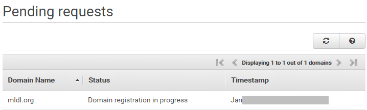

##### aimldl/aws/route53/README.md

# Amazon Route53
## How to Register a Domain Name
Refer to a tutorial to [Register a Domain Name with Amazon Route 53](https://aws.amazon.com/getting-started/tutorials/get-a-domain/).

1. Sign into https://aws.amazon.com/
2. In the AWS Management Console, enter "Route 53" to the dialog box under "Find Services".

 Then you will enter the dashboard for Route 53.
3. In the Route 53 dashboard, type in a domain name to check if it is available.

Typically, it is likely the domain name you want is unavailble. So be creative to find an alternative domain name.

In my case, I wanted aimldl.com, but chose mldl.org instead because I can create a link http://ai.mldl.org.

4. Once the domain name is decided, click "Continue" and follow the procedure.
5. A pending request is created. Note the domain is not created instantly.

6. In several minutes, the registration is complete and an email is sent to the registered email.

* [Working with Resource Record Sets](https://docs.aws.amazon.com/Route53/latest/DeveloperGuide/rrsets-working-with.html)
* [Amazon Web Services Customer Support](https://console.aws.amazon.com/support/cases#/create?issueType=customer-service)
