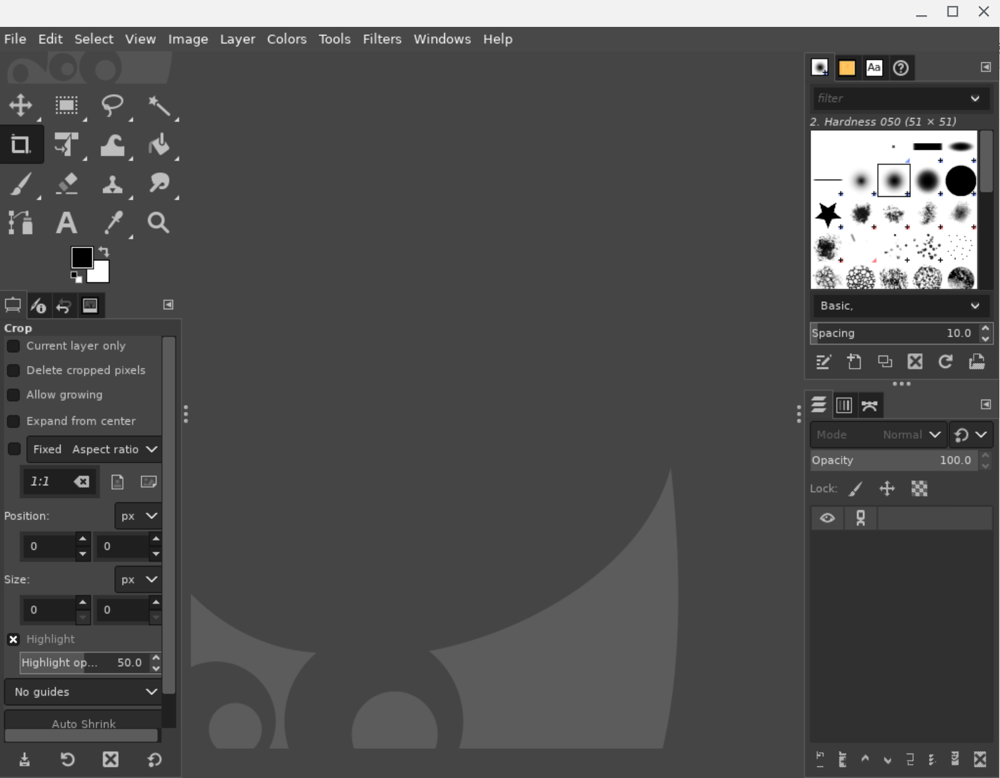

* Created: 2024-09-23 (Mon)

# Gimp
Gimp is a popular open-source photo editing tool that supports multiple platforms (GNU/Linux, macOS, Microsoft Windows).

The following installation steps are found at 
https://www.gimp.org/downloads/

When I opened the above link, Chrome OS has been recognized as "we think your OS is Chrome OS".

```
Current Stable Version
The current stable release of GIMP is 2.10.38 (2024-05-02).

Show downloads for GNU/Linux | macOS | Microsoft Windows | All
(we think your OS is Chrome OS)
```

## Install manually with `flatpak`
It's prerequisite to install `flatpak` first. And go to Terminal and run:
```bash
sudo flatpak install https://flathub.org/repo/appstream/org.gimp.GIMP.flatpakref
```

After installation, run the following command to execute `flatpak`

```bash
flatpak run org.gimp.GIMP//stable
```



## Full messages
### Installation
Double-check if flatpak is installed properly.
```bash
(base) thekim@penguin:~$ which flatpak
/usr/bin/flatpak
(base) thekim@penguin:~$
```

Install gimp with the flatpak install command
```bash
(base) thekim@penguin:~$ sudo flatpak install https://flathub.org/repo/appstream/org
.gimp.GIMP.flatpakref
```
The full installation message is below.
```bash
The remote 'flathub', referred to by 'org.gimp.GIMP' at location https://dl.flathub.org/repo/ contains additional applications.
Should the remote be kept for future installations? [Y/n]: y
Required runtime for org.gimp.GIMP/x86_64/stable (runtime/org.gnome.Platform/x86_64/46) found in remote flathub
Do you want to install it? [Y/n]: y

org.gimp.GIMP permissions:
    ipc                   network               x11            dri
    file access [1]       dbus access [2]       tags [3]

    [1] /tmp, host, xdg-config/GIMP, xdg-config/gtk-3.0, xdg-run/gvfs,
        xdg-run/gvfsd
    [2] org.freedesktop.FileManager1, org.gnome.Shell.Screenshot, org.gtk.vfs.*,
        org.kde.kwin.Screenshot
    [3] stable

        ID                                  Branch      Op Remote  Download
 1. [✓] org.freedesktop.Platform.GL.default 23.08       i  flathub 174.7 MB / 175.0 MB
 2. [✓] org.freedesktop.Platform.GL.default 23.08-extra i  flathub  21.0 MB / 175.0 MB
 3. [✓] org.freedesktop.Platform.openh264   2.4.1       i  flathub 921.4 kB / 976.5 kB
 4. [✓] org.gnome.Platform.Locale           46          i  flathub  18.0 kB / 378.5 MB
 5. [✓] org.gtk.Gtk3theme.CrosAdapta        3.22        i  flathub 516.9 kB / 386.3 kB
 6. [✓] org.gnome.Platform                  46          i  flathub 353.7 MB / 363.7 MB
 7. [—] org.gimp.GIMP                       stable      i  flathub  76.3 MB / 131.0 MB

Installing 7/7… ████████████████████ 100%  1.3 MB/s  00:00
(base) thekim@penguin:~$
```
### Running `gimp`

```bash
(base) thekim@penguin:~$ flatpak run org.gimp.GIMP//stable
```
The full message
```bash
** (process:6929): WARNING **: 11:16:59.592: Error writing credentials to socket: Error sending message: Broken pipe

(gimp-2.10:2): Gtk-WARNING **: 11:17:00.470: /app/lib/gtk-2.0/2.10.0/immodules/im-ibus.so: undefined symbol: ibus_input_context_set_post_process_key_event

(gimp-2.10:2): Gtk-WARNING **: 11:17:00.470: Loading IM context type 'ibus' failed

(gimp-2.10:2): Gtk-WARNING **: 11:17:05.322: /app/lib/gtk-2.0/2.10.0/immodules/im-ibus.so: undefined symbol: ibus_input_context_set_post_process_key_event

(gimp-2.10:2): Gtk-WARNING **: 11:17:05.322: Loading IM context type 'ibus' failed

(gimp-2.10:2): Gtk-WARNING **: 11:17:05.405: /app/lib/gtk-2.0/2.10.0/immodules/im-ibus.so: undefined symbol: ibus_input_context_set_post_process_key_event

(gimp-2.10:2): Gtk-WARNING **: 11:17:05.405: Loading IM context type 'ibus' failed

(gimp-2.10:2): Gtk-WARNING **: 11:17:05.410: /app/lib/gtk-2.0/2.10.0/immodules/im-ibus.so: undefined symbol: ibus_input_context_set_post_process_key_event

(gimp-2.10:2): Gtk-WARNING **: 11:17:05.410: Loading IM context type 'ibus' failed

(gimp-2.10:2): Gtk-WARNING **: 11:17:05.413: /app/lib/gtk-2.0/2.10.0/immodules/im-ibus.so: undefined symbol: ibus_input_context_set_post_process_key_event

(gimp-2.10:2): Gtk-WARNING **: 11:17:05.413: Loading IM context type 'ibus' failed

(gimp-2.10:2): Gtk-WARNING **: 11:17:05.420: /app/lib/gtk-2.0/2.10.0/immodules/im-ibus.so: undefined symbol: ibus_input_context_set_post_process_key_event

(gimp-2.10:2): Gtk-WARNING **: 11:17:05.420: Loading IM context type 'ibus' failed

(gimp-2.10:2): Gtk-WARNING **: 11:17:05.423: /app/lib/gtk-2.0/2.10.0/immodules/im-ibus.so: undefined symbol: ibus_input_context_set_post_process_key_event

(gimp-2.10:2): Gtk-WARNING **: 11:17:05.423: Loading IM context type 'ibus' failed

(gimp-2.10:2): Gtk-WARNING **: 11:17:05.428: /app/lib/gtk-2.0/2.10.0/immodules/im-ibus.so: undefined symbol: ibus_input_context_set_post_process_key_event
```


## Error messages
### Error message without the sudo command
```bash
(base) thekim@penguin:~$ flatpak install https://flathub.org/repo/appstream/org.gimp
.GIMP.flatpakref
```
The full error message is below.
```bash
The remote 'flathub', referred to by 'org.gimp.GIMP' at location https://dl.flathub.org/repo/ contains additional applications.
Should the remote be kept for future installations? [Y/n]: y
error: Flatpak system operation ConfigureRemote not allowed for user
(base) thekim@penguin:~$
```

### Error messages associated with `gimp`
```bash
(base) thekim@penguin:~$ gimp
-bash: gimp: command not found
(base) thekim@penguin:~$
```

```bash
(base) thekim@penguin:~$ flatpak run org.gimp/GIMP//stable
error: Invalid id org.gimp: Names must contain at least 2 periods
(base) thekim@penguin:~$
```
