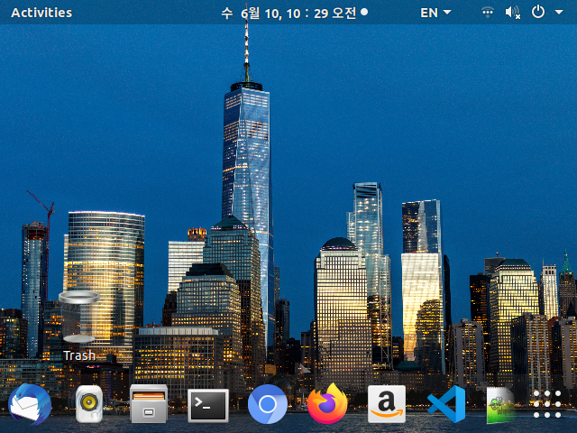

* Draft: 2020-06-10 (Wed)

# Fix the Low Resolution Issue after Upgrading Ubuntu 18.04

I have NVIDIA Graphics Card (GeForce 1080Ti) and the resolution is messed up after upgrading Ubuntu. The resolution is lowered to VGA.

## Problem

The resolution of the monitor before the upgrade is below.

After performing a regular `sudo apt update` and `sudo apt upgrade`, the resolution is lowered to VGA as follows.

The resolution is so low that it's impossible to browse `Settings > Devices > Displays`.

## Solution

Reinstall the NVIDIA Graphics Card driver and the problem is fixed. For details, refer to [Install NVIDIA Graphics Card on Ubuntu](../INSTALL-NVIDIA_Graphics_CARD-Ubuntu.md). 