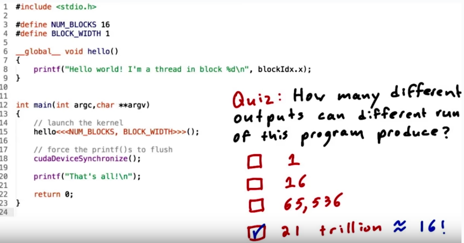

* Rev.1: 2020-05-25 (Mon)
* Draft: 2017-03-03 (Fri)
# Many Hello World


```bash
aimldl@gpu:~/aimldl/cuda/2.exercise/6.many_hello_world$ ./many_hello_world 
Hello, world! I'm a thread 0 in block 11
Hello, world! I'm a thread 0 in block 7
Hello, world! I'm a thread 0 in block 15
Hello, world! I'm a thread 0 in block 6
Hello, world! I'm a thread 0 in block 14
Hello, world! I'm a thread 0 in block 13
Hello, world! I'm a thread 0 in block 2
Hello, world! I'm a thread 0 in block 1
Hello, world! I'm a thread 0 in block 3
Hello, world! I'm a thread 0 in block 12
Hello, world! I'm a thread 0 in block 0
Hello, world! I'm a thread 0 in block 10
Hello, world! I'm a thread 0 in block 9
Hello, world! I'm a thread 0 in block 5
Hello, world! I'm a thread 0 in block 8
Hello, world! I'm a thread 0 in block 4
That's all!
aimldl@gpu:~/aimldl/cuda/2.exercise/6.many_hello_world$ ./many_hello_world 
Hello, world! I'm a thread 0 in block 11
Hello, world! I'm a thread 0 in block 7
Hello, world! I'm a thread 0 in block 15
Hello, world! I'm a thread 0 in block 6
Hello, world! I'm a thread 0 in block 3
Hello, world! I'm a thread 0 in block 12
Hello, world! I'm a thread 0 in block 5
Hello, world! I'm a thread 0 in block 14
Hello, world! I'm a thread 0 in block 2
Hello, world! I'm a thread 0 in block 13
Hello, world! I'm a thread 0 in block 10
Hello, world! I'm a thread 0 in block 0
Hello, world! I'm a thread 0 in block 1
Hello, world! I'm a thread 0 in block 9
Hello, world! I'm a thread 0 in block 8
Hello, world! I'm a thread 0 in block 4
That's all!
aimldl@gpu:~/aimldl/cuda/2.exercise/6.many_hello_world$ ./many_hello_world 
Hello, world! I'm a thread 0 in block 7
Hello, world! I'm a thread 0 in block 9
Hello, world! I'm a thread 0 in block 15
Hello, world! I'm a thread 0 in block 13
Hello, world! I'm a thread 0 in block 11
Hello, world! I'm a thread 0 in block 10
Hello, world! I'm a thread 0 in block 14
Hello, world! I'm a thread 0 in block 1
Hello, world! I'm a thread 0 in block 2
Hello, world! I'm a thread 0 in block 12
Hello, world! I'm a thread 0 in block 0
Hello, world! I'm a thread 0 in block 6
Hello, world! I'm a thread 0 in block 5
Hello, world! I'm a thread 0 in block 8
Hello, world! I'm a thread 0 in block 4
Hello, world! I'm a thread 0 in block 3
That's all!
aimldl@gpu:~/aimldl/cuda/2.exercise/6.many_hello_world$ ls
compile-many_hello_world  many_hello_world  many_hello_world.cu
aimldl@gpu:~/aimldl/cuda/2.exercise/6.many_hello_world$ nano many_hello_world.cu 
aimldl@gpu:~/aimldl/cuda/2.exercise/6.many_hello_world$ ls
compile-many_hello_world  many_hello_world  many_hello_world.cu
aimldl@gpu:~/aimldl/cuda/2.exercise/6.many_hello_world$ mv many_hello_world many_hello_world.original
aimldl@gpu:~/aimldl/cuda/2.exercise/6.many_hello_world$ ./compile-many_hello_world 
nvcc warning : The 'compute_20', 'sm_20', and 'sm_21' architectures are deprecated, and may be removed in a future release (Use -Wno-deprecated-gpu-targets to suppress warning).

Without cudaDeviceSynchronize()
aimldl@gpu:~/aimldl/cuda/2.exercise/6.many_hello_world$ ./many_hello_world 
That's all!
aimldl@gpu:~/aimldl/cuda/2.exercise/6.many_hello_world$ ./many_hello_world 
That's all!
aimldl@gpu:~/aimldl/cuda/2.exercise/6.many_hello_world$ 
```
