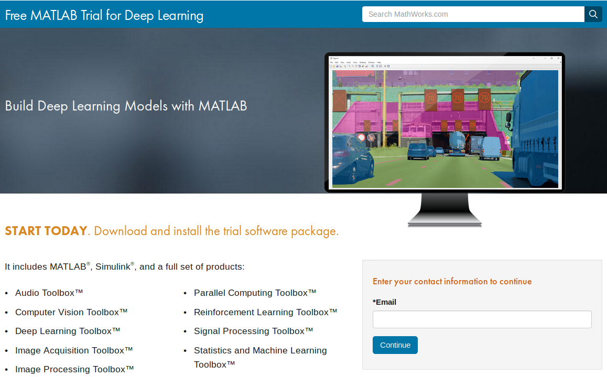
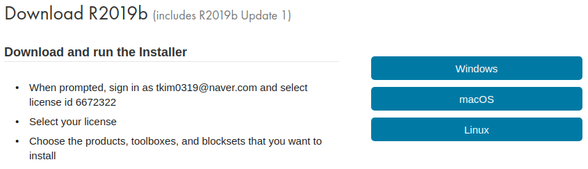

##### aimldl > matlab > Installation.md
* Draft: 2019-11-10 (Sun)
# 1. Installation for Deep Learning
## 1.1. Download the Installation File
Download the installation file at [Free MATLAB Trial for Deep Learning](https://www.mathworks.com/campaigns/products/trials/targeted/dpl.html). To obtain the free one-month trial license, create a new MathWorks account. You must have a valid license (either for free trial or for purchased one) to run the Matlab program.

The same page or [Free MATLAB Trial for Deep Learning](https://www.mathworks.com/campaigns/products/trials/targeted/dpl.html) can be open from the homepage as follows:
1. Go to [MathWorks homepage](https://www.mathworks.com/) & click "Deep Learning".
</img>
2. Click "Download a free trial".
</img>
3. Provide an email address and create a new MathWorks account.
</img>
4. Select the OS to download the installation file.
</img>

## 1.2. Installing on Linux
5. The installation file is downloaded to directory Downloads. Go to the directory, create a new directory matlab_R2019b, and move the file to the created directory.
```bash
~$ cd ~/Downloads
~/Downloads$ mkdir matlab_R2019b
~/Downloads$ mv matlab_R2019b_glnxa64.zip matlab_R2019b
~/Downloads$ cd matlab_R2019b
```
6. Unzip the compressed installation file.
```bash
~/Downloads/matlab_R2019b$ unzip matlab_R2019b_glnxa64.zip
~/Downloads/matlab_R2019b$ ls
VersionInfo.xml  install_guide.pdf          patents.txt
activate.ini     install_guide_zh_CN.pdf    readme.txt
archives         installer_input.txt        sys
bin              java                       trademarks.txt
help             license_agreement.txt      ui
install          matlab_R2019b_glnxa64.zip
```
7. Run the install script to launch the Matlab installation window.
```bash
$ sudo ./install
[sudo] aimldl's password:
Preparing installation files ...
Installing ...
```
8. Provide the new MathWorks account information to get the license information. If the license is set up, the rest of installation process is easy. For details, refer to [Installation, Licensing, and Activation](https://www.mathworks.com/help/releases/R2019b/install/index.html) or [How to install Matlab 2017b on Ubuntu 16.04](https://xunyunliu.github.io/post/install_matlab/).
* Location: /usr/local/MATLAB/R2019b

## 2. Why Matlab?
[Build Deep Learning Models with MATLAB (30-Day Free Trial)](https://www.mathworks.com/campaigns/products/trials/targeted/dpl.html) explains the installed Matlab products and why Matlab. The installed Matlab products include MATLAB®, Simulink®, and a full set of products to learn about deep learning:
* Audio Toolbox™
* Computer Vision Toolbox™
* Deep Learning Toolbox™
* Image Acquisition Toolbox™
* Image Processing Toolbox™
* Parallel Computing Toolbox™
* Reinforcement Learning Toolbox™
* Signal Processing Toolbox™
* Statistics and Machine Learning Toolbox

> With the trial software package, you’ll see how engineers can do deep learning in MATLAB without having to learn another language, environment, or toolchain. With MATLAB, you don’t have to be a deep learning expert to get started quickly.

> Learn how to do deep learning by exploring great documentation, videos, and examples. With just a few lines of code, you can build deep learning models, access large sets of image data, and leverage GPUs. Iteratively visualize and debug intermediate results and adjust layers as you build a model.

## 3. My Comment
Matlab is a great option to learn about Deep Learning because it is a well-designed commercial product. Matlab installs everything at a one shot; it works just fine right after the installation. All you have to do is to take the easy-to-follow tutorial designed by the experts.

On the contrary, the popular Python-based installation of an open-source deep learning framework, e.g. TensorFlow, is a pain not only for a newbie to the field, but also for an expert. A newbie has to go through additional hassles of:
* selecting a deep learning framework from many different options (TensorFlow vs. Keras vs. PyTorch vs. several other options),
* dealing with heterogenous packages (Python, Numpy, Pandas, MatplotLib, SciPy, and then the deep learning framework of your choice,
* finding the tutorials running without errors (from a plethora of web articles that don't work in your computing environment),
* and fixing the open-sourced code that doesn't run at first.

My purpose of the previous paragraph is not to devalue the Python-based deep learning frameworks, but to explain the unnecessary hassles that require problem solving skills just to get started the deep learning thing. MathWorks takes care of these hassles and the learner can focus on learning the deep learning thing.

(EOF)
