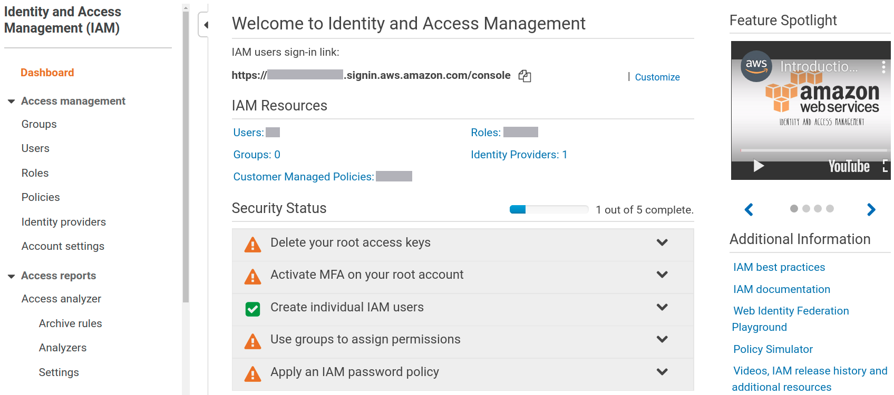
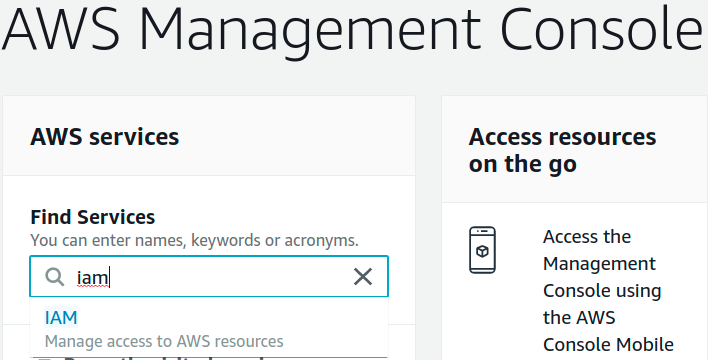

##### aimldl/aws/IAM/README.md

* Draft: 2020-04-05 (Sun)

# IAM (Identity and Access management)

IAM is pronounced as "I am". 

## What is IAM?

An introductory tutorial by Amazon Web Services [2:15]

<iframe width="560" height="315" src="https://www.youtube.com/embed/Ul6FW4UANGc" frameborder="0" allow="accelerometer; autoplay; encrypted-media; gyroscope; picture-in-picture" allowfullscreen></iframe>

Identity and access for AWS users, roles, groups, and policies are managed easily on a web browser as well as a terminal after installing AWS CLI (Command-Line Interface).

## Managing IAM on a Web Browser

The GUI (Graphical User Interface) environment is shown below. Take a look at the page.  You will have an idea what can be done with it.



## Managing IAM on a Terminal

Examples of a terminal include a Linux terminal, Windows powershell, PuTTY terminal and a lot more. Once AWS CLI is installed on your computer, the "aws" command can be used on your terminal. The following example command is run on a Bash terminal on Ubuntu 18.04 "after installing the AWS CLI."

```
$ aws iam help
IAM()        IAM()
NAME         iam -
DESCRIPTION
       AWS  Identity and Access Management (IAM) is a web service that you can
       use to manage users and user permissions under your AWS  account. This
       guide  provides  descriptions of IAM actions that you can call program-
       matically. For general information about  IAM,  see  AWS  Identity  and
       Access Management (IAM) . For the user guide for IAM, see Using IAM .
  ...
       We recommend that you use the AWS SDKs to make programmatic  API  calls
       to  IAM.  However,  you  can  also use the IAM Query API to make direct
       calls to the IAM web service. To learn more about the  IAM  Query  API,
       see  Making Query Requests in the Using IAM guide. IAM supports GET and
       POST requests for all actions. That is, the API does not require you to
       use GET for some actions and POST for others. However, GET requests are
       subject to the limitation size of a URL. Therefore, for operations that
       require larger sizes, use a POST request.
          Signing Requests

```


## Overview: How to Manage IAM

Step 1. Log into http://aws.amazon.com/

Step 2. Go to the IAM service. You may enter "iam" in the "Find Services" search box.



Step 3. Click "IAM" and you will see the welcome page.


Step 4. Take necessary steps to achieve what you want. For example, create an IAM to run "aws configure" for other service, e.g. for a new Amazon EC2 instance.

