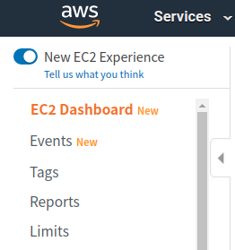
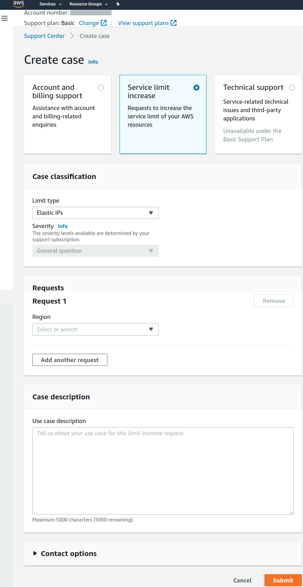

##### increase the limit on amazon ec2.md

* Draft: 2020-04-21 (Tue)

# Increasing the Limit on Amazon EC2

[Amazon EC2 Service Quotas](https://docs.aws.amazon.com/AWSEC2/latest/UserGuide/ec2-resource-limits.html)

## View your current limits

1. Open the Amazon EC2 console at https://console.aws.amazon.com/ec2/.
2. From the navigation bar, select a Region.
3. From the navigation pane, choose **Limits**.

4. Locate the resource in the list. You can use the search fields to filter the list by resource name or resource group. The **Current limit** column displays the current maximum for the resource for your account.

## Request a limit increase

Click `Request limit increase` and complete the fields in `Create case`. You may have to wait for a while until the case is been processed.

