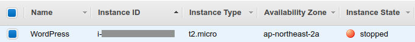
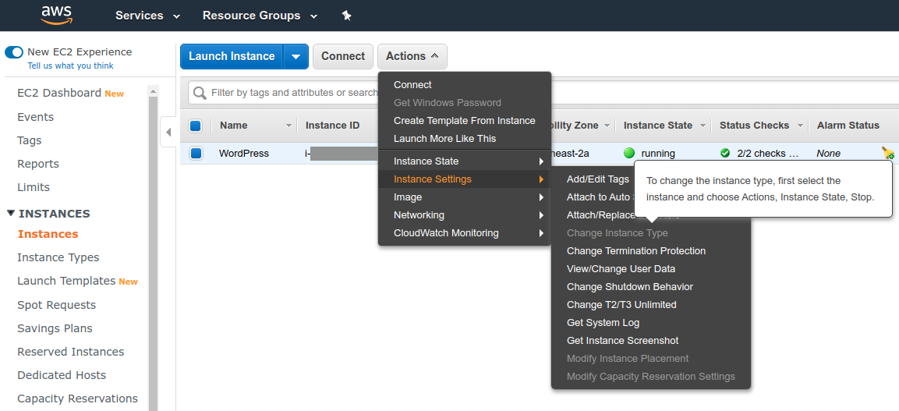
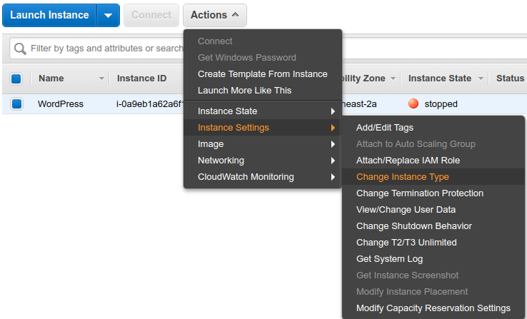
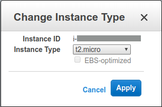
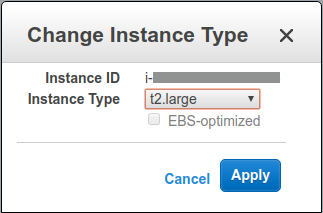
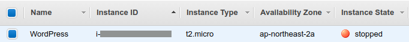

##### aimldl/aws/ec2/how_to_change_instance_type.md
* Rev.1: 2020-01-15 (Wed)
* Draft: 2019-12-18 (Wed)

## How to Change Amazon EC2 Instance Type on Console
The steps to change the instance type is below. For details, refer to [Resizing an EC2 Instance - Curious Orbit](https://curiousorbit.com/blog/resizing-an-ec2-instance/) or google-search with "aws ec2 how to change instance type".

1. Open the EC2 Dashboard
2. Select the instance you wish to resize and stop the instance.
  

  If an instance is running, "Change Instance Type" can not be selected.
  

3. Select "Actions > Instance Settings > Change Instance Type"
  
4. Change the "Instance Type" and click "Apply. For example, change from t2.micro to t2.large.
  
  
5. Start the instance again to take the change effective.
  The Instance Type has been changed from
  
    to
  

(EOF)
