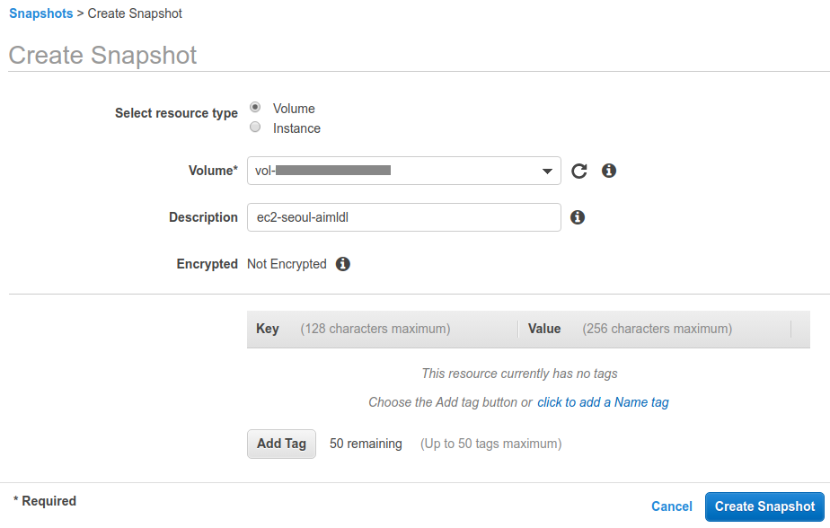

##### ec2/how_to_create_a_snapshot.md

## Create a Snapshot
To create a snapshot using the console,
1. Open the Amazon EC2 console at https://console.aws.amazon.com/ec2/.
2. Choose Snapshots under Elastic Block Store in the navigation pane.
3. Choose Create Snapshot.
4. For Select resource type, choose Volume.
5. For Volume, select the volume.
6. (Optional) Enter a description for the snapshot.
7. (Optional) Choose Add Tag to add tags to your snapshot. For each tag, provide a tag key and a tag value.
8. Choose Create Snapshot.

* To create a snapshot using the command line, refer to [create-snapshot¶](https://docs.aws.amazon.com/cli/latest/reference/ec2/create-snapshot.html).

For details, refer to [Creating Amazon EBS Snapshots](https://docs.aws.amazon.com/AWSEC2/latest/UserGuide/ebs-creating-snapshot.html).

## Example



After an hour and 11 minutes, the Progress field shows 3%. No improvement at all.

Probably, it's because there's no space left?

```bash
$ sudo apt-get autoremove
sudo: unable to resolve host ec2-seoul-aimldl: Resource temporarily unavailable
Reading package lists... Error!
E: Write error - write (28: No space left on device)
E: IO Error saving source cache
E: The package lists or status file could not be parsed or opened.
$
```
I was able to empty some space and about 25GB is secured. In about two hours, the progress is still 3%. At 4:55pm, the progress is 88%.

##
The progress is too slow. So I have exited all the ssh sessions and logged back in.
```bash
  ...
*** System restart required ***
$
```
I found "System restart required". So the EC2 instance is rebooted.
```bash
$ sudo reboot
```

Google search: unable to resolve host Resource temporarily unavailable
After the reboot, the following message disappeared.
```bash
sudo: unable to resolve host ec2-seoul-aimldl: Resource temporarily unavailable
```
