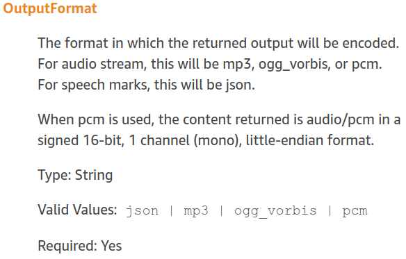

##### aimldl > aws > polly > cli > README.md

# CLI (Command Line Interface)

### Text-To-Speech Conversion to a Single Voice
[Voices in Amazon Polly](https://docs.aws.amazon.com/polly/latest/dg/voicelist.html)
* See the list of available voices.

### request_polly_all_voices
request_polly_all_voices requests Amazon Polly to convert the input text to all available voices in English. You can specify the text and file name as follows. The default format is mp3.
```bash
$ ./request_polly_all_voices "This is a test." "this_is_a_test.mp3"
```
The output file name is changed from voice to voice. For a voice name  of "Amy", the corresponding output file name is "this_is_a_test-Amy.mp3". For " Emma", "this_is_a_test-Emma.mp3". The voice name is added to the given output file name and output files for all voices are generated.

It's recommended to use the same file name as the input text. A space is replaced to underscore _ and all characters are small letters.

To change the output format to wav, you should do it in two steps. Amazon Polly doesn't support wav. Instead, pcm is supported. So get the Polly's output in pcm and then convert the pcm file to a wav file.


source: [SynthesizeSpeech](https://docs.aws.amazon.com/polly/latest/dg/API_SynthesizeSpeech.html) > OutputFormat

The part related to a new file name is below.
```bash
# Command line arguments
TEXT=${1:-"Input a text to read out loud."}
FILE_NAME=${2:-"output_filename.mp3"}
FORMAT=${3:-"mp3"}
BASE_NAME=$(basename ${FILE_NAME/.mp3})
echo $BASE_NAME

# All voices for English in the order of:
# English (British) (en-GB)
# English (US) (en-US)
# English (Australian) (en-AU)
# English (Welsh) (en-GB-WLS)
# English (Indian) (en-IN)
# Source: https://docs.aws.amazon.com/polly/latest/dg/voicelist.html
VOICES="Amy Emma Brian Ivy Joanna Kendra Kimberly Salli Joey Justin Matthew Nicole Russell Geraint Aditi Raveena"
for VOICE in ${VOICES}; do
  NEW_FILE_NAME=${BASE_NAME}-${VOICE}.${FORMAT}
```
### Text-To-Speech Conversion to All Available Voices
#### Example to use request_polly_all_voices

```bash
~$ cd aws_polly/
~/aws_polly$ cd new/
~/aws_polly/new$ ls
request_polly_all_voices
~/aws_polly/new$ chmod +x request_polly_all_voices
~/aws_polly/new$ ./request_polly_all_voices "Check me out." "check_me_out.mp3"
check_me_out
aws polly synthesize-speech --output-format mp3 --voice-id Amy --text 'Check me out.' check_me_out-Amy.mp3
  ...
  SNIMissingWarning
{
    "ContentType": "audio/mpeg",
    "RequestCharacters": "13"
}
aws polly synthesize-speech --output-format mp3 --voice-id Emma --text 'Check me out.' check_me_out-Emma.mp3
  ...
  SNIMissingWarning
{
    "ContentType": "audio/mpeg",
    "RequestCharacters": "13"
}
aws polly synthesize-speech --output-format mp3 --voice-id Brian --text 'Check me out.' check_me_out-Brian.mp3
  ...
  SNIMissingWarning
{
    "ContentType": "audio/mpeg",
    "RequestCharacters": "13"
}
aws polly synthesize-speech --output-format mp3 --voice-id Ivy --text 'Check me out.' check_me_out-Ivy.mp3
  ...
  SNIMissingWarning
{
    "ContentType": "audio/mpeg",
    "RequestCharacters": "13"
}
aws polly synthesize-speech --output-format mp3 --voice-id Joanna --text 'Check me out.' check_me_out-Joanna.mp3
  ...
  SNIMissingWarning
{
    "ContentType": "audio/mpeg",
    "RequestCharacters": "13"
}
aws polly synthesize-speech --output-format mp3 --voice-id Kendra --text 'Check me out.' check_me_out-Kendra.mp3
  ...
  SNIMissingWarning
{
    "ContentType": "audio/mpeg",
    "RequestCharacters": "13"
}
aws polly synthesize-speech --output-format mp3 --voice-id Kimberly --text 'Check me out.' check_me_out-Kimberly.mp3
  ...
  SNIMissingWarning
{
    "ContentType": "audio/mpeg",
    "RequestCharacters": "13"
}
aws polly synthesize-speech --output-format mp3 --voice-id Salli --text 'Check me out.' check_me_out-Salli.mp3
  ...
  SNIMissingWarning
{
    "ContentType": "audio/mpeg",
    "RequestCharacters": "13"
}
aws polly synthesize-speech --output-format mp3 --voice-id Joey --text 'Check me out.' check_me_out-Joey.mp3
  ...
  SNIMissingWarning
{
    "ContentType": "audio/mpeg",
    "RequestCharacters": "13"
}
aws polly synthesize-speech --output-format mp3 --voice-id Justin --text 'Check me out.' check_me_out-Justin.mp3
  ...
  SNIMissingWarning
{
    "ContentType": "audio/mpeg",
    "RequestCharacters": "13"
}
aws polly synthesize-speech --output-format mp3 --voice-id Matthew --text 'Check me out.' check_me_out-Matthew.mp3
  ...
  SNIMissingWarning
{
    "ContentType": "audio/mpeg",
    "RequestCharacters": "13"
}
aws polly synthesize-speech --output-format mp3 --voice-id Nicole --text 'Check me out.' check_me_out-Nicole.mp3
  ...
  SNIMissingWarning
{
    "ContentType": "audio/mpeg",
    "RequestCharacters": "13"
}
aws polly synthesize-speech --output-format mp3 --voice-id Russell --text 'Check me out.' check_me_out-Russell.mp3
  ...
  SNIMissingWarning
{
    "ContentType": "audio/mpeg",
    "RequestCharacters": "13"
}
aws polly synthesize-speech --output-format mp3 --voice-id Geraint --text 'Check me out.' check_me_out-Geraint.mp3
  ...
  SNIMissingWarning
{
    "ContentType": "audio/mpeg",
    "RequestCharacters": "13"
}
aws polly synthesize-speech --output-format mp3 --voice-id Aditi --text 'Check me out.' check_me_out-Aditi.mp3
  ...
  SNIMissingWarning
{
    "ContentType": "audio/mpeg",
    "RequestCharacters": "13"
}
aws polly synthesize-speech --output-format mp3 --voice-id Raveena --text 'Check me out.' check_me_out-Raveena.mp3
  ...
  SNIMissingWarning
{
    "ContentType": "audio/mpeg",
    "RequestCharacters": "13"
}
~/aws_polly/new$ ls
check_me_out-Aditi.mp3    check_me_out-Ivy.mp3     check_me_out-Kimberly.mp3  check_me_out-Salli.mp3
check_me_out-Amy.mp3      check_me_out-Joanna.mp3  check_me_out-Matthew.mp3   request_polly_all_voices
check_me_out-Brian.mp3    check_me_out-Joey.mp3    check_me_out-Nicole.mp3
check_me_out-Emma.mp3     check_me_out-Justin.mp3  check_me_out-Raveena.mp3
check_me_out-Geraint.mp3  check_me_out-Kendra.mp3  check_me_out-Russell.mp3
```

```bash
~/aws_polly/new$ tar zcvf new.tar.gz *
check_me_out-Aditi.mp3
check_me_out-Amy.mp3
check_me_out-Brian.mp3
check_me_out-Emma.mp3
check_me_out-Geraint.mp3
check_me_out-Ivy.mp3
check_me_out-Joanna.mp3
check_me_out-Joey.mp3
check_me_out-Justin.mp3
check_me_out-Kendra.mp3
check_me_out-Kimberly.mp3
check_me_out-Matthew.mp3
check_me_out-Nicole.mp3
check_me_out-Raveena.mp3
check_me_out-Russell.mp3
check_me_out-Salli.mp3
request_polly_all_voices
~/aws_polly/new$ ls
check_me_out-Aditi.mp3    check_me_out-Ivy.mp3     check_me_out-Kimberly.mp3  check_me_out-Salli.mp3
check_me_out-Amy.mp3      check_me_out-Joanna.mp3  check_me_out-Matthew.mp3   new.tar.gz
check_me_out-Brian.mp3    check_me_out-Joey.mp3    check_me_out-Nicole.mp3    request_polly_all_voices
check_me_out-Emma.mp3     check_me_out-Justin.mp3  check_me_out-Raveena.mp3
check_me_out-Geraint.mp3  check_me_out-Kendra.mp3  check_me_out-Russell.mp3
~/aws_polly/new$ exit
```

#### Example for PCM
```bash
~/aws_polly/new$ ls
request_polly_all_voices
~/aws_polly/new$ ./request_polly_all_voices "Check me out." "check_me_out.pcm" "pcm"
check_me_out.pcm
aws polly synthesize-speech --output-format pcm --voice-id Amy --text 'Check me out.' check_me_out.pcm-Amy.pcm
  ...
  SNIMissingWarning
{
    "ContentType": "audio/pcm",
    "RequestCharacters": "13"
}
aws polly synthesize-speech --output-format pcm --voice-id Emma --text 'Check me out.' check_me_out.pcm-Emma.pcm
  ...
  SNIMissingWarning
{
    "ContentType": "audio/pcm",
    "RequestCharacters": "13"
}
aws polly synthesize-speech --output-format pcm --voice-id Brian --text 'Check me out.' check_me_out.pcm-Brian.pcm
  ...
  SNIMissingWarning
{
    "ContentType": "audio/pcm",
    "RequestCharacters": "13"
}
aws polly synthesize-speech --output-format pcm --voice-id Ivy --text 'Check me out.' check_me_out.pcm-Ivy.pcm
  ...
  SNIMissingWarning
{
    "ContentType": "audio/pcm",
    "RequestCharacters": "13"
}
aws polly synthesize-speech --output-format pcm --voice-id Joanna --text 'Check me out.' check_me_out.pcm-Joanna.pcm
  ...
  SNIMissingWarning
{
    "ContentType": "audio/pcm",
    "RequestCharacters": "13"
}
aws polly synthesize-speech --output-format pcm --voice-id Kendra --text 'Check me out.' check_me_out.pcm-Kendra.pcm
  ...
  SNIMissingWarning
{
    "ContentType": "audio/pcm",
    "RequestCharacters": "13"
}
aws polly synthesize-speech --output-format pcm --voice-id Kimberly --text 'Check me out.' check_me_out.pcm-Kimberly.pcm
  ...
  SNIMissingWarning
{
    "ContentType": "audio/pcm",
    "RequestCharacters": "13"
}
aws polly synthesize-speech --output-format pcm --voice-id Salli --text 'Check me out.' check_me_out.pcm-Salli.pcm
  ...
  SNIMissingWarning
{
    "ContentType": "audio/pcm",
    "RequestCharacters": "13"
}
aws polly synthesize-speech --output-format pcm --voice-id Joey --text 'Check me out.' check_me_out.pcm-Joey.pcm
  ...
  SNIMissingWarning
{
    "ContentType": "audio/pcm",
    "RequestCharacters": "13"
}
aws polly synthesize-speech --output-format pcm --voice-id Justin --text 'Check me out.' check_me_out.pcm-Justin.pcm
  ...
  SNIMissingWarning
{
    "ContentType": "audio/pcm",
    "RequestCharacters": "13"
}
aws polly synthesize-speech --output-format pcm --voice-id Matthew --text 'Check me out.' check_me_out.pcm-Matthew.pcm
  ...
  SNIMissingWarning
{
    "ContentType": "audio/pcm",
    "RequestCharacters": "13"
}
aws polly synthesize-speech --output-format pcm --voice-id Nicole --text 'Check me out.' check_me_out.pcm-Nicole.pcm
  ...
  SNIMissingWarning
{
    "ContentType": "audio/pcm",
    "RequestCharacters": "13"
}
aws polly synthesize-speech --output-format pcm --voice-id Russell --text 'Check me out.' check_me_out.pcm-Russell.pcm
  ...
  SNIMissingWarning
{
    "ContentType": "audio/pcm",
    "RequestCharacters": "13"
}
aws polly synthesize-speech --output-format pcm --voice-id Geraint --text 'Check me out.' check_me_out.pcm-Geraint.pcm
  ...
  SNIMissingWarning
{
    "ContentType": "audio/pcm",
    "RequestCharacters": "13"
}
aws polly synthesize-speech --output-format pcm --voice-id Aditi --text 'Check me out.' check_me_out.pcm-Aditi.pcm
  ...
  SNIMissingWarning
{
    "ContentType": "audio/pcm",
    "RequestCharacters": "13"
}
aws polly synthesize-speech --output-format pcm --voice-id Raveena --text 'Check me out.' check_me_out.pcm-Raveena.pcm
  ...
  SNIMissingWarning
{
    "ContentType": "audio/pcm",
    "RequestCharacters": "13"
}
~/aws_polly/new$ ls
check_me_out.pcm-Aditi.pcm    check_me_out.pcm-Joanna.pcm    check_me_out.pcm-Nicole.pcm
check_me_out.pcm-Amy.pcm      check_me_out.pcm-Joey.pcm      check_me_out.pcm-Raveena.pcm
check_me_out.pcm-Brian.pcm    check_me_out.pcm-Justin.pcm    check_me_out.pcm-Russell.pcm
check_me_out.pcm-Emma.pcm     check_me_out.pcm-Kendra.pcm    check_me_out.pcm-Salli.pcm
check_me_out.pcm-Geraint.pcm  check_me_out.pcm-Kimberly.pcm  request_polly_all_voices
check_me_out.pcm-Ivy.pcm      check_me_out.pcm-Matthew.pcm
~/aws_polly/new$ tar zcvf new.tar.gz *
check_me_out.pcm-Aditi.pcm
check_me_out.pcm-Amy.pcm
check_me_out.pcm-Brian.pcm
check_me_out.pcm-Emma.pcm
check_me_out.pcm-Geraint.pcm
check_me_out.pcm-Ivy.pcm
check_me_out.pcm-Joanna.pcm
check_me_out.pcm-Joey.pcm
check_me_out.pcm-Justin.pcm
check_me_out.pcm-Kendra.pcm
check_me_out.pcm-Kimberly.pcm
check_me_out.pcm-Matthew.pcm
check_me_out.pcm-Nicole.pcm
check_me_out.pcm-Raveena.pcm
check_me_out.pcm-Russell.pcm
check_me_out.pcm-Salli.pcm
request_polly_all_voices
~/aws_polly/new$ ls
check_me_out.pcm-Aditi.pcm    check_me_out.pcm-Joanna.pcm    check_me_out.pcm-Nicole.pcm
check_me_out.pcm-Amy.pcm      check_me_out.pcm-Joey.pcm      check_me_out.pcm-Raveena.pcm
check_me_out.pcm-Brian.pcm    check_me_out.pcm-Justin.pcm    check_me_out.pcm-Russell.pcm
check_me_out.pcm-Emma.pcm     check_me_out.pcm-Kendra.pcm    check_me_out.pcm-Salli.pcm
check_me_out.pcm-Geraint.pcm  check_me_out.pcm-Kimberly.pcm  new.tar.gz
check_me_out.pcm-Ivy.pcm      check_me_out.pcm-Matthew.pcm   request_polly_all_voices
~/aws_polly/new$ exit
```
