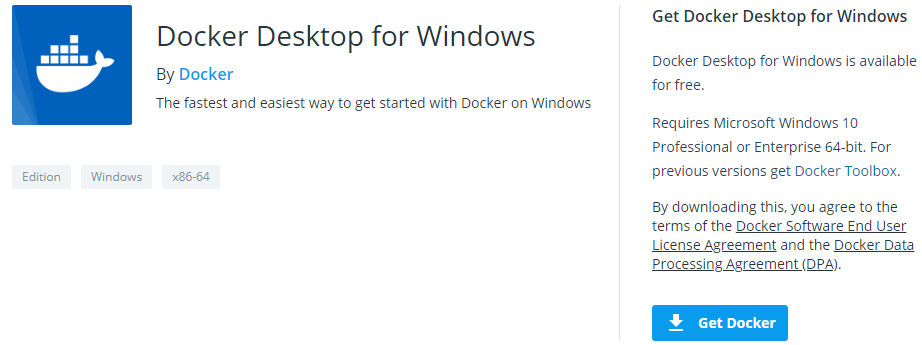
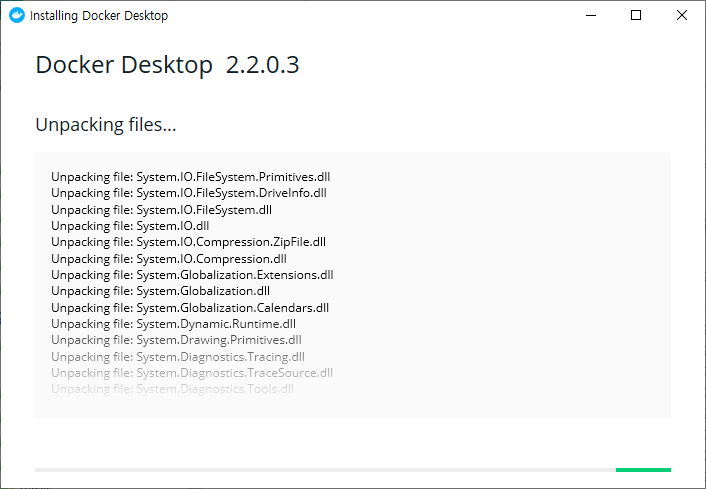
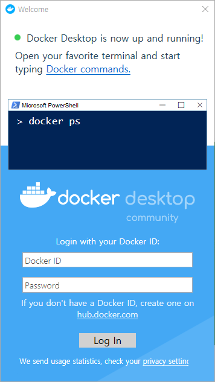
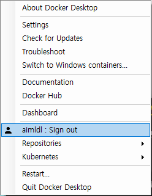

##### aimldl/computing_environments/docker/INSTALL-Docker_Desktop_on_Windows.md
* Draft: 2020-0312 (Thu)
# Install Docker Desktop on Windows
[Docker Desktop for Windows](https://hub.docker.com/editions/community/docker-ce-desktop-windows/) is the Community version of Docker for Microsoft Windows. 

1. Go to [Docker Desktop for Windows](https://hub.docker.com/editions/community/docker-ce-desktop-windows/)


2. Click "Get Docker" to download the installation file "Docker Desktop Installer.exe".

3. Run the installation file and follow the steps. The installation will go smooth like other Windows program installation.



4. After the installation is complete, it is required to reboot the computer.

## Verify the Installation (of Docker Desktop on Windows)
After the reboot, a pop-up window introduces Docker on Windows.


### Check if the Basic Docker Commands Run.
The cool thing is the docker commands is entered into Windows Powershell. Verify the docker installation by entering some docker commands like the instructions.


### Log into Docker Hub (from Docker Desktop on Windows)
Create a [Docker Hub](https://hub.docker.com/) account and enter the ID and password in the pop-up window in order to log into [Docker Hub](https://hub.docker.com/).

### Check if You're Logged in.
Right-click the whale shape Docker symbol.


Check if you're signed in like below. My ID is "aimldl".


### "Hello, World!" for Docker.
Test if the hello-world image can be downloaded from Docker Hub and run. If this hello-world works, you're good to go!

```powershell
PS C:\Users\aimldl> docker run hello-world

Hello from Docker!
This message shows that your installation appears to be working correctly.

To generate this message, Docker took the following steps:
 1. The Docker client contacted the Docker daemon.
 2. The Docker daemon pulled the "hello-world" image from the Docker Hub.
    (amd64)
 3. The Docker daemon created a new container from that image which runs the
    executable that produces the output you are currently reading.
 4. The Docker daemon streamed that output to the Docker client, which sent it
    to your terminal.

To try something more ambitious, you can run an Ubuntu container with:
 $ docker run -it ubuntu bash

Share images, automate workflows, and more with a free Docker ID:
 https://hub.docker.com/

For more examples and ideas, visit:
 https://docs.docker.com/get-started/

PS C:\Users\aimldl>
```
 Note the output looks the same in Linux as well. The following command is run on Ubuntu Linux 18.04.
 ```bash
 $ docker run hello-world
Hello from Docker! 
This message shows that your installation appears to be working correctly.

To generate this message, Docker took the following steps:
  1. The Docker client contacted the Docker daemon.
  2. The Docker daemon pulled the "hello-world" image from the Docker Hub.
     (amd64)
  3. The Docker daemon created a new container from that image which runs the
     executable that produces the output you are currently reading.
  4. The Docker daemon streamed that output to the Docker client, which sent it
     to your terminal.

To try something more ambitious, you can run an Ubuntu container with:
 $ docker run -it ubuntu bash

Share images, automate workflows, and more with a free Docker ID:
 https://hub.docker.com/

For more examples and ideas, visit:
 https://docs.docker.com/get-started/\
$
 ```
