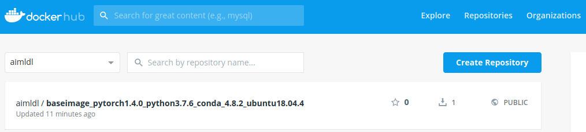

# PyTorch 

PyTorch is installed in a container named pytorch of which base image is "aimldl/baseimage_python3.7.6_conda_4.8.2_ubuntu18.04.4".


```
$ docker run -it -p 8080:8080 --name pytorch aimldl/baseimage_python3.7.6_conda_4.8.2_ubuntu18.04.4 bash
2020-03-26 (Thu) 08:38 (12th week)
Welcome to ubuntu18.04, conda 4.8.2, Python 3.7.6
(base) user@cfc17edfbcc1:~$ conda info -e
# conda environments:
#
base                  *  /home/user/anaconda3

(base) user@cfc17edfbcc1:~$ conda create -n pytorch python=3 anaconda
Collecting package metadata (current_repodata.json): done
  ...
Proceed ([y]/n)? y
  ...
#
# To activate this environment, use
#
#     $ conda activate pytorch
#
# To deactivate an active environment, use
#
#     $ conda deactivate
(base) user@cfc17edfbcc1:~$ conda install pytorch torchvision cuda100 -c pytorch
Collecting package metadata (current_repodata.json): done
  ...
Proceed ([y]/n)? y
  ...
cudatoolkit-10.1.243 | 347.4 MB  |###################################### | 100% 
pytorch-1.4.0        | 432.9 MB  | ##################################### | 100% 
cuda100-1.0          | 2 KB      | ##################################### | 100% 
Preparing transaction: done
Verifying transaction: done
Executing transaction: done
(base) user@cfc17edfbcc1:~$ python
Python 3.7.6 (default, Jan  8 2020, 19:59:22) 
[GCC 7.3.0] :: Anaconda, Inc. on linux
Type "help", "copyright", "credits" or "license" for more information.
>>> import torch
>>> exit()
(base) user@cfc17edfbcc1:~$
```


### Install tochaudio

> torchaudio 0.4.0
> https://pypi.org/project/torchaudio/
>
> pip install torchaudio

```
(base) user@cfc17edfbcc1:~$ python
Python 3.7.6 (default, Jan  8 2020, 19:59:22) 
[GCC 7.3.0] :: Anaconda, Inc. on linux
Type "help", "copyright", "credits" or "license" for more information.
>>> import torchaudio
Traceback (most recent call last):
  File "<stdin>", line 1, in <module>
ModuleNotFoundError: No module named 'torchaudio'
>>> exit()
(base) user@cfc17edfbcc1:~$ pip install torchaudio
Collecting torchaudio
  Downloading torchaudio-0.4.0-cp37-cp37m-manylinux1_x86_64.whl (3.1 MB)
     |████████████████████████████████| 3.1 MB 865 kB/s 
Requirement already satisfied: torch==1.4.0 in ./anaconda3/lib/python3.7/site-packages (from torchaudio) (1.4.0)
Installing collected packages: torchaudio
Successfully installed torchaudio-0.4.0
(base) user@cfc17edfbcc1:~$ python
Python 3.7.6 (default, Jan  8 2020, 19:59:22) 
[GCC 7.3.0] :: Anaconda, Inc. on linux
Type "help", "copyright", "credits" or "license" for more information.
>>> import torchaudio
>>> exit()
(base) user@cfc17edfbcc1:~$
```

### Install torchtext

> torchtext 0.5.0
> https://pypi.org/project/torchtext/
>
> pip install torchtext

```
(base) user@cfc17edfbcc1:~$ python
Python 3.7.6 (default, Jan  8 2020, 19:59:22) 
[GCC 7.3.0] :: Anaconda, Inc. on linux
Type "help", "copyright", "credits" or "license" for more information.
>>> import torchtext
Traceback (most recent call last):
  File "<stdin>", line 1, in <module>
ModuleNotFoundError: No module named 'torchtext'
>>> exit()
(base) user@cfc17edfbcc1:~$ pip install torchtext
Collecting torchtext
  Downloading torchtext-0.5.0-py3-none-any.whl (73 kB)
     |████████████████████████████████| 73 kB 449 kB/s 
Requirement already satisfied: numpy in ./anaconda3/lib/python3.7/site-packages (from torchtext) (1.18.1)
Requirement already satisfied: six in ./anaconda3/lib/python3.7/site-packages (from torchtext) (1.14.0)
Requirement already satisfied: requests in ./anaconda3/lib/python3.7/site-packages (from torchtext) (2.22.0)
Collecting sentencepiece
  Downloading sentencepiece-0.1.85-cp37-cp37m-manylinux1_x86_64.whl (1.0 MB)
     |████████████████████████████████| 1.0 MB 1.9 MB/s 
Requirement already satisfied: tqdm in ./anaconda3/lib/python3.7/site-packages (from torchtext) (4.42.1)
Requirement already satisfied: torch in ./anaconda3/lib/python3.7/site-packages (from torchtext) (1.4.0)
Requirement already satisfied: chardet<3.1.0,>=3.0.2 in ./anaconda3/lib/python3.7/site-packages (from requests->torchtext) (3.0.4)
Requirement already satisfied: certifi>=2017.4.17 in ./anaconda3/lib/python3.7/site-packages (from requests->torchtext) (2019.11.28)
Requirement already satisfied: urllib3!=1.25.0,!=1.25.1,<1.26,>=1.21.1 in ./anaconda3/lib/python3.7/site-packages (from requests->torchtext) (1.25.8)
Requirement already satisfied: idna<2.9,>=2.5 in ./anaconda3/lib/python3.7/site-packages (from requests->torchtext) (2.8)
Installing collected packages: sentencepiece, torchtext
Successfully installed sentencepiece-0.1.85 torchtext-0.5.0
(base) user@cfc17edfbcc1:~$ python
Python 3.7.6 (default, Jan  8 2020, 19:59:22) 
[GCC 7.3.0] :: Anaconda, Inc. on linux
Type "help", "copyright", "credits" or "license" for more information.
>>> import torchtext
>>> exit()
(base) user@cfc17edfbcc1:~$ 
```


### Add .bashrc to display versions of newly installed packages

pytorch, torchvision, torchtext, and torchaudio are newly installed and it's convenient to display their versions when the container starts. The .custom_bashrc is changed so that it prints the following welcome message. (If you wish, you may add these lines directly in .bashrc.)

```
2020-03-26 (Thu) 09:32 (12th week)
Welcome to ubuntu18.04, conda 4.8.3, Python 3.7.6, pytorch-1.4.0, torchvision-0.5.0, torchtext-0.5.0, torchaudio-0.4.0
(base) user@cfc17edfbcc1:~$
```

```
#####################
#  Welcome Message  #
#####################
# Welcome to ubuntu18.04, conda 4.8.2, Python 3.7.6
linux_distribution=$(. /etc/os-release;echo $ID$VERSION_ID)
python_version=`python --version`
anaconda_version=`conda -V`

# PyTorch Versions
pytorch_version=`python -c 'import torch; version=torch.__version__; print(f"pytorch-{version}")'`
torchvision_version=`python -c 'import torchvision; version=torchvision.__version__; print(f"torchvision-{version}")'`
torchtext_version=`python -c 'import torchtext; version=torchtext.__version__; print(f"torchtext-{version}")'`
torchaudio_version=`python -c 'import torchaudio; version=torchaudio.__version__; print(f"torchaudio-{version}")'`

# Welcome to ubuntu18.04, conda 4.8.3, Python 3.7.6, pytorch-1.4.0, torchvision-0.5.0, torchtext-0.5.0, torchaudio-0.4.0
echo "Welcome to $linux_distribution, $anaconda_version, $python_version, $pytorch_version, $torchvision_version, $torchtext_version, $torchaudio_version"
```


### Commit the configured container to an image

Make an image "aimldl/baseimage_pytorch1.4.0_python3.7.6_conda_4.8.2_ubuntu18.04.4" from the container "pytorch". And then upload the created image to Docker Hub so it can be downloaded from anywhere.

```
(base) aimldl@Home-Laptop:~$ docker commit pytorch aimldl/baseimage_pytorch1.4.0_python3.7.6_conda_4.8.2_ubuntu18.04.4
sha256:  ...
(base) aimldl@Home-Laptop:~$ docker images
REPOSITORY                                                            TAG     ... 
aimldl/baseimage_pytorch1.4.0_python3.7.6_conda_4.8.2_ubuntu18.04.4   latest  ...
aimldl/baseimage_python3.7.6_conda_4.8.2_ubuntu18.04.4                latest  ...
hello-world                                                           latest  ...
(base) aimldl@Home-Laptop:~$ docker push aimldl/baseimage_pytorch1.4.0_python3.7.6_conda_4.8.2_ubuntu18.04.4 
The push refers to repository [docker.io/aimldl/baseimage_pytorch1.4.0_python3.7.6_conda_4.8.2_ubuntu18.04.4]
  ...
latest: digest:  ...
(base) aimldl@Home-Laptop:~$ docker logout
Removing login credentials for https://index.docker.io/v1/
```


After the upload or push, check if the image is successfully uploaded on the Docker Hub homepage. 



I found it's not a good idea to use the "docker search" command right after the push or upload. The reason being I can't see the newly pushed image. I think there's a lag somehow. It's been like this years ago and it still is like this.

```
$ docker search aimldl
```

