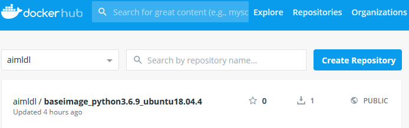

##### aimldl/computing_environments/docker/how_to/create a new image from a container.md
* Rev.1: 2020-05-21 (Thu)
* Draft: 2020-03-12 (Thu)
# How to Create a New Image from a Container

## docker commit
### Usage
```bash
docker commit [OPTIONS] CONTAINER [REPOSITORY[:TAG]]
```
### Help
```bash
docker commit --help
```
### Example
To create a new image "aimldl/baseimage_python3.6.9_ubuntu18.04.4" from a container "flamboyant_bhabha", run:
```bash
$ docker commit -a "T.Kim" flamboyant_bhabha aimldl/baseimage_python3.6.9_ubuntu18.04.4
sha256:b237e70d403e009480dcc768f2112103331a011c2c54cf8b5354c5e096112c68
$
```
The author name is set up "T.Kim" with the -a option.

A sequence of commands to commit an image and push it to Docker Hub is represented below.
```bash
$ docker images
REPOSITORY                                  TAG     IMAGE ID      CREATED         SIZE
hello-world                                 latest  fce289e99eb9  14 months ago   1.84kB
aimldl/python3_base_image                   latest  588f6d18f46e  18 months ago   1.09GB
$ docker ps
CONTAINER ID  IMAGE                       ... NAMES
0ea530773393  aimldl/python3_base_image   ... flamboyant_bhabha
$ docker commit -a "T.Kim" flamboyant_bhabha aimldl/baseimage_python3.6.9_ubuntu18.04.4
sha256:b237e70d403e009480dcc768f2112103331a011c2c54cf8b5354c5e096112c68
$ docker images
REPOSITORY                                  TAG     IMAGE ID      CREATED         SIZE
aimldl/baseimage_python3.6.9_ubuntu18.04.4  latest  773d27d8765e  52 minutes ago  1.57GB
hello-world                                 latest  fce289e99eb9  14 months ago   1.84kB
aimldl/python3_base_image                   latest  588f6d18f46e  18 months ago   1.09GB
$ docker login
Authenticating with existing credentials...
Login Succeeded
$ docker push aimldl/baseimage_python3.6.9_ubuntu18.04.4
The push refers to repository [docker.io/aimldl/baseimage_python3.6.9_ubuntu18.04.4]
53f0bdfe8a57: Pushed                                                  
  ...
a30b835850bf: Mounted from aimldl/python3_base_image
latest: digest: sha256:... size: 8712
$
```

To verify if the upload went well, I've searched Docker Hub, but couldn't find the image.
```bash
$ docker search aimldl
NAME                       DESCRIPTION  STARS  OFFICIAL  AUTOMATED
aimldl/python3_base_image  0
  ...
$  docker logout
Removing login credentials for https://index.docker.io/v1/
$
```
However I was able to find it after logging into the website with a web browser.


It's not the first time the Docker CLI doesn't show the uploaded image immediately.
In that case, you may use a web browser to verify the upload.

### Caution
#### repository name must be lowercase
```bash
$ docker commit -a "http://tae.hyung.kim" flamboyant_bhabha aimldl/baseimage_Python3.6.9_Ubuntu18.04.4
invalid reference format: repository name must be lowercase
$
```

## Example
```bash
(base) user@df4703dbba5f:~$ read escape sequence
(base) aimldl@Home-Laptop:~$ docker ps
CONTAINER ID        IMAGE                                                    COMMAND             CREATED             STATUS              PORTS                    NAMES
df4703dbba5f        aimldl/baseimage_python3.7.6_conda_4.8.2_ubuntu18.04.4   "bash"              About an hour ago   Up About an hour                             conda
dddbf9e9b072        aimldl/kaggle_telco_customer_churn:ver0.1                "bash"              2 hours ago         Up 2 hours          0.0.0.0:8080->8080/tcp   telco
(base) aimldl@Home-Laptop:~$ docker commit df4703dbba5f aimldl/baseimage_python3.7.6_conda_4.8.2_ubuntu18.04.4
sha256:  ...
(base) aimldl@Home-Laptop:~$ docker images
REPOSITORY                                               TAG                 IMAGE ID            CREATED             SIZE
aimldl/baseimage_python3.7.6_conda_4.8.2_ubuntu18.04.4   latest              1b5f015ba472        17 seconds ago      5.84GB
aimldl/baseimage_python3.7.6_conda_4.8.2_ubuntu18.04.4   <none>              562fb67f8f2d        8 days ago          5.44GB
hello-world                                              latest              fce289e99eb9        14 months ago       1.84kB
(base) aimldl@Home-Laptop:~$ docker login
Authenticating with existing credentials...
   ...
Login Succeeded
(base) aimldl@Home-Laptop:~$ docker push aimldl/baseimage_python3.7.6_conda_4.8.2_ubuntu18.04.4:latest
The push refers to repository [docker.io/aimldl/baseimage_python3.7.6_conda_4.8.2_ubuntu18.04.4]
080057d0bba6: Pushed 
  ...
latest: digest: sha256:  ...
(base) aimldl@Home-Laptop:~$ 
```

## Example: Create a Docker base image for H2O.ai
```bash
$ docker commit -a "Tae-Hyung T. Kim, Ph.D." compassionate_lamport aimldl/baseimage_h2o_3.30.0.3_default_jdk_python3.7.6_conda_4.8.2_ubuntu18.04.4
sha256:888a9a0990fc8ac487d730da5c6fdf7c0942c2cdca48a88142e7fe51f9b01253
$ docker images
REPOSITORY                                                                       TAG   ...
aimldl/baseimage_h2o_3.30.0.3_default_jdk_python3.7.6_conda_4.8.2_ubuntu18.04.4  latest...

...  IMAGE ID            CREATED              SIZE
...  888a9a0990fc        About a minute ago   8.03GB
$ docker login
  ...
Login Succeeded
$ docker push aimldl/baseimage_h2o_3.30.0.3_default_jdk_python3.7.6_conda_4.8.2_ubuntu18.04.4
$
```
