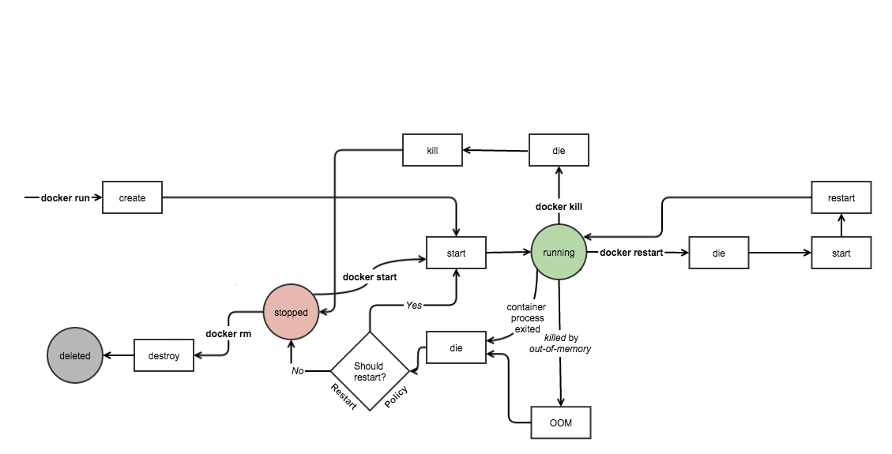

##### aimldl/computing_environments/docker/lifecycle_of_docker_container.md
* Rev.: 2020-0316 (Mon)
* Draft: 2020-0311 (Wed)
# Lifecycle of Docker Container
Commands associated with [Lifecycle of Docker Container](https://medium.com/@nagarwal/lifecycle-of-docker-container-d2da9f85959) on medium is the container level commands.


## Check the Running Containers with "docker ps"
"docker ps" shows the running containers. The following command shows "scikit_surprise" is a running container.
```bash
$ docker ps
CONTAINER ID  IMAGE          ...                               NAMES
9ec1b217c60a  aimldl/baseimage_python3.6.9_ubuntu18.04.4  ...  scikit_surprise
$
```
## Check All or Stopped Containers with "docker ps -a"
Use "docker ps -a" to see the stopped containers because this command shows all the containers. For example, the following three containers are created from the same image of "aimldl/baseimage_python3.6.9_ubuntu18.04.4".
```bash
$ docker ps -a
CONTAINER ID  IMAGE          ...                               NAMES
9ec1b217c60a  aimldl/baseimage_python3.6.9_ubuntu18.04.4  ...  scikit_surprise
0450b4aec5ba  aimldl/baseimage_python3.6.9_ubuntu18.04.4  ...  funny_vaughan
097e01a4a334  aimldl/baseimage_python3.6.9_ubuntu18.04.4  ...  festive_jackson
$
```
While "scikit_surprise" is running, "funny_vaughan" and "festive_jackson" are being stopped. So "funny_vaughan" and "festive_jackson" can be removed immediately with the "docker rm" command. On the other hand, "scikit_surprise" must be stopped first in order to remove it.

## Subsets of Lifecycle of Docker Container
The commands represented in [Lifecycle of Docker Container](https://medium.com/@nagarwal/lifecycle-of-docker-container-d2da9f85959) is rearranged to show subsets of the above figure.

### Subset 1 of the Lifecycle
docker creates a container from an image. Once a container starts to run, uou cannot remove a running container. So stop the container before attempting removal or force remove.
```
docker create --name <container-name> <image-name>
docker start <container-id/name>
docker stop <container-id/name>
docker rm <container-id/name>
```


For example,
```bash
$ docker ps
CONTAINER ID  IMAGE          ...                               NAMES
9ec1b217c60a  aimldl/baseimage_python3.6.9_ubuntu18.04.4  ...  scikit_surprise
$ docker rm scikit_surprise
Error response from daemon: You cannot remove a running container 9ec1b217c60a.
Stop the container before attempting removal or force remove
$ docker stop scikit_surprise
scikit_surprise
$ docker rm scikit_surprise
scikit_surprise
$
```

### Subset 2 of the Lifecycle
```
docker run -it -d --name <container-name> <image-name> bash
docker pause <container-id/name>
docker unpause <container-id/name>
docker stop <container-id/name>
docker rm <container-id/name>
```


### Subset 3 of the Lifecycle
```
docker run -it -d --name <container-name> <image-name> bash
docker restart <container-id/name>
docker kill <container-id/name>
docker rm <container-id/name>
```

