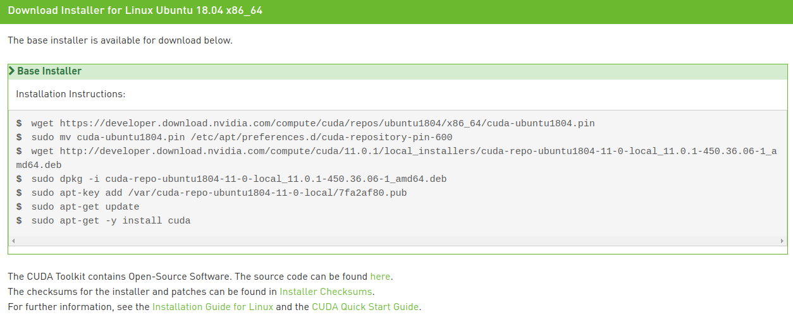

* Rev.1: 2020-06-25 (Thu)

* Draft: 2019-07-23 (Tue)

# Install NVIDIA CUDA Toolkit

For the full detail of this document, refer to [NVIDIA CUDA Installation Guide for Linux](https://docs.nvidia.com/cuda/cuda-installation-guide-linux/index.html#abstract).

## Summary

Step 1. Take the pre-installation actions

```bash
$ lspci | grep -i nvidia
$ uname -m && cat /etc/*release
$ gcc --version
$ uname -r
```

Step 2. Go to the [CUDA download page](http://developer.nvidia.com/cuda-downloads) and 

* http://developer.nvidia.com/cuda-downloads.

Step 3. asdf


## Pre-installation actions

```bash
$ lspci | grep -i nvidia
01:00.0 VGA compatible controller: NVIDIA Corporation GP104 [GeForce GTX 1080] (rev a1)
01:00.1 Audio device: NVIDIA Corporation GP104 High Definition Audio Controller (rev a1)
02:00.0 VGA compatible controller: NVIDIA Corporation GP104 [GeForce GTX 1080] (rev a1)
02:00.1 Audio device: NVIDIA Corporation GP104 High Definition Audio Controller (rev a1)
$ uname -m && cat /etc/*release
x86_64
DISTRIB_ID=Ubuntu
DISTRIB_RELEASE=18.04
DISTRIB_CODENAME=bionic
DISTRIB_DESCRIPTION="Ubuntu 18.04.4 LTS"
NAME="Ubuntu"
VERSION="18.04.4 LTS (Bionic Beaver)"
ID=ubuntu
ID_LIKE=debian
PRETTY_NAME="Ubuntu 18.04.4 LTS"
VERSION_ID="18.04"
HOME_URL="https://www.ubuntu.com/"
SUPPORT_URL="https://help.ubuntu.com/"
BUG_REPORT_URL="https://bugs.launchpad.net/ubuntu/"
PRIVACY_POLICY_URL="https://www.ubuntu.com/legal/terms-and-policies/privacy-policy"
VERSION_CODENAME=bionic
UBUNTU_CODENAME=bionic
$ gcc --version
gcc (Ubuntu 7.5.0-3ubuntu1~18.04) 7.5.0
Copyright (C) 2017 Free Software Foundation, Inc.
This is free software; see the source for copying conditions.  There is NO
warranty; not even for MERCHANTABILITY or FITNESS FOR A PARTICULAR PURPOSE.

$ uname -r
4.15.0-106-generic
$
```

The above output is for Dell Alienware Aurora R7 with two NVIDIA GPU cards (GeForce GTX 1080) with the recent Ubuntu 18.04.

## Download the NVIDIA CUDA Toolkit

### Select the target platform to install the toolkit

Go to http://developer.nvidia.com/cuda-downloads.


And select the options for the target platform. For Ubuntu 18.04, the selections are presented below. 


The `Installer Type` can be any of the three options while my preference is `deb(local)` in this example. When the selections are made, the installation instructions and some useful links are presented.



### Some useful links presented in this part

[CUDA Quick Start Guide](https://docs.nvidia.com/cuda/cuda-quick-start-guide/index.html): Minimal first-steps instructions to get CUDA running on a standard system.

[CUDA FAQ](https://developer.nvidia.com/cuda-faq)

[CUDA Samples](https://github.com/nvidia/cuda-samples) at https://github.com/nvidia/cuda-samples

[CUDA Toolkit Documentation v11.0.171](https://docs.nvidia.com/cuda/)

[Accelerated Computing - Training](https://developer.nvidia.com/accelerated-computing-training)

[NVIDIA Developer Forums](https://forums.developer.nvidia.com/)

--------

[Open-Source Software for the CUDA Toolkit](http://developer.download.nvidia.com/compute/cuda/opensource/11.0.1/): `cuda_gdb_src-all-all-11.0.172.tar.gz` is the only file in this link.

[Index of /compute/cuda/opensource](https://developer.download.nvidia.com/compute/cuda/opensource/): some more open source packages are available here.

[NVIDIA CUDA Toolkit Release Notes](https://docs.nvidia.com/cuda/cuda-toolkit-release-notes/index.html)

[CUDA Toolkit Archive](https://developer.nvidia.com/cuda-toolkit-archive)

### Download Installer for Linux Ubuntu 18.04 x86_64

Recall three options exits for `Installer Type` in `CUDA Toolkit 11.0 RC Download > Select Target Platform`.

* runfile (local)
* deb (local): this is the option for this example.
* deb (network)

The CUDA Toolkit will be downloaded and installed which contains

* the CUDA driver
* tools needed to create, build and run a CUDA application
* libraries, header files, CUDA samples source code, and other resources.

#### Installation instructions: runfile (local)

```bash
$ wget http://developer.download.nvidia.com/compute/cuda/11.0.1/local_installers/cuda_11.0.1_450.36.06_linux.run
$ sudo sh cuda_11.0.1_450.36.06_linux.run
```

For details, refer to [4. Runfile Installation](https://docs.nvidia.com/cuda/cuda-installation-guide-linux/index.html#runfile).

#### Installation instructions: deb (local)

```bash
$ wget https://developer.download.nvidia.com/compute/cuda/repos/ubuntu1804/x86_64/cuda-ubuntu1804.pin
$ sudo mv cuda-ubuntu1804.pin /etc/apt/preferences.d/cuda-repository-pin-600
$ wget http://developer.download.nvidia.com/compute/cuda/11.0.1/local_installers/cuda-repo-ubuntu1804-11-0-local_11.0.1-450.36.06-1_amd64.deb
$ sudo dpkg -i cuda-repo-ubuntu1804-11-0-local_11.0.1-450.36.06-1_amd64.deb
$ sudo apt-key add /var/cuda-repo-ubuntu1804-11-0-local/7fa2af80.pub
$ sudo apt-get update
$ sudo apt-get -y install cuda
```

#### Installation instructions: deb (network)

All the lines, but the 3rd & 4th commands are identical to those of `deb (local)`.

```bash
$ wget https://developer.download.nvidia.com/compute/cuda/repos/ubuntu1804/x86_64/cuda-ubuntu1804.pin
$ sudo mv cuda-ubuntu1804.pin /etc/apt/preferences.d/cuda-repository-pin-600
$ sudo apt-key adv --fetch-keys https://developer.download.nvidia.com/compute/cuda/repos/ubuntu1804/x86_64/7fa2af80.pub
$ sudo add-apt-repository "deb http://developer.download.nvidia.com/compute/cuda/repos/ubuntu1804/x86_64/ /"
$ sudo apt-get update
$ sudo apt-get -y install cuda
```

## Download and install CUDA with deb (local)

`deb (local)` is the option for this example. The commands presented in the `Installation Instructions` are executed in this part.

### Download

```bash
$ wget https://developer.download.nvidia.com/compute/cuda/repos/ubuntu1804/x86_64/cuda-ubuntu1804.pin
$ sudo mv cuda-ubuntu1804.pin /etc/apt/preferences.d/cuda-repository-pin-600
$ wget http://developer.download.nvidia.com/compute/cuda/11.0.1/local_installers/cuda-repo-ubuntu1804-11-0-local_11.0.1-450.36.06-1_amd64.deb
```

The file download takes 4~5 hours no matter how fast the network is. So take this slow download time into consideration.

### Install

Before installing CUDA, any previously installations that could conflict should be uninstalled. For details, refer to [2.7. Handle Conflicting Installation Methods](https://docs.nvidia.com/cuda/cuda-installation-guide-linux/index.html#handle-uninstallation).

```bash
# Install repository metadata
# sudo dpkg -i cuda-repo-<distro>_<version>_<architecture>.deb
$ sudo dpkg -i cuda-repo-ubuntu1804-11-0-local_11.0.1-450.36.06-1_amd64.deb
# Install the CUDA public GPG key
# sudo apt-key add /var/cuda-repo-<version>/7fa2af80.pub
$ sudo apt-key add /var/cuda-repo-ubuntu1804-11-0-local/7fa2af80.pub
# Update the Apt repository cache
$ sudo apt-get update
# Install CUDA
$ sudo apt-get -y install cuda
```

## Post-installation actions


