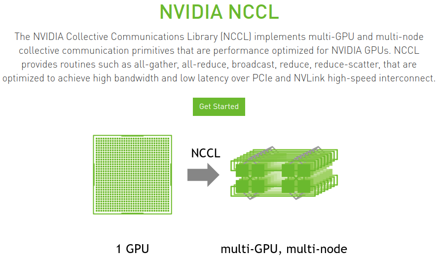
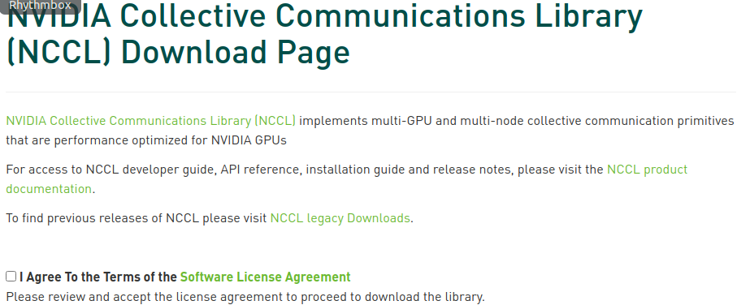

* Draft: 2020-06-29 (Mon)

# Install NVIDIA NCCL

## Overview

NCCL (NVIDIA Collective Communications Library) pronounced “Nickel” is a library of multi-GPU collective communication primitives. It is required not only for multi-GPU computations, but also multi-node multi-GPU computations as it allows multiple GPUs to communicate each other.

> Collective communication algorithms employ many processors working in concert to aggregate data. NCCL is not a full-blown parallel programming framework; rather, it is a library focused on accelerating collective communication primitives. The following collective operations are currently supported:
>
> - AllReduce
> - Broadcast
> - Reduce
> - AllGather
> - ReduceScatter
>
> Tight synchronization between communicating processors is a key aspect of collective communication.
>
> It supports a variety of interconnect technologies including:
>
> * PCIe
> * NVLink
> * InfiniBand Verbs
> * IP sockets
>
> Source: [NVIDIA NCCL Installation Guide](https://docs.nvidia.com/deeplearning/nccl/install-guide/index.html)

For more details, refer to [NVIDIA NCCL](https://developer.nvidia.com/nccl) and [NVIDIA NCCL Installation Guide](https://docs.nvidia.com/deeplearning/nccl/install-guide/index.html).

## Prerequisites

* glibc 2.17 or higher

* [Install NVIDIA Display Drivers](nvidia_graphics_card_driver_automatically.md)
  * CUDA 10.0 or higher
* [Install NVIDIA CUDA Toolkit](nvidia_cuda_toolkit.md)
* [Install NVIDIA cuDNN](nvidia_cudnn.md)
* Hardware Requirements
  * All CUDA devices with a compute capability of 3.5 and higher.
  * For example,
    * GeForce GTX 1080 Ti & GeForce GTX 1080 have compute capability of 6.1.
  * For details, refer to [Recommended GPU for Developers](https://developer.nvidia.com/cuda-gpus).

## Summary

For details, refer to [NVIDIA NCCL Installation Guide](https://docs.nvidia.com/deeplearning/nccl/install-guide/index.html).

## 1. Download the installation file

#### Step 1. Go to the [NVIDIA NCCL](https://developer.nvidia.com/nccl) page and click `Get Started` button.



And the [NCCL: Getting Started](https://developer.nvidia.com/nccl/getting_started) page will open.


#### Step 2. Click `Download NCCL`, fill in the `NCCL 2 Download Survey`, and submit the survey. 



#### Step 3. Check the box `I Agree To the Terms of the ...` and the following part shows up.


#### Step 4. Click the interested version of CUDA.

In my case, the most recent CUDA version 11.0 is my interest. So `Download NCCL 2.7.5, for CUDA 11.0, June 26,2020` is clicked.


Among several options,

* Local installers (x86)
* Network installers (x86)
* Local installers (POWER)
* Network installers (POWER)
* Local installers (ARM)
* Network installers (ARM)

I chose `Local installer for Ubuntu 18.04`.

`nccl-repo-ubuntu1804-2.7.5-ga-cuda11.0_1-1_amd64.deb`

`Network Installer for Ubuntu18.04`

`nvidia-machine-learning-repo-ubuntu1804_1.0.0-1_amd64.deb`


## 2. Install the downloaded installation file

```bash
$ sudo dpkg -i nccl-repo-ubuntu1804-2.7.5-ga-cuda11.0_1-1_amd64.deb 
```

```bash
[sudo] password for k8snode: 
Selecting previously unselected package nccl-repo-ubuntu1804-2.7.5-ga-cuda11.0.
(Reading database ... 230085 files and directories currently installed.)
Preparing to unpack nccl-repo-ubuntu1804-2.7.5-ga-cuda11.0_1-1_amd64.deb ...
Unpacking nccl-repo-ubuntu1804-2.7.5-ga-cuda11.0 (1-1) ...
Setting up nccl-repo-ubuntu1804-2.7.5-ga-cuda11.0 (1-1) ...
$
```

```bash
$ sudo apt update
```


```bash
$ sudo apt install libnccl2 libnccl-dev
```

```bash
Reading package lists... Done
Building dependency tree       
Reading state information... Done
You might want to run 'apt --fix-broken install' to correct these.
The following packages have unmet dependencies:
 libcudnn8-doc : Depends: libcudnn8-dev but it is not installable or
                          libcudnn8-dev- but it is not installable
E: Unmet dependencies. Try 'apt --fix-broken install' with no packages (or specify a solution).
$
```

```bash
$ sudo apt install libnccl2 libnccl-dev
```

```bash
Reading package lists... Done
Building dependency tree       
Reading state information... Done
The following NEW packages will be installed:
  libnccl-dev libnccl2
0 upgraded, 2 newly installed, 0 to remove and 5 not upgraded.
Need to get 0 B/70.4 MB of archives.
After this operation, 244 MB of additional disk space will be used.
Get:1 file:/var/nccl-repo-2.7.5-ga-cuda11.0  libnccl2 2.7.5-1+cuda11.0 [35.7 MB]
Get:2 file:/var/nccl-repo-2.7.5-ga-cuda11.0  libnccl-dev 2.7.5-1+cuda11.0 [34.7 MB]
Selecting previously unselected package libnccl2.
(Reading database ... 230031 files and directories currently installed.)
Preparing to unpack .../libnccl2_2.7.5-1+cuda11.0_amd64.deb ...
Unpacking libnccl2 (2.7.5-1+cuda11.0) ...
Selecting previously unselected package libnccl-dev.
Preparing to unpack .../libnccl-dev_2.7.5-1+cuda11.0_amd64.deb ...
Unpacking libnccl-dev (2.7.5-1+cuda11.0) ...
Setting up libnccl2 (2.7.5-1+cuda11.0) ...
Setting up libnccl-dev (2.7.5-1+cuda11.0) ...
Processing triggers for libc-bin (2.27-3ubuntu1) ...
/sbin/ldconfig.real: /usr/local/cuda-11.0/targets/x86_64-linux/lib/libcudnn_adv_train.so.8 is not a symbolic link

/sbin/ldconfig.real: /usr/local/cuda-11.0/targets/x86_64-linux/lib/libcudnn_cnn_infer.so.8 is not a symbolic link

/sbin/ldconfig.real: /usr/local/cuda-11.0/targets/x86_64-linux/lib/libcudnn_ops_train.so.8 is not a symbolic link

/sbin/ldconfig.real: /usr/local/cuda-11.0/targets/x86_64-linux/lib/libcudnn.so.8 is not a symbolic link

/sbin/ldconfig.real: /usr/local/cuda-11.0/targets/x86_64-linux/lib/libcudnn_adv_infer.so.8 is not a symbolic link

/sbin/ldconfig.real: /usr/local/cuda-11.0/targets/x86_64-linux/lib/libcudnn_ops_infer.so.8 is not a symbolic link

/sbin/ldconfig.real: /usr/local/cuda-11.0/targets/x86_64-linux/lib/libcudnn_cnn_train.so.8 is not a symbolic link

$
```


```bash
$ sudo apt --fix-broken install
Reading package lists... Done
Building dependency tree       
Reading state information... Done
Correcting dependencies... Done
The following packages will be REMOVED:
  libcudnn8-doc
0 upgraded, 0 newly installed, 1 to remove and 5 not upgraded.
1 not fully installed or removed.
After this operation, 10.7 MB disk space will be freed.
Do you want to continue? [Y/n] y
(Reading database ... 230094 files and directories currently installed.)
Removing libcudnn8-doc (8.0.1.13-1+cuda11.0) ...
$
```


```bash
$ sudo ldconfig
/sbin/ldconfig.real: /usr/local/cuda-11.0/targets/x86_64-linux/lib/libcudnn_adv_train.so.8 is not a symbolic link

/sbin/ldconfig.real: /usr/local/cuda-11.0/targets/x86_64-linux/lib/libcudnn_cnn_infer.so.8 is not a symbolic link

/sbin/ldconfig.real: /usr/local/cuda-11.0/targets/x86_64-linux/lib/libcudnn_ops_train.so.8 is not a symbolic link

/sbin/ldconfig.real: /usr/local/cuda-11.0/targets/x86_64-linux/lib/libcudnn.so.8 is not a symbolic link

/sbin/ldconfig.real: /usr/local/cuda-11.0/targets/x86_64-linux/lib/libcudnn_adv_infer.so.8 is not a symbolic link

/sbin/ldconfig.real: /usr/local/cuda-11.0/targets/x86_64-linux/lib/libcudnn_ops_infer.so.8 is not a symbolic link

/sbin/ldconfig.real: /usr/local/cuda-11.0/targets/x86_64-linux/lib/libcudnn_cnn_train.so.8 is not a symbolic link
$
```


```bash
$ sudo dpkg -i nvidia-machine-learning-repo-ubuntu1804_1.0.0-1_amd64.deb 
Selecting previously unselected package nvidia-machine-learning-repo-ubuntu1804.
(Reading database ... 230042 files and directories currently installed.)
Preparing to unpack nvidia-machine-learning-repo-ubuntu1804_1.0.0-1_amd64.deb ...
Unpacking nvidia-machine-learning-repo-ubuntu1804 (1.0.0-1) ...
Setting up nvidia-machine-learning-repo-ubuntu1804 (1.0.0-1) ...
$
```


```bash
$ sudo apt update
```


```bash
$ sudo apt install libnccl2 libnccl-dev
Reading package lists... Done
Building dependency tree       
Reading state information... Done
libnccl-dev is already the newest version (2.7.5-1+cuda11.0).
libnccl2 is already the newest version (2.7.5-1+cuda11.0).
0 upgraded, 0 newly installed, 0 to remove and 5 not upgraded.
$
```


에 접근하시어 log-in > Download NCCL v2.5.6, for CUDA 10.0, Nov 19,2019 > O/S agnostic local installer 의 순서를 따라주시면 ‘nccl_2.5.6-1+cuda10.0_x86_64.txz’ 파일을 다운 받을 수 있습니다. 마찬가지로, 다른 버전의 CUDA를 가지고 계신 분은 해당 버전에 받는 nccl을 받아주시기 바랍니다.

마지막 명령어 입니다:

```
tar -xf nccl_2.5.6-1+cuda10.0_x86_64.txz

cd nccl_2.5.6-1+cuda10.0_x86_64

sudo cp -R * /usr/local/cuda-10.0/targets/x86_64-linux/

sudo ldconfig
```

## References

* [NVIDIA NCCL Installation Guide](https://docs.nvidia.com/deeplearning/nccl/install-guide/index.html)
* [NCCL Archives](https://docs.nvidia.com/deeplearning/nccl/archives/index.html) for previous releases.