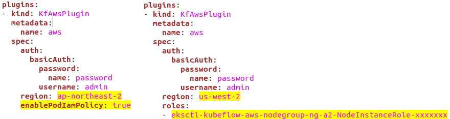
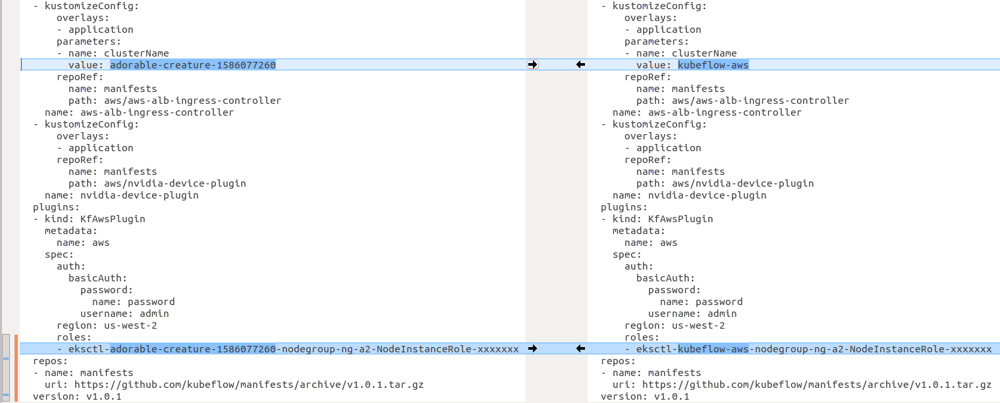

* Draft: 2020-04-08 (Wed)

# Installing Kubeflow for AWS

[Install Kubeflow: Instructions for deploying Kubeflow on AWS with the shell](https://www.kubeflow.org/docs/aws/deploy/install-kubeflow/)

Prerequisites

Refer to 

* [AWS를 이용해서 Kubernetes 설치하기](../kubernetes/INSTALL-Amazon_EKS.md)

## Prepare your environment

### Step 1. ktctl 실행 파일을 다운로드 받습니다.

```
$ wget https://github.com/kubeflow/kfctl/releases/download/v1.0.1/kfctl_v1.0.1-0-gf3edb9b_linux.tar.gz
  ...
Saving to: ‘kfctl_v1.0.1-0-gf3edb9b_linux.tar.gz’
kfctl_v1.0.1-0-gf3edb9b_linux. 100%[================>]  30.17M   118KB/s    in 5m 49s  
2020-04-09 11:11:21 (88.5 KB/s) - ‘kfctl_v1.0.1-0-gf3edb9b_linux.tar.gz’ saved [31630869/31630869]
$ ls
kfctl_v1.0.1-0-gf3edb9b_linux.tar.gz
$
```

(옵션) 웹브라우저를 이용해서 홈페이지에서 직접 받으려면 https://github.com/kubeflow/kfctl/releases/tag/v1.0.1으로 접속해서 [kfctl_v1.0.1-0-gf3edb9b_linux.tar.gz](https://github.com/kubeflow/kfctl/releases/download/v1.0.1/kfctl_v1.0.1-0-gf3edb9b_linux.tar.gz)를 다운로드 받으면 됩니다.


### Step 2. 압축파일을 풉니다.

```
$ tar -xvf kfctl_v1.0.1_<platform>.tar.gz
./kfctl
$ ls
kfctl  kfctl_v1.0.1-0-gf3edb9b_linux.tar.gz
$
```

### Step 3. 유저 홈 디렉토리에 bin 디렉토리를 만들고 kfctl 파일을 이동합니다.

```
$ mkdir ~/bin
$ mv kfctl ~/bin
$ ls ~/bin/
kfctl
$
```

bin 디렉토리 대신 다른 곳으로 지정해도 괜찮습니다. 대신 다음 단계의 PATH를 잘 지정해야 합니다.

### Step 4. kfctl이 있는 디렉토리를 PATH에 포함합니다.

편의상 PATH에 bin 디렉토리 포함해서 kfctl이 어디에서든 실행가능하도록 설정합니다.

```
export PATH=$PATH:~/bin
```

### Step 5. kfctl의 실행을 확인합니다.

압축이 해제되고 PATH 설정이 된 `kfctl`의 동작여부를 확인하기 위해 실행시켜봅니다. 현재 `kfctl`에는 `--version`옵션은 없으므로 `--help`옵션을 줍니다.  `cd` 명령어로 `kfctl`이 없는 유저 홈디렉토리로 이동하고 `kfctl --help` 명령어를 실행합니다.

```
$ cd
$ kfctl --help
A client CLI to create kubeflow applications for specific platforms or 'on-prem' 
to an existing k8s cluster.

Usage:
  kfctl [command]
  ...
To install run -> kfctl apply -f ${CONFIG}
For more information, run 'kfctl apply -h' or read the docs at www.kubeflow.org.
  version     Print the version of kfctl.

Flags:
  -h, --help   help for kfctl

Use "kfctl [command] --help" for more information about a command.
$
```

#### Kubeflow 설치과정에 대한 설명

출력된 내용에는 설치를 위해서는 다음 명령어를 실행하라고 나옵니다.

```
$ kfctl apply -f ${CONFIG}
```

이 명령어는 -f 옵션으로 지정된 파일을 kfctl에 적용한다는 뜻으로 설정사항은 YAML 양식으로 된 파일에 저장됩니다. ${CONFIG}는 CONFIG변수에 저장된 값으로 치환합니다. 가령 설정파일의 이름이 `config4kubeflow.yaml`이라면 

```
$ kfctl apply -f config4kubeflow.yaml
```

이라는 명령어를 실행하게 됩니다.

#### Kubernetes의 배치 (deployment) 방법

위와 같은 설치 방식은 Kubernetes에서 일반적으로 쓰입니다. 필요한 설정사항을 YAML파일에 저장해놓고 이를 적용하는 방식으로 프로그램을 설치합니다.

Kubernetes에서는 설치 (Install) 대신 배치(deploy)라는 용어를 씁니다. 객체 (Object)를 이미 구성된 Kubernetes 클러스터에 배치한다는 개념입니다. 한편 배치할 때 다양한 옵션의 (커맨드라인) 명령어를 쓰기 보다 설정사항을  YAML 양식으로 저장한 매니페스트 (Manifest)를 적용하는 것이 Kubernetes의 기본 정책입니다. 예를 들어 다음 명령어는 매니페스트가 `config4k8s.yaml`입니다. 이 YAML파일에 저장된 설정사항을 Kubernetes 클러스터에 적용해서 특정 객체 (예: 프로그램)를 배치합니다.

```
$ kubectl apply -f config4k8s.yaml 
```

#### 용어: 매니페스트 파일 (Manifest file)

프로그램에 대한 각종 정보를 저장한 것을 매니페스트 (Manifest)라고 합니다. Manifest는 명사로 `(배·비행기의) 화물 목록 [승객 명단]`이라는 뜻을 가지는 선원 및 화물을 나열하는 화물 수송 절차에서 나온 전문용어입니다. 자세한 내용은 [매니페스트 파일]([https://ko.wikipedia.org/wiki/%EB%A7%A4%EB%8B%88%ED%8E%98%EC%8A%A4%ED%8A%B8_%ED%8C%8C%EC%9D%BC](https://ko.wikipedia.org/wiki/매니페스트_파일))을 참고하세요.

#### Kubernetes에 배치되는 Kubeflow에 필요한 오픈소스 프로그램의 예

아래에 나올 Kubeflow의 설치과정을 요약하면 다음과 같습니다. 

* 설치 상의 편의를 위해 환경변수를 지정합니다.
* 다운로드 받은 YAML파일의 설정사항을 수정합니다.
* `kfctl apply -f ${CONFIG}`와 유사한 명령어를 실행합니다.

그러면 Kubeflow의 동작을 위해 필요한 다양한 오픈소스 프로그램이 Kubernetes 클러스터 (AWS에 설치할 경우 Amazon EKS 클러스터)에 배치됩니다. 이 정도의 설명은 모호할 수 있으므로 아래의 설명을 추가합니다. Kubernetes의 deploy 개념에 대해 아시면 건너 뛰셔도 무방합니다.

먼저 큰그림을 보자면 아래 그림은 Kubeflow에서 엔드-투-엔드 머신러닝 워크플로우 (E2E ML Workflow)를 구현하기 위해 필요한 오픈소스 프로그램을 보여줍니다.


Develop-build-train-deploy Critical user Journey, [Kubeflow 1.0: Cloud-Native ML for Everyone](https://medium.com/kubeflow/kubeflow-1-0-cloud-native-ml-for-everyone-a3950202751)

이 중에 머신러닝 모델의 Deploy를 위해서 필요한 KFServing의 아키텍쳐는 아래와 같습니다. 이 Deploy는 쿠버네티스의 객체를 Deploy하는 것과 다른 것으로 Production레벨의 서비스를 위한 것입니다. 예측 서버 (Prediction Server) 혹은 추론 서버 (Inference Server)로 불리는 서버에 훈련된 머신러닝 모델을 "옮겨서" 실제 서비스를 하는 단계입니다. 

설치과정에서 현상태는 Kubernetes 클러스터 (AWS는 EKS 클러스터)가 준비된 상태로, 아래의 두 단계인 Compute Cluster와 Kubernetes 레이어가 준비된 상태입니다. kfctl로 Kubeflow를 설치하는 과정에서 윗단에 있는 Istio, Knative, KFServing이 이미 준비된 Kubernetes 클러스터에 자동으로 배치됩니다. 이 뿐만이 아니라 Develop, Build, Train을 위해 필요한 다양한 오픈소스 프로그램도 배치됩니다.


Source: https://github.com/kubeflow/kfserving


#### Kubeflow가 지원하는 Deployment Platform과 Manifest파일

위의 그림에서 Compute Cluster는 온프레미스, AWS (Amazon Web Services), GCP (Google Cloud Platform), Microsoft Azure, IBM Cloud (IKS) 및 OpenShift가 있습니다. Kubernetes가 깔린 Compute Cluster, 즉 Deployment Platform에 Kubeflow를 깔기 위한 Manifest 파일은 다음의 표에 정리되어 있습니다.

| Deployment platform                        | Manifest File                                                |
| ------------------------------------------ | ------------------------------------------------------------ |
| 기존의 Kubernetes 클러스터 (표준 설정)     | [kfctl_k8s_istio.v1.0.1.yaml](https://raw.githubusercontent.com/kubeflow/manifests/v1.0-branch/kfdef/kfctl_k8s_istio.v1.0.1.yaml) |
| 기존의 Kubernetes 클러스터 (DEX 인증 설정) | [kfctl_istio_dex.v1.0.1.yaml](https://raw.githubusercontent.com/kubeflow/manifests/v1.0-branch/kfdef/kfctl_istio_dex.v1.0.1.yaml) |
| AWS (표준 설정)                            | [kfctl_aws.v1.0.1.yaml](https://raw.githubusercontent.com/kubeflow/manifests/v1.0-branch/kfdef/kfctl_aws.v1.0.1.yaml) |
| AWS (DEX 인증 설정)                        | [kfctl_aws_cognito.v1.0.1.yaml](https://raw.githubusercontent.com/kubeflow/manifests/v1.0-branch/kfdef/kfctl_aws_cognito.v1.0.1.yaml) |
| Microsoft Azure                            | [kfctl_k8s_istio.v1.0.1.yaml](https://raw.githubusercontent.com/kubeflow/manifests/v1.0-branch/kfdef/kfctl_k8s_istio.v1.0.1.yaml) |
| GCP (Cloud Identity-Aware Proxy 사용)      | [kfctl_gcp_iap.v1.0.1.yaml](https://raw.githubusercontent.com/kubeflow/manifests/v1.0-branch/kfdef/kfctl_gcp_iap.v1.0.1.yaml) |
| IBM Cloud (IKS)                            | [kfctl_ibm.v1.0.1.yaml](https://raw.githubusercontent.com/kubeflow/manifests/v1.0-branch/kfdef/kfctl_ibm.v1.0.1.yaml) |
| OpenShift                                  | [kfctl_openshift.yaml](https://raw.githubusercontent.com/opendatahub-io/manifests/v0.7-branch-openshift/kfdef/kfctl_openshift.yaml) |

출처: [Documentation Getting Started Installing Kubeflow](https://www.kubeflow.org/docs/started/getting-started/)

## 이후 절차의 요약

Kubeflow를 설치하기 위해 이제부터 다음 3가지 절차를 거칩니다.

* 설치 준비

  1. 설치 상의 편의를 위해 환경변수를 지정합니다.

  * CONFIG_FILE: 매니페스트 파일(YAML파일)을 선택.
  * AWS_CLUSTER_NAME: EKS 클러스터의 이름을 지정.
    * KF_NAME: Kubeflow Deployment의 이름. 자동으로 AWS_CLUSTER_NAME과 동일하게 지정됨.
  * BASE_DIR: Kubeflow deployment를 저장할 베이스 디렉토리 이름을 지정.
    * Kubeflow application directory인 KF_DIR=${BASE_DIR}/${KF_NAME}는 자동으로 지정됨.

  2. 설정-다운로드 받은 매니페스트 파일의 내용을 수정합니다.

  * CONFIG_FILE에 저장된 YAML파일을 수정

* 설치

  3. `kfctl apply -V -f ${CONFIG_FILE}`명령어를 통해 매니페스트 파일을 적용합니다.

### 설치 준비: 1. 환경 변수 지정하기

#### CONFIG_FILE 선택하기

AWS를 위해선 (1) 표준 설정, (2) DEX 인증 설정 두가지 중 하나를 선택합니다.

| Deployment platform | Manifest 파일                                                | URI                                                          |
| ------------------- | ------------------------------------------------------------ | ------------------------------------------------------------ |
| 표준 설정           | [kfctl_aws.v1.0.1.yaml](https://raw.githubusercontent.com/kubeflow/manifests/v1.0-branch/kfdef/kfctl_aws.v1.0.1.yaml) | https://raw.githubusercontent.com/kubeflow/manifests/v1.0-branch/kfdef/kfctl_aws.v1.0.1.yaml |
| DEX 인증 설정       | [kfctl_aws_cognito.v1.0.1.yaml](https://raw.githubusercontent.com/kubeflow/manifests/v1.0-branch/kfdef/kfctl_aws_cognito.v1.0.1.yaml) | https://raw.githubusercontent.com/kubeflow/manifests/v1.0-branch/kfdef/kfctl_aws_cognito.v1.0.1.yaml |

##### AWS 표준 설정

표준 설정은 인증 (authentication) 기능이 없습니다.

```bash
export CONFIG_URI="https://raw.githubusercontent.com/kubeflow/manifests/v1.0-branch/kfdef/kfctl_aws.v1.0.1.yaml"
```

##### AWS DEX 인증 설정

DEX 인증 설정을 하면 인증 (authentication), 승인 (authorization), 다중 사용자 (multi-user) 기능을 제공합니다.

```bash
export CONFIG_URI="https://raw.githubusercontent.com/kubeflow/manifests/v1.0-branch/kfdef/kfctl_aws_cognito.v1.0.1.yaml"
```

##### 표준 설정 vs. DEX 인증 설정

어느 쪽을 선택해도 설치 명령어는 동일합니다. 다만 Manifest 파일의 설정 항목이 다릅니다. 결과적으로 DEX 인증 설정에 더 많은 기능이 추가되고, 이것은 설치 후 Kubeflow Dashboard에서 확인할 수 있습니다.

설정항목이 추가된 만큼 절차가 조금 추가되고 그만큼 설치 에러가 발생할 가능성이 높아집니다. 그러므로 먼저 표준 설정을 선택합니다.

주의: 이명환 저, "쿠브플로우!"에 의하면 Kubeflow를 제거할 때에 깔끔하게 제거되지 않는 문제점이 있다고 합니다. 그러므로 나중에 DEX 인증을 설치할 때 에러가 발생한다고 합니다. 그래서 표준 설정 Kubeflow이 설치된 Kubernetes 클러스터까지 제거하고, 완전히 처음부터 다시 설치하는게 오히려 깔끔하다고 합니다. 

#### AWS_CLUSTER_NAME 및 KF_NAME 지정하기

```bash
export AWS_CLUSTER_NAME=<YOUR EKS CLUSTER NAME>
export KF_NAME=${AWS_CLUSTER_NAME}
```

`AWS_CLUSTER_NAME`은 EKS 클러스터의 이름으로 지정합니다. Kubeflow의 Deployment 이름인 `KF_NAME`은 AWS_CLUSTER_NAME과 동일하게 자동으로 지정됩니다. `KF_NAME`는 소문자, 숫자, '-'로만 구성되고, '-'로 시작하거나 끝날 수 없습니다. 25자 (25 characters) 보다 크기가 작아야합니다. 참고로 Kubeflow 설정은 `KF_NAME`에 저장됩니다.

`ELK 클러스터`의 이름은 `~.kube/config`파일에 있습니다. 혹은 `kubectl config view` 명령어를 실행하면 파일을 출력해줍니다.

```bash
$ kubectl config view
  ...
      - --cluster-name
      - adorable-creature-1234567890
      - --region
      - ap-northeast-2
  ...
$
```

예를 들어, 클러스터 이름이 `adorable-creature-1234567890`이라면 `AWS_CLUSTER_NAME`으로 지정합니다.

```bash
export AWS_CLUSTER_NAME=adorable-creature-1234567890
export KF_NAME=${AWS_CLUSTER_NAME}
```

`${AWS_CLUSTER_NAME}`는 `AWS_CLUSTER_NAME`변수에 저장된 값으로 치환되므로 결국 `KF_NAME=adorable-creature-1234567890`과 같습니다. 확인을 위해서 `KF_NAME`의 값을 출력하면

```bash
$ echo $KF_NAME
adorable-creature-1234567890
$
```

같은 값을 가지는 것을 알 수 있습니다.

#### BASE_DIR 및 KF_DIR 지정하기

```
export BASE_DIR=<path to a base directory>
export KF_DIR=${BASE_DIR}/${KF_NAME}
```

`BASE_DIR`은 Kubeflow deployment를 저장할 베이스 디렉토리 이름입니다. 이것을 지정하면 Kubeflow application directory인 `KF_DIR`는 자동으로 지정됩니다.

Kufeblow의 설치 페이지에서는 `BASE_DIR`의 예로 `/opt/` 디렉토리를 언급합니다만, 디렉토리 접근 권한의 문제가 발생할 수 있고 유저 홈 디렉토리에서 접근이 쉽도록 `~/kubeflow`을 설정합니다. 물론 선호하는 다른 디렉토리를 지정해도 됩니다.

```
export BASE_DIR=~/kubeflow
export KF_DIR=${BASE_DIR}/${KF_NAME}
```

#### 요약: 지정한 환경변수의 예

지금까지 설정한 환경변수입니다.

```bash
$ export PATH=$PATH:~/bin
$ export CONFIG_URI="https://raw.githubusercontent.com/kubeflow/manifests/v1.0-branch/kfdef/kfctl_aws.v1.0.1.yaml"
$ export AWS_CLUSTER_NAME="adorable-creature-1234567890"
$ export KF_NAME=${AWS_CLUSTER_NAME}
$ export BASE_DIR=~/kubeflow/
$ export KF_DIR=${BASE_DIR}/${KF_NAME}
```

#### 결과 확인

다음 단계로 넘어가기 전에 각 환경변수의 값을 출력해서 확인해봅니다. 단계별로 확인하는 것은 좋은 습관이지만, 귀찮다면 이 단계는 일단 넘어가셔도 됩니다. 다음 단계에서 에러가 발생했을 때 돌아와서 각 환경변수의 값을 확인해도 됩니다.

아래의 echo 명령어를 각각 실행하거나 아래의 Script를 텍스트 파일에 저장해서 실행합니다.

```bash
#!/bin/bash
#  print_environment_variables
#  Usage:
#    $ bash print_environment_variables
#      or
#    $ chmod +x print_environment_variables
#    $ ./print_environment_variables

echo "CONFIG_URI       = $CONFIG_URI"
echo "AWS_CLUSTER_NAME = $AWS_CLUSTER_NAME"
echo "KF_NAME          = $KF_NAME"
echo "BASE_DIR         = $BASE_DIR"
echo "KF_DIR           = $KF_DIR"
```

아래의 결과값에서 `AWS_CLUSTER_NAME`과 `KF_NAME`의 값은 동일해야 합니다.

```
$ bash print_environment_variables
CONFIG_URI       = https://raw.githubusercontent.com/kubeflow/manifests/v1.0-branch/kfdef/kfctl_aws.v1.0.1.yaml
AWS_CLUSTER_NAME = adorable-creature-1586077260
KF_NAME          = adorable-creature-1586077260
BASE_DIR         = /home/aimldl/kubeflow
KF_DIR           = 
$
```

`KF_DIR`의 값이 비어있으므로 수정합니다.

```bash
$ export KF_DIR=${BASE_DIR}/${KF_NAME}
$ bash print_environment_variables
CONFIG_URI       = https://raw.githubusercontent.com/kubeflow/manifests/v1.0-branch/kfdef/kfctl_aws.v1.0.1.yaml
AWS_CLUSTER_NAME = adorable-creature-1586077260
KF_NAME          = adorable-creature-1586077260
BASE_DIR         = /home/aimldl/kubeflow
KF_DIR           = /home/aimldl/kubeflow/adorable-creature-1586077260
$
```

### 설치 준비: 2. 설정-매니페스트 파일 설정하기

#### 매니페스트 파일 다운로드 받기

우선 `KF_DIR` 디렉토리를 만듭니다.

```bash
$ mkdir -p ${KF_DIR}
$ cd && tree kubeflow/
kubeflow/
├── adorable-creature-1586077260
├── kfctl
├── kfctl_v1.0.1-0-gf3edb9b_linux.tar.gz
└── print_environment_variables

1 directory, 3 files
$
```

tree 명령어로 현재까지의 디렉토리/파일 구조를 보면 위와 같습니다. 큰 그림을 보기 위해 tree 명령어를 쓰지만, 이 명령어가 설치되어 있지 않다면 ls 명령어도 보셔도 됩니다.

* `~/kubeflow` 디렉토리는 `BASE_DIR`에 저장된 값으로 Kubeflow deployment가 저장됩니다.
* `~/kubeflow/adorable-creature-1586077260`는 `KF_DIR`에 지정된 값으로 Kubeflow application directory입니다.
* `print_environment_variable`는 편의상 만든 Bash Script로 없어도 됩니다.

`CONFIG_URI`에 입력된 github링크에서 매니페스트 파일을 다운로드 받습니다. 참고로 다운로드 받은 매니페스트 파일은 `KF_DIR`디렉토리에 위치해야 합니다.

```
$ cd ${KF_DIR}
$ wget -O kfctl_aws.yaml $CONFIG_URI
--2020-04-08 13:41:17--  https://raw.githubusercontent.com/kubeflow/manifests/v1.0-branch/kfdef/kfctl_aws_cognito.v1.0.1.yaml
Resolving raw.githubusercontent.com (raw.githubusercontent.com)... 151.101.228.133
접속 raw.githubusercontent.com (raw.githubusercontent.com)|151.101.228.133|:443... 접속됨.
HTTP request sent, awaiting response... 200 OK
Length: 8803 (8.6K) [text/plain]
Saving to: ‘kfctl_aws.yaml’

kfctl_aws.yaml           100%[==================================>]   8.60K  --.-KB/s    in 0.06s   

2020-04-08 13:41:18 (145 KB/s) - ‘kfctl_aws.yaml’ saved [8803/8803]

$ ls
kfctl_aws.yaml
$
```

이 파일의 Full Path를 `CONFIG_FILE`에 저장합니다. 이것은 설치 시 사용됩니다. `kfctl apply -V -f ${CONFIG_FILE}`

```bash
$ export CONFIG_FILE=${KF_DIR}/kfctl_aws.yaml
$ echo $CONFIG_FILE
/home/aimldl/kubeflow/adorable-creature-1586077260/kfctl_aws.yaml
$
```

다운로드 받은 YAML파일를 텍스트 에디터로 열어서 내용을 수정합니다. 아래와 같이 Kubeflow 설치를 위한 설정을 진행합니다. 이 단계에서 표준설정과 DEX 인증 설정의 파일명이 동일하게 kfctl_aws.yaml로 변경됩니다. 

* 링크 위치: https://raw.githubusercontent.com/kubeflow/manifests/v1.0-branch/kfdef/
  * 표준 설정: kfctl_aws.v1.0.1.yaml
  * DEX 인증 설정: kfctl_aws_cognito.v1.0.1.yaml

DEX 인증 설정은 AWS의 Cognito 서비스를 이용합니다. 자세한 내용은 [Amazon Cognito](https://aws.amazon.com/ko/cognito/?nc1=h_ls)를 참고하세요. 서비스 이용을 위해 YAML파일에는 아래의 부분이 추가됩니다. 

```yaml
  plugins:
  - kind: KfAwsPlugin
    metadata:
      name: aws
    spec:
      auth:
        cognito:
          certArn: arn:aws:acm:us-west-2:xxxxx:certificate/xxxxxxxxxxxxx-xxxx
          cognitoAppClientId: xxxxxbxxxxxx
          cognitoUserPoolArn: arn:aws:cognito-idp:us-west-2:xxxxx:userpool/us-west-2_xxxxxx
          cognitoUserPoolDomain: your-user-pool
```

#### 매니패스트 파일 수정하기

일반적으로 AWS에 접속하기 위해서 IAM (Identity and Access Management) policy가 필요합니다. 클러스터의 노드는 각각 별개의 Amazon EC2 인스턴스이므로 IAM 설정이 필요해집니다. 두가지 설정 방식이 있습니다.

* 신규: 서비스 계정에 대한 AWS IAM 역할을 사용하는 방식

* 기존: Node Group 역할에 AWS IAM 정책을 붙이는 방식 

##### 신규: 서비스 계정에 대한 AWS IAM 역할을 사용하는 방식

이 방식은 Kubeflow v.1.0.1부터 지원하는 기능입니다. Kubeflow 홈페이지에는 설정을 아래처럼 간결하게 설명합니다. 

```
  region: us-west-2
  enablePodIamPolicy: true

  # you can delete following roles settings.
  #roles:
  #- eksctl-kubeflow-example-nodegroup-ng-185-NodeInstanceRole-1DDJJXQBG9EM6
```

설정파일에 (1) AWS 리젼 (region)을 `region`의 값에 입력, (2) `enablePodIamPolicy: true`를 다음 줄에 삽입, (3) (옵션) 마지막 2 줄에 해당하는 `roles:`과 `- eksctl-`로 시작하는 줄을 삭제합니다. 그래서 오른쪽의 설정 파일값을 왼쪽처럼 변경합니다.



##### 상세 설명

다음 단계에서 설치를 진행할 때 이 부분에서 에러가 발생했습니다. 그래서 변경사항을 조금 더 상세하게 설정 절차를 설명해봅니다.

Step 1. 설정파일을 텍스트 에디터로 열어서 `region:` 부분을 `us-west-2`에서 EKS 클러스터가 있는 AWS 리젼 (Region)으로 변경합니다. 예를 들어,

```yaml
      region: us-west-2
```

을

```yaml
      region: ap-northeast-2
```

로 변경합니다. EKS 클러스터의 리젼 (Region)은 `kubectl config view`를 실행하면 알 수 있습니다.

```bash
$ kubectl config view
  ...
      - --region
      - ap-northeast-2
  ...
$
```

Step 2. `enablePodIamPolicy: true`를 다음 줄에 추가합니다. 예를 들어,

```yaml
      region: us-west-2

```

을

```yaml
      region: ap-northeast-2
      enablePodIamPolicy: true
```

로 변경합니다.

Step 3. `roles`의 key-value를 삭제합니다. 혹은 #로 주석 처리합니다.

설정 파일의 변경 결과는 왼쪽과 같습니다. 이 예제에서는 EKS 클러스터가 만들어진 AWS 리젼이 한국이므로 `ap-northeast-2`이지만 다른 리젼에 만들었다면 그에 맞게 변경해야 하므로 주의가 필요합니다.


##### 이 방식에 대한 부연 설명

이 부분을 이해하지 않아도 설정과 설치를 할 수 있습니다. 필요 시 넘어가셔도 됩니다. 

이 방식은 Kubeflow v1.0.1부터 Amazon EKS서비스에 한해 지원하는 방식입니다. AWS IAM OIDC Identity Provider를 생성하거나 재사용 가능하다고 합니다. 자세한 내용은 [서비스 계정에 대한 IAM 역할 (AWS 공식 문서)](https://docs.aws.amazon.com/ko_kr/eks/latest/userguide/iam-roles-for-service-accounts.html) 혹은 [AWS IAM Role for Service Account (Kubeflow 공식 문서)](https://www.kubeflow.org/docs/aws/iam-for-sa/)를 참고하세요. AWS 공식 문서의 영문 제목은 [IAM Roles for Service Accounts](https://docs.aws.amazon.com/eks/latest/userguide/iam-roles-for-service-accounts.html)입니다.

> `kfctl` will help create or reuse IAM OIDC Identity Provider, create role and handle trust relationship binding with Kubernetes Service Accounts. For details, refer to .

Kubeflow 네임스페이스 아래 두 개의 역할 (role)과 쿠버네티스 서비스 계정 (Kubernetes service account)를 생성합니다. 

* 역할: `kf-admin-${cluster_name}`, `kf-user-${cluster_name}` 
* 쿠버네티스 서비스 계정: `kf-admin`, `kf-user` 

역할의 경우 아래와 같습니다. 자세한 내용은 [Amazon EKS Pod Identity Webhook](https://github.com/aws/amazon-eks-pod-identity-webhook/)를 참고하세요.

`kf-admin-${cluster_name}`

* Kubeflow의 컨트롤 플레인 요소들 (Control Plane Components)이  AWS 서비스와 연락할 때 쓰입니다.
* 예를 들면  `albingress-controller`와 `profile-controller`가 컨트롤 프레인 요소입니다.

`kf-user-${cluster_name}`

*  사용자 어플리케이션에 의해 이용됩니다.

##### Option 2. Node Group Role 사용하기

설정파일의 `kubeflow-aws`로 된 부분을 모두 `AWS_CLUSTER_NAME`의 값으로 치환합니다.  `AWS_CLUSTER_NAME`의 값은 echo 명령어로 직접 얻거나

```
$ echo $AWS_CLUSTER_NAME
adorable-creature-1586077260
$
```

Kubernetes Application Directory의 이름에서 마지막 부분 `adorable-creature-1586077260`을 발췌하면 됩니다.

```
$ pwd
/home/aimldl/kubeflow/adorable-creature-1586077260
$ 
```

설정파일에서 치환된 결과 (왼쪽)과 원래 결과 (오른쪽)를 비교하면 두 부분을 변경하면 됩니다.



그러므로 수동으로 혹은 텍스트 편집기의 바꾸기 기능을 써서 변경하면 됩니다. 혹은 공식 홈페이지의 설치 문서에 있는 것처럼 아래의 sed 명령어를 쓸 수도 있습니다.

```bash
$ sed -i'.bak' -e 's/kubeflow-aws/'"$AWS_CLUSTER_NAME"'/' ${CONFIG_FILE}
$ ls
kfctl_aws.yaml  kfctl_aws.yaml.bak
$ 
```

참고로 위의 명령어는 `CONFIG_FILE`의 `kubeflow-aws`를 `$AWS_CLUSTER_NAME`이 치환하는 값으로 변경 (substitute)합니다. `-i`옵션은 in-place편집을 하므로 설정파일의 내용이 직접 편집됩니다. 그리고 기존 파일의 내용을 `설정 파일의 이름.bak`으로 저장/백업해줍니다. 위의 예에서 보면 `kfctl_aws.yaml`(왼쪽)에는 변경된 내용이 있고 `kfctl_aws.yaml.bak`(오른쪽)에는 기존 파일의 내용이 있습니다.

```
$ sudo apt install jq
$ aws iam list-roles | jq -r ".Roles[] | select(.RoleName | startswith(\"eksctl\") and contains(\"NodeInstanceRole\")) \
    .RoleName"
eksctl-adorable-creature-15860772-NodeInstanceRole-AIX9FFX3BHVH
eksctl-ridiculous-painting-158609-NodeInstanceRole-XSZPUWSD2JWR
$ 
```

There is not output with`startswith(\"eksctl-$AWS_CLUSTER_NAME\") ` . So it is changed to `startswith(\"eksctl\")`. 

3 can be done. I may use

```
roles:
- eksctl-adorable-creature-15860772-NodeInstanceRole-AIX9FFX3BHVH
```


### Deploy Kubeflow

```
$ cd ${KF_DIR}
$ kfctl apply -V -f ${CONFIG_FILE}
```

An error occurs

```
$ kfctl apply -V -f ${CONFIG_FILE}
INFO[0000] No name specified in KfDef.Metadata.Name; defaulting to adorable-lagomorph based on location of config file: /home/aimldl/kubeflow/adorable-lagomorph/kfctl_aws.yaml.  filename="coordinator/coordinator.go:202"
  ...
INFO[0003] You already have cluster setup. Skip creating new eks cluster.   filename="aws/eks.go:95"
Error: failed to apply:  (kubeflow.error): Code 500 with message: coordinator Apply failed for aws:  (kubeflow.error): Code 400 with message: Could not determinte it's EKS cluster MissingRegion: could not find region configuration
Usage:
  kfctl apply -f ${CONFIG} [flags]

Flags:
  -f, --file string   Static config file to use. Can be either a local path:
                      		export CONFIG=./kfctl_gcp_iap.yaml
                      	or a URL:
                      		export CONFIG=https://raw.githubusercontent.com/kubeflow/manifests/v1.0-branch/kfdef/kfctl_gcp_iap.v1.0.0.yaml
                      		export CONFIG=https://raw.githubusercontent.com/kubeflow/manifests/v1.0-branch/kfdef/kfctl_istio_dex.v1.0.0.yaml
                      		export CONFIG=https://raw.githubusercontent.com/kubeflow/manifests/v1.0-branch/kfdef/kfctl_aws.v1.0.0.yaml
                      		export CONFIG=https://raw.githubusercontent.com/kubeflow/manifests/v1.0-branch/kfdef/kfctl_k8s_istio.v1.0.0.yaml
                      	kfctl apply -V --file=${CONFIG}
  -h, --help          help for apply
  -V, --verbose       verbose output default is false

failed to apply:  (kubeflow.error): Code 500 with message: coordinator Apply failed for aws:  (kubeflow.error): Code 400 with message: Could not determinte it's EKS cluster MissingRegion: could not find region configuration
$
```

The following two lines in `ktctl_aws.yaml` are switched after applying it.

Before

```
      region: ap-northeast-2
      enablePodIamPolicy: true
```

After

```
      enablePodIamPolicy: true
      region: ap-northeast-2
```

Run the command to deploy Kubeflow again.

```
$ cd ${KF_DIR}
$ kfctl apply -V -f ${CONFIG_FILE}
```

This didn't work.


```
$ bash echo_env_variables 
  ...
The following two names are supposed to be the same.
AWS_CLUSTER_NAME=adorable-creature-1586077260
KF_NAME =adorable-lagomorph
  ...
$
```


> *Important!!!* By default, these scripts create an AWS Application Load Balancer for Kubeflow that is open to public. This is good for development testing and for short term use, but we do not recommend that you use this configuration for production workloads.
>
> To secure your installation, Follow the [instructions](https://www.kubeflow.org/docs/aws/authentication) to add authentication and authorization.

> Wait for all the resources to become ready in the kubeflow namespace.

```
$ kubectl -n kubeflow get all
```

https://www.kubeflow.org/docs/aws/deploy/install-kubeflow/


TODO: Update the document above

$ export AWS_CLUSTER_NAME="adorable-creature-1234567890"
$ export BASE_DIR=~/kubeflow/
$ export KF_NAME="adorable-lagomorph"

export KF_NAME=${AWS_CLUSTER_NAME}
export KF_DIR=${BASE_DIR}/${KF_NAME}

updated
$ bash echo_env_variables 
PATH=/home/aimldl/anaconda3/bin:/home/aimldl/anaconda3/condabin:/home/aimldl/.local/bin:/home/aimldl/bin:/usr/local/sbin:/usr/local/bin:/usr/sbin:/usr/bin:/sbin:/bin:/usr/games:/usr/local/games:/snap/bin:/usr/lib/jvm/java-12-oracle/bin:/usr/lib/jvm/java-12-oracle/db/bin:/home/aimldl/bin:/home/aimldl/bin
CONFIG_URI=https://raw.githubusercontent.com/kubeflow/manifests/v1.0-branch/kfdef/kfctl_aws.v1.0.1.yaml
The following two names are supposed to be the same.
AWS_CLUSTER_NAME=adorable-creature-1586077260
KF_NAME =adorable-creature-1586077260
BASE_DIR=/home/aimldl/kubeflow/
KF_DIR =KF_DIR

