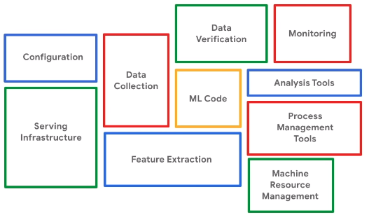
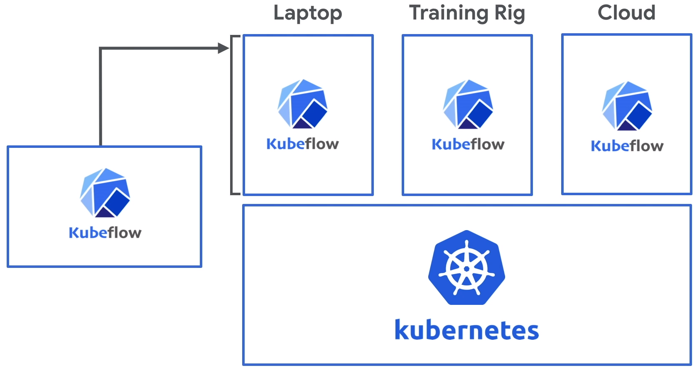

# Kubeflow
> Kubeflow = Kubernetes + Machine Learning Flow

## Kubeflow에 접속하기
설치 완료 후
```bash
$ kfui
Forwarding from 127.0.0.1:8080 -> 80
Forwarding from [::1]:8080 -> 80
```


결과 메세지는 8080포트를 80포트로 포워딩 했다는 것을 의미합니다.

웹브라우저 주소창에
> http://localhost:8080/

## 소개하기
Kubeflow는 쿠버네티스 (Kubernetes)를 위한 머신러닝 툴킷 (Machine Learning toolkit)으로 머신러닝 업무에 필요한  개발 - 빌드 - 훈련 - 배포의 머신러닝 파이프라인 (Machine Learning Pipeline)을 위한 플랫폼 (Platform) 입니다. 쿠버네티스는 컨테이너 오케스트레이션 (Container Orchestration)을 위한 오픈소스 시스템으로, 주로 시스템 관리자의 관심영역이였습니다. 머신러닝 개발자나 데이터 과학자는 시스템 관리자가 설치해놓은 시스템을 이용하는 사용자의 입장에 그쳤습니다. Kubeflow의 등장으로 쿠버네티스에 클러스터를 설치하고 머신러닝의 개발, 학습, 배포하는 머신러닝 워크플로우 (Machine Learning Workflow)에 변화가 생겼습니다.

쿠버네티스는 다수의 컴퓨터/서버의 자원을 다수의 사용자가 효율적으로 사용하기 위한 다양한 기능을 제공합니다. 예를 들어 n대의 슈퍼컴퓨터를 n명이 한 대씩 나눠서 쓰고 있다고 가정합시다. 만약 한 번에 몇 주씩 돌아가는 머신러닝 훈련을 한다고 하더라도, 훈련결과 확인이나 실험을 준비하기 위해 중간중간에 쉬는 시간이 있을 것입니다. 즉, 365일 24시간 컴퓨터를 돌리기는 힘들기 때문에 비싼 연산자원이 낭비됩니다. 쿠버네티스는 n대의 수퍼컴퓨터가 돌아가는 상황을 주시하고, 사용자가 연산자원을 요청할 때 자동으로 할당하는 등의 스케줄링을 하며 전체 연산 자원을 보다 효율적으로 쓸 수 있게 해줍니다. 이것은 시스템 인프라를 관리하는 도구이므로 쿠버네티스는 주로 시스템 관리자의 관심영역이였습니다.


기존에는 개별적으로 진행해야 했던 작업들을 묶어서 할 수 있으므로, 사용자 입장에서 머신러닝을 위한 CI/CD (Continuous Integration/Continuous Deployment) 도구로 이해될 수 있습니다. 일반적으로 상용제품 레벨의 머신러닝 제품을 개발하는데 있어, 역할은 크게 (1) 데이터 개발, (2) 모델 개발, (3) 배포/운용의 3단계로 나뉩니다. Kubeflow는 (1) 데이터 개발을 제외한 나머지 부분을 자동으로 수행할 수 있게 도와줍니다. AWS에 비유하자면 SageMaker의 워크플로우와 유사합니다.

이러한 머신러닝 업무 단계의 자동화를 연구하는 AutoML (Automatic Machine Learning)이라는 분야가 있습니다. 대표적인 오픈소스 Python 라이브러리로 h2o, auto-sklearn, TPOT 등이 있습니다. 이런 라이브러리는 (2) 모델 개발을 자동화하지만 (3) 배포/운용는 지원하지 않습니다.

Kubeflow에 관한 상세한 내용은 [공식 홈페이지](https://www.kubeflow.org/) (https://www.kubeflow.org/)를 참고하세요.

> Q: TFX (TensorFlow Extended)와의 차이는?
>
> A: Kubeflow는 TFX에 바탕을 둔 multi-architecture, multi-cloud framework입니다.
>
> ***History***
>
> Kubeflow started as an open sourcing of the way Google ran [TensorFlow](https://www.tensorflow.org/) internally, based on a pipeline called [TensorFlow Extended](https://www.tensorflow.org/tfx/). It began as just a simpler way to run TensorFlow jobs on Kubernetes, but has since expanded to be a multi-architecture, multi-cloud framework for running entire machine learning pipelines.
>
> Source: [An introduction to Kubeflow](https://www.kubeflow.org/docs/about/kubeflow/)

## [Introduction to Kubeflow - Kubeflow 101](https://youtu.be/cTZArDgbIWw)







[TODO] 이런 역할을 해주는 다양한 프로그램이 있는데, 비교를 하는게 좋을 듯...

예: MLFlow

[Run an MLflow Project on Kubernetes (experimental)](https://mlflow.org/docs/latest/projects.html#run-an-mlflow-project-on-kubernetes-experimental)

AutoML의 논문도 넣고... 

## [Kubeflow Versioning Policies](https://www.kubeflow.org/docs/reference/version-policy/) (in Kubeflow v1.0.2)

For the full information on the status and application version refer to [Kubeflow application](https://www.kubeflow.org/docs/reference/version-policy/#kubeflow-application-matrix)  and [Kubeflow SDKs and CLIs](https://www.kubeflow.org/docs/reference/version-policy/#kubeflow-sdks-and-clis).

| Application                                                  | Status | Version  |
| ------------------------------------------------------------ | ------ | -------- |
| [Central dashboard: Kubeflow UI](https://www.kubeflow.org/docs/components/central-dash/overview/) ([GitHub](https://github.com/kubeflow/kubeflow/tree/master/components/centraldashboard)) | Stable | 1.0.0    |
| [Hyperparameter tuning: Katib](https://www.kubeflow.org/docs/components/hyperparameter-tuning/overview/) ([GitHub](https://github.com/kubeflow/katib)) | Beta   | v1alpha3 |
| [KFServing](https://www.kubeflow.org/docs/components/serving/kfserving/) ([GitHub](https://github.com/kubeflow/kfserving)) | Beta   | v0.2.2   |
| [Metadata](https://www.kubeflow.org/docs/components/misc/metadata/) ([GitHub](https://github.com/kubeflow/metadata)) | Beta   | 0.2.1    |
| [MPI training: MPI operator](https://www.kubeflow.org/docs/components/training/mpi/) ([GitHub](https://github.com/kubeflow/mpi-operator)) | Alpha  |          |
| [Notebook web app](https://www.kubeflow.org/docs/notebooks/why-use-jupyter-notebook/) ([GitHub](https://github.com/kubeflow/kubeflow/tree/master/components/jupyter-web-app)) | Stable | 1.0.0    |
| [Notebook controller](https://www.kubeflow.org/docs/notebooks/why-use-jupyter-notebook/) ([GitHub](https://github.com/kubeflow/kubeflow/tree/master/components/notebook-controller)) | Stable | 1.0.0    |
| [Pipelines](https://www.kubeflow.org/docs/pipelines/overview/pipelines-overview/) ([GitHub](https://github.com/kubeflow/pipelines)) | Beta   | 0.2.0    |
| [PyTorch training: PyTorch operator](https://www.kubeflow.org/docs/components/training/pytorch/) ([GitHub](https://github.com/kubeflow/pytorch-operator)) | Stable | 1.0.0    |
| [Seldon Core Serving](https://www.kubeflow.org/docs/components/serving/seldon) ([GitHub](https://github.com/SeldonIO/seldon-core)) | Stable | 1.0.1    |
| [TensorFlow training: TFJob operator](https://www.kubeflow.org/docs/components/training/tftraining/) ([GitHub](https://github.com/kubeflow/tf-operator)) | Stable | 1.0.0    |
| XGBoost training: XGBoost operator ([GitHub](https://github.com/kubeflow/xgboost-operator)) | Alpha  |          |
| **SDK / CLI**                                                |        |          |
| [Fairing](https://www.kubeflow.org/docs/fairing/fairing-overview/) ([GitHub](https://github.com/kubeflow/fairing)) | Beta   | 0.7.1    |
| [kfctl](https://www.kubeflow.org/docs/other-guides/kustomize/) ([GitHub](https://github.com/kubeflow/kfctl) ) | Stable | 1.0.0    |
| [Kubeflow Pipelines SDK](https://www.kubeflow.org/docs/pipelines/sdk/sdk-overview/) ([GitHub](https://github.com/kubeflow/pipelines)) | Beta   | 0.2.0    |

## Install / 설치하기

Kubeflow의 설치 과정은 아직까지 상당히 힘듭니다. AWS에 설치하는 경우 아직 버그가 리포팅 되고 있어서 난관을 넘어야 합니다. 

* [Installing Kubeflow](https://www.kubeflow.org/docs/started/getting-started/)
* The official installation manual "[Instructions for deploying Kubeflow on AWS with the shell](https://www.kubeflow.org/docs/aws/deploy/install-kubeflow/)"has a couple of defects. Check [troubleshoot/MissingRegion could not find region configuration.md](troubleshoot/MissingRegion could not find region configuration.md) if you encounter MissingRegion error after running:
```bash
$ kfctl apply -V -f ${CONFIG_FILE}
```

-----------------

다음: [AWS에 Kubeflow 설치하기](INSTALL-AWS.md)

p.s. My opinion.

In my case, I installed Kubeflow on AWS and this path was a bumpy road. I had to fix many things to make the my-first-notebook work. I had to write a Bash script automating the installation process because I had to try this and that over and over for weeks. The official installation documentation is confusing at first. Some parts are inaccurate and outdated. To make the installation itself successfully, well, I had to collect the correct information piece-by-piece and move forward little by little.
