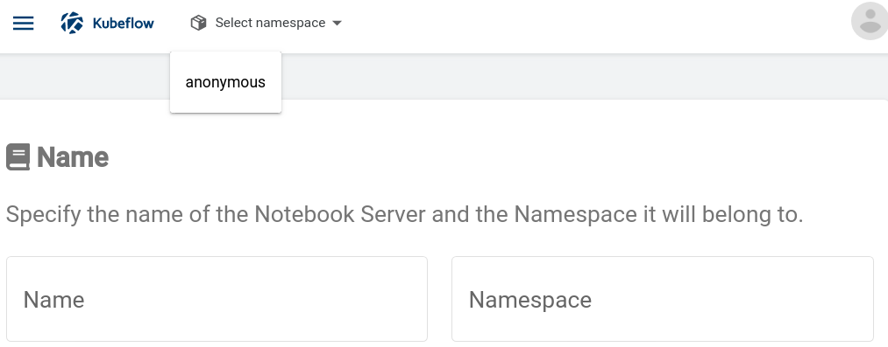

[Documentation / Jupyter Notebooks / Create a Custom Jupyter Image](https://www.kubeflow.org/docs/notebooks/custom-notebook/)

##### 예: `anomymous` 네임스페이스에 `my-jupyter-notebook-server`이름 입력하기

`Namespace`를 `anonymous`로 선택해주면

`anonymous`라고 자동으로 입력됩니다.

서버의 이름을 `my-jupyter-notebook-server`라고 입력을 해봅니다.

[kfp 0.5.0](https://pypi.org/project/kfp/), KubeFlow Pipelines SDK

> pip install kfp

python
Docker Official Images

How to use this image
Create a Dockerfile in your Python app project
FROM python:3

WORKDIR /usr/src/app

COPY requirements.txt ./
RUN pip install --no-cache-dir -r requirements.txt

COPY . .

CMD [ "python", "./your-daemon-or-script.py" ]

or (if you need to use Python 2):

FROM python:2

WORKDIR /usr/src/app

COPY requirements.txt ./
RUN pip install --no-cache-dir -r requirements.txt

COPY . .

CMD [ "python", "./your-daemon-or-script.py" ]
You can then build and run the Docker image:

$ docker build -t my-python-app .
$ docker run -it --rm --name my-running-app my-python-app

Run a single Python script
For many simple, single file projects, you may find it inconvenient to write a complete Dockerfile. In such cases, you can run a Python script by using the Python Docker image directly:

$ docker run -it --rm --name my-running-script -v "$PWD":/usr/src/myapp -w /usr/src/myapp python:3 python your-daemon-or-script.py
or (again, if you need to use Python 2):

$ docker run -it --rm --name my-running-script -v "$PWD":/usr/src/myapp -w /usr/src/myapp python:2 python your-daemon-or-script.py

Image Variants
The python images come in many flavors, each designed for a specific use case.

python:<version>

