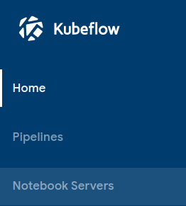
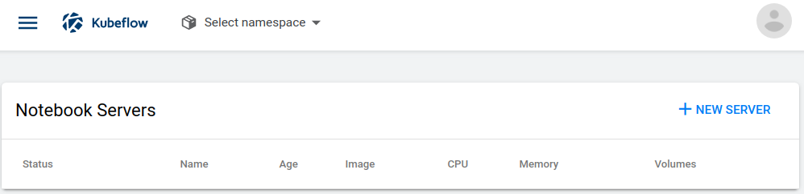
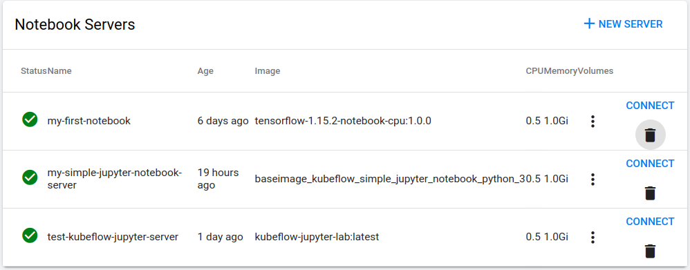

* Rev.3: 2020-05-22 (Fri)
* Rev.2: 2020-04-29 (Wed)
* Rev.1: 2020-04-28 (Tue)
* Draft: 2020-04-27 (Mon)

# 커스텀 도커 이미지 만들기

이 부분에는 아래의 내용을 참고해서 작성되었습니다.

* [Documentation / Jupyter Notebooks / Create a Custom Jupyter Image](https://www.kubeflow.org/docs/notebooks/custom-notebook/)
* "쿠브플로우!" 이명환 저, 디지털북스, 2.2.4. 커스텀 이미지 생성, pp.152~156
* [KubeFlow Custom Jupyter Image (+ github for notebook source control)](https://andrewm4894.com/2019/10/20/kubeflow-custom-jupyter-image-github-for-notebook-source-control/), 

Google search: kubeflow create a custom image and notebook servers

* [KubeflowでCustom Jupyter Imageの作成](https://note.com/ucwork/n/n7377c45147ef)

  

Kubeflow를 사용함에 있어서 도커 이미지를 만드는 것은 근본적이면서도 중요한 작업 중에 하나 입니다. Kubeflow는 컨테이너 오케스트레터 Kubernetes에서 동작하므로, 컨테이너가 근간이 되는 자원 (Resource) 중에 하나입니다. 컨테이너는 이미지에서 만들어지므로, 내가 원하는 동작을 하는 컨테이너를 만들기 위해서 이미지부터 만들어야 합니다.

> Docker Image → Docker Container →k8s Pod →...

## Kubeflow용 Docker Image 만들기

Kubeflow에서 쓰이는 Docker Image를 만드는 과정은 일반적인 Docker Image 생성과정과 한가지만 빼고 동일합니다. Dockerfile에 Dockerfile에서 요구되는 아래의 문구를 넣기만 하면 됩니다.

```dockerfile
# Kubeflow requirements for custom images
USER root
ENV NB_PREFIX /
CMD ["sh","-c", "jupyter notebook --notebook-dir=/home/jovyan --ip=0.0.0.0 --no-browser --allow-root --port=8888 --NotebookApp.token='' --NotebookApp.password='' --NotebookApp.allow_origin='*' --NotebookApp.base_url=${NB_PREFIX}"]
```

나머지 과정인 Image를 빌드, Docker Hub에 푸쉬하는 과정은 일반적인 Docker Image 생성과정과 같습니다. Kubeflow는 Docker Hub에 올라온 이미지를 자동으로 다운로드 받아서 컨테이터화 하기 때문입니다. 만약 아래 내용이 잘 이해가 안 가신다면, Docker Image 생성에 대해 먼저 공부를 하시면 도움이 됩니다.

### Simplest: 가장 간단한 Kubeflow용 Docker Image 생성

Kubeflow용 Jupyter Notebook Server를 만들어봅니다. 

* 사용자 이름: aimldl
* 이름: kubeflow-jupyter-notebook-server-simplest

aimldl는 저의 Docker Hub의 사용자 이름이므로, 본인의 사용자 이름으로 바꾸셔야 합니다. 이미지의 용도를 구분을 위해서`testimage-`를 추가했습니다. 그러면 Docker Hub의 `Repository`는

> aimldl/testimage-kubeflow-jupyter-notebook-server-simplest

가 됩니다.

##### Step 1. 텍스트 에디터에 아래 내용을 복사하고 파일명을 `Dockerfile`로 저장합니다.

이 Dockerfile은 Docker Image를 만들기 위한 설정파일입니다. Docker의 공식 `python:3` 컨테이너를 기반으로 Kubeflow에서 필요한 설정만 합니다. Kubeflow용 Docker Image를 만들 때 이런 방식은 가장 간단한 Dockerfile 형태가 아닐까 생각됩니다.

```dockerfile
# Dockerfile-simplest-jns

# Base Container
FROM python:3
LABEL version="0.1"

# Kubeflow requirements for custom images
USER root
ENV NB_PREFIX /
CMD ["sh","-c", "jupyter notebook --notebook-dir=/home/jovyan --ip=0.0.0.0 --no-browser --allow-root --port=8888 --NotebookApp.token='' --NotebookApp.password='' --NotebookApp.allow_origin='*' --NotebookApp.base_url=${NB_PREFIX}"]
```

##### Step 2. `Dockerfile`에서 이미지를 빌드 (build)하고, Docker Hub에 업로드/푸쉬 (Push)합니다.

```bash
$ docker build -t aimldl/testimage-kubeflow-jupyter-notebook-server-simplest - < Dockerfile-simplest-jns
$ docker push aimldl/testimage-kubeflow-jupyter-notebook-server-simplest
```

##### Step 3. Docker Hub에 업로드 여부를 확인합니다.

http://hub.docker.com에 로그인해서 업로드 여부를 확인합니다.


> 터미널에서 `docker search` 명령어로 레파지토리를 검색할 수 있습니다. 그런데 `docker push` 후에 바로 업데이트가 안 되서 확인이 힘듭니다. 하지만 Docker Hub 홈페이지의 경우 바로 업데이트가 되서 바로 확인할 수 있습니다.
>
> $ docker search aimldl
> NAME                                          DESCRIPTION                        STARS               OFFICIAL            AUTOMATED
>
>   ...
>
> $

### Full Messages

Step2에서 실행한 명령어인 도커 이미지 빌드 및 푸쉬 작업의 전체 출력 메세지입니다.

```bash
$ docker build -t aimldl/testimage-kubeflow-jupyter-notebook-server-simplest - < Dockerfile-simplest-jns
Sending build context to Docker daemon  4.096kB
Sending build context to Docker daemon  4.096kB
Step 1/10 : FROM python:3
 ---> a6be143418fc
Step 2/10 : RUN apt-get update -y
 ---> Using cache
 ---> 8debfa37d39f
Step 3/10 : RUN apt-get clean && rm -rf /var/lib/apt/lists/*
 ---> Running in 0ed791cf7001
Removing intermediate container 0ed791cf7001
 ---> 49d04c5c82d4
Step 4/10 : WORKDIR /home/jovyan
 ---> Running in a17f3fb9de74
Removing intermediate container a17f3fb9de74
 ---> 6aea09cec52c
Step 5/10 : ENV HOME /home/jovyan
 ---> Running in 6400f095aacd
Removing intermediate container 6400f095aacd
 ---> 99b5b7da928c
Step 6/10 : RUN pip3 install --upgrade pip
 ---> Running in f9c9e4737df3
Collecting pip
  ...
Step 8/10 : EXPOSE 8888
 ---> Running in 155e4e645bc0
Removing intermediate container 155e4e645bc0
 ---> db08cbb2ce10
Step 9/10 : ENV NB_PREFIX /
 ---> Running in adf40a88f3c3
Removing intermediate container adf40a88f3c3
 ---> be5c7b8d6632
Step 10/10 : CMD ["sh","-c", "jupyter notebook --notebook-dir=/home/jovyan --ip=0.0.0.0 --no-browser --allow-root --port=8888 --NotebookApp.token='' --NotebookApp.password='' --NotebookApp.allow_origin='*' --NotebookApp.base_url=${NB_PREFIX}"]
 ---> Running in 6b3cf91c0ea6
Removing intermediate container 6b3cf91c0ea6
 ---> 90dfc3e98f50
Successfully built 90dfc3e98f50
Successfully tagged aimldl/testimage-kubeflow-jupyter-notebook-server-simplest:latest
$
```

아래와 같은 출력을 가진 이미지가 생성되었습니다. aimldl대신 지정한 사용자 이름이 들어갈 것입니다.

```bash
$ docker images
REPOSITORY                                                  TAG     ...  SIZE
aimldl/testimage-kubeflow-jupyter-notebook-server-simplest  latest  ...  933MB
$
```

```bash
$ docker run -it --name simplest aimldl/testimage-kubeflow-jupyter-notebook-server-simplest bash
root@36d0c8c7acdf:~# pwd
/home/jovyan
root@36d0c8c7acdf:~# python --version
Python 3.8.2
root@36d0c8c7acdf:~# which jupyter
/usr/local/bin/jupyter
root@36d0c8c7acdf:~# jupyter notebook
[I 09:15:20.006 NotebookApp] Writing notebook server cookie secret to /home/jovyan/.local/share/jupyter/runtime/notebook_cookie_secret
Traceback (most recent call last):
  ...
OSError: [Errno 99] Cannot assign requested address
root@36d0c8c7acdf:~# exit
exit
$
```

`docker push`는 업로드를 할 때 쓰이는 명령어입니다. `aimldl/testimage-kubeflow-jupyter-notebook-server-simplest`를 Docker Hub에 업로드합니다.

```bash
$ docker push aimldl/testimage-kubeflow-jupyter-notebook-server-simplest
The push refers to repository [docker.io/aimldl/testimage-kubeflow-jupyter-notebook-server-simplest]
dfddc549c0b6: Mounted from aimldl/testimage-kubeflow-jupyter-notebook-server 
7e453511681f: Mounted from aimldl/testimage-kubeflow-jupyter-notebook-server 
b544d7bb9107: Mounted from aimldl/testimage-kubeflow-jupyter-notebook-server 
baf481fca4b7: Mounted from aimldl/testimage-kubeflow-jupyter-notebook-server 
3d3e92e98337: Mounted from aimldl/testimage-kubeflow-jupyter-notebook-server 
8967306e673e: Mounted from aimldl/testimage-kubeflow-jupyter-notebook-server 
9794a3b3ed45: Mounted from aimldl/testimage-kubeflow-jupyter-notebook-server 
5f77a51ade6a: Mounted from aimldl/testimage-kubeflow-jupyter-notebook-server 
e40d297cf5f8: Mounted from aimldl/testimage-kubeflow-jupyter-notebook-server 
latest: digest: sha256:2efe7362cfa628c4295856bd5031e795fb1e66b9352adf14a85acd0d2b2c5a3d size: 2217
$
```

## Docker Image로 Kubeflow에서 Notebook Server 런칭하기

### 생성된 Image로 Kubeflow에서 Notebook Server 런칭하기

Kubeflow Central Dashboard를 열고, Notebook Server의 설정페이지로 이동한 후, NEW SERVER를 선택합니다. 이때 새로운 Notebook Server의 설정사항에 앞에서 생성한 Image의 레파지토리를 입력해주면 됩니다.

##### Step 1. Kubeflow Central Dashboard 서버 실행

`kfui`명령어를 실행해서 Kubeflow Dashboard 서버를 시작합니다.

```bash
$ kfui
Forwarding from 127.0.0.1:8080 -> 80
Forwarding from [::1]:8080 -> 80
```

터미널에서 실행한 화면은 다음과 같습니다.


`kfui`명령어의 alias가 아직 설정되지 않았다면, `$ kfui` 대신

```bash
$ kubectl port-forward -n istio-system svc/istio-ingressgateway  8080:80
```

를 실행해서 다음 단계로 넘어갈 수는 있습니다. 하지만 [Kubeflow UI 소개](#introducing_kubeflow_central_dashboard.md)를 참고해서 설정하시길 권장합니다. 자주 쓰이는 명령어라서 설정하는게 훨씬 편리합니다.

##### Step 2. Client 프로그램으로 Dashboard 서버에 접속

Client 프로그램으로 일반적으로 웹브라우저를 씁니다. 예를 들어, 크롬 웹브라우저의 주소창에 http://localhost:8080 와 엔터키를 입력하면,


Kubeflow Central Dashboard 서버에 접속되어 아래와 같이 Kubeflow Central Dashboard의 메인화면이 열립니다.


##### Step 3. `Notebook Servers` 설정 페이지로 이동하기

좌측 메뉴의 `Notebook Servers`를 클릭하면

런칭

`Notebook Servers` 설정 페이지가 열립니다.



위의 경우 아직 생성된 노트북 서버가 없어서 비어있습니다. 일반적으로 생성된 노트북 서버가 있을 경우 아래처럼 상태정보를 볼 수 있습니다.




##### Step 4. `NEW SERVER` 생성 메뉴

우측의 `+ NEW SERVER` 버튼을 누르면 신규 노트북 서버를 설정 페이지가 나옵니다. 아래는 설정 페이지 중 필수 입력 항목만 발췌한 것으로 `Image`와 `Miscellaneous Settings` 사이의 값은 생략한 것입니다.


`Select namespace`에서 네임스페이스를 선택, `Name`항목에 Notebook Server의 이름을 입력합니다. 그러면 `LAUNCH`버튼이 활성화됩니다. 


남은 설정을 하기 위해서, `❏ Custom Image`의 `❏`를 클릭하고, Docker Hub 레파지토리 이름을 입력합니다. 마지막으로 `LAUNCH` 버튼을 눌러서 노트북 서버가 런칭을 시작합니다. 보다 자세한 내용은 [개요: Kubeflow의 `Notebook Servers`](overview_of_kubeflow's_notebook_servers.md)를 참고하세요.

------

다음: [예: Jupyter Notebook Server 런칭하기](example-launching_a_jupyter_notebook_server.md)

