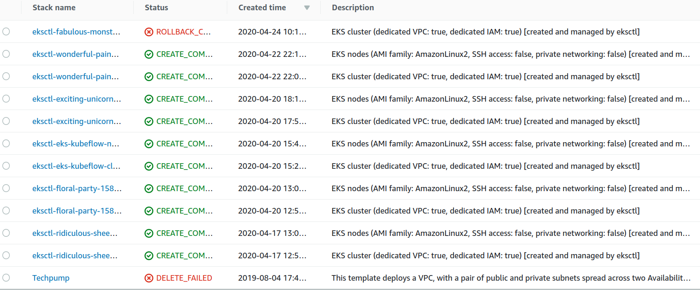

* Draft: 2020-04-24 (Fri)

# How to Find out What is My Current EKS Cluster for Kubeflow?

## Problem

Q: How do I find the current cluster among many possible clusters?



## Solution

`current-context` in the `~/.kube/config` file is the current cluster. To extract the corresponding line, run:

```bash
$ grep "current" ~/.kube/config
current-context: aimldl@wonderful-painting-1587560462.us-west-2.eksctl.io
$
```

Alternatively, you may open the  `~/.kube/config` file with a text editor and find the same line. `current-context:` is at the end of `contexts:`

> ...
> contexts:
>
> \- context:
> cluster: adorable-creature-1234567890.ap-northeast-2.eksctl.io
> user: aimldl@adorable-creature-1234567890.ap-northeast-2.eksctl.io
> name: aimldl@adorable-creature-1234567890.ap-northeast-2.eksctl.io
>
> \- context:
> cluster: attractive-outfit-2345678901.ap-northeast-1.eksctl.io
> user: aimldl@attractive-outfit-2345678901.ap-northeast-1.eksctl.io
> name: aimldl@attractive-outfit-2345678901.ap-northeast-1.eksctl.io
> ...
>
> \- context:
> cluster: wonderful-painting-0123456789.us-west-2.eksctl.io
> user: aimldl@wonderful-painting-0123456789.us-west-2.eksctl.io
> name: aimldl@wonderful-painting-0123456789.us-west-2.eksctl.io
>
> current-context: ***aimldl@wonderful-painting-0123456789.us-west-2.eksctl.io***

