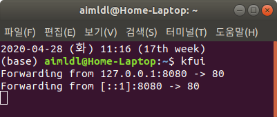

* Rev.1: 2020-04-28 (Tue)
* Draft: 2020-04-27 (Mon)

# 요약: Kubeflow Central Dashboard 들어가기

Kubeflow Central Dashboard 혹은 Dashboard는 정식 명칭인데, 편의상 Kubeflow Web UI 혹은 Kubeflow UI로 부르겠습니다. Dashboard, Kubeflow UI, 웹 UI 등의 용어는 혼재되어 쓰일 수 있습니다. 

앞에선 Dashboard를 설정하는 부분에 대한 설명도 포함되어 있습니다. 이 부분에선 설정 후 사용하는 입장에서 필요한 내용을 다음 부분으로 넘어가기 전에 정리해봅니다. 내용이 중복되지만 반드시 숙지해야 할 사항입니다. 내용이 중복되는 만큼 조금 다른 각도와 용어로 설명하는 부분도 있습니다.

### Dashboard 서버 실행

[Kubeflow UI 소개](#Kubeflow UI 소개)에서 설정한 `kfui`명령어를 터미널에서 실행해서 Dashboard 서버를 시작합니다.

```bash
$ kfui
Forwarding from 127.0.0.1:8080 -> 80
Forwarding from [::1]:8080 -> 80
```



결과 메세지는 8080포트를 80포트로 포워딩 했다는 것을 의미합니다.

### 클라이언트로 Dashboard 서버에 접속하기

클라이언트 프로그램으로 웹브라우저를 쓸 수 있습니다. 크롬 웹브라우저에 http://localhost:8080 와 엔터키를 입력하면 실행 중인 Dashboard 서버에 접속할 수 있습니다.


### Dashboard 메인 화면

Kubeflow Central Dashboard에 접속되었습니다. 메인화면은 아래와 같습니다. 다른 표현으로 "Dashboard를 오픈했다", "웹UI에 접속했다", "UI를 열었다" 등이 있습니다. 


### Dashboard 메뉴

이 웹UI에서 Kubeflow을 설정할 수 있습니다. 이에 더해 실행 중인 내용을 확인하는 등 큰 그림을 이해하고 할 수도 있습니다. 좌측 메뉴에 지원하는 주요 기능이 있습니다.

* Pipelines
* Notebook Servers
* Katib
* Artifact Store

각 기능을 앞으로 다룰 순서대로 간략히 설명합니다.

Notebook Servers는 Jupyter Notebook 서버의 생성, 연결, 관리를 하는 기능입니다. 쥬피터 노트북이 쥬피터 서버에서 실행되므로, 쥬피터 노트북 서버는 쥬피터 노트북의 상위 개념입니다. 이 메뉴에서 새로 서버를 만들고 머신러닝 기능이 구현된 파이썬 코드를 Jupyter Notebook에 저장해서 실행할 수 있습니다. 지금 단계에서 중요한 것은 머신러닝에서 작업을 하려면 일단 코드를 생성해야 하므로, 가장 먼저 Jupyter Notebook을 실행할 수 있는 서버가 만들어져야 합니다.

Pipelines는 머신러닝 워크프로우에서 별도로 수행하던 작업을 연결해주는 기능을 제공합니다. 모델의 학습, 추가 학습, 모델의 배포 등 기존에는 개별적으로 수행해야 했던 것을 연결하는 작업을 pipelining이라고 합니다. 이 용어는 대표적인 파이썬 머신러닝 라이브러리 [scikit-learn](https://www.google.com/search?q=Scikit-Learn&oq=Scikit-Learn&aqs=chrome..69i57j69i65l3.458j0j7&client=ubuntu&sourceid=chrome&ie=UTF-8)에서도 쓰입니다. 잘 모르겠다면 일단은 공장에서 여러개로 나뉘어진 파이프 (pipe)를 연결해서 하나의 공정으로 연결한다 (lining)는 느낌을 가지고 다음으로 넘어가면 될 것 같습니다.

Katib는 Hyperparameter Tuning 및 Neural Architecture Search를 위한 기능입니다. 머신러닝 모델을 학습할 때 모델의 성능 향상을 위해 반복적으로 수행해야하는 작업을 자동화할 수 있습니다. Hypterparameter Tuning은 머신 러닝 모델을 학습할 때 설정하는 변수인 Hyperparameter 값을 바꿔가면서 (튜닝하면서) 성능을 높이는 작업을 말합니다. Neural Architecture Search는 머신 러닝 모델의 구조, 즉 Neural Architecture, 를 성능이 높아지도록 찾아가는 (search) 작업을 말합니다. 

Katib의 이해는 다소 어려울 수 있습니다. 왜냐하면 Kubeflow라는 툴 (Tool) 자체에 쓰이는 Katib 라이브러리를 이용하는 방법만 이해한다고 끝나지 않기 때문입니다. 이에 더해 머신러닝의 응용 기능인 Hyperparameter Tuning 및 Neural Architecture Search에 기술 자체에 대한 이해가 필요합니다. 이러한 기능은 아직 연구가 진행되는 분야 (Active research areas)로 어려운 것이 당연하므로 일단은 조금씩 알아가시면 될 것 같습니다.

Artifact Store [TODO]

MLFlow의 [Artifact Stores](https://mlflow.org/docs/latest/tracking.html#artifact-stores)도 참고.

`Pipelines`, `Notebook Servers`, `Katib`, `Artifact Store` 의 상세한 내용이 궁금하시면 일단 [Documentation](https://www.kubeflow.org/docs/about/kubeflow/)을 참고하세요.

### 관련 링크

그 밑의 `GitHub`와 `Documentation`는 Kubeflow 공식 GitHub 레파지토리와 공식 문서로 연결되는 링크입니다.

* GitHub   https://github.com/kubeflow/kubeflow


* Documentation  https://www.kubeflow.org/docs/about/kubeflow/


* 다음: [개요: Kubeflow의 Notebook Servers](#overview of kubeflow's notebook servers.md)
