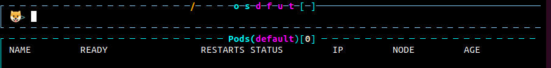
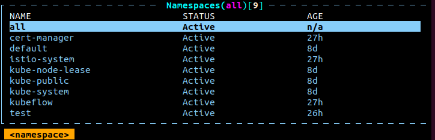
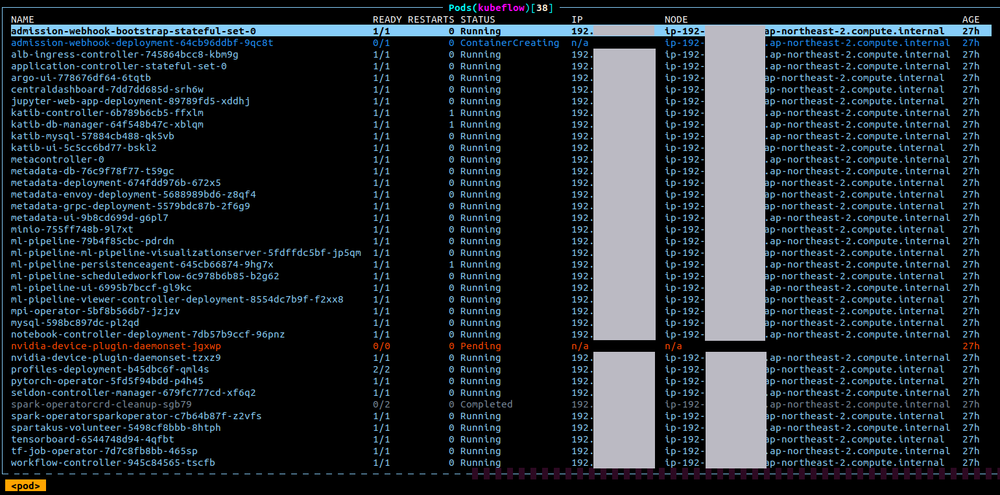

* Draft: 2020-04-14 (Tue)

# k9s 명령어 소개


다음: [쿠브플로우 대쉬보드 소개](how_to/introducing_kubeflow_central_dashboard.md)

## 명령어

#### k9s 실행하기

터미널에 아래 명령어를 입력하면 `k9s`가 실행됩니다.

```bash
$ k9s
```


아래 화면은 최초 실행 시 default 상태의 pod를 보여줍니다. 쿠버네티스 설치 직후이므로 pod가 아무 것도 없는 것처럼 보일 수도 있습니다만, 이것은 `kube-public` 네임스페이스의 pod입니다. 좌측 아래의 `<pod>`라고 표기되었음을 인지해주세요. 참고로 중간에 공란이 많아서 그림을 편집했으므로 실제 화면은 조금 다르게 보입니다.

#### 읽기 전용 모드로 실행하기: --readonly

읽기 전용 모드는 쓰기 금지 모드와 동일합니다.

```bash
$ k9s --readonly
```

#### k9s 종료하기

위의 화면에서 빠져나오려면 `:q`, `:quit`, 혹은 `Ctrl+C`를 입력합니다.

```bash
$ k9s  # k9s를 실행한 명령어
$      # 종료 후 프롬프트 위치
```

#### k9s 명령어 입력하기

콜론 `:`을 누르면 명령어 입력창이 나타납니다.



#### Autofill 기능

입력창에 namespace를 입력하고자 합니다. `names`까지 입력하면 아래 그림처럼 `pace`가 보입니다. 이때 탭을 누르면 타이핑 없이 `namespace`가 완성됩니다.


#### 네임스페이스 보기: namespace, ns

입력창에 `namespace` 혹은 `ns`와 엔터키를 입력하면 쿠버네티스 클러스터의 네임스페이스가 보여집니다. 좌측 하단에 `<namespace>`라고 되어 있습니다.



#### 응용: kubeflow 네임스페이스의 Pod 보기

방향키 ↓를 움직여 kubeflow로 이동하고 엔터키를 입력합니다.


그러면 `kubeflow` 네임스페이스에 있는 pod에 대한 정보를 볼 수 있습니다. 지금 단계에서 이 pod들은 설치된 오픈소스 프로그램 정도로 이해하면 될 것 같습니다. 설치과정에서 쿠버네티스 클러스터를 생성된 후, `kubeflow`가 설치될 때 자동으로 설치되었습니다. IP와 NODE에서 가려진 부분은 IP주소입니다. 



#### 나머지 명령어

나머지 명령어는 [k9s, Commands](https://k9scli.io/topics/commands/)의 Key Bindings를 참고하세요.

## 커맨드 라인 명령어

#### k9s help

```bash
$ k9s help
K9s is a CLI to view and manage your Kubernetes clusters.

Usage:
  k9s [flags]
  k9s [command]

Available Commands:
  help        Help about any command
  info        Print configuration info
  version     Print version/build info

Flags:
  -A, --all-namespaces                 Launch K9s in all namespaces
      --as string                      Username to impersonate for the operation
      --as-group stringArray           Group to impersonate for the operation
      --certificate-authority string   Path to a cert file for the certificate authority
      --client-certificate string      Path to a client certificate file for TLS
      --client-key string              Path to a client key file for TLS
      --cluster string                 The name of the kubeconfig cluster to use
  -c, --command string                 Specify the default command to view when the application launches
      --context string                 The name of the kubeconfig context to use
      --demo                           Enable demo mode to show keyboard commands
      --headless                       Turn K9s header off
  -h, --help                           help for k9s
      --insecure-skip-tls-verify       If true, the server's caCertFile will not be checked for validity
      --kubeconfig string              Path to the kubeconfig file to use for CLI requests
  -l, --logLevel string                Specify a log level (info, warn, debug, error, fatal, panic, trace) (default "info")
  -n, --namespace string               If present, the namespace scope for this CLI request
      --readonly                       Disable all commands that modify the cluster
  -r, --refresh int                    Specify the default refresh rate as an integer (sec) (default 2)
      --request-timeout string         The length of time to wait before giving up on a single server request
      --token string                   Bearer token for authentication to the API server
      --user string                    The name of the kubeconfig user to use

Use "k9s [command] --help" for more information about a command.
$
```

#### k9s info

```bash
$ k9s info
 ____  __.________       
|    |/ _/   __   \______
|      < \____    /  ___/
|    |  \   /    /\___ \ 
|____|__ \ /____//____  >
        \/            \/ 

Configuration:   /home/aimldl/.k9s/config.yml
Logs:            /tmp/k9s-aimldl.log
Screen Dumps:    /tmp/k9s-screens-aimldl
$
```

#### 네임스페이스 지정하고 실행하기

`k9s`실행 시 지정한 네임스페이스를 오픈합니다. (?)

```bash
$ k9s -n kubeflow
```

#### 실행 후 pod view 모드

```bash
$ k9s -c pod
```

#### KubeConfig context에서 실행하기

이미 만들어놓은 context가 있다면

```bash
$ k9s --context coolCtx
```

참고 문서:

* [k9s, Commands](https://k9scli.io/topics/commands/)

----------

다음: [쿠브플로우 대쉬보드 소개](how_to/introducing_kubeflow_central_dashboard.md)