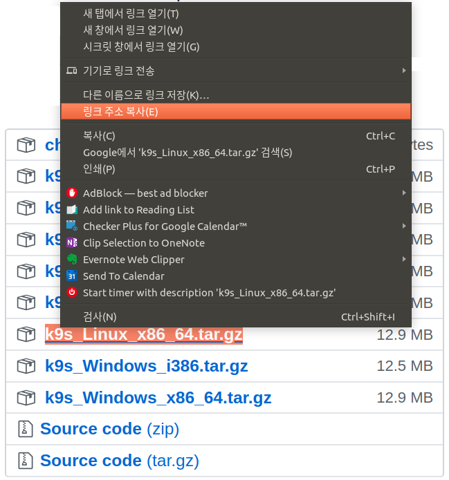
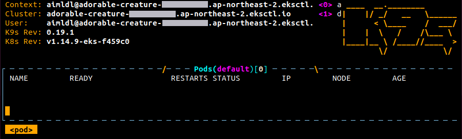

# k9s 설치하기

## k9s

k9s는 쿠버네티스 클러스터를 보다 쉽게 운용하게 해주는 CLI (Command-Line Interface)입니다. 필수 프로그램이 아니라 유틸리티 프로그램으로 로컬 컴퓨터에 설치합니다. 복잡한 쿠버네티스 명령어를 외우지 않고 필요한 정보를 조회할 수 있어서 편리하므로 설치를 권장합니다.

참고로 k9s라는 이름은 쿠버네티스를 줄여서 k8s로 표기하는데서 착안했을 것으로 예상됩니다. 

> kubernetes → kubern-eight-s → k-eight-s →k8s


## 설치하기

Ubuntu에 설치하는 몇 가지 방법 중에 `snapd`를 이용하는 방식이 가장 간편합니다. 하지만 2020년 4월 중순 현재 이슈가 있어서 에러가 발생합니다. 그러므로 릴리스되는 압축파일에서 직접 설치하는 방식을 채택합니다.

### 압축 파일의 링크 알아내기

k9s의 릴리스 페이지 https://github.com/derailed/k9s/releases에서 설치하려는 시스템에 맞는 운영체계와 아키텍쳐용 압축 파일의 링크를 찾아냅니다. Ubuntu Linux에 x86, 64비트 시스템의 경우 [k9s_Linux_x86_64.tar.gz](https://github.com/derailed/k9s/releases/download/v0.19.1/k9s_Linux_x86_64.tar.gz)를 다운로드 받습니다.


### 압축 파일 다운로드 후 설치 진행

[k9s_Linux_x86_64.tar.gz](https://github.com/derailed/k9s/releases/download/v0.19.1/k9s_Linux_x86_64.tar.gz)를 마우스로 우클릭하고 `링크 주소 복사`를 하면 아래와 같은 링크를 복사 가능합니다.



> https://github.com/derailed/k9s/releases/download/v0.19.1/k9s_Linux_x86_64.tar.gz

아래는 wget 명령어로 이 링크에서 다운로드 하고, tar 명령어로 압축을 풀고, 실행파일인 `k9s`를 `/usr/bin` 디렉토리에 옮깁니다. 이 디렉토리에 있는 실행파일은 어디서나 실행 가능하므로 `k9s` 명령어를 자유롭게 실행 가능합니다.

```
$ wget https://github.com/derailed/k9s/releases/download/v0.19.1/k9s_Linux_x86_64.tar.gz
$ tar zxvf k9s_Linux_x86_64.tar.gz
LICENSE
README.md
k9s
$ sudo mv k9s /usr/bin
```

### 설치 확인하기

`k9s`명령어를 실행했을 때 화면이 나오므로 성공적으로 설치되었습니다.

```
$ k9s
```



`k9s`의 사용법은 뒷부분에서 간략히 다룰 예정입니다. 혹은 공식 홈페이지를 참고하세요.

* [Kubernetes CLI To Manage Your Clusters In Style!](https://github.com/derailed/k9s), [https://k9scli.io](https://k9scli.io/)

참고 문서

* [k9s, Installation](https://k9scli.io/topics/install/)

-----------

다음: [k9s 명령어 소개](how_to/user_k9s.md)

--------------

snap으로 설치할 경우 `k9s` 실행 시 에러가 발생합니다. 하지만 설치, 실행, 제거 과정을 아래에 기록합니다. 필요 시 참고하세요.

## snap으로 k9s 설치/제거하기

snap은 리눅스를 위한 앱스토어 (The app store for Linux) 입니다. 컨테이너화된 소프트웨어 패키지를 설치해줍니다. snapd를 설치한 후에 snap 명령어를  이용해서 k9s를 설치합니다. 주의: snap 명령어에는 d가 빠져있습니다.

```bash
$ sudo apt update
$ sudo apt install snapd
$ sudo snap install k9s
```

하지만 `k9s`를 실행할 경우 설정 에러가 발생합니다.

```bash
$ k9s
 ____  __.________       
|    |/ _/   __   \______
|      < \____    /  ___/
|    |  \   /    /\___ \ 
|____|__ \ /____//____  >
        \/            \/ 

Boom!! Unable to locate K8s cluster configuration.
$
```

snap으로 k9s를 설치하는 방식에는 이슈가 있으므로 release page에서 직접 다운로드 받으라는 경고가 있습니다.

> 구글 검색: k9s unable to locate k8s cluster configuration
> 참고 문서: [Boom!! Unable to locate K8s cluster configuration. #267](https://github.com/derailed/k9s/issues/267)
>
> Are you using a snap release of K9s? If so please download K9s from the release page as we're currently having issues with snap. - **[derailed](https://github.com/derailed)** commented [on 18 Jul 2019](https://github.com/derailed/k9s/issues/267#issuecomment-512824636)

만약 설치했다면 아래 명령어로 간단히 제거 가능합니다.

```bash
$ sudo snap remove k9s
```

참고 문서

* [Installing snap on Ubuntu](https://snapcraft.io/docs/installing-snap-on-ubuntu)
* [How to install k9s on Ubuntu](https://snapcraft.io/install/k9s/ubuntu)

