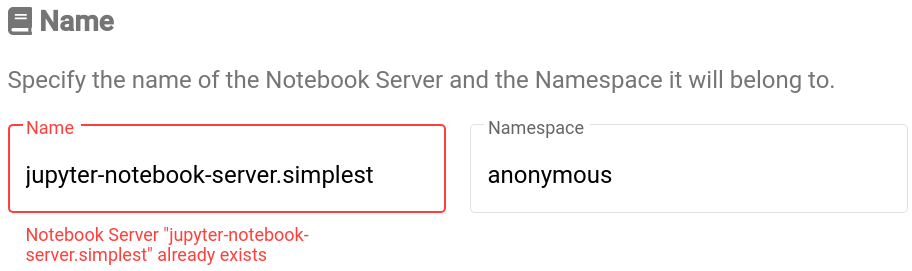

* Rev.3: 2020-05-22 (Fri)
* Rev.2: 2020-04-29 (Wed)
* Rev.1: 2020-04-28 (Tue)
* Draft: 2020-04-27 (Mon)

# Troubleshooting / 에러 메세지 처리

#### Namining Convention

`Name`을 입력할 때 영어 소문자, 숫자, 기호 -만 사용하세요. 

##### 이유 1: 이름에 스페이스, _ 등의 기호가 들어갈 경우 `LAUNCH`버튼을 눌렀을 때 에러가 발생합니다.


Alphanumeric chracters는 영문자 및 숫자를 의미합니다. lower case alphanumeric characters는 영어 소문자 및 숫자를 의미합니다.

이 메세지에는 영어 소문자, 숫자, 기호 -와 .만 허용된다고 합니다. 예를 들어 아래의 첫 3개 이름은 안 되고, 마지막 이름는 가능한 듯 보입니다.

* Simplest Jupyter Notebook Server  (X)
* simplest_jupyter_notebook_server (X)
* jupyter-notebook-server:simplest (X)
* jupyter-notebook-server.simplest (O)

##### 이유 2: 기호 .를 쓸 경우 `LAUNCH`버튼을 눌러 다음 단계로 진행되지만, 다음 단계에서 에러가 발생합니다.

기호 .가 이름에 포함됐을 경우 실질적으로 다음 단계에서 아래와 같은 에러가 발생하며 `CONNECT`링크가 활성화되지 않습니다. 

> label must consist of lower case alphanumeric characters or '-', and must start and end with an alphanumeric character.이미 동일한 이름의 노트북 서버가 있을 경우에 에러 메세지가 발생합니다.


#### Notebook Server "some-name" already exists

이미 동일한 이름의 노트북 서버가 있을 경우에 에러 메세지가 발생합니다.



#### no healthy upstream

노트북 서버의 생성이 완료된 후 `CONNECT`를 눌렀을 때, 다음 에러메세지가 발생할 경우가 있습니다.


```dockerfile
# Base Container
FROM python:3

# Kubeflow requirements for custom images
USER root
ENV NB_PREFIX /
CMD ["sh","-c", "jupyter notebook --notebook-dir=/home/jovyan --ip=0.0.0.0 --no-browser --allow-root --port=8888 --NotebookApp.token='' --NotebookApp.password='' --NotebookApp.allow_origin='*' --NotebookApp.base_url=${NB_PREFIX}"]
```


```dockerfile
# Base Container
FROM python:3

# Kubeflow requirements for custom images
ENV NB_PREFIX /
CMD ["sh","-c", "jupyter notebook --notebook-dir=/home/jovyan --ip=0.0.0.0 --no-browser --allow-root --port=8888 --NotebookApp.token='' --NotebookApp.password='' --NotebookApp.allow_origin='*' --NotebookApp.base_url=${NB_PREFIX}"]
```


```dockerfile
# Base Container
FROM python:3
LABEL version="0.1"
Troubleshooting / 에러 메세지 처리
# Kubeflow requirements for custom images
USER jovyan
ENV NB_PREFIX /
CMD ["sh","-c", "jupyter notebook --notebook-dir=/home/jovyan --ip=0.0.0.0 --no-browser --allow-root --port=8888 --NotebookApp.token='' --NotebookApp.password='' --NotebookApp.allow_origin='*' --NotebookApp.base_url=${NB_PREFIX}"]
```


```bash
$ docker run -it --name simplest aimldl/testimage-kubeflow-jupyter-notebook-server-simplest:latest bash
docker: Error response from daemon: unable to find user jovyan: no matching entries in passwd file.
ERRO[0000] error waiting for container: context canceled 
$
```

```dockerfile
# Base Container
FROM python:3

# Open the terminal from /home/jovyan
WORKDIR /home/jovyan
ENV HOME /home/jovyan

# Kubeflow requirements for custom images
ENV NB_PREFIX /
CMD ["sh","-c", "jupyter notebook --notebook-dir=/home/jovyan --ip=0.0.0.0 --no-browser --allow-root --port=8888 --NotebookApp.token='' --NotebookApp.password='' --NotebookApp.allow_origin='*' --NotebookApp.base_url=${NB_PREFIX}"]
```


```bash
$ docker run -it --name simplest aimldl/testimage-kubeflow-jupyter-notebook-server-simplest bash
root@adc93dba55ea:~# pwd
/home/jovyan
root@adc93dba55ea:~#  which jupyter
root@adc93dba55ea:~# jupyter notebook
bash: jupyter: command not found
root@adc93dba55ea:~# python
Python 3.8.2 (default, Apr 23 2020, 14:22:33) 
[GCC 8.3.0] on linux
Type "help", "copyright", "credits" or "license" for more information.
>>> exit()
root@adc93dba55ea:~#
```

* [Unable to access UI for kubeflow](https://stackoverflow.com/questions/54567694/unable-to-access-ui-for-kubeflow)
* [No healthy upstream trying to connect to the Jupyter Notebook #1337](https://github.com/kubeflow/website/issues/1337)

------
다음: [Use Auto-Sklearn on Kubeflow](../how_to/use_auto-sklearn_on_kubeflow.md)
