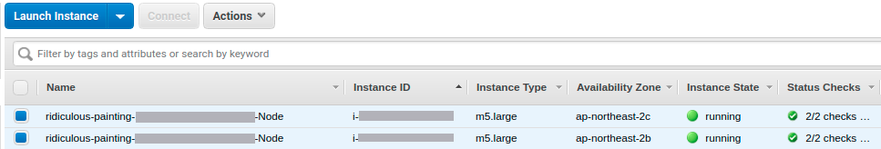

* Rev.1: 2020-04-06 (Mon)
* Draft: 2020-04-05 (Sun)

# eksctl로 AWS에 EKS 클러스터 만들기

eksctl를 실행할 준비가 되었으므로 

```bash
$ eksctl create cluster
```

명령어를 실행해서 Amazon EKS를 시작할 때 필요한 모든 리소스를 자동으로 설치합니다. 즉, EKS 클러스터 혹은 Kubernetes 클러스터 환경을 자동으로 조성합니다. 이때 수행되는 특징입니다.

* 클러스터 이름을 자동 생성. 예: eksctl-adorable-lagomorph-1234567890-cluster
* EC2 인스턴스 중 2x m5.large nodes를 선택
* 공식 AWS EKS AMI를 사용. 예: AmazonLinux2/1.14
* IAM configure에 설정된 region
* Dedicated VPC를 사용 (quota 체크 필요)
* static AMI resolver를 사용

이 절에 관한 자세한 내용은 [eksctl 시작하기 (AWS 공식 문서)](https://docs.aws.amazon.com/ko_kr/eks/latest/userguide/getting-started-eksctl.html) 혹은 [Amazon EKS 클러스터 생성 (AWS 공식 문서)](https://docs.aws.amazon.com/ko_kr/eks/latest/userguide/create-cluster.html)를 참고하세요.

## 생성 옵션 이해하기

ekctl은 다양한 옵션을 제공합니다. 워커 노드 (Worker node)를 Linux만으로 구성하거나, Windows를 섞어서 구성할 수 있습니다. 혹은 컨테이너를 위한 서버리스 컴퓨팅을 위한 AWS Fargate만으로 구성할 수도 있습니다. 가능한 옵션은

```
$ eksctl create cluster --help
```

를 실행하면 확인할 수 있습니다.

##### 참고 문서

- [Cluster with Linux-only workloads](https://docs.aws.amazon.com/ko_kr/eks/latest/userguide/getting-started-eksctl.html#cluster-with-linux-only-workloads)
- [Cluster with Linux and Windows workloads](https://docs.aws.amazon.com/ko_kr/eks/latest/userguide/getting-started-eksctl.html#cluster-with-linux-and-windows-workloads)
- [AWS Fargate-only cluster](https://docs.aws.amazon.com/ko_kr/eks/latest/userguide/getting-started-eksctl.html#aws-fargate-only-cluster)

## 디폴트 옵션으로 생성하기

우선 기본적인 구성으로 시작하기 위해 "eksctl create cluster" 명령어를 실행합니다. 하나의 마스터 노트와 2개의 워커 노트로 구성된 EKS 클러스터가 생성됩니다. 명령어는 실행 후 10~15분 정도 후에 완료됩니다. 

#### 클러스터 프러비저닝 (Provisioning) 하기

클러스터 프로비저닝에는 10~15분의 시간이 소요됩니다.

```bash
$ eksctl create cluster
[ℹ]  eksctl version 0.16.0
[ℹ]  using region ap-northeast-2
[ℹ]  setting availability zones to [ap-northeast-2c ap-northeast-2b ap-northeast-2a]
[ℹ]  subnets for ap-northeast-2c - public:192.168.0.0/19 private:192.168.96.0/19
[ℹ]  subnets for ap-northeast-2b - public:192.168.32.0/19 private:192.168.128.0/19
[ℹ]  subnets for ap-northeast-2a - public:192.168.64.0/19 private:192.168.160.0/19
[ℹ]  nodegroup "ng-l2mn3o4p" will use "ami-036c8013bc6bd6051" [AmazonLinux2/1.14]
[ℹ]  using Kubernetes version 1.14
[ℹ]  creating EKS cluster "adorable-lagomorph-1234567890" in "ap-northeast-2" region with un-managed nodes
[ℹ]  will create 2 separate CloudFormation stacks for cluster itself and the initial nodegroup
[ℹ]  if you encounter any issues, check CloudFormation console or try 'eksctl utils describe-stacks --region=ap-northeast-2 --cluster=adorable-lagomorph-1234567890'
[ℹ]  CloudWatch logging will not be enabled for cluster "adorable-lagomorph-1234567890" in "ap-northeast-2"
[ℹ]  you can enable it with 'eksctl utils update-cluster-logging --region=ap-northeast-2 --cluster=adorable-lagomorph-1234567890'
[ℹ]  Kubernetes API endpoint access will use default of {publicAccess=true, privateAccess=false} for cluster "adorable-lagomorph-1234567890" in "ap-northeast-2"
[ℹ]  2 sequential tasks: { create cluster control plane "adorable-lagomorph-1234567890", create nodegroup "ng-l2mn3o4p" }
[ℹ]  building cluster stack "eksctl-adorable-lagomorph-1234567890-cluster"
[ℹ]  deploying stack "eksctl-adorable-lagomorph-1234567890-cluster"
[ℹ]  building nodegroup stack "eksctl-adorable-lagomorph-1234567890-nodegroup-ng-l2mn3o4p"
[ℹ]  --nodes-min=2 was set automatically for nodegroup ng-l2mn3o4p
[ℹ]  --nodes-max=2 was set automatically for nodegroup ng-l2mn3o4p
[ℹ]  deploying stack "eksctl-adorable-lagomorph-1234567890-nodegroup-ng-l2mn3o4p"
[✔]  all EKS cluster resources for "adorable-lagomorph-1234567890" have been created
[✔]  saved kubeconfig as "/home/aimldl/.kube/config"
[ℹ]  adding identity "arn:aws:iam::123456789012:role/eksctl-adorable-lagomorph-123456-NodeInstanceRole-ABCDEFGH1IJK" to auth
 ConfigMap
[ℹ]  nodegroup "ng-l2mn3o4p" has 0 node(s)
[ℹ]  waiting for at least 2 node(s) to become ready in "ng-l2mn3o4p"
[ℹ]  nodegroup "ng-l2mn3o4p" has 2 node(s)
[ℹ]  node "ip-123-456-78-901.ap-northeast-2.compute.internal" is ready
[ℹ]  node "ip-234-567-89-01.ap-northeast-2.compute.internal" is ready
[ℹ]  kubectl command should work with "/home/aimldl/.kube/config", try 'kubectl get nodes'
[✔]  EKS cluster "adorable-lagomorph-1234567890" in "ap-northeast-2" region is ready
$
```

###  kubectl 구성 확인

```
$ kubectl get svc
NAME         TYPE        CLUSTER-IP   EXTERNAL-IP   PORT(S)   AGE
kubernetes   ClusterIP   12.345.6.7   <none>        443/TCP   17h
$
```

#### 명령어 주요 내용 요약

#### $ eksctl create cluster

AWS CLI의 "aws configure"로 지정한 "ap-northeast-2" 리전 (region)에  "adorable-lagomorph-1234567890"라는 이름의 EKS cluster가 생성되었습니다. (본래 이름은 임의로 생성되지만, 이 예제에서는 임의로 변경했습니다.) 메세지의 주요 내용을 요약하자면 아래와 같습니다.

* EKS 클러스터 생성
  * 이름: adorable-lagomorph-1234567890
  * 생성 리전 (region): ap-northeast-2 (한국)
  * kubeconfig 저장 위치: ~/.kube/config
* 마스터 노드 (Master Node) 생성
  * VPC가 3개. 각 VPC에 마스터 노트를 하나씩 생성
    * ap-northeast-2c
    * ap-northeast-2b
    * ap-northeast-2a
  * 동작하는 마스터 노트는 하나이지만 높은 가용성 (Availability)를 제공하기 위해 2개의 노드가 대기 중
* 워커 노트 (Worker Node) 생성
  * 노드 그룹 (nodegroup) 이름: ng-l2mn3o4p
    * 노드 1: node "ip-1*.ap-northeast-2.compute.internal"
    * 노드 2: node "ip-2*.ap-northeast-2.compute.internal"

##### 노드 그룹

노드 그룹의 모든 노드는 동일해야 합니다. 구체적으로

* 동일한 EC2 인스턴스 타입

* 동일한 Amazon Machine Image (AMI) 실행
* 동일한 Amazon EKS 작업자 노드 IAM 역할 사용

#### $ kubectl get svc

[TODO]  의미 확인 후 간략한 설명

#### 생성된 인스턴스 확인

AWS Management Consol의 EC2 서비스에서 Instances를 확인해봅니다. 아래와 같이 2개의 EC2가 생성되었음을 알 수 있습니다. 



[TODO: 그림 안의 이름이 생성된 node의 이름과 불일치. 그림의 내용을 변경해야 함.)

## 옵션의 값을 지정하고 생성하기

디폴트 값을 활용하지 않고, 옵션의 값을 지정할 수도 있습니다. 

### 워커 노드의 리눅스 Only 구성

아래 명령어는 [
Cluster with Linux-only workloads (AWS 공식 문서)](https://docs.aws.amazon.com/ko_kr/eks/latest/userguide/getting-started-eksctl.html#cluster-with-linux-only-workloads)의 예에서 쓰인 옵션과 값입니다.

```bash
$ eksctl create cluster \
--name prod \
--version 1.14 \
--region region-code \
--nodegroup-name standard-workers \
--node-type t3.medium \
--nodes 3 \
--nodes-min 1 \
--nodes-max 4 \
--ssh-access \
--ssh-public-key my-public-key.pub \
--managed
```

> - Amazon EKS [관리형 노드 그룹](https://docs.aws.amazon.com/ko_kr/eks/latest/userguide/managed-node-groups.html)에 대한 `--managed` 옵션은 현재 Kubernetes 1.14 클러스터에서만 지원됩니다. 최신 기능을 활용하려면 Amazon EKS에서 제공되는 최신 버전의 Kubernetes를 사용하는 것이 좋습니다. 
> - `--ssh-public-key`는 선택 사항이지만 클러스터를 사용하여 노드 그룹을 생성할 때 지정하는 것이 좋습니다. 이 옵션은 관리형 노드 그룹의 노드에 SSH 액세스를 활성화합니다. SSH 액세스를 활성화하면 문제가 있는 경우 인스턴스에 연결하여 진단 정보를 수집할 수 있습니다. 노드 그룹을 생성한 후에는 원격 액세스를 활성화할 수 없습니다. 키에 대한 자세한 내용은 Linux 인스턴스용 Amazon EC2 사용 설명서의 [Amazon EC2 키 페어](https://docs.aws.amazon.com/AWSEC2/latest/UserGuide/ec2-key-pairs.html)를 참조하십시오.

[TODO] 명령어 실행 & 확인

### 워커 노드의 리눅스 + 윈도우즈 혼합 구성

리눅스와 윈도우즈를 섞어서 구성하는 경우입니다. 

#### cluster-spec.yaml

> \---
>
> apiVersion: eksctl.io/v1alpha5
> kind: ClusterConfig
>
> metadata:
>   name: windows-prod
>   region: region-code
>   version: '1.14'
>
> managedNodeGroups:
>   - name: linux-ng
>     instanceType: t2.large
>     minSize: 2
>
> nodeGroups:
>   - name: windows-ng
>     instanceType: m5.large
>     minSize: 2
>     volumeSize: 100
>     amiFamily: WindowsServer2019FullContainer

> 구성 파일은 클러스터와 Linux 및 Windows 작업자 노드 그룹을 생성하는 데 사용됩니다. 클러스터에서 Windows 워크로드만 실행하려는 경우에도 모든 Amazon EKS 클러스터에는 하나 이상의 Linux 작업자 노드가 있어야 합니다. 가용성을 위해 각 노드 그룹에 작업자 노드를 두 개 이상 생성하는 것이 좋습니다. Windows 워크로드에 필요한 최소 Kubernetes 버전은 1.14입니다.

#### 실행 명령어

-f 옵션으로 설정 파일의 이름을 지정합니다. 

```
$ eksctl create cluster -f cluster-spec.yaml --install-vpc-controllers
```

> * Amazon EKS [관리형 노드 그룹](https://docs.aws.amazon.com/ko_kr/eks/latest/userguide/managed-node-groups.html)에 대한 `managedNodeGroups` 옵션은 현재 Kubernetes 1.14 클러스터에서만 지원됩니다. 최신 기능을 활용하려면 Amazon EKS에서 제공되는 최신 버전의 Kubernetes를 사용하는 것이 좋습니다.

[TODO] 명령어 실행 & 확인

#### 워커 노드의 AWS FarGate Only 구성

```bash
$ eksctl create cluster \
--name prod \
--version 1.14 \
--region region-code \
--fargate
```

> 작업자 노드 그룹 없이 새 Amazon EKS 클러스터가 생성됩니다. 그러나 `eksctl`에서는 포드 실행 역할, `default` 및 `kube-system` 네임스페이스에 대한 Fargate 프로파일을 만들고 Fargate에서 실행할 수 있도록 `coredns` 배포를 패치합니다. 자세한 내용은 [AWS Fargate](https://docs.aws.amazon.com/ko_kr/eks/latest/userguide/fargate.html) 단원을 참조하십시오.

[TODO] 명령어 실행 & 확인

#### GPU사용을 위한 구성

> (Linux GPU 작업자만 해당) GPU 인스턴스 유형과 GPU 지원이 포함된 Amazon EKS 최적화 AMI를 선택한 경우 다음 명령을 이용해 클러스터에 [Kubernetes용 NVIDIA 디바이스 플러그인](https://github.com/NVIDIA/k8s-device-plugin)을 데몬 세트로 적용해야 합니다.

------

Q: 다음 단계로 무엇을 해야 하나?

P: AWK EKS의 공식문서를 읽어봤지만 뭘 어떻게 해야 할지 모르겠음.

H: 그래서 일단 Kubernetes의 Tutorials로 넘어가는 걸로...

이전: [AWS를 이용해서 Kubernetes 설치하기](../INSTALL-Amazon_EKS.md)

다음: [1.Hello Minikube](../tutorials/1-Hello Minikube.md)

