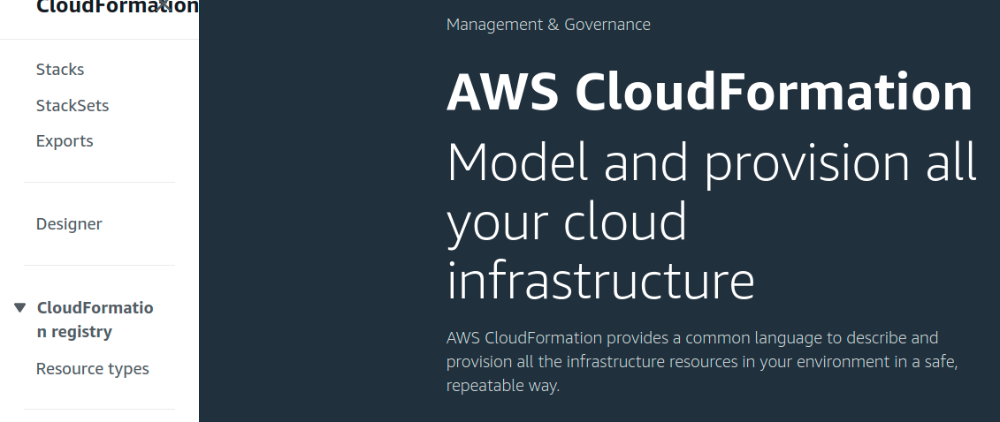

```bash
$ eksctl create cluster
[ℹ]  eksctl version 0.16.0
   ...
[ℹ]  using Kubernetes version 1.14
[ℹ]  creating EKS cluster "exciting-outfit-1586076975" in "ap-northeast-2" region with un-managed nodes
[ℹ]  will create 2 separate CloudFormation stacks for cluster itself and the initial nodegroup
[ℹ]  if you encounter any issues, check CloudFormation console or try 'eksctl utils describe-stacks --region=ap-northeast-2 --cluster=exciting-outfit-1586076975'
  ...
[ℹ]  Kubernetes API endpoint access will use default of {publicAccess=true, privateAccess=false} for cluster "exciting-outfit-1586076975" in "ap-northeast-2"
[ℹ]  2 sequential tasks: { create cluster control plane "exciting-outfit-1586076975", create nodegroup "ng-6df46ecd" }
[ℹ]  building cluster stack "eksctl-exciting-outfit-1586076975-cluster"
[ℹ]  deploying stack "eksctl-exciting-outfit-1586076975-cluster"
[✖]  unexpected status "ROLLBACK_IN_PROGRESS" while waiting for CloudFormation stack "eksctl-exciting-outfit-1586076975-cluster"
[ℹ]  fetching stack events in attempt to troubleshoot the root cause of the failure
[!]  AWS::EC2::InternetGateway/InternetGateway: DELETE_IN_PROGRESS
[!]  AWS::EC2::VPC/VPC: DELETE_IN_PROGRESS
[✖]  AWS::EC2::InternetGateway/InternetGateway: CREATE_FAILED – "Resource creation cancelled"
[✖]  AWS::EC2::VPC/VPC: CREATE_FAILED – "Resource creation cancelled"
[✖]  AWS::EC2::EIP/NATIP: CREATE_FAILED – "The maximum number of addresses has been reached. (Service: AmazonEC2; Status Code: 400; Error Code: AddressLimitExceeded; Request ID: 49a4b6f6-0d22-42b9-a9ed-cdb85e55f63b)"
[ℹ]  1 error(s) occurred and cluster hasn't been created properly, you may wish to check CloudFormation console
[ℹ]  to cleanup resources, run 'eksctl delete cluster --region=ap-northeast-2 --name=exciting-outfit-1586076975'
[✖]  waiting for CloudFormation stack "eksctl-exciting-outfit-1586076975-cluster": ResourceNotReady: failed waiting for successful resource state
Error: failed to create cluster "exciting-outfit-1586076975"
$
```

먼저 AWS Management Console에서 CloudFormation 서비스로 이동합니다.


내용을 확인하기 위해 Stacks를 클릭합니다.



Status가 ROLLBACK_COMPLETE인 스택을 클릭합니다.


이벤트의 세부내용을 보기 위해 vents 탭을 클릭합니다.


신규 IP주소 생성 문제 같습니다. 


AWS Management Console에서 EC2 서비스로 이동해서, Elastic IPs를 클릭합니다. 2개의 IP주소가 남아서 "Release Elastic IP addresses"를 클릭. 2개의 IP주소를 release해서 2개의 IP주소를 확보했습니다.


다시 한번 명령어를 실행해보니 IP주소 부족으로 인한 문제는 해결됐습니다.

```bash
$ eksctl create cluster
[ℹ]  eksctl version 0.16.0
  ...
[ℹ]  using Kubernetes version 1.14
[ℹ]  creating EKS cluster "adorable-lagomorph-1234567890" in "ap-northeast-2" region with un-managed nodes(e2e_automl) ~
[ℹ]  will create 2 separate CloudFormation stacks for cluster itself and the initial nodegroup
[ℹ]  if you encounter any issues, check CloudFormation console or try 'eksctl utils describe-stacks --region=ap-northeast-2 --cluster=adorable-lagomorph-1234567890'
[ℹ]  CloudWatch logging will not be enabled for cluster "adorable-lagomorph-1234567890" in "ap-northeast-2"
[ℹ]  you can enable it with 'eksctl utils update-cluster-logging --region=ap-northeast-2 --cluster=adorable-lagomorph-1234567890'
[ℹ]  Kubernetes API endpoint access will use default of {publicAccess=true, privateAccess=false} for cluster "adorable-lagomorph-1234567890" in "ap-northeast-2"
[ℹ]  2 sequential tasks: { create cluster control plane "adorable-lagomorph-1234567890", create nodegroup "ng-abcdefghi" }
[ℹ]  building cluster stack "eksctl-adorable-lagomorph-1234567890-cluster"
[ℹ]  deploying stack "eksctl-adorable-lagomorph-1234567890-cluster"
[ℹ]  building nodegroup stack "eksctl-adorable-lagomorph-1234567890-nodegroup-ng-abcdefghi"
[ℹ]  --nodes-min=2 was set automatically for nodegroup ng-abcdefghi
[ℹ]  --nodes-max=2 was set automatically for nodegroup ng-abcdefghi
[ℹ]  deploying stack "eksctl-adorable-lagomorph-1234567890-nodegroup-ng-abcdefghi"
[✔]  all EKS cluster resources for "adorable-lagomorph-1234567890" have been created
[✔]  saved kubeconfig as "/home/aimldl/.kube/config"
  ...
[ℹ]  nodegroup "ng-abcdefghi" has 0 node(s)
[ℹ]  waiting for at least 2 node(s) to become ready in "ng-abcdefghi"
[ℹ]  nodegroup "ng-abcdefghi" has 2 node(s)
[ℹ]  node "ip-w-x-y-z.ap-northeast-2.compute.internal" is ready
[ℹ]  node "ip-a-b-c-d.ap-northeast-2.compute.internal" is ready
[✖]  unable to use kubectl with the EKS cluster (check 'kubectl version'): /usr/lib/python3/dist-packages/requests/__init__.py:80: RequestsDependencyWarning: urllib3 (1.25.5) or chardet (3.0.4) doesn't match a supported version!
  RequestsDependencyWarning)
usage: aws [options] <command> <subcommand> [<subcommand> ...] [parameters]
To see help text, you can run:

  aws help
  aws <command> help
  aws <command> <subcommand> help
aws: error: argument operation: Invalid choice, valid choices are:

create-cluster                           | delete-cluster                          
describe-cluster                         | describe-update                         
list-clusters                            | list-tags-for-resource                  
list-updates                             | tag-resource                            
untag-resource                           | update-cluster-config                   
update-cluster-version                   | wait                                    
help                                    
Unable to connect to the server: getting credentials: exec: exit status 2

[ℹ]  cluster should be functional despite missing (or misconfigured) client binaries
[✔]  EKS cluster "adorable-lagomorph-1234567890" in "ap-northeast-2" region is ready
$
```

### Caution: 

Two EC2 instances are created and running. 


Make sure to stop or terminate the instances. 


As the message says, CloudFormation stack has been checked and found the following reason causes the error.

> The maximum number of addresses has been reached.


The

