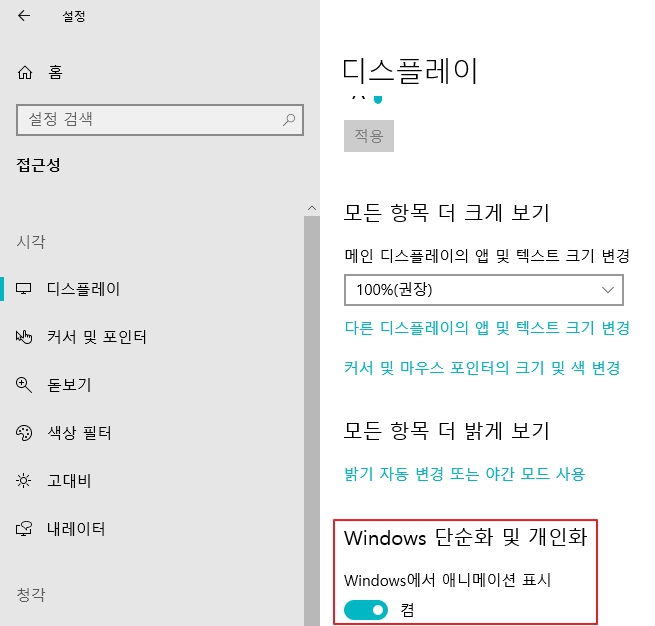
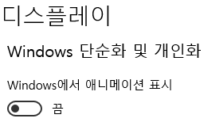

* Draft: 2020-05-17 (Sun)

# Animation Extremely Slowed down Windows 10
## Problem
* My hardware is lightening fast and Windows 10 on this machine slowed down all of a sudden. 
* As an extreme example, it took tens of seconds to open Notepad which usually takes less than a second.

## Hint
* Google search: why windows 10 slowed down suddenly
* [Windows 10 Slow Suddenly! Effective Fixes Here to Speed Up Windows 10](https://www.easeus.com/partition-manager-software/windows-10-suddenly-extremely-slow.html)

```
How can I speed up my computer with Windows 10?
* Restart your PC
* Upgrade your RAM
* Install the latest Windows 10 update

* Change the power plan
* Disable startup programs
* Disable Transparency Effect
* Extend system C drive
* Defragment and optimize drives
* Run Disk Cleanup
* Adjust the appearance and performance of Windows
...
```

```
Why is Windows 10 so Slow? There may be the following reasons:
* Slow on startup
* Run out of disk space
* Dirty fan or heat sink
* Windows system issue
* Hard drive issue
* Virtual memory not enough
* Virus or malware attack
...
```

## Solution
The animation was on.



When I turned it off, windows started to function way faster.



Let's see if turning off animation brings everything back and my Windows 10 runs fast like it used to do.
