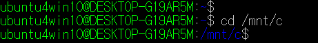
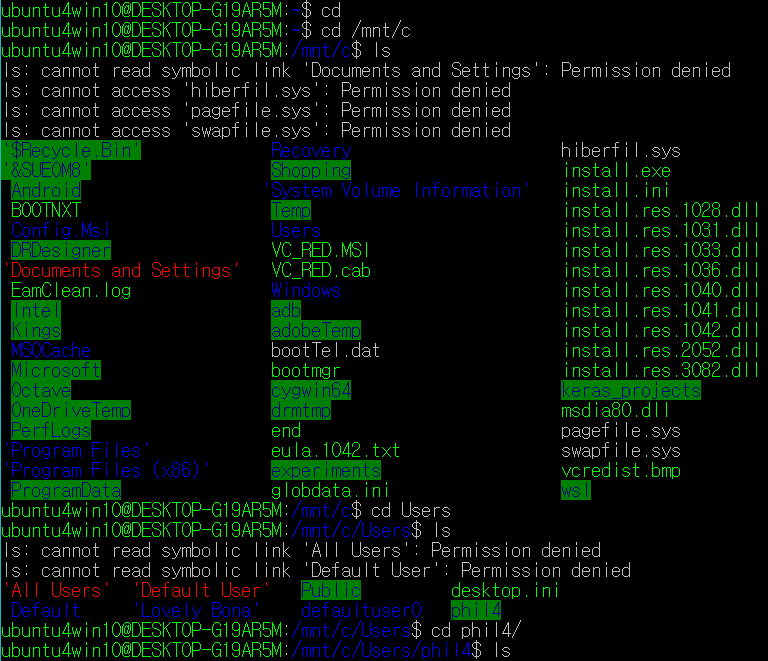

* Rev.1: 2020-05-17 (Sun)
* Draft: 2019-07-08 (Mon)

# Windows Subsystem for Linux (WSL)
## Installation
In Korean,
* [Windows10에 Ubuntu Linux 설치하기](https://aimldl.blog.me/221580854229)
* [GUI환경 설정하기](https://aimldl.blog.me/221551211802)

## Several Commands
#### cd to C:\
```bash
$ cd /mnt/c
```


#### cd to the User Account Directory
```bash
$ cd /mnt/c/Users/{user_id}
```


(EOF)
