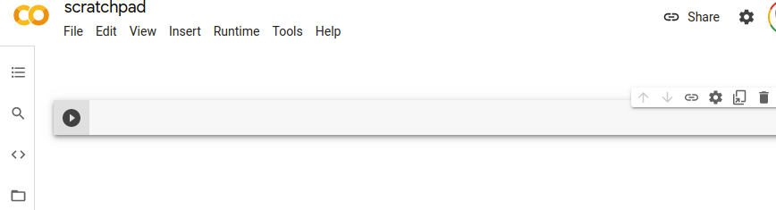
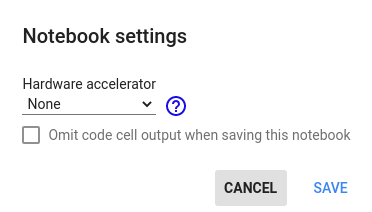
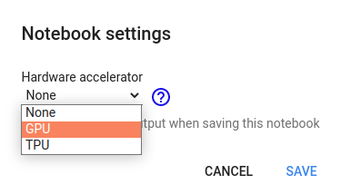
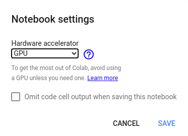

* Draft: 2020-11-03 (Tue)

# Google Colab에서 GPU 쓰는 방법

Step 1. Google Colab을 오픈합니다.

Step 2. 메뉴에서 `Runtime` > `Change runtime type`을 선택합니다.

그러면 `Notebook settings`창이 나옵니다. `Hardware accelerator`가 `None`임을 알 수 있습니다. 즉, CPU에서만 실행합니다.

Step 3. 드랍다운 메뉴에서 GPU를 선택합니다.

Step 4. GPU가 선택된 후 `Save` 버튼을 눌러서 설정을 저장합니다.

