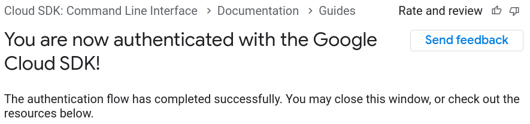

* Draft: 2021-05-17 (Mon)

# How to Install Google Cloud SDK

## Summary

For Linux 64-bit (x86_64), run:

```bash
$ python --version
$ curl -O https://dl.google.com/dl/cloudsdk/channels/rapid/downloads/google-cloud-sdk-340.0.0-linux-x86_64.tar.gz
$ tar -xvf google-cloud-sdk-340.0.0-linux-x86_64.tar.gz
$ ./google-cloud-sdk/install.sh
$ ./google-cloud-sdk/bin/gcloud init
```

## Overview

### https://cloud.google.com/sdk


### [Installing Google Cloud SDK](https://cloud.google.com/sdk/docs/install)

The installation manual explains the process in details.

#### Step 1. Check the Python version.

```bash
$ python --version
Python 3.8.5
$
```

#### Step 2. Select the platform suitable for you.

For Linux,

| Platform              | Package                                                      | Size    | SHA256 Checksum                                              |
| --------------------- | ------------------------------------------------------------ | ------- | ------------------------------------------------------------ |
| Linux 64-bit (x86_64) | [google-cloud-sdk-340.0.0-linux-x86_64.tar.gz](https://dl.google.com/dl/cloudsdk/channels/rapid/downloads/google-cloud-sdk-340.0.0-linux-x86_64.tar.gz) | 85.1 MB | f2ae79ff55a3bbe700208ccdde49c2fd5511c03016e3a09f69257ffdd6a6a9d6 |
| Linux 32-bit (x86)    | [google-cloud-sdk-340.0.0-linux-x86.tar.gz](https://dl.google.com/dl/cloudsdk/channels/rapid/downloads/google-cloud-sdk-340.0.0-linux-x86.tar.gz) | 82.5 MB | 0446d7fd770601389c878640c8749d6336f3097c5e99005d5eab4b911343baf1 |

#### Step 3. Download the installation package.

For Linux 64-bit (x86_64), the download command is as follows. If your platform is different, choose the right one and change the package file name accordingly.

```bash
$ curl -O https://dl.google.com/dl/cloudsdk/channels/rapid/downloads/google-cloud-sdk-340.0.0-linux-x86_64.tar.gz
```

The above command downloads a compressed file.

```bash
$ ls
google-cloud-sdk-340.0.0-linux-x86_64.tar.gz
$
```

#### Step 4. Extract the compressed file.

```bash
$ tar -xvf google-cloud-sdk-340.0.0-linux-x86_64.tar.gz

```

#### Step 5. Install `google-cloud-sdk` with the `install.sh` script.

```bash
$ ./google-cloud-sdk/install.sh
```

Given the following inquiry, 

```bash
  ...
Do you want to help improve the Google Cloud SDK (y/N)? 
```

enter either `y` or `n`.

```bash
  ...
To install or remove components at your current SDK version [340.0.0], run:
  $ gcloud components install COMPONENT_ID
  $ gcloud components remove COMPONENT_ID

To update your SDK installation to the latest version [340.0.0], run:
  $ gcloud components update


Modify profile to update your $PATH and enable shell command 
completion?

Do you want to continue (Y/n)?
```

Enter `y`.

```bash
Enter a path to an rc file to update, or leave blank to use 
[/home/aimldl/.bashrc]: 
```

And hit the `Enter` key.

```bash
  ...
==> Start a new shell for the changes to take effect.


For more information on how to get started, please visit:
  https://cloud.google.com/sdk/docs/quickstarts
$
```

#### Step 6. Initialize Google Cloud

Run the `gcloud init` command to initialize the SDK.

```bash
$ ./google-cloud-sdk/bin/gcloud init

```

The full message is below.

```bash
Welcome! This command will take you through the configuration of gcloud.

Your current configuration has been set to: [default]

You can skip diagnostics next time by using the following flag:
  gcloud init --skip-diagnostics

Network diagnostic detects and fixes local network connection issues.
Checking network connection...done.                                            
Reachability Check passed.
Network diagnostic passed (1/1 checks passed).

You must log in to continue. Would you like to log in (Y/n)?
```

Enter `y` and a web browser will pop up. Click the Google account you wish to use.


If you click `Use another account`, you must enter your gmail account to sign in.


Click `Allow` to grant the access privilege.


Verify the account. If you have already verified the computer you're using, the verification step won't be necessary.

When the authentication is a success, the following message is shown at https://cloud.google.com/sdk/auth_success.



#### Step 7. Start using the Cloud SDK.

In the terminal, you will see something like this.


