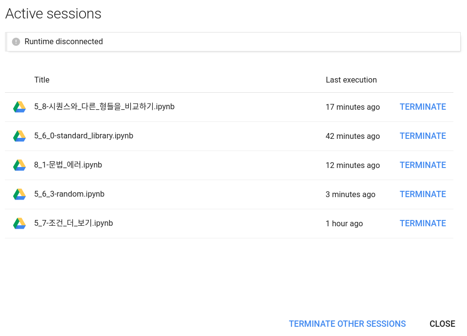

* Draft: 2021-01-06 (Wed)

# Too many sessions

코드 셀을 실행했을 때, 실행되지 않고 아래의 메세지가 발생하는 경우가 있습니다.

* `MANAGE SESSIONS`를 클릭하면 `Active sessions`를 보여줍니다.

* 필요없는 세션은 `TERMINATE`를 클릭해서 강제종료합니다.
* 모든 세션을 닫으려면 `TERMINATE OTHER SESSIONS`를 클릭합니다.

