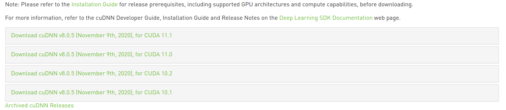
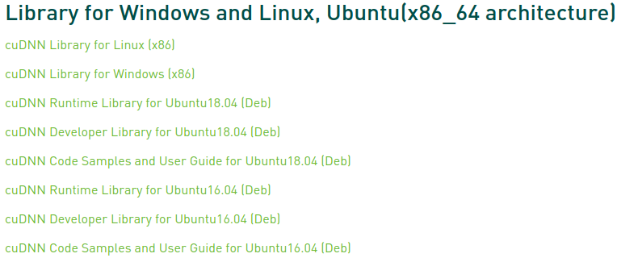

* Draft: 2020-06-29 (Mon)

# Install NVIDIA cuDNN for Ubuntu 20.04

## Overview

NVIDIA cuDNN (CUDA Deep Neural Network) library is a GPU-accelerated library of primitives for deep neural networks. This is one of the requirements to run deep learning on GPU. 

## Prerequisites

* [Install NVIDIA Display Drivers](nvidia_graphics_card_driver_automatically.md)
* [Install NVIDIA CUDA Toolkit](nvidia_cuda_toolkit.md)

## Summary

1. Download `cuDNN Library for Linux (x86)` (`cudnn-x.x-linux-x64-v8.x.x.x.tgz`) from https://developer.nvidia.com/cudnn

See below to see the detailed explanation regarding which files to download.

2. Install cuDNN from the downloaded .deb file

Say the downloaded .deb files are:

```bash
$ ls
libcudnn8-dev_8.0.5.39-1+cuda11.1_amd64.deb      libcudnn8_8.0.5.39-1+cuda11.1_amd64.deb
libcudnn8-samples_8.0.5.39-1+cuda11.1_amd64.deb
$
```

The commands to install the files are below. Be careful to run the commands in the right order.

```bash
$ sudo dpkg -i libcudnn8_8.0.5.39-1+cuda11.1_amd64.deb
$ sudo dpkg -i libcudnn8-dev_8.0.5.39-1+cuda11.1_amd64.deb
$ sudo dpkg -i libcudnn8-samples_8.0.5.39-1+cuda11.1_amd64.deb 
```

3. Verify the cuDNN installation.

   ```bash
   $ cp -r /usr/src/cudnn_samples_v8/ $HOME
   $ cd  $HOME/cudnn_samples_v8/mnistCUDNN
   $ make clean && makebash
   $ ./mnistCUDNN
   ```

## 1. Download the installation file

For details, refer to the [Installation Guide](https://docs.nvidia.com/deeplearning/sdk/cudnn-install/index.html).

#### Step 1. Go to https://developer.nvidianvidia_graphics_card_driver_automatically-ubuntu18_04.mdnvidia_graphics_card_driver_automatically-ubuntu18_04.md.com/cudnn


#### For detailsFor detailsStep 2. Click the `Download cuDNN` button and the following page is open.


If you don't have an existing account, create one. If you have one, click the `Login` button.

#### Step 3. Log in with your NVIDIA account.


The `cuDNN Download` page will open.

#### Step 4. Check the box `I Agree To the Terms of the cuDNN Software License Agreement`.


And links for the recent cuDNN versions for CUDA versions are open as follows.



Refer to the [Installation Guide ](https://docs.nvidia.com/deeplearning/sdk/cudnn-install/index.html) to learn about the detailed installation process.

#### Step 5. Click the version of your interest. 

In my case, the most recent CUDA version of 11.0 is used. So `Download cuDNN v8.0.1 RC2 (June 26th, 2020), for CUDA 11.0` is clicked. New menus are shown under `Download cuDNN v8.0.1 RC2 (June 26th, 2020), for CUDA 11.0`: 

* Library for Windows and Linux, Ubuntu(xlinux-x64-v8.x.x.x.tgz
  $ sudo cp cuda/include/cudnn*.h /usr/local/cuda/include
  $ sudo cp cuda/lib64/libcudnn* /usr/local/cuda/lib64
  $ sudo chmod a+r /usr/local/cuda/include/cudnn*.h /usr/local/cuda/lib64/libcudnn*86_64 architecture)
* Library for Red Hat (x86_64 & Power architecture)
* Library for Linux and Ubuntu (Power architecture)

I clicked the first one as my OS is Ubuntu and the following menu is shown.



#### Step 6. Click to download the installation file(s).

I clicked `cuDNN Library for Linux (x86)`. I took an hour to download the installation file. So take this time into consideration.


Instead, I may choose to download three files separately.

* [cuDNN Runtime Library for Ubuntu20.04 x86_64 (Deb)](https://developer.nvidia.com/compute/machine-learning/cudnn/secure/8.0.5/11.1_20201106/Ubuntu20_04-x64/libcudnn8_8.0.5.39-1+cuda11.1_amd64.deb)

  [cuDNN Developer Library for Ubuntu20.04 x86_64 (Deb)](https://developer.nvidia.com/compute/machine-learning/cudnn/secure/8.0.5/11.1_20201106/Ubuntu20_04-x64/libcudnn8-dev_8.0.5.39-1+cuda11.1_amd64.deb)

  [cuDNN Code Samples and User Guide for Ubuntu20.04 x86_64 (Deb)](https://developer.nvidia.com/compute/machine-learning/cudnn/secure/8.0.5/11.1_20201106/Ubuntu20_04-x64/libcudnn8-samples_8.0.5.39-1+cuda11.1_amd64.deb)

## 2. Install cuDNN from the downloaded tar file

The commands to install cuDNN are summarized below.

Say the download file names are as follows:

```bash
$ ls
libcudnn8-dev_8.0.5.39-1+cuda11.1_amd64.deb      libcudnn8_8.0.5.39-1+cuda11.1_amd64.deb
libcudnn8-samples_8.0.5.39-1+cuda11.1_amd64.deb
$
```

```bash
$ sudo dpkg -i libcudnn8_8.0.5.39-1+cuda11.1_amd64.deb
$ sudo dpkg -i libcudnn8-dev_8.0.5.39-1+cuda11.1_amd64.deb
$ sudo dpkg -i libcudnn8-samples_8.0.5.39-1+cuda11.1_amd64.deb 
```

Notice the file names of downloaded files are changed compared to Ubuntu 18.04. See [nvidia_graphics_card_driver_automatically-ubuntu18_04.md](nvidia_graphics_card_driver_automatically-ubuntu18_04.md) for comparison. The old set of commands are:

```bash
$ sudo cp cuda/include/cudnn*.h /usr/local/cuda/include
$ sudo cp cuda/lib64/libcudnn* /usr/local/cuda/lib64
$ sudo chmod a+r /usr/local/cuda/include/cudnn*.h /usr/local/cuda/lib64/libcudnn*
```

#### Step 1. Install the .deb files one after another.

```bash
$ sudo dpkg -i libcudnn8_8.0.5.39-1+cuda11.1_amd64.deb 
Selecting previously unselected package libcudnn8.
(데이터베이스 읽는중 ...현재 249032개의 파일과 디렉터리가 설치되어 있습니다.)
Preparing to unpack libcudnn8_8.0.5.39-1+cuda11.1_amd64.deb ...
Unpacking libcudnn8 (8.0.5.39-1+cuda11.1) ...
libcudnn8 (8.0.5.39-1+cuda11.1) 설정하는 중입니다 ...
Processing triggers for libc-bin (2.31-0ubuntu9.1) ...
$
```

The order matters. If you violate the right order, `dpkg: error processing package libcudnn8-dev (--install):` will occur.

```bash
$ sudo dpkg -i libcudnn8-dev_8.0.5.39-1+cuda11.1_amd64.deb
(데이터베이스 읽는중 ...현재 249050개의 파일과 디렉터리가 설치되어 있습니다.)
Preparing to unpack libcudnn8-dev_8.0.5.39-1+cuda11.1_amd64.deb ...
Unpacking libcudnn8-dev (8.0.5.39-1+cuda11.1) over (8.0.5.39-1+cuda11.1) ...
libcudnn8-dev (8.0.5.39-1+cuda11.1) 설정하는 중입니다 ...
update-alternatives: using /usr/include/x86_64-linux-gnu/cudnn_v8.h to provide /usr/include/cudnn.h (libcudnn) in auto mode
$
```

Lastly,

```bash
$ sudo dpkg -i libcudnn8-samples_8.0.5.39-1+cuda11.1_amd64.deb 
Selecting previously unselected package libcudnn8-samples.
(데이터베이스 읽는중 ...현재 249050개의 파일과 디렉터리가 설치되어 있습니다.)
Preparing to unpack libcudnn8-samples_8.0.5.39-1+cuda11.1_amd64.deb ...
Unpacking libcudnn8-samples (8.0.5.39-1+cuda11.1) ...
libcudnn8-samples (8.0.5.39-1+cuda11.1) 설정하는 중입니다 ...
$
```

## 3. Verify the cuDNN installation

The commands to verify the cuDNN installation are summarized below.

```bash
$ cp -r /usr/src/cudnn_samples_v8/ $HOME
$ cd  $HOME/cudnn_samples_v8/mnistCUDNN
$ make clean && make
$ ./mnistCUDNN
```

If the cuDNN is installed from `cuDNN Library for Linux (x86)`, verify the installation as described in [Installation Guide](https://docs.nvidia.com/deeplearning/sdk/cudnn-install/index.html). 

> Compile the mnistCUDNN sample located in the `/usr/src/cudnn_samples_v8` directory in the Debian file.

#### Step 1. Copy the cuDNN sample to a writable path.

```bash
$ cp -r /usr/src/cudnn_samples_v8/ $HOME
$
```

#### Step 2. Go to the writable path.

```bash
$ cd ~/cudnn_samples_v8/mnistCUDNN/
$
```

Let's see what's in this directory.

```bash
$ ls
data  fp16_dev.cu  fp16_emu.cpp  FreeImage  Makefile  readme.txt
error_util.h  fp16_dev.h  fp16_emu.h  gemv.h  mnistCUDNN.cpp
$
```

Step 3. Compile the mnistCUDNN sample.

```bash
$ make clean && make
```

The message is below.

```bash
rm -rf *o
rm -rf mnistCUDNN
Linking agains cublasLt = true
CUDA VERSION: 11020
TARGET ARCH: x86_64
HOST_ARCH: x86_64
TARGET OS: linux
SMS: 35 50 53 60 61 62 70 72 75 
/usr/local/cuda/bin/nvcc -ccbin g++ -I/usr/local/cuda/include -I/usr/local/cuda/targets/ppc64le-linux/include -IFreeImage/include  -m64    -gencode arch=compute_35,code=sm_35 -gencode arch=compute_50,code=sm_50 -gencode arch=compute_53,code=sm_53 -gencode arch=compute_60,code=sm_60 -gencode arch=compute_61,code=sm_61 -gencode arch=compute_62,code=sm_62 -gencode arch=compute_70,code=sm_70 -gencode arch=compute_72,code=sm_72 -gencode arch=compute_75,code=sm_75 -gencode arch=compute_75,code=compute_75 -o fp16_dev.o -c fp16_dev.cu
nvcc warning : The 'compute_35', 'compute_37', 'compute_50', 'sm_35', 'sm_37' and 'sm_50' architectures are deprecated, and may be removed in a future release (Use -Wno-deprecated-gpu-targets to suppress warning).
g++ -I/usr/local/cuda/include -I/usr/local/cuda/targets/ppc64le-linux/include -IFreeImage/include   -o fp16_emu.o -c fp16_emu.cpp
g++ -I/usr/local/cuda/include -I/usr/local/cuda/targets/ppc64le-linux/include -IFreeImage/include   -o mnistCUDNN.o -c mnistCUDNN.cpp
/usr/local/cuda/bin/nvcc -ccbin g++   -m64      -gencode arch=compute_35,code=sm_35 -gencode arch=compute_50,code=sm_50 -gencode arch=compute_53,code=sm_53 -gencode arch=compute_60,code=sm_60 -gencode arch=compute_61,code=sm_61 -gencode arch=compute_62,code=sm_62 -gencode arch=compute_70,code=sm_70 -gencode arch=compute_72,code=sm_72 -gencode arch=compute_75,code=sm_75 -gencode arch=compute_75,code=compute_75 -o mnistCUDNN fp16_dev.o fp16_emu.o mnistCUDNN.o -I/usr/local/cuda/include -I/usr/local/cuda/targets/ppc64le-linux/include -IFreeImage/include -L/usr/local/cuda/lib64 -L/usr/local/cuda/targets/ppc64le-linux/lib -lcublasLt -LFreeImage/lib/linux/x86_64 -LFreeImage/lib/linux -lcudart -lcublas -lcudnn -lfreeimage -lstdc++ -lm
nvcc warning : The 'compute_35', 'compute_37', 'compute_50', 'sm_35', 'sm_37' and 'sm_50' architectures are deprecated, and may be removed in a future release (Use -Wno-deprecated-gpu-targets to suppress warning).

$
```

#### Step 4. Run the mnistCUDNN sample.

```bash
$ ./mnistCUDNN
```

The message is below.

```bash
Executing: mnistCUDNN
cudnnGetVersion() : 8005 , CUDNN_VERSION from cudnn.h : 8005 (8.0.5)
Host compiler version : GCC 9.3.0

There are 2 CUDA capable devices on your machine :
device 0 : sms 20  Capabilities 6.1, SmClock 1733.5 Mhz, MemSize (Mb) 8118, MemClock 5005.0 Mhz, Ecc=0, boardGroupID=0
device 1 : sms 20  Capabilities 6.1, SmClock 1733.5 Mhz, MemSize (Mb) 8119, MemClock 5005.0 Mhz, Ecc=0, boardGroupID=1
Using device 0

Testing single precision
Loading binary file data/conv1.bin
Loading binary file data/conv1.bias.bin
Loading binary file data/conv2.bin
Loading binary file data/conv2.bias.bin
Loading binary file data/ip1.bin
Loading binary file data/ip1.bias.bin
Loading binary file data/ip2.bin
Loading binary file data/ip2.bias.bin
Loading image data/one_28x28.pgm
Performing forward propagation ...
Testing cudnnGetConvolutionForwardAlgorithm_v7 ...
^^^^ CUDNN_STATUS_SUCCESS for Algo 1: -1.000000 time requiring 0 memory
^^^^ CUDNN_STATUS_SUCCESS for Algo 0: -1.000000 time requiring 0 memory
^^^^ CUDNN_STATUS_SUCCESS for Algo 2: -1.000000 time requiring 57600 memory
^^^^ CUDNN_STATUS_SUCCESS for Algo 5: -1.000000 time requiring 178432 memory
^^^^ CUDNN_STATUS_SUCCESS for Algo 7: -1.000000 time requiring 2057744 memory
^^^^ CUDNN_STATUS_SUCCESS for Algo 4: -1.000000 time requiring 184784 memory
^^^^ CUDNN_STATUS_NOT_SUPPORTED for Algo 6: -1.000000 time requiring 0 memory
^^^^ CUDNN_STATUS_NOT_SUPPORTED for Algo 3: -1.000000 time requiring 0 memory
Testing cudnnFindConvolutionForwardAlgorithm ...
^^^^ CUDNN_STATUS_SUCCESS for Algo 1: 0.011264 time requiring 0 memory
^^^^ CUDNN_STATUS_SUCCESS for Algo 0: 0.015360 time requiring 0 memory
^^^^ CUDNN_STATUS_SUCCESS for Algo 2: 0.037888 time requiring 57600 memory
^^^^ CUDNN_STATUS_SUCCESS for Algo 5: 0.048128 time requiring 178432 memory
^^^^ CUDNN_STATUS_SUCCESS for Algo 7: 0.076800 time requiring 2057744 memory
^^^^ CUDNN_STATUS_SUCCESS for Algo 4: 0.092160 time requiring 184784 memory
^^^^ CUDNN_STATUS_NOT_SUPPORTED for Algo 6: -1.000000 time requiring 0 memory
^^^^ CUDNN_STATUS_NOT_SUPPORTED for Algo 3: -1.000000 time requiring 0 memory
Testing cudnnGetConvolutionForwardAlgorithm_v7 ...
^^^^ CUDNN_STATUS_SUCCESS for Algo 4: -1.000000 time requiring 2450080 memory
^^^^ CUDNN_STATUS_SUCCESS for Algo 7: -1.000000 time requiring 1433120 memory
^^^^ CUDNN_STATUS_SUCCESS for Algo 5: -1.000000 time requiring 4656640 memory
^^^^ CUDNN_STATUS_SUCCESS for Algo 1: -1.000000 time requiring 2000 memory
^^^^ CUDNN_STATUS_SUCCESS for Algo 0: -1.000000 time requiring 0 memory
^^^^ CUDNN_STATUS_SUCCESS for Algo 2: -1.000000 time requiring 128000 memory
^^^^ CUDNN_STATUS_NOT_SUPPORTED for Algo 6: -1.000000 time requiring 0 memory
^^^^ CUDNN_STATUS_NOT_SUPPORTED for Algo 3: -1.000000 time requiring 0 memory
Testing cudnnFindConvolutionForwardAlgorithm ...
^^^^ CUDNN_STATUS_SUCCESS for Algo 0: 0.041984 time requiring 0 memory
^^^^ CUDNN_STATUS_SUCCESS for Algo 1: 0.055296 time requiring 2000 memory
^^^^ CUDNN_STATUS_SUCCESS for Algo 4: 0.057344 time requiring 2450080 memory
^^^^ CUDNN_STATUS_SUCCESS for Algo 7: 0.080896 time requiring 1433120 memory
^^^^ CUDNN_STATUS_SUCCESS for Algo 2: 0.096256 time requiring 128000 memory
^^^^ CUDNN_STATUS_SUCCESS for Algo 5: 0.110592 time requiring 4656640 memory
^^^^ CUDNN_STATUS_NOT_SUPPORTED for Algo 6: -1.000000 time requiring 0 memory
^^^^ CUDNN_STATUS_NOT_SUPPORTED for Algo 3: -1.000000 time requiring 0 memory
Resulting weights from Softmax:
0.0000000 0.9999399 0.0000000 0.0000000 0.0000561 0.0000000 0.0000012 0.0000017 0.0000010 0.0000000 
Loading image data/three_28x28.pgm
Performing forward propagation ...
Testing cudnnGetConvolutionForwardAlgorithm_v7 ...
^^^^ CUDNN_STATUS_SUCCESS for Algo 1: -1.000000 time requiring 0 memory
^^^^ CUDNN_STATUS_SUCCESS for Algo 0: -1.000000 time requiring 0 memory
^^^^ CUDNN_STATUS_SUCCESS for Algo 2: -1.000000 time requiring 57600 memory
^^^^ CUDNN_STATUS_SUCCESS for Algo 5: -1.000000 time requiring 178432 memory
^^^^ CUDNN_STATUS_SUCCESS for Algo 7: -1.000000 time requiring 2057744 memory
^^^^ CUDNN_STATUS_SUCCESS for Algo 4: -1.000000 time requiring 184784 memory
^^^^ CUDNN_STATUS_NOT_SUPPORTED for Algo 6: -1.000000 time requiring 0 memory
^^^^ CUDNN_STATUS_NOT_SUPPORTED for Algo 3: -1.000000 time requiring 0 memory
Testing cudnnFindConvolutionForwardAlgorithm ...
^^^^ CUDNN_STATUS_SUCCESS for Algo 0: 0.013312 time requiring 0 memory
^^^^ CUDNN_STATUS_SUCCESS for Algo 1: 0.015360 time requiring 0 memory
^^^^ CUDNN_STATUS_SUCCESS for Algo 2: 0.036864 time requiring 57600 memory
^^^^ CUDNN_STATUS_SUCCESS for Algo 5: 0.046080 time requiring 178432 memory
^^^^ CUDNN_STATUS_SUCCESS for Algo 4: 0.052224 time requiring 184784 memory
^^^^ CUDNN_STATUS_SUCCESS for Algo 7: 0.077824 time requiring 2057744 memory
^^^^ CUDNN_STATUS_NOT_SUPPORTED for Algo 6: -1.000000 time requiring 0 memory
^^^^ CUDNN_STATUS_NOT_SUPPORTED for Algo 3: -1.000000 time requiring 0 memory
Testing cudnnGetConvolutionForwardAlgorithm_v7 ...
^^^^ CUDNN_STATUS_SUCCESS for Algo 4: -1.000000 time requiring 2450080 memory
^^^^ CUDNN_STATUS_SUCCESS for Algo 7: -1.000000 time requiring 1433120 memory
^^^^ CUDNN_STATUS_SUCCESS for Algo 5: -1.000000 time requiring 4656640 memory
^^^^ CUDNN_STATUS_SUCCESS for Algo 1: -1.000000 time requiring 2000 memory
^^^^ CUDNN_STATUS_SUCCESS for Algo 0: -1.000000 time requiring 0 memory
^^^^ CUDNN_STATUS_SUCCESS for Algo 2: -1.000000 time requiring 128000 memory
^^^^ CUDNN_STATUS_NOT_SUPPORTED for Algo 6: -1.000000 time requiring 0 memory
^^^^ CUDNN_STATUS_NOT_SUPPORTED for Algo 3: -1.000000 time requiring 0 memory
Testing cudnnFindConvolutionForwardAlgorithm ...
^^^^ CUDNN_STATUS_SUCCESS for Algo 0: 0.040960 time requiring 0 memory
^^^^ CUDNN_STATUS_SUCCESS for Algo 1: 0.053248 time requiring 2000 memory
^^^^ CUDNN_STATUS_SUCCESS for Algo 4: 0.055296 time requiring 2450080 memory
^^^^ CUDNN_STATUS_SUCCESS for Algo 7: 0.075776 time requiring 1433120 memory
^^^^ CUDNN_STATUS_SUCCESS for Algo 2: 0.096256 time requiring 128000 memory
^^^^ CUDNN_STATUS_SUCCESS for Algo 5: 0.110592 time requiring 4656640 memory
^^^^ CUDNN_STATUS_NOT_SUPPORTED for Algo 6: -1.000000 time requiring 0 memory
^^^^ CUDNN_STATUS_NOT_SUPPORTED for Algo 3: -1.000000 time requiring 0 memory
Resulting weights from Softmax:
0.0000000 0.0000000 0.0000000 0.9999288 0.0000000 0.0000711 0.0000000 0.0000000 0.0000000 0.0000000 
Loading image data/five_28x28.pgm
Performing forward propagation ...
Resulting weights from Softmax:
0.0000000 0.0000008 0.0000000 0.0000002 0.0000000 0.9999820 0.0000154 0.0000000 0.0000012 0.0000006 

Result of classification: 1 3 5

Test passed!

Testing half precision (math in single precision)
Loading binary file data/conv1.bin
Loading binary file data/conv1.bias.bin
Loading binary file data/conv2.bin
Loading binary file data/conv2.bias.bin
Loading binary file data/ip1.bin
Loading binary file data/ip1.bias.bin
Loading binary file data/ip2.bin
Loading binary file data/ip2.bias.bin
Loading image data/one_28x28.pgm
Performing forward propagation ...
Testing cudnnGetConvolutionForwardAlgorithm_v7 ...
^^^^ CUDNN_STATUS_SUCCESS for Algo 2: -1.000000 time requiring 28800 memory
^^^^ CUDNN_STATUS_SUCCESS for Algo 1: -1.000000 time requiring 100 memory
^^^^ CUDNN_STATUS_SUCCESS for Algo 0: -1.000000 time requiring 0 memory
^^^^ CUDNN_STATUS_SUCCESS for Algo 5: -1.000000 time requiring 178432 memory
^^^^ CUDNN_STATUS_SUCCESS for Algo 4: -1.000000 time requiring 184784 memory
^^^^ CUDNN_STATUS_SUCCESS for Algo 7: -1.000000 time requiring 2057744 memory
^^^^ CUDNN_STATUS_NOT_SUPPORTED for Algo 6: -1.000000 time requiring 0 memory
^^^^ CUDNN_STATUS_NOT_SUPPORTED for Algo 3: -1.000000 time requiring 0 memory
Testing cudnnFindConvolutionForwardAlgorithm ...
^^^^ CUDNN_STATUS_SUCCESS for Algo 0: 0.017408 time requiring 0 memory
^^^^ CUDNN_STATUS_SUCCESS for Algo 1: 0.029696 time requiring 100 memory
^^^^ CUDNN_STATUS_SUCCESS for Algo 2: 0.032768 time requiring 28800 memory
^^^^ CUDNN_STATUS_SUCCESS for Algo 5: 0.043008 time requiring 178432 memory
^^^^ CUDNN_STATUS_SUCCESS for Algo 4: 0.048128 time requiring 184784 memory
^^^^ CUDNN_STATUS_SUCCESS for Algo 7: 0.075776 time requiring 2057744 memory
^^^^ CUDNN_STATUS_NOT_SUPPORTED for Algo 6: -1.000000 time requiring 0 memory
^^^^ CUDNN_STATUS_NOT_SUPPORTED for Algo 3: -1.000000 time requiring 0 memory
Testing cudnnGetConvolutionForwardAlgorithm_v7 ...
^^^^ CUDNN_STATUS_SUCCESS for Algo 1: -1.000000 time requiring 2000 memory
^^^^ CUDNN_STATUS_SUCCESS for Algo 5: -1.000000 time requiring 4656640 memory
^^^^ CUDNN_STATUS_SUCCESS for Algo 0: -1.000000 time requiring 0 memory
^^^^ CUDNN_STATUS_SUCCESS for Algo 2: -1.000000 time requiring 64000 memory
^^^^ CUDNN_STATUS_SUCCESS for Algo 4: -1.000000 time requiring 2450080 memory
^^^^ CUDNN_STATUS_SUCCESS for Algo 7: -1.000000 time requiring 1433120 memory
^^^^ CUDNN_STATUS_NOT_SUPPORTED for Algo 6: -1.000000 time requiring 0 memory
^^^^ CUDNN_STATUS_NOT_SUPPORTED for Algo 3: -1.000000 time requiring 0 memory
Testing cudnnFindConvolutionForwardAlgorithm ...
^^^^ CUDNN_STATUS_SUCCESS for Algo 0: 0.052224 time requiring 0 memory
^^^^ CUDNN_STATUS_SUCCESS for Algo 1: 0.052224 time requiring 2000 memory
^^^^ CUDNN_STATUS_SUCCESS for Algo 4: 0.052224 time requiring 2450080 memory
^^^^ CUDNN_STATUS_SUCCESS for Algo 7: 0.080896 time requiring 1433120 memory
^^^^ CUDNN_STATUS_SUCCESS for Algo 2: 0.105472 time requiring 64000 memory
^^^^ CUDNN_STATUS_SUCCESS for Algo 5: 0.109568 time requiring 4656640 memory
^^^^ CUDNN_STATUS_NOT_SUPPORTED for Algo 6: -1.000000 time requiring 0 memory
^^^^ CUDNN_STATUS_NOT_SUPPORTED for Algo 3: -1.000000 time requiring 0 memory
Resulting weights from Softmax:
0.0000001 1.0000000 0.0000001 0.0000000 0.0000563 0.0000001 0.0000012 0.0000017 0.0000010 0.0000001 
Loading image data/three_28x28.pgm
Performing forward propagation ...
Testing cudnnGetConvolutionForwardAlgorithm_v7 ...
^^^^ CUDNN_STATUS_SUCCESS for Algo 2: -1.000000 time requiring 28800 memory
^^^^ CUDNN_STATUS_SUCCESS for Algo 1: -1.000000 time requiring 100 memory
^^^^ CUDNN_STATUS_SUCCESS for Algo 0: -1.000000 time requiring 0 memory
^^^^ CUDNN_STATUS_SUCCESS for Algo 5: -1.000000 time requiring 178432 memory
^^^^ CUDNN_STATUS_SUCCESS for Algo 4: -1.000000 time requiring 184784 memory
^^^^ CUDNN_STATUS_SUCCESS for Algo 7: -1.000000 time requiring 2057744 memory
^^^^ CUDNN_STATUS_NOT_SUPPORTED for Algo 6: -1.000000 time requiring 0 memory
^^^^ CUDNN_STATUS_NOT_SUPPORTED for Algo 3: -1.000000 time requiring 0 memory
Testing cudnnFindConvolutionForwardAlgorithm ...
^^^^ CUDNN_STATUS_SUCCESS for Algo 0: 0.018432 time requiring 0 memory
^^^^ CUDNN_STATUS_SUCCESS for Algo 1: 0.031744 time -requiring 100 memory
^^^^ CUDNN_STATUS_SUCCESS for Algo 2: 0.032768 time requiring 28800 memory
^^^^ CUDNN_STATUS_SUCCESS for Algo 5: 0.035840 time requiring 178432 memory
^^^^ CUDNN_STATUS_SUCCESS for Algo 4: 0.048128 time requiring 184784 memory
^^^^ CUDNN_STATUS_SUCCESS for Algo 7: 0.073728 time requiring 2057744 memory
^^^^ CUDNN_STATUS_NOT_SUPPORTED for Algo 6: -1.000000 time requiring 0 memory
^^^^ CUDNN_STATUS_NOT_SUPPORTED for Algo 3: -1.000000 time requiring 0 memory
Testing cudnnGetConvolutionForwardAlgorithm_v7 ...
^^^^ CUDNN_STATUS_SUCCESS for Algo 1: -1.000000 time requiring 2000 memory
^^^^ CUDNN_STATUS_SUCCESS for Algo 5: -1.000000 time requiring 4656640 memory
^^^^ CUDNN_STATUS_SUCCESS for Algo 0: -1.000000 time requiring 0 memory
^^^^ CUDNN_STATUS_SUCCESS for Algo 2: -1.000000 time requiring 64000 memory
^^^^ CUDNN_STATUS_SUCCESS for Algo 4: -1.000000 time requiring 2450080 memory
^^^^ CUDNN_STATUS_SUCCESS for Algo 7: -1.000000 time requiring 1433120 memory
^^^^ CUDNN_STATUS_NOT_SUPPORTED for Algo 6: -1.000000 time requiring 0 memory
^^^^ CUDNN_STATUS_NOT_SUPPORTED for Algo 3: -1.000000 time requiring 0 memory
Testing cudnnFindConvolutionForwardAlgorithm ...
^^^^ CUDNN_STATUS_SUCCESS for Algo 0: 0.048128 time requiring 0 memory
^^^^ CUDNN_STATUS_SUCCESS for Algo 4: 0.050176 time requiring 2450080 memory
^^^^ CUDNN_STATUS_SUCCESS for Algo 1: 0.053248 time requiring 2000 memory
^^^^ CUDNN_STATUS_SUCCESS for Algo 7: 0.078848 time requiring 1433120 memory
^^^^ CUDNN_STATUS_SUCCESS for Algo 2: 0.108064 time requiring 64000 memory
^^^^ CUDNN_STATUS_SUCCESS for Algo 5: 0.113664 time requiring 4656640 memory
^^^^ CUDNN_STATUS_NOT_SUPPORTED for Algo 6: -1.000000 time requiring 0 memory
^^^^ CUDNN_STATUS_NOT_SUPPORTED for Algo 3: -1.000000 time requiring 0 memory
Resulting weights from Softmax:
0.0000000 0.0000000 0.0000000 1.0000000 0.0000000 0.0000714 0.0000000 0.0000000 0.0000000 0.0000000 
Loading image data/five_28x28.pgm
Performing forward propagation ...
Resulting weights from Softmax:
0.0000000 0.0000008 0.0000000 0.0000002 0.0000000 1.0000000 0.0000154 0.0000000 0.0000012 0.0000006 

Result of classification: 1 3 5

Test passed!
$
```

`Test passed!` is shown twice and it runs properly.

## Next

[Install NCCL](install_nvidia_nccl.md)

## References

* [Installation Guide](https://docs.nvidia.com/deeplearning/sdk/cudnn-install/index.html)

## Appendix.

Notice the `wget` command can not be used to download the cuDNN package from the provided link.

```bash
$ wget https://developer.nvidia.com/compute/machine-learning/cudnn/secure/8.0.1.13/11.0_20200626/cudnn-11.0-linux-x64-v8.0.1.13.tgz
```

The above command used to work, but not any more. The error message is below.

```bash
--2020-06-29 15:41:34--  https://developer.nvidia.com/compute/machine-learning/cudnn/secure/8.0.1.13/11.0_20200626/cudnn-11.0-linux-x64-v8.0.1.13.tgz
Resolving developer.nvidia.com (developer.nvidia.com)... 152.195.57.194
Connecting to developer.nvidia.com (developer.nvidia.com)|152.195.57.194|:443... connected.
HTTP request sent, awaiting response... 403 Forbidden
2020-06-29 15:41:35 ERROR 403: Forbidden.
$
```

