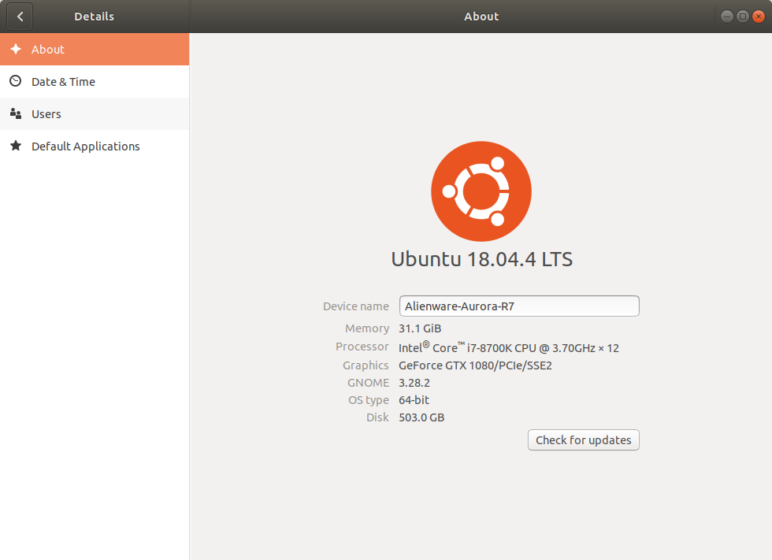

* Rev.2: 2020-06-25 (Thu)
* Rev.1: 2019-10-10 (Thu)
* Draft: 2019-03-03 (Sun)

# Install NVIDIA Graphics Card Driver on Ubuntu Automatically

## Summary

Step 1. Check the information on the graphics card

```bash
$ ubuntu-drivers devices
  ...
model    : GP104 [GeForce GTX 1080]
  ...
$
```

Step 2. Check the current graphics driver in `Settings > Details > About`

Step 3. Install the driver automatically.

```bash
# Auto-install the driver
$ sudo ubuntu-drivers autoinstall
[sudo] password for k8snode: 
  ...
$
```

Step 4. Reboot the system

```bash
$ reboot
```

Step 5. Verify the installation in `Settings > Details > About`

Additionally, check the status with:

```bash
$ nvidia-smi
```

## Check the information on the graphics card

```bash
$ ubuntu-drivers devices
== /sys/devices/pci0000:00/0000:00:01.1/0000:02:00.0 ==
modalias : pci:v000010DEd00001B80sv00001028sd00003366bc03sc00i00
vendor   : NVIDIA Corporation
model    : GP104 [GeForce GTX 1080]
driver   : nvidia-driver-415 - third-party free
driver   : nvidia-driver-390 - distro non-free
driver   : nvidia-driver-435 - distro non-free
driver   : nvidia-driver-440 - third-party free recommended
driver   : nvidia-driver-410 - third-party free
driver   : xserver-xorg-video-nouveau - distro free builtin

$
```

The model of my graphics card is `GP104 [GeForce GTX 1080]`. I thought it is `1080Ti`, but it turned out it is `1080`. It was good to double-check because the memory may fade away.

## Check the current graphics driver

Go to `Settings > Details > About` and check `Graphics`. In this example, `NV134` is set up for the graphics card because Ubuntu sets up the default graphics card driver to make the system works. In the following process, the driver designated to the given NVIDIA graphics card will be installed to use the graphics card at its full capacity.


## Install the driver automatically

### Auto-install the driver

```bash
$ sudo ubuntu-drivers autoinstall
[sudo] password for k8snode: 
  ...
$
```

For the full message to run this command, refer to "Appendix: Full message for `sudo ubuntu-drivers autoinstall`" at the bottom of this page.

### Install a specific driver version

Alternatively, install the desired driver selectively using the `apt` command.

```bash
$ sudo apt install nvidia-440
# or
$ sudo apt install nvidia-340
```

The version number can be checked in the [download page](https://www.nvidia.com/download/index.aspx?lang=en-us). For details, refer to [Install NVIDIA Graphics Card Driver on Ubuntu Manually](nvidia_graphics_driver_manually.md). (2. Download the driver installation file)

## Reboot the system

```bash
$ reboot
```

## Verify the installation 

### Using GUI in `Settings > Details > About`



Graphics is `GeForce GTX 1080/PCIe/SSE2`. 

**Memo: Wow! This auto-install feature works just great! Ubuntu has done a great job to remove the hassle of installing the driver manually. **

### Using the terminal with `nvidia-smi`

Run `nvidia-smi` and see if the graphics card(s) is/are properly recognized.

```bash
$ nvidia-smi
```

The output is presented below. Notice two GPUs are on the machine which are up and running.

```bash
Thu Jun 25 10:56:04 2020       
+-----------------------------------------------------------------------------+
| NVIDIA-SMI 440.82       Driver Version: 440.82       CUDA Version: 10.2     |
|-------------------------------+----------------------+----------------------+
| GPU  Name        Persistence-M| Bus-Id        Disp.A | Volatile Uncorr. ECC |
| Fan  Temp  Perf  Pwr:Usage/Cap|         Memory-Usage | GPU-Util  Compute M. |
|===============================+======================+======================|
|   0  GeForce GTX 1080    Off  | 00000000:01:00.0  On |                  N/A |
| 27%   38C    P8     9W / 180W |    280MiB /  8118MiB |      0%      Default |
+-------------------------------+----------------------+----------------------+
|   1  GeForce GTX 1080    Off  | 00000000:02:00.0 Off |                  N/A |
| 27%   30C    P8     5W / 180W |      2MiB /  8119MiB |      0%      Default |
+-------------------------------+----------------------+----------------------+
                                                                               
+-----------------------------------------------------------------------------+
| Processes:                                                       GPU Memory |
|  GPU       PID   Type   Process name                             Usage      |
|=============================================================================|
|    0      1067      G   /usr/lib/xorg/Xorg                           148MiB |
|    0      1231      G   /usr/bin/gnome-shell                          84MiB |
|    0      1860      G   ...AAAAAAAAAAAAAAgAAAAAAAAA --shared-files    43MiB |
+-----------------------------------------------------------------------------+
```

For comparison, the following output is when the graphics card driver is installed manually. The result is almost the same.

```bash
Wed Jun 10 15:00:17 2020       
+-----------------------------------------------------------------------------+
| NVIDIA-SMI 440.82       Driver Version: 440.82       CUDA Version: 10.2     |
|-------------------------------+----------------------+----------------------+
| GPU  Name        Persistence-M| Bus-Id        Disp.A | Volatile Uncorr. ECC |
| Fan  Temp  Perf  Pwr:Usage/Cap|         Memory-Usage | GPU-Util  Compute M. |
|===============================+======================+======================|
|   0  GeForce GTX 108...  Off  | 00000000:01:00.0  On |                  N/A |
| 23%   34C    P8    13W / 250W |    174MiB / 11177MiB |      0%      Default |
+-------------------------------+----------------------+----------------------+
|   1  GeForce GTX 108...  Off  | 00000000:02:00.0 Off |                  N/A |
| 23%   29C    P8     7W / 250W |      2MiB / 11178MiB |      0%      Default |
+-------------------------------+----------------------+----------------------+
                                                                               
+-----------------------------------------------------------------------------+
| Processes:                                                       GPU Memory |
|  GPU       PID   Type   Process name                             Usage      |
|=============================================================================|
|    0       994      G   /usr/lib/xorg/Xorg                           105MiB |
|    0      2078      G   /usr/bin/gnome-shell                          66MiB |
+-----------------------------------------------------------------------------+
$
```

## References

* [How to install the NVIDIA drivers on Ubuntu 18.04 Bionic Beaver Linux](https://linuxconfig.org/how-to-install-the-nvidia-drivers-on-ubuntu-18-04-bionic-beaver-linux)

## Appendix: Full message for `sudo ubuntu-drivers autoinstall`

```bash
k8snode@Alienware-Aurora-R7:~$ sudo ubuntu-drivers autoinstall
[sudo] password for k8snode: 
Reading package lists... Done
Building dependency tree       
Reading state information... Done
The following additional packages will be installed:
  dkms gcc-8-base:i386 libatomic1:i386 libbsd0:i386 libc6:i386 libdrm-amdgpu1:i386
  libdrm-intel1:i386 libdrm-nouveau2:i386 libdrm-radeon1:i386 libdrm2:i386 libedit2:i386
  libelf1:i386 libexpat1:i386 libffi6:i386 libgcc1:i386 libgl1:i386 libgl1-mesa-dri:i386
  libglapi-mesa:i386 libglvnd0:i386 libglx-mesa0:i386 libglx0:i386 libllvm9:i386 libnvidia-cfg1-440
  libnvidia-common-440 libnvidia-compute-440 libnvidia-compute-440:i386 libnvidia-decode-440
  libnvidia-decode-440:i386 libnvidia-encode-440 libnvidia-encode-440:i386 libnvidia-extra-440
  libnvidia-fbc1-440 libnvidia-fbc1-440:i386 libnvidia-gl-440 libnvidia-gl-440:i386
  libnvidia-ifr1-440 libnvidia-ifr1-440:i386 libpciaccess0:i386 libsensors4:i386 libstdc++6:i386
  libtinfo5:i386 libx11-6:i386 libx11-xcb1:i386 libxau6:i386 libxcb-dri2-0:i386 libxcb-dri3-0:i386
  libxcb-glx0:i386 libxcb-present0:i386 libxcb-sync1:i386 libxcb1:i386 libxdamage1:i386
  libxdmcp6:i386 libxext6:i386 libxfixes3:i386 libxnvctrl0 libxshmfence1:i386 libxxf86vm1:i386
  nvidia-compute-utils-440 nvidia-dkms-440 nvidia-kernel-common-440 nvidia-kernel-source-440
  nvidia-prime nvidia-settings nvidia-utils-440 screen-resolution-extra
  xserver-xorg-video-nvidia-440 zlib1g:i386
Suggested packages:
  menu glibc-doc:i386 locales:i386 lm-sensors:i386
The following NEW packages will be installed:
  dkms gcc-8-base:i386 libatomic1:i386 libbsd0:i386 libc6:i386 libdrm-amdgpu1:i386
  libdrm-intel1:i386 libdrm-nouveau2:i386 libdrm-radeon1:i386 libdrm2:i386 libedit2:i386
  libelf1:i386 libexpat1:i386 libffi6:i386 libgcc1:i386 libgl1:i386 libgl1-mesa-dri:i386
  libglapi-mesa:i386 libglvnd0:i386 libglx-mesa0:i386 libglx0:i386 libllvm9:i386 libnvidia-cfg1-440
  libnvidia-common-440 libnvidia-compute-440 libnvidia-compute-440:i386 libnvidia-decode-440
  libnvidia-decode-440:i386 libnvidia-encode-440 libnvidia-encode-440:i386 libnvidia-extra-440
  libnvidia-fbc1-440 libnvidia-fbc1-440:i386 libnvidia-gl-440 libnvidia-gl-440:i386
  libnvidia-ifr1-440 libnvidia-ifr1-440:i386 libpciaccess0:i386 libsensors4:i386 libstdc++6:i386
  libtinfo5:i386 libx11-6:i386 libx11-xcb1:i386 libxau6:i386 libxcb-dri2-0:i386 libxcb-dri3-0:i386
  libxcb-glx0:i386 libxcb-present0:i386 libxcb-sync1:i386 libxcb1:i386 libxdamage1:i386
  libxdmcp6:i386 libxext6:i386 libxfixes3:i386 libxnvctrl0 libxshmfence1:i386 libxxf86vm1:i386
  nvidia-compute-utils-440 nvidia-dkms-440 nvidia-driver-440 nvidia-kernel-common-440
  nvidia-kernel-source-440 nvidia-prime nvidia-settings nvidia-utils-440 screen-resolution-extra
  xserver-xorg-video-nvidia-440 zlib1g:i386
0 upgraded, 68 newly installed, 0 to remove and 7 not upgraded.
Need to get 171 MB of archives.
After this operation, 890 MB of additional disk space will be used.
Get:1 http://ppa.launchpad.net/graphics-drivers/ppa/ubuntu bionic/main amd64 libnvidia-cfg1-440 amd64 440.82-0ubuntu0~0.18.04.2 [74.0 kB]
Get:2 http://us.archive.ubuntu.com/ubuntu bionic-updates/main i386 gcc-8-base i386 8.4.0-1ubuntu1~18.04 [18.7 kB]
Get:3 http://us.archive.ubuntu.com/ubuntu bionic-updates/main i386 libgcc1 i386 1:8.4.0-1ubuntu1~18.04 [48.3 kB]
Get:4 http://us.archive.ubuntu.com/ubuntu bionic/main i386 libc6 i386 2.27-3ubuntu1 [2,551 kB]
Get:5 http://ppa.launchpad.net/graphics-drivers/ppa/ubuntu bionic/main amd64 libnvidia-common-440 all 440.82-0ubuntu0~0.18.04.2 [12.6 kB]
Get:6 http://ppa.launchpad.net/graphics-drivers/ppa/ubuntu bionic/main amd64 libnvidia-compute-440 amd64 440.82-0ubuntu0~0.18.04.2 [20.9 MB]
Get:7 http://us.archive.ubuntu.com/ubuntu bionic/main i386 libxau6 i386 1:1.0.8-1 [8,352 B]
Get:8 http://us.archive.ubuntu.com/ubuntu bionic-updates/main i386 libbsd0 i386 0.8.7-1ubuntu0.1 [44.7 kB]
Get:9 http://us.archive.ubuntu.com/ubuntu bionic/main i386 libxdmcp6 i386 1:1.1.2-3 [11.1 kB]
Get:10 http://us.archive.ubuntu.com/ubuntu bionic-updates/main i386 libxcb1 i386 1.13-2~ubuntu18.04 [49.9 kB]
Get:11 http://us.archive.ubuntu.com/ubuntu bionic-updates/main i386 libx11-6 i386 2:1.6.4-3ubuntu0.2 [591 kB]
Get:12 http://us.archive.ubuntu.com/ubuntu bionic/main i386 libxext6 i386 2:1.3.3-1 [31.6 kB]
Get:13 http://us.archive.ubuntu.com/ubuntu bionic/main i386 libxxf86vm1 i386 1:1.1.4-1 [11.3 kB]
Get:14 http://us.archive.ubuntu.com/ubuntu bionic-updates/main i386 libtinfo5 i386 6.1-1ubuntu1.18.04 [80.4 kB]
Get:15 http://us.archive.ubuntu.com/ubuntu bionic/main i386 zlib1g i386 1:1.2.11.dfsg-0ubuntu2 [58.2 kB]
Get:16 http://us.archive.ubuntu.com/ubuntu bionic-updates/main i386 libelf1 i386 0.170-0.4ubuntu0.1 [51.4 kB]
Get:17 http://us.archive.ubuntu.com/ubuntu bionic-updates/main i386 libexpat1 i386 2.2.5-3ubuntu0.2 [79.0 kB]
Get:18 http://us.archive.ubuntu.com/ubuntu bionic/main i386 libffi6 i386 3.2.1-8 [17.2 kB]
Get:19 http://us.archive.ubuntu.com/ubuntu bionic-updates/main i386 libstdc++6 i386 8.4.0-1ubuntu1~18.04 [432 kB]
Get:20 http://us.archive.ubuntu.com/ubuntu bionic-updates/main i386 libdrm2 i386 2.4.101-2~18.04.1 [35.2 kB]
Get:21 http://us.archive.ubuntu.com/ubuntu bionic/main i386 libedit2 i386 3.1-20170329-1 [80.4 kB]
Get:22 http://us.archive.ubuntu.com/ubuntu bionic-updates/main amd64 dkms all 2.3-3ubuntu9.7 [68.1 kB]
Get:23 http://us.archive.ubuntu.com/ubuntu bionic-updates/main i386 libatomic1 i386 8.4.0-1ubuntu1~18.04 [9,720 B]
Get:24 http://us.archive.ubuntu.com/ubuntu bionic-updates/main i386 libdrm-amdgpu1 i386 2.4.101-2~18.04.1 [21.3 kB]
Get:25 http://us.archive.ubuntu.com/ubuntu bionic/main i386 libpciaccess0 i386 0.14-1 [20.2 kB]
Get:26 http://us.archive.ubuntu.com/ubuntu bionic-updates/main i386 libdrm-intel1 i386 2.4.101-2~18.04.1 [63.7 kB]
Get:27 http://us.archive.ubuntu.com/ubuntu bionic-updates/main i386 libdrm-nouveau2 i386 2.4.101-2~18.04.1 [18.2 kB]
Get:28 http://us.archive.ubuntu.com/ubuntu bionic-updates/main i386 libdrm-radeon1 i386 2.4.101-2~18.04.1 [23.1 kB]
Get:29 http://us.archive.ubuntu.com/ubuntu bionic-updates/main i386 libglapi-mesa i386 19.2.8-0ubuntu0~18.04.3 [26.6 kB]
Get:30 http://us.archive.ubuntu.com/ubuntu bionic-updates/main i386 libllvm9 i386 1:9-2~ubuntu18.04.2 [14.8 MB]
Get:31 http://us.archive.ubuntu.com/ubuntu bionic/main i386 libsensors4 i386 1:3.4.0-4 [29.3 kB]
Get:32 http://us.archive.ubuntu.com/ubuntu bionic-updates/main i386 libgl1-mesa-dri i386 19.2.8-0ubuntu0~18.04.3 [9,432 kB]
Get:33 http://ppa.launchpad.net/graphics-drivers/ppa/ubuntu bionic/main i386 libnvidia-compute-440 i386 440.82-0ubuntu0~0.18.04.2 [21.7 MB]
Get:34 http://us.archive.ubuntu.com/ubuntu bionic-updates/main i386 libx11-xcb1 i386 2:1.6.4-3ubuntu0.2 [9,364 B]
Get:35 http://us.archive.ubuntu.com/ubuntu bionic-updates/main i386 libxcb-dri2-0 i386 1.13-2~ubuntu18.04 [7,308 B]
Get:36 http://us.archive.ubuntu.com/ubuntu bionic-updates/main i386 libxcb-dri3-0 i386 1.13-2~ubuntu18.04 [6,956 B]
Get:37 http://us.archive.ubuntu.com/ubuntu bionic-updates/main i386 libxcb-glx0 i386 1.13-2~ubuntu18.04 [23.7 kB]
Get:38 http://us.archive.ubuntu.com/ubuntu bionic-updates/main i386 libxcb-present0 i386 1.13-2~ubuntu18.04 [5,696 B]
Get:39 http://us.archive.ubuntu.com/ubuntu bionic-updates/main i386 libxcb-sync1 i386 1.13-2~ubuntu18.04 [9,152 B]
Get:40 http://us.archive.ubuntu.com/ubuntu bionic/main i386 libxdamage1 i386 1:1.1.4-3 [7,090 B]    
Get:41 http://us.archive.ubuntu.com/ubuntu bionic/main i386 libxfixes3 i386 1:5.0.3-1 [11.2 kB]     
Get:42 http://us.archive.ubuntu.com/ubuntu bionic/main i386 libxshmfence1 i386 1.3-1 [5,180 B]      
Get:43 http://us.archive.ubuntu.com/ubuntu bionic-updates/main i386 libglx-mesa0 i386 19.2.8-0ubuntu0~18.04.3 [147 kB]
Get:44 http://us.archive.ubuntu.com/ubuntu bionic-updates/main i386 libglvnd0 i386 1.0.0-2ubuntu2.3 [40.4 kB]
Get:45 http://us.archive.ubuntu.com/ubuntu bionic-updates/main i386 libglx0 i386 1.0.0-2ubuntu2.3 [29.6 kB]
Get:46 http://us.archive.ubuntu.com/ubuntu bionic-updates/main i386 libgl1 i386 1.0.0-2ubuntu2.3 [78.6 kB]
Get:47 http://us.archive.ubuntu.com/ubuntu bionic-updates/main amd64 nvidia-prime all 0.8.8.2 [8,412 B]
Get:48 http://us.archive.ubuntu.com/ubuntu bionic/main amd64 screen-resolution-extra all 0.17.3 [11.7 kB]
Get:49 http://ppa.launchpad.net/graphics-drivers/ppa/ubuntu bionic/main i386 libnvidia-decode-440 i386 440.82-0ubuntu0~0.18.04.2 [1,055 kB]
Get:50 http://ppa.launchpad.net/graphics-drivers/ppa/ubuntu bionic/main amd64 libnvidia-decode-440 amd64 440.82-0ubuntu0~0.18.04.2 [1,028 kB]
Get:51 http://ppa.launchpad.net/graphics-drivers/ppa/ubuntu bionic/main amd64 libnvidia-encode-440 amd64 440.82-0ubuntu0~0.18.04.2 [40.7 kB]
Get:52 http://ppa.launchpad.net/graphics-drivers/ppa/ubuntu bionic/main i386 libnvidia-encode-440 i386 440.82-0ubuntu0~0.18.04.2 [41.1 kB]
Get:53 http://ppa.launchpad.net/graphics-drivers/ppa/ubuntu bionic/main amd64 libnvidia-extra-440 amd64 440.82-0ubuntu0~0.18.04.2 [40.5 kB]
Get:54 http://ppa.launchpad.net/graphics-drivers/ppa/ubuntu bionic/main amd64 libnvidia-fbc1-440 amd64 440.82-0ubuntu0~0.18.04.2 [51.7 kB]
Get:55 http://ppa.launchpad.net/graphics-drivers/ppa/ubuntu bionic/main i386 libnvidia-fbc1-440 i386 440.82-0ubuntu0~0.18.04.2 [49.1 kB]
Get:56 http://ppa.launchpad.net/graphics-drivers/ppa/ubuntu bionic/main amd64 libnvidia-gl-440 amd64 440.82-0ubuntu0~0.18.04.2 [62.9 MB]
Get:57 http://ppa.launchpad.net/graphics-drivers/ppa/ubuntu bionic/main i386 libnvidia-gl-440 i386 440.82-0ubuntu0~0.18.04.2 [16.8 MB]
Get:58 http://ppa.launchpad.net/graphics-drivers/ppa/ubuntu bionic/main amd64 libnvidia-ifr1-440 amd64 440.82-0ubuntu0~0.18.04.2 [71.2 kB]
Get:59 http://ppa.launchpad.net/graphics-drivers/ppa/ubuntu bionic/main i386 libnvidia-ifr1-440 i386 440.82-0ubuntu0~0.18.04.2 [64.3 kB]
Get:60 http://ppa.launchpad.net/graphics-drivers/ppa/ubuntu bionic/main amd64 libxnvctrl0 amd64 440.64-0ubuntu0~0.18.04.1 [18.2 kB]
Get:61 http://ppa.launchpad.net/graphics-drivers/ppa/ubuntu bionic/main amd64 nvidia-compute-utils-440 amd64 440.82-0ubuntu0~0.18.04.2 [76.0 kB]
Get:62 http://ppa.launchpad.net/graphics-drivers/ppa/ubuntu bionic/main amd64 nvidia-kernel-source-440 amd64 440.82-0ubuntu0~0.18.04.2 [13.2 MB]
Get:63 http://ppa.launchpad.net/graphics-drivers/ppa/ubuntu bionic/main amd64 nvidia-kernel-common-440 amd64 440.82-0ubuntu0~0.18.04.2 [22.1 kB]
Get:64 http://ppa.launchpad.net/graphics-drivers/ppa/ubuntu bionic/main amd64 nvidia-dkms-440 amd64 440.82-0ubuntu0~0.18.04.2 [31.6 kB]
Get:65 http://ppa.launchpad.net/graphics-drivers/ppa/ubuntu bionic/main amd64 nvidia-utils-440 amd64 440.82-0ubuntu0~0.18.04.2 [348 kB]
Get:66 http://ppa.launchpad.net/graphics-drivers/ppa/ubuntu bionic/main amd64 xserver-xorg-video-nvidia-440 amd64 440.82-0ubuntu0~0.18.04.2 [1,482 kB]
Get:67 http://ppa.launchpad.net/graphics-drivers/ppa/ubuntu bionic/main amd64 nvidia-driver-440 amd64 440.82-0ubuntu0~0.18.04.2 [417 kB]
Get:68 http://ppa.launchpad.net/graphics-drivers/ppa/ubuntu bionic/main amd64 nvidia-settings amd64 440.64-0ubuntu0~0.18.04.1 [964 kB]
Fetched 171 MB in 1min 25s (2,000 kB/s)                                                             
Extracting templates from packages: 100%
Preconfiguring packages ...
Selecting previously unselected package gcc-8-base:i386.
(Reading database ... 204236 files and directories currently installed.)
Preparing to unpack .../00-gcc-8-base_8.4.0-1ubuntu1~18.04_i386.deb ...
Unpacking gcc-8-base:i386 (8.4.0-1ubuntu1~18.04) ...
Selecting previously unselected package libgcc1:i386.
Preparing to unpack .../01-libgcc1_1%3a8.4.0-1ubuntu1~18.04_i386.deb ...
Unpacking libgcc1:i386 (1:8.4.0-1ubuntu1~18.04) ...
Selecting previously unselected package libc6:i386.
Preparing to unpack .../02-libc6_2.27-3ubuntu1_i386.deb ...
Unpacking libc6:i386 (2.27-3ubuntu1) ...
Selecting previously unselected package libxau6:i386.
Preparing to unpack .../03-libxau6_1%3a1.0.8-1_i386.deb ...
Unpacking libxau6:i386 (1:1.0.8-1) ...
Selecting previously unselected package libbsd0:i386.
Preparing to unpack .../04-libbsd0_0.8.7-1ubuntu0.1_i386.deb ...
Unpacking libbsd0:i386 (0.8.7-1ubuntu0.1) ...
Selecting previously unselected package libxdmcp6:i386.
Preparing to unpack .../05-libxdmcp6_1%3a1.1.2-3_i386.deb ...
Unpacking libxdmcp6:i386 (1:1.1.2-3) ...
Selecting previously unselected package libxcb1:i386.
Preparing to unpack .../06-libxcb1_1.13-2~ubuntu18.04_i386.deb ...
Unpacking libxcb1:i386 (1.13-2~ubuntu18.04) ...
Selecting previously unselected package libx11-6:i386.
Preparing to unpack .../07-libx11-6_2%3a1.6.4-3ubuntu0.2_i386.deb ...
Unpacking libx11-6:i386 (2:1.6.4-3ubuntu0.2) ...
Selecting previously unselected package libxext6:i386.
Preparing to unpack .../08-libxext6_2%3a1.3.3-1_i386.deb ...
Unpacking libxext6:i386 (2:1.3.3-1) ...
Selecting previously unselected package libxxf86vm1:i386.
Preparing to unpack .../09-libxxf86vm1_1%3a1.1.4-1_i386.deb ...
Unpacking libxxf86vm1:i386 (1:1.1.4-1) ...
Selecting previously unselected package libtinfo5:i386.
Preparing to unpack .../10-libtinfo5_6.1-1ubuntu1.18.04_i386.deb ...
Unpacking libtinfo5:i386 (6.1-1ubuntu1.18.04) ...
Selecting previously unselected package zlib1g:i386.
Preparing to unpack .../11-zlib1g_1%3a1.2.11.dfsg-0ubuntu2_i386.deb ...
Unpacking zlib1g:i386 (1:1.2.11.dfsg-0ubuntu2) ...
Selecting previously unselected package libelf1:i386.
Preparing to unpack .../12-libelf1_0.170-0.4ubuntu0.1_i386.deb ...
Unpacking libelf1:i386 (0.170-0.4ubuntu0.1) ...
Selecting previously unselected package libexpat1:i386.
Preparing to unpack .../13-libexpat1_2.2.5-3ubuntu0.2_i386.deb ...
Unpacking libexpat1:i386 (2.2.5-3ubuntu0.2) ...
Selecting previously unselected package libffi6:i386.
Preparing to unpack .../14-libffi6_3.2.1-8_i386.deb ...
Unpacking libffi6:i386 (3.2.1-8) ...
Selecting previously unselected package libstdc++6:i386.
Preparing to unpack .../15-libstdc++6_8.4.0-1ubuntu1~18.04_i386.deb ...
Unpacking libstdc++6:i386 (8.4.0-1ubuntu1~18.04) ...
Selecting previously unselected package libdrm2:i386.
Preparing to unpack .../16-libdrm2_2.4.101-2~18.04.1_i386.deb ...
Unpacking libdrm2:i386 (2.4.101-2~18.04.1) ...
Selecting previously unselected package libedit2:i386.
Preparing to unpack .../17-libedit2_3.1-20170329-1_i386.deb ...
Unpacking libedit2:i386 (3.1-20170329-1) ...
Selecting previously unselected package dkms.
Preparing to unpack .../18-dkms_2.3-3ubuntu9.7_all.deb ...
Unpacking dkms (2.3-3ubuntu9.7) ...
Selecting previously unselected package libatomic1:i386.
Preparing to unpack .../19-libatomic1_8.4.0-1ubuntu1~18.04_i386.deb ...
Unpacking libatomic1:i386 (8.4.0-1ubuntu1~18.04) ...
Selecting previously unselected package libdrm-amdgpu1:i386.
Preparing to unpack .../20-libdrm-amdgpu1_2.4.101-2~18.04.1_i386.deb ...
Unpacking libdrm-amdgpu1:i386 (2.4.101-2~18.04.1) ...
Selecting previously unselected package libpciaccess0:i386.
Preparing to unpack .../21-libpciaccess0_0.14-1_i386.deb ...
Unpacking libpciaccess0:i386 (0.14-1) ...
Selecting previously unselected package libdrm-intel1:i386.
Preparing to unpack .../22-libdrm-intel1_2.4.101-2~18.04.1_i386.deb ...
Unpacking libdrm-intel1:i386 (2.4.101-2~18.04.1) ...
Selecting previously unselected package libdrm-nouveau2:i386.
Preparing to unpack .../23-libdrm-nouveau2_2.4.101-2~18.04.1_i386.deb ...
Unpacking libdrm-nouveau2:i386 (2.4.101-2~18.04.1) ...
Selecting previously unselected package libdrm-radeon1:i386.
Preparing to unpack .../24-libdrm-radeon1_2.4.101-2~18.04.1_i386.deb ...
Unpacking libdrm-radeon1:i386 (2.4.101-2~18.04.1) ...
Selecting previously unselected package libglapi-mesa:i386.
Preparing to unpack .../25-libglapi-mesa_19.2.8-0ubuntu0~18.04.3_i386.deb ...
Unpacking libglapi-mesa:i386 (19.2.8-0ubuntu0~18.04.3) ...
Selecting previously unselected package libllvm9:i386.
Preparing to unpack .../26-libllvm9_1%3a9-2~ubuntu18.04.2_i386.deb ...
Unpacking libllvm9:i386 (1:9-2~ubuntu18.04.2) ...
Selecting previously unselected package libsensors4:i386.
Preparing to unpack .../27-libsensors4_1%3a3.4.0-4_i386.deb ...
Unpacking libsensors4:i386 (1:3.4.0-4) ...
Selecting previously unselected package libgl1-mesa-dri:i386.
Preparing to unpack .../28-libgl1-mesa-dri_19.2.8-0ubuntu0~18.04.3_i386.deb ...
Unpacking libgl1-mesa-dri:i386 (19.2.8-0ubuntu0~18.04.3) ...
Selecting previously unselected package libx11-xcb1:i386.
Preparing to unpack .../29-libx11-xcb1_2%3a1.6.4-3ubuntu0.2_i386.deb ...
Unpacking libx11-xcb1:i386 (2:1.6.4-3ubuntu0.2) ...
Selecting previously unselected package libxcb-dri2-0:i386.
Preparing to unpack .../30-libxcb-dri2-0_1.13-2~ubuntu18.04_i386.deb ...
Unpacking libxcb-dri2-0:i386 (1.13-2~ubuntu18.04) ...
Selecting previously unselected package libxcb-dri3-0:i386.
Preparing to unpack .../31-libxcb-dri3-0_1.13-2~ubuntu18.04_i386.deb ...
Unpacking libxcb-dri3-0:i386 (1.13-2~ubuntu18.04) ...
Selecting previously unselected package libxcb-glx0:i386.
Preparing to unpack .../32-libxcb-glx0_1.13-2~ubuntu18.04_i386.deb ...
Unpacking libxcb-glx0:i386 (1.13-2~ubuntu18.04) ...
Selecting previously unselected package libxcb-present0:i386.
Preparing to unpack .../33-libxcb-present0_1.13-2~ubuntu18.04_i386.deb ...
Unpacking libxcb-present0:i386 (1.13-2~ubuntu18.04) ...
Selecting previously unselected package libxcb-sync1:i386.
Preparing to unpack .../34-libxcb-sync1_1.13-2~ubuntu18.04_i386.deb ...
Unpacking libxcb-sync1:i386 (1.13-2~ubuntu18.04) ...
Selecting previously unselected package libxdamage1:i386.
Preparing to unpack .../35-libxdamage1_1%3a1.1.4-3_i386.deb ...
Unpacking libxdamage1:i386 (1:1.1.4-3) ...
Selecting previously unselected package libxfixes3:i386.
Preparing to unpack .../36-libxfixes3_1%3a5.0.3-1_i386.deb ...
Unpacking libxfixes3:i386 (1:5.0.3-1) ...
Selecting previously unselected package libxshmfence1:i386.
Preparing to unpack .../37-libxshmfence1_1.3-1_i386.deb ...
Unpacking libxshmfence1:i386 (1.3-1) ...
Selecting previously unselected package libglx-mesa0:i386.
Preparing to unpack .../38-libglx-mesa0_19.2.8-0ubuntu0~18.04.3_i386.deb ...
Unpacking libglx-mesa0:i386 (19.2.8-0ubuntu0~18.04.3) ...
Selecting previously unselected package libnvidia-cfg1-440:amd64.
Preparing to unpack .../39-libnvidia-cfg1-440_440.82-0ubuntu0~0.18.04.2_amd64.deb ...
Unpacking libnvidia-cfg1-440:amd64 (440.82-0ubuntu0~0.18.04.2) ...
Selecting previously unselected package libnvidia-common-440.
Preparing to unpack .../40-libnvidia-common-440_440.82-0ubuntu0~0.18.04.2_all.deb ...
Unpacking libnvidia-common-440 (440.82-0ubuntu0~0.18.04.2) ...
Selecting previously unselected package libnvidia-compute-440:i386.
Preparing to unpack .../41-libnvidia-compute-440_440.82-0ubuntu0~0.18.04.2_i386.deb ...
Unpacking libnvidia-compute-440:i386 (440.82-0ubuntu0~0.18.04.2) ...
Selecting previously unselected package libnvidia-compute-440:amd64.
Preparing to unpack .../42-libnvidia-compute-440_440.82-0ubuntu0~0.18.04.2_amd64.deb ...
Unpacking libnvidia-compute-440:amd64 (440.82-0ubuntu0~0.18.04.2) ...
Selecting previously unselected package libnvidia-decode-440:amd64.
Preparing to unpack .../43-libnvidia-decode-440_440.82-0ubuntu0~0.18.04.2_amd64.deb ...
Unpacking libnvidia-decode-440:amd64 (440.82-0ubuntu0~0.18.04.2) ...
Selecting previously unselected package libnvidia-decode-440:i386.
Preparing to unpack .../44-libnvidia-decode-440_440.82-0ubuntu0~0.18.04.2_i386.deb ...
Unpacking libnvidia-decode-440:i386 (440.82-0ubuntu0~0.18.04.2) ...
Selecting previously unselected package libnvidia-encode-440:i386.
Preparing to unpack .../45-libnvidia-encode-440_440.82-0ubuntu0~0.18.04.2_i386.deb ...
Unpacking libnvidia-encode-440:i386 (440.82-0ubuntu0~0.18.04.2) ...
Selecting previously unselected package libnvidia-encode-440:amd64.
Preparing to unpack .../46-libnvidia-encode-440_440.82-0ubuntu0~0.18.04.2_amd64.deb ...
Unpacking libnvidia-encode-440:amd64 (440.82-0ubuntu0~0.18.04.2) ...
Selecting previously unselected package libnvidia-extra-440:amd64.
Preparing to unpack .../47-libnvidia-extra-440_440.82-0ubuntu0~0.18.04.2_amd64.deb ...
Unpacking libnvidia-extra-440:amd64 (440.82-0ubuntu0~0.18.04.2) ...
Selecting previously unselected package libglvnd0:i386.
Preparing to unpack .../48-libglvnd0_1.0.0-2ubuntu2.3_i386.deb ...
Unpacking libglvnd0:i386 (1.0.0-2ubuntu2.3) ...
Selecting previously unselected package libglx0:i386.
Preparing to unpack .../49-libglx0_1.0.0-2ubuntu2.3_i386.deb ...
Unpacking libglx0:i386 (1.0.0-2ubuntu2.3) ...
Selecting previously unselected package libgl1:i386.
Preparing to unpack .../50-libgl1_1.0.0-2ubuntu2.3_i386.deb ...
Unpacking libgl1:i386 (1.0.0-2ubuntu2.3) ...
Selecting previously unselected package libnvidia-fbc1-440:i386.
Preparing to unpack .../51-libnvidia-fbc1-440_440.82-0ubuntu0~0.18.04.2_i386.deb ...
Unpacking libnvidia-fbc1-440:i386 (440.82-0ubuntu0~0.18.04.2) ...
Selecting previously unselected package libnvidia-fbc1-440:amd64.
Preparing to unpack .../52-libnvidia-fbc1-440_440.82-0ubuntu0~0.18.04.2_amd64.deb ...
Unpacking libnvidia-fbc1-440:amd64 (440.82-0ubuntu0~0.18.04.2) ...
Selecting previously unselected package libnvidia-gl-440:i386.
Preparing to unpack .../53-libnvidia-gl-440_440.82-0ubuntu0~0.18.04.2_i386.deb ...
Unpacking libnvidia-gl-440:i386 (440.82-0ubuntu0~0.18.04.2) ...
Selecting previously unselected package libnvidia-gl-440:amd64.
Preparing to unpack .../54-libnvidia-gl-440_440.82-0ubuntu0~0.18.04.2_amd64.deb ...
Unpacking libnvidia-gl-440:amd64 (440.82-0ubuntu0~0.18.04.2) ...
Selecting previously unselected package libnvidia-ifr1-440:amd64.
Preparing to unpack .../55-libnvidia-ifr1-440_440.82-0ubuntu0~0.18.04.2_amd64.deb ...
Unpacking libnvidia-ifr1-440:amd64 (440.82-0ubuntu0~0.18.04.2) ...
Selecting previously unselected package libnvidia-ifr1-440:i386.
Preparing to unpack .../56-libnvidia-ifr1-440_440.82-0ubuntu0~0.18.04.2_i386.deb ...
Unpacking libnvidia-ifr1-440:i386 (440.82-0ubuntu0~0.18.04.2) ...
Selecting previously unselected package libxnvctrl0:amd64.
Preparing to unpack .../57-libxnvctrl0_440.64-0ubuntu0~0.18.04.1_amd64.deb ...
Unpacking libxnvctrl0:amd64 (440.64-0ubuntu0~0.18.04.1) ...
Selecting previously unselected package nvidia-compute-utils-440.
Preparing to unpack .../58-nvidia-compute-utils-440_440.82-0ubuntu0~0.18.04.2_amd64.deb ...
Unpacking nvidia-compute-utils-440 (440.82-0ubuntu0~0.18.04.2) ...
Selecting previously unselected package nvidia-kernel-source-440.
Preparing to unpack .../59-nvidia-kernel-source-440_440.82-0ubuntu0~0.18.04.2_amd64.deb ...
Unpacking nvidia-kernel-source-440 (440.82-0ubuntu0~0.18.04.2) ...
Selecting previously unselected package nvidia-kernel-common-440.
Preparing to unpack .../60-nvidia-kernel-common-440_440.82-0ubuntu0~0.18.04.2_amd64.deb ...
Unpacking nvidia-kernel-common-440 (440.82-0ubuntu0~0.18.04.2) ...
Selecting previously unselected package nvidia-dkms-440.
Preparing to unpack .../61-nvidia-dkms-440_440.82-0ubuntu0~0.18.04.2_amd64.deb ...
Unpacking nvidia-dkms-440 (440.82-0ubuntu0~0.18.04.2) ...
Selecting previously unselected package nvidia-utils-440.
Preparing to unpack .../62-nvidia-utils-440_440.82-0ubuntu0~0.18.04.2_amd64.deb ...
Unpacking nvidia-utils-440 (440.82-0ubuntu0~0.18.04.2) ...
Selecting previously unselected package xserver-xorg-video-nvidia-440.
Preparing to unpack .../63-xserver-xorg-video-nvidia-440_440.82-0ubuntu0~0.18.04.2_amd64.deb ...
Unpacking xserver-xorg-video-nvidia-440 (440.82-0ubuntu0~0.18.04.2) ...
Selecting previously unselected package nvidia-driver-440.
Preparing to unpack .../64-nvidia-driver-440_440.82-0ubuntu0~0.18.04.2_amd64.deb ...
Unpacking nvidia-driver-440 (440.82-0ubuntu0~0.18.04.2) ...
Selecting previously unselected package nvidia-prime.
Preparing to unpack .../65-nvidia-prime_0.8.8.2_all.deb ...
Unpacking nvidia-prime (0.8.8.2) ...
Selecting previously unselected package screen-resolution-extra.
Preparing to unpack .../66-screen-resolution-extra_0.17.3_all.deb ...
Unpacking screen-resolution-extra (0.17.3) ...
Selecting previously unselected package nvidia-settings.
Preparing to unpack .../67-nvidia-settings_440.64-0ubuntu0~0.18.04.1_amd64.deb ...
Unpacking nvidia-settings (440.64-0ubuntu0~0.18.04.1) ...
Setting up libnvidia-common-440 (440.82-0ubuntu0~0.18.04.2) ...
Setting up nvidia-prime (0.8.8.2) ...
Setting up libnvidia-fbc1-440:amd64 (440.82-0ubuntu0~0.18.04.2) ...
Setting up libnvidia-compute-440:amd64 (440.82-0ubuntu0~0.18.04.2) ...
Setting up nvidia-utils-440 (440.82-0ubuntu0~0.18.04.2) ...
Setting up nvidia-kernel-common-440 (440.82-0ubuntu0~0.18.04.2) ...
update-initramfs: deferring update (trigger activated)
Setting up libnvidia-cfg1-440:amd64 (440.82-0ubuntu0~0.18.04.2) ...
Setting up libx11-xcb1:i386 (2:1.6.4-3ubuntu0.2) ...
Setting up dkms (2.3-3ubuntu9.7) ...
Setting up screen-resolution-extra (0.17.3) ...
Setting up gcc-8-base:i386 (8.4.0-1ubuntu1~18.04) ...
Setting up libnvidia-decode-440:amd64 (440.82-0ubuntu0~0.18.04.2) ...
Setting up nvidia-compute-utils-440 (440.82-0ubuntu0~0.18.04.2) ...
Warning: The home dir /nonexistent you specified can't be accessed: No such file or directory
Adding system user `nvidia-persistenced' (UID 122) ...
Adding new group `nvidia-persistenced' (GID 127) ...
Adding new user `nvidia-persistenced' (UID 122) with group `nvidia-persistenced' ...
Not creating home directory `/nonexistent'.
Setting up libnvidia-extra-440:amd64 (440.82-0ubuntu0~0.18.04.2) ...
Setting up libnvidia-encode-440:amd64 (440.82-0ubuntu0~0.18.04.2) ...
Setting up nvidia-kernel-source-440 (440.82-0ubuntu0~0.18.04.2) ...
Setting up libxnvctrl0:amd64 (440.64-0ubuntu0~0.18.04.1) ...
Setting up xserver-xorg-video-nvidia-440 (440.82-0ubuntu0~0.18.04.2) ...
Setting up libnvidia-gl-440:amd64 (440.82-0ubuntu0~0.18.04.2) ...
Setting up nvidia-dkms-440 (440.82-0ubuntu0~0.18.04.2) ...
update-initramfs: deferring update (trigger activated)
INFO:Enable nvidia
DEBUG:Parsing /usr/share/ubuntu-drivers-common/quirks/put_your_quirks_here
DEBUG:Parsing /usr/share/ubuntu-drivers-common/quirks/dell_latitude
DEBUG:Parsing /usr/share/ubuntu-drivers-common/quirks/lenovo_thinkpad
Loading new nvidia-440.82 DKMS files...
Building for 4.15.0-106-generic
Building for architecture x86_64
Building initial module for 4.15.0-106-generic
Done.

nvidia:
Running module version sanity check.
 - Original module
   - No original module exists within this kernel
 - Installation
   - Installing to /lib/modules/4.15.0-106-generic/updates/dkms/

nvidia-modeset.ko:
Running module version sanity check.
 - Original module
   - No original module exists within this kernel
 - Installation
   - Installing to /lib/modules/4.15.0-106-generic/updates/dkms/

nvidia-drm.ko:
Running module version sanity check.
 - Original module
   - No original module exists within this kernel
 - Installation
   - Installing to /lib/modules/4.15.0-106-generic/updates/dkms/

nvidia-uvm.ko:
Running module version sanity check.
 - Original module
   - No original module exists within this kernel
 - Installation
   - Installing to /lib/modules/4.15.0-106-generic/updates/dkms/

depmod...

DKMS: install completed.
Setting up nvidia-settings (440.64-0ubuntu0~0.18.04.1) ...
Setting up libnvidia-ifr1-440:amd64 (440.82-0ubuntu0~0.18.04.2) ...
Setting up nvidia-driver-440 (440.82-0ubuntu0~0.18.04.2) ...
Setting up libc6:i386 (2.27-3ubuntu1) ...
Setting up libnvidia-compute-440:i386 (440.82-0ubuntu0~0.18.04.2) ...
Setting up libglapi-mesa:i386 (19.2.8-0ubuntu0~18.04.3) ...
Setting up libbsd0:i386 (0.8.7-1ubuntu0.1) ...
Setting up libdrm2:i386 (2.4.101-2~18.04.1) ...
Setting up libsensors4:i386 (1:3.4.0-4) ...
Setting up libffi6:i386 (3.2.1-8) ...
Setting up libdrm-radeon1:i386 (2.4.101-2~18.04.1) ...
Setting up libxdmcp6:i386 (1:1.1.2-3) ...
Setting up libdrm-nouveau2:i386 (2.4.101-2~18.04.1) ...
Setting up libxau6:i386 (1:1.0.8-1) ...
Setting up libgcc1:i386 (1:8.4.0-1ubuntu1~18.04) ...
Setting up libatomic1:i386 (8.4.0-1ubuntu1~18.04) ...
Setting up libglvnd0:i386 (1.0.0-2ubuntu2.3) ...
Setting up libtinfo5:i386 (6.1-1ubuntu1.18.04) ...
Setting up libexpat1:i386 (2.2.5-3ubuntu0.2) ...
Setting up libdrm-amdgpu1:i386 (2.4.101-2~18.04.1) ...
Setting up zlib1g:i386 (1:1.2.11.dfsg-0ubuntu2) ...
Setting up libelf1:i386 (0.170-0.4ubuntu0.1) ...
Setting up libxshmfence1:i386 (1.3-1) ...
Setting up libpciaccess0:i386 (0.14-1) ...
Setting up libstdc++6:i386 (8.4.0-1ubuntu1~18.04) ...
Setting up libxcb1:i386 (1.13-2~ubuntu18.04) ...
Setting up libedit2:i386 (3.1-20170329-1) ...
Setting up libxcb-present0:i386 (1.13-2~ubuntu18.04) ...
Setting up libxcb-dri2-0:i386 (1.13-2~ubuntu18.04) ...
Setting up libxcb-dri3-0:i386 (1.13-2~ubuntu18.04) ...
Setting up libxcb-glx0:i386 (1.13-2~ubuntu18.04) ...
Setting up libx11-6:i386 (2:1.6.4-3ubuntu0.2) ...
Setting up libxcb-sync1:i386 (1.13-2~ubuntu18.04) ...
Setting up libdrm-intel1:i386 (2.4.101-2~18.04.1) ...
Setting up libllvm9:i386 (1:9-2~ubuntu18.04.2) ...
Setting up libxdamage1:i386 (1:1.1.4-3) ...
Setting up libxext6:i386 (2:1.3.3-1) ...
Setting up libxfixes3:i386 (1:5.0.3-1) ...
Setting up libgl1-mesa-dri:i386 (19.2.8-0ubuntu0~18.04.3) ...
Setting up libnvidia-decode-440:i386 (440.82-0ubuntu0~0.18.04.2) ...
Setting up libxxf86vm1:i386 (1:1.1.4-1) ...
Setting up libnvidia-encode-440:i386 (440.82-0ubuntu0~0.18.04.2) ...
Setting up libnvidia-gl-440:i386 (440.82-0ubuntu0~0.18.04.2) ...
Setting up libglx-mesa0:i386 (19.2.8-0ubuntu0~18.04.3) ...
Setting up libglx0:i386 (1.0.0-2ubuntu2.3) ...
Setting up libgl1:i386 (1.0.0-2ubuntu2.3) ...
Setting up libnvidia-ifr1-440:i386 (440.82-0ubuntu0~0.18.04.2) ...
Setting up libnvidia-fbc1-440:i386 (440.82-0ubuntu0~0.18.04.2) ...
Processing triggers for desktop-file-utils (0.23-1ubuntu3.18.04.2) ...
Processing triggers for libc-bin (2.27-3ubuntu1) ...
Processing triggers for man-db (2.8.3-2ubuntu0.1) ...
Processing triggers for gnome-menus (3.13.3-11ubuntu1.1) ...
Processing triggers for dbus (1.12.2-1ubuntu1.2) ...
Processing triggers for mime-support (3.60ubuntu1) ...
Processing triggers for initramfs-tools (0.130ubuntu3.9) ...
update-initramfs: Generating /boot/initrd.img-4.15.0-106-generic
k8snode@Alienware-Aurora-R7:~$ 
```