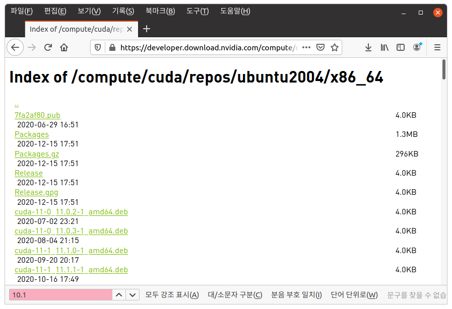

* Draft: 2021-01-18 (Mon)

# 부록: 왜 최신 버전의 우분투와 CUDA를 쓰지 않는가?

## 개요

GPGPU를 사용을 위한 GPU카드 설정에서 

1. NVIDIA 그래픽 카드 드라이버 설치하기
2. cuDNN 둥 NVIDIA CUDA tools 설치하기

등의 절차를 거쳐야 합니다. 이 과정에서 GPU환경을 구축할 때 텐서플로가 지원하는 버전인 10.1를 수동 설치해야 합니다. (CUDA 10.2를 쓰려면 텐서플로를 소스에서 컴파일해야한다고 합니다.) CUDA 10.1은 항상 오래된 것이기 때문에 최신 CUDA버전을 깔면 작은 문제가 발생하기 마련입니다. 

예를 들어 `import tensorflow as tf`를 실행 시 `Could not load dynamic library 'libcudart.so.11.0'`에러가 발생합니다. 이런 에러를 하나씩 제거하고 동작하게 할 수는 있지만, 예기치 못한 타이밍에 문제가 발생하는 것을 원치 않습니다.

## 텐서플로 2.x가 우분투 20.04를 지원하지 않습니다.

### 1804 -> 2004
텐서플로 설치페이지에 있는 18.04용 명령어를 수동으로 20.04를 위해 설정을 해봤습니다.

```bash
$ wget https://developer.download.nvidia.com/compute/cuda/repos/ubuntu2004/x86_64/cuda-repo-ubuntu2004_10.1.243-1_amd64.deb
  ...
HTTP request sent, awaiting response... 404 Not Found
2021-01-19 09:52:32 ERROR 404: Not Found.

$
```
에러가 발생합니다. 

링크를 확인하기 위해서 NVIDIA의 링크에서 CUDA 10.01 관련된 파일이 있는지 확인해봅니다.
https://developer.download.nvidia.com/compute/cuda/repos/ubuntu2004/x86_64/

웹브라우저의 찾기 기능을 써보니 없다는 것을 알 수 있었습니다.



```bash
#!/bin.bash
# install_cuda_with_apt
#   https://www.tensorflow.org/install/gpu?hl=ko
# 1804 -> 2004

# Add NVIDIA package repositories
wget https://developer.download.nvidia.com/compute/cuda/repos/ubuntu2004/x86_64/cuda-repo-ubuntu2004_10.1.243-1_amd64.deb
sudo apt-key adv --fetch-keys https://developer.download.nvidia.com/compute/cuda/repos/ubuntu2004/x86_64/7fa2af80.pub
sudo dpkg -i cuda-repo-ubuntu2004_10.1.243-1_amd64.deb
sudo apt-get update
wget http://developer.download.nvidia.com/compute/machine-learning/repos/ubuntu2004/x86_64/nvidia-machine-learning-repo-ubuntu2004_1.0.0-1_amd64.deb
sudo apt install -y ./nvidia-machine-learning-repo-ubuntu2004_1.0.0-1_amd64.deb
sudo apt-get update

# Install NVIDIA driver
sudo apt-get install --no-install-recommends nvidia-driver-450
# Reboot. Check that GPUs are visible using the command: nvidia-smi

# Install development and runtime libraries (~4GB)
sudo apt-get install --no-install-recommends \
    cuda-10-1 \
    libcudnn7=7.6.5.32-1+cuda10.1  \
    libcudnn7-dev=7.6.5.32-1+cuda10.1


# Install TensorRT. Requires that libcudnn7 is installed above.
sudo apt-get install -y --no-install-recommends libnvinfer6=6.0.1-1+cuda10.1 \
    libnvinfer-dev=6.0.1-1+cuda10.1 \
    libnvinfer-plugin6=6.0.1-1+cuda10.1
```


## 1. NVIDIA 그래픽 카드 드라이버 설치하기 전에

(1) 그래픽 카드에 대한 정보 알아내기

```
$ ubuntu-drivers devices
  ...
model    : GP104 [GeForce GTX 1080]
  ...																																						
$
```

(2) `설정 > 정보`에서 시스템에 설치된 그래픽 카드 확인하기. 


`그래픽`이 `NV134`로 되어있습니다. NVIDIA사의 그래픽 카드 드라이버로 설치해야 합니다.

### 주의 사항

GPU환경을 구축할 때 텐서플로가 지원하는 `CUDA 버전`은 항상 오래된 것이기 때문에 작은 문제가 발생하기 마련이므로 주의가 필요합니다.

* 텐서플로는 오래된 `CUDA 버전`인 `10.1`을 지원합니다.
* 이 문서가 작성된 시점에서 `CUDA 버전`은 `11.2`입니다. 

우분투가 제공하는 자동설치 명령어가 일반적인 경우에는 편리합니다. 설치 후 `nvidia-smi`명령어로 확인해보면

```bash
$ nvidia-smi
```

출력 메세지는 아래와 같습니다. 아래에 설치된 드라이버 버전은 `460.32.03`, CUDA 버전은 `11.2`입니다.

```bash
Sun Jan 10 23:53:02 2021       
+-----------------------------------------------------------------------------+
| NVIDIA-SMI 460.32.03    Driver Version: 460.32.03    CUDA Version: 11.2     |
|-------------------------------+----------------------+----------------------+
| GPU  Name        Persistence-M| Bus-Id        Disp.A | Volatile Uncorr. ECC |
| Fan  Temp  Perf  Pwr:Usage/Cap|         Memory-Usage | GPU-Util  Compute M. |
|                               |                      |               MIG M. |
|===============================+======================+======================|
|   0  GeForce GTX 1080    Off  | 00000000:01:00.0  On |                  N/A |
|  0%   38C    P8    13W / 200W |    384MiB /  8118MiB |      2%      Default |
|                               |                      |                  N/A |
+-------------------------------+----------------------+----------------------+
                                                                               
+-----------------------------------------------------------------------------+
| Processes:                                                                  |
|  GPU   GI   CI        PID   Type   Process name                  GPU Memory |
|        ID   ID                                                   Usage      |
|=============================================================================|
|    0   N/A  N/A      1009      G   /usr/lib/xorg/Xorg                182MiB |
|    0   N/A  N/A      1266      G   /usr/bin/gnome-shell              120MiB |
|    0   N/A  N/A      4302      G   ...AAAAAAAAA= --shared-files       77MiB |
+-----------------------------------------------------------------------------+
$
```

하지만 GPU환경을 구축할 때 텐서플로가 지원하는 버전인 10.1를 수동 설치해야 합니다. 이 `CUDA 버전`은 항상 오래된 것이기 때문에 작은 문제가 발생하기 마련입니다. 예를 들어 `import tensorflow as tf`를 실행 시 `Could not load dynamic library 'libcudart.so.11.0'`에러가 발생합니다. 

```bash
$ python3 -c 'import tensorflow as tf'
2021-01-11 17:28:01.246385: W tensorflow/stream_executor/platform/default/dso_loader.cc:60] Could not load dynamic library 'libcudart.so.11.0'; dlerror: libcudart.so.11.0: cannot open shared object file: No such file or directory
2021-01-11 17:28:01.246512: I tensorflow/stream_executor/cuda/cudart_stub.cc:29] Ignore above cudart dlerror if you do not have a GPU set up on your machine.
$
```

이런 에러를 하나씩 제거하고 동작하게 할 수는 있지만, 예기치 못한 타이밍에 문제가 발생하는 것을 원치 않습니다.

> Google search: Could not load dynamic library 'libcudart.so.11.0'; dlerror: libcudart.so.11.0: cannot open shared object file: No such file or directory

* #### [Could not load dynamic library 'libcudart.so.10.1'; dlerror: libcudart.so.10.1: cannot open shared object file: No such file or directory #38578](https://github.com/tensorflow/tensorflow/issues/38578)

> **[gadagashwini](https://github.com/gadagashwini)** commented [on 17 Apr 2020](https://github.com/tensorflow/tensorflow/issues/38578#issuecomment-615184395)
>
> [@domindominik](https://github.com/domindominik), To use CUDA 10.2 with Tensorflow 2.2. Please build the Tensorflow from source. Follow the instructions mentioned [here](https://www.tensorflow.org/install/source). And also take a look at this [comment.](https://github.com/tensorflow/tensorflow/issues/38194#issuecomment-609922803)Thanks

CUDA 10.2으로 업그레이드 하려고 해도 소스를 컴파일해야 하므로 상당히 번거롭습니다. CUDA 10.1을 쓰는게 낫겠습니다.

> **[ozett](https://github.com/ozett)** commented [on 4 Jul 2020](https://github.com/tensorflow/tensorflow/issues/38578#issuecomment-653752758)
>
> [#38578 (comment)](https://github.com/tensorflow/tensorflow/issues/38578#issuecomment-636414914) > `sudo apt-get install cuda-cudart-10-1`install ing "cuda-cudart-10-1" seems not sufficient.. libcublas.so.10 still missing in my ub18. install. i will try intstall complete "cuda-10-1" to solve this issue..
