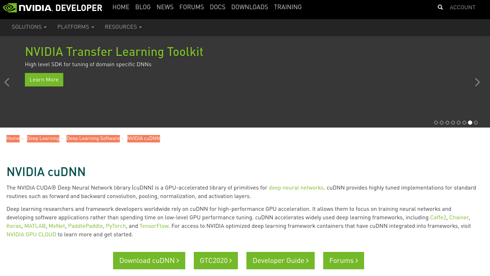
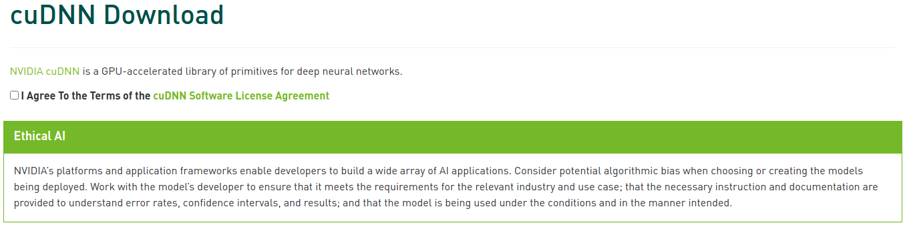
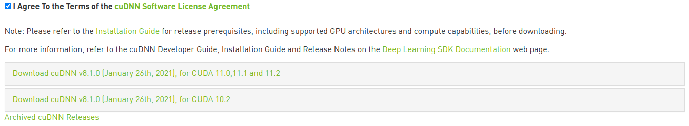
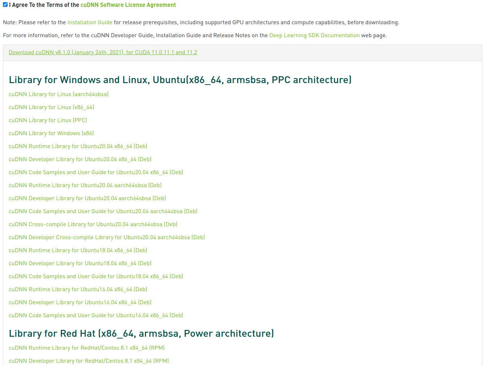
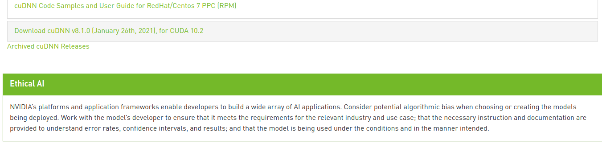
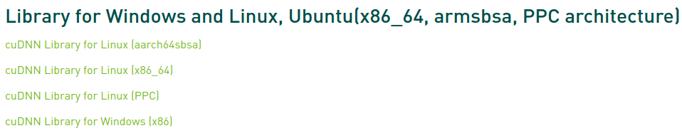
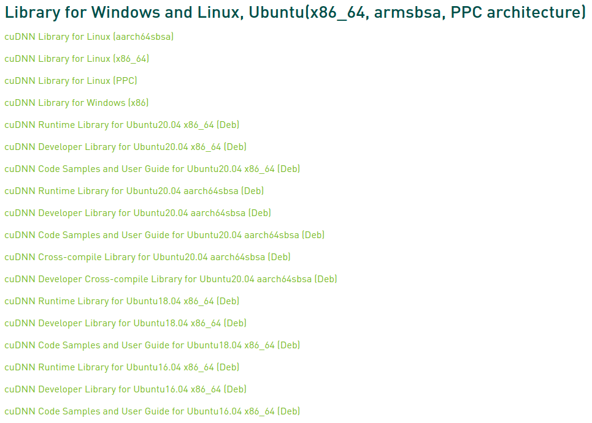
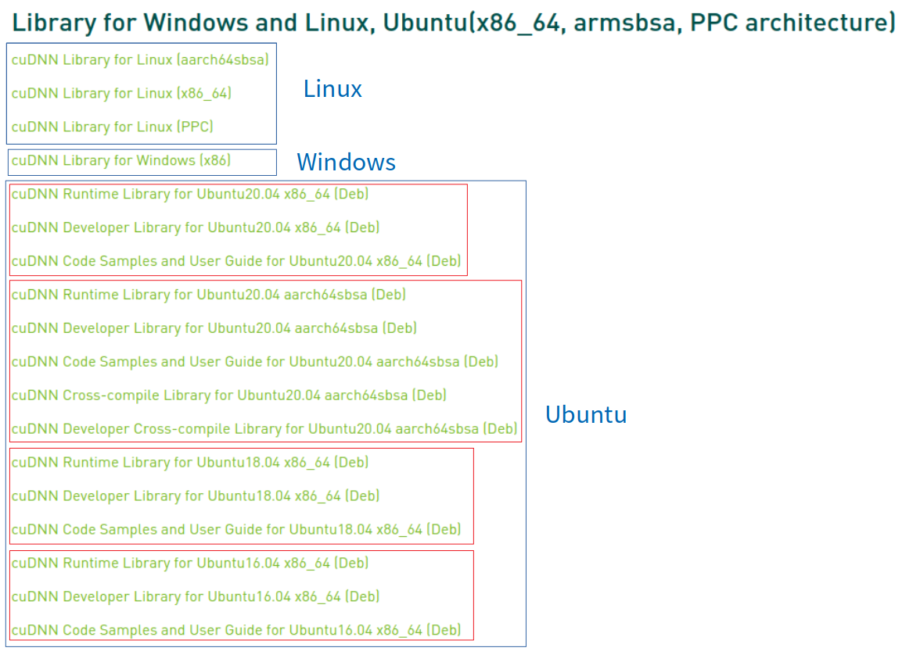
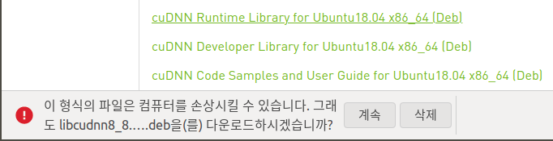
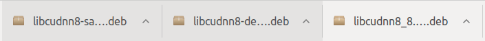

* Draft: 2021-02-10 (Wed)

# NVIDIA cuDNN 설치하기


Google search: nvidia cudnn download

* [Home](https://developer.nvidia.com/) > [Deep Learning](https://developer.nvidia.com/deep-learning) > [Deep Learning Software](https://developer.nvidia.com/deep-learning-software) > [NVIDIA cuDNN](https://developer.nvidia.com/CUDnn)

## cuDNN 설치 파일 다운로드

### cuDNN 다운로드 링크 찾아가기



`Download cuDNN`을 클릭합니다.


계정이 있다면 `Login` 아니라면 `Join now`에서 계정을 만든 후에 로그인 합니다.


로그인 입력을 누른 다음  캡챠로 태깅을 해야합니다.


 (이렇게 조금씩 자발적으로 라벨링을 하게 하다니 스마트 하죠. ^^)

### cuDNN 설치 파일 선택해서 다운로드 받기



`I Agree ...`를 클릭하면



 (현재로썬) 3개의 옵션이 있습니다. 

* CUDA 11.0, 11.1, 11.2
* CUDA 10.2
* 이전 버전

> 컴퓨터에 설치된 CUDA 버전을 확인하기 위해 터미널에서 명령어를 실행합니다.
>
> ```bash
> $ nvidia-smi
> ```
>
> 위쪽에 `CUDA Version`이 나옵니다.
>
> ```bash
> Wed Feb 10 09:45:30 2021       
> +-----------------------------------------------------------------------------+
> | NVIDIA-SMI 450.102.04   Driver Version: 450.102.04   CUDA Version: 11.0     |
> |-------------------------------+----------------------+----------------------+
>   ...
> $
> ```
>
> 이 문서를 만들기 위해 사용 중인 컴퓨터에는 CUDA 11.0이 설치되어 있다는 걸 알 수 있습니다.
>
> 전체 메세지는 다음과 같습니다.
>
> ```bash
> $ nvidia-smi
> Wed Feb 10 09:45:30 2021       
> +-----------------------------------------------------------------------------+
> | NVIDIA-SMI 450.102.04   Driver Version: 450.102.04   CUDA Version: 11.0     |
> |-------------------------------+----------------------+----------------------+
> | GPU  Name        Persistence-M| Bus-Id        Disp.A | Volatile Uncorr. ECC |
> | Fan  Temp  Perf  Pwr:Usage/Cap|         Memory-Usage | GPU-Util  Compute M. |
> |                               |                      |               MIG M. |
> |===============================+======================+======================|
> |   0  GeForce GTX 1080    On   | 00000000:01:00.0  On |                  N/A |
> |  0%   42C    P8    11W / 200W |    677MiB /  8118MiB |      1%      Default |
> |                               |                      |                  N/A |
> +-------------------------------+----------------------+----------------------+
>                                                                                
> +-----------------------------------------------------------------------------+
> | Processes:                                                                  |
> |  GPU   GI   CI        PID   Type   Process name                  GPU Memory |
> |        ID   ID                                                   Usage      |
> |=============================================================================|
> |    0   N/A  N/A      1176      G   /usr/lib/xorg/Xorg                369MiB |
> |    0   N/A  N/A      1362      G   /usr/bin/gnome-shell              175MiB |
> |    0   N/A  N/A      6105      G   ...AAAAAAAAA= --shared-files       66MiB |
> |    0   N/A  N/A      6962      G   ...gAAAAAAAAA --shared-files       61MiB |
> +-----------------------------------------------------------------------------+
> $
> ```
>
> 만약 `nvidia-smi` 명령어가 없다면 NVIDIA 그래픽 드라이버와 CUDA를 설치하고 다시 이 단계로 돌아옵니다.

CUDA 11.0을 위한 `cuDNN v8.1.0`을 다운로드 하기 위해 제일 위의 링크를 클릭합니다. 다운로드 가능한 설치 파일이 펼쳐집니다. 이 중에 필요한 것을 선택하면 됩니다.



페이지를 스크롤 다운하면 다음과 같습니다.



위 목록에 대한 간략한 설명입니다. OS에 따라 크게 2가지로 나뉩니다.

* 윈도우즈, 리눅스, 우분투를 위한 라이브러리
* 레드햇 (리눅스)를 위한 라이브러리

제가 쓰는 컴퓨터에는 우분투 리눅스가 설치되어 있으므로 위쪽 목록을 봅니다. 다음처럼 시작합니다.



전체 목록은 다음과 같습니다.



이 목록은 크게 3개로 나뉘어져있으며 우분투는 버전과 용도에 따라 추가로 세분화 됩니다.



목록에서 목적으로 하는 컴퓨터의 OS와 버전에 따라 필요한 파일을 모두 다운로드 하면 됩니다. 제 경우는 우분투 18.04이므로 아래 파일들을 클릭한 후 `계속`을 선택해서 



전체 3개의 파일을 다운로드 받습니다.



받는 시간은 네트워크 시간에 따라 달라집니다. 회사 사무실에 있는 무선 라우터는 2시간 반 정도 시간이 걸렸는데, 집의 유선망은 1분이 채 걸리지 않는 것 같군요.


https://docs.nvidia.com/deeplearning/cudnn/install-guide/index.html

