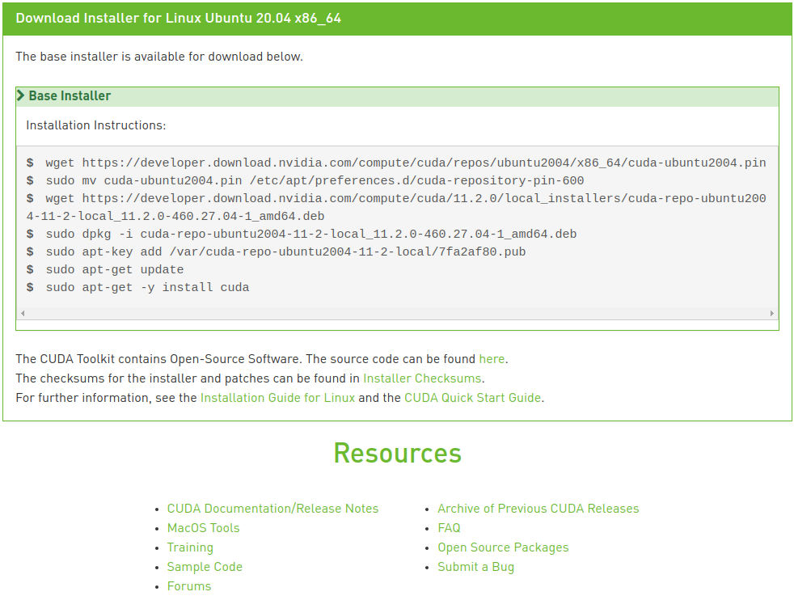

* Rev.2: 2021-01-08 (Thu)
* Rev.1: 2020-06-25 (Thu)
* Draft: 2019-07-23 (Tue)

# Install NVIDIA CUDA Toolkit for Ubuntu 20.04

## Summary

You may download and run a Bash script [install_nvidia_cuda_libraries-ubuntu20_04](https://github.com/aimldl/coding/blob/main/bash_scripting/bash_scripts/install_nvidia_cuda_libraries-ubuntu20_04) or manually enter the following commands.

Step 1. Pre-installation actions

```bash
$ lspci | grep -i nvidia
$ uname -m && cat /etc/*release
$ gcc --version
```

Step 2. Update/upgrade the system and install dependencies

```bash
$ sudo apt-get update && sudo apt-get upgrade -y
$ sudo apt install -y build-essential
$ sudo apt-get install -y python-dev python3-dev python-pip python3-pip
#$ sudo apt-get install linux-headers-$(uname -r)
```

Step 3. Clean the existing NVIDIA driver.

```bash
# TODO: include -y to remove automatically
$ sudo apt-get purge nvidia*
$ sudo apt-get autoremove
$ sudo apt-get autoclean
$ sudo rm -rf /usr/local/cuda*
```

Step 4. Install the latest NVIDIA CUDA

* cuda 11.2 is the latest version (as of 2021-01-08). 
* You may change the version name in the following command.
* These commands are from ***Installation instructions: deb (network)*** below. 

```bash
$ wget https://developer.download.nvidia.com/compute/cuda/repos/ubuntu2004/x86_64/cuda-ubuntu2004.pin
$ sudo mv cuda-ubuntu2004.pin /etc/apt/preferences.d/cuda-repository-pin-600
$ wget https://developer.download.nvidia.com/compute/cuda/11.2.0/local_installers/cuda-repo-ubuntu2004-11-2-local_11.2.0-460.27.04-1_amd64.deb
$ sudo dpkg -i cuda-repo-ubuntu2004-11-2-local_11.2.0-460.27.04-1_amd64.deb
$ sudo apt-key add /var/cuda-repo-ubuntu2004-11-2-local/7fa2af80.pub
$ sudo apt-get update -y
$ sudo apt-get -y install cuda
```

Step 5. Reboot the system

```bash
$ reboot
```

For the full detail of this document, refer to [NVIDIA CUDA Installation Guide for Linux](https://docs.nvidia.com/cuda/cuda-installation-guide-linux/index.html#abstract). A more general guideline is available at [NVIDIA CUDA GETTING STARTED GUIDE FOR LINUX](http://developer.download.nvidia.com/compute/cuda/7_0/Prod/doc/CUDA_Getting_Started_Linux.pdf). [Verify CUDA Installation](https://xcat-docs.readthedocs.io/en/stable/advanced/gpu/nvidia/verify_cuda_install.html)

Step 6. Post-installation actions

TODO: check the command & update the output at the bottom.

```bash
# Double-check the directory name
$ ls /usr/local/ | grep "cuda-"
$ ls /usr/local/

# Add the PATH variable at the end of `.bashrc`
$ echo 'export PATH=/usr/local/cuda-11.0/bin${PATH:+:${PATH}}' >> ~/.bashrc
$ echo 'export LD_LIBRARY_PATH=/usr/local/cuda-11.0/lib64${LD_LIBRARY_PATH:+:${LD_LIBRARY_PATH}}' >> ~/.bashrc

# Reload the bash
$ source ~/.bashrc

# Check 
$ sudo ldconfig
$ nvidia-smi
$ echo $PATH
/usr/local/cuda-11.0/bin:/usr/local/sbin:/usr/local/bin:/usr/sbin:/usr/bin:/sbin:/bin:/usr/games:/usr/local/games:/snap/bin
$
```

The above commands are explained more in detail below.

## Pre-installation actions

```bash
$ lspci | grep -i nvidia
01:00.0 VGA compatible controller: NVIDIA Corporation GP104 [GeForce GTX 1080] (rev a1)
01:00.1 Audio device: NVIDIA Corporation GP104 High Definition Audio Controller (rev a1)
02:00.0 VGA compatible controller: NVIDIA Corporation GP104 [GeForce GTX 1080] (rev a1)
02:00.1 Audio device: NVIDIA Corporation GP104 High Definition Audio Controller (rev a1)
$ uname -m && cat /etc/*release
x86_64
DISTRIB_ID=Ubuntu
DISTRIB_RELEASE=20.04
DISTRIB_CODENAME=focal
DISTRIB_DESCRIPTION="Ubuntu 20.04.1 LTS"
NAME="Ubuntu"
VERSION="20.04.1 LTS (Focal Fossa)"
ID=ubuntu
ID_LIKE=debian
PRETTY_NAME="Ubuntu 20.04.1 LTS"
VERSION_ID="20.04"
HOME_URL="https://www.ubuntu.com/"
SUPPORT_URL="https://help.ubuntu.com/"
BUG_REPORT_URL="https://bugs.launchpad.net/ubuntu/"
PRIVACY_POLICY_URL="https://www.ubuntu.com/legal/terms-and-policies/privacy-policy"
VERSION_CODENAME=focal
UBUNTU_CODENAME=focal
$ gcc --version
gcc (Ubuntu 9.3.0-17ubuntu1~20.04) 9.3.0
Copyright (C) 2019 Free Software Foundation, Inc.
This is free software; see the source for copying conditions.  There is NO
warranty; not even for MERCHANTABILITY or FITNESS FOR A PARTICULAR PURPOSE.

$ uname -r
5.4.0-58-generic
$
```

The above output is for Dell Alienware Aurora R7 with two NVIDIA GPU cards (GeForce GTX 1080) with the recent Ubuntu 20.04.

## Download the NVIDIA CUDA Toolkit

### Select the target platform to install the toolkit

Go to http://developer.nvidia.com/cuda-downloads.


And select the options for the target platform. For Ubuntu 20.04, the selections are presented below. 


The `Installer Type` can be any of the three options while my preference is `deb(local)` in this example. When the selections are made, the installation instructions and some useful links are presented.



### Some useful links presented in this part

[CUDA Quick Start Guide](https://docs.nvidia.com/cuda/cuda-quick-start-guide/index.html): Minimal first-steps instructions to get CUDA running on a standard system.

[CUDA FAQ](https://developer.nvidia.com/cuda-faq)

[CUDA Samples](https://github.com/nvidia/cuda-samples) at https://github.com/nvidia/cuda-samples

[CUDA Toolkit Documentation v11.0.171](https://docs.nvidia.com/cuda/)

[Accelerated Computing - Training](https://developer.nvidia.com/accelerated-computing-training)

[NVIDIA Developer Forums](https://forums.developer.nvidia.com/)

--------

[Open-Source Software for the CUDA Toolkit](http://developer.download.nvidia.com/compute/cuda/opensource/11.0.1/): `cuda_gdb_src-all-all-11.0.172.tar.gz` is the only file in this link.sudo rm -rf /usr/local/cuda*

[Index of /compute/cuda/opensource](https://developer.download.nvidia.com/compute/cuda/opensource/): some more open source packages are available here.

[NVIDIA CUDA Toolkit Release Notes](https://docs.nvidia.com/cuda/cuda-toolkit-release-notes/index.html)

[CUDA Toolkit Archive](https://developer.nvidia.com/cuda-toolkit-archive)

### Download Installer for Linux Ubuntu 20.04 x86_64

Recall three options exits for `Installer Type` in `CUDA Toolkit 11.2 RC Download > Select Target Platform`. 

* runfile (local)
* deb (local): this is the option for this example.
* deb (network)

**Memo:** It took about 4 hours to download files for `deb (local)` while 1 and a half hours for `deb (network)`.  For me, `deb (local)` failed and I had to reinstall from the OS all over again. `deb (network)` worked fine and the summary is at the top of this document.

The CUDA Toolkit will be downloaded and installed which contains

* the CUDA driver
* tools needed to create, build and run a CUDA application
* libraries, header files, CUDA samples source code, and other resources.

#### Installation instructions: deb (local)

```bash
$ wget https://developer.download.nvidia.com/compute/cuda/repos/ubuntu2004/x86_64/cuda-ubuntu2004.pin
$ sudo mv cuda-ubuntu2004.pin /etc/apt/preferences.d/cuda-repository-pin-600
$ wget https://developer.download.nvidia.com/compute/cuda/11.2.0/local_installers/cuda-repo-ubuntu2004-11-2-local_11.2.0-460.27.04-1_amd64.deb
$ sudo dpkg -i cuda-repo-ubuntu2004-11-2-local_11.2.0-460.27.04-1_amd64.deb
$ sudo apt-key add /var/cuda-repo-ubuntu2004-11-2-local/7fa2af80.pub
$ sudo apt-get update -y
$ sudo apt-get -y install cuda
```

## Reboot the system

```bash
$ reboot
```

## Post-installation actions

### Mandatory Actions

### Summary

```bash
# TODO: make it a bash script
# Fetch the directory name for the CUDA version
export CUDA_VERSION=`ls /usr/local/ | grep "cuda-..\.."

# Add the `PATH` & `LD_LIBRARY_PATH` variable at the end of `.bashrc`
echo "export PATH=/usr/local/$CUDA_VERSION/bin${PATH:+:${PATH}}" >> ~/.bashrc
echo "export LD_LIBRARY_PATH=/usr/local/$CUDA_VERSION/lib64${LD_LIBRARY_PATH:+:${LD_LIBRARY_PATH}}" >> ~/.bashrc

# Reload the bash
source ~/.bashrc

# Verify the CUDA toolkits are installed
nvidia-smi
```

Notice the first three commands look slightly different from ones in step 1 and step 2. The ones above automatically extract the CUDA version. This change allows to automatically update `.bashrc`.

### Detailed Explanation

Step 1. Fetch the directory name for the CUDA version

```bash
$ ls /usr/local/ | grep "cuda-..\.."
cuda-11.2
# Or to see it in full
$ ls /usr/local/
bin  cuda  cuda-11  cuda-11.2  etc  games  include  lib  man  sbin  share  src
$
```

Step 2. Add the `PATH` & `LD_LIBRARY_PATH` variable at the end of `.bashrc`

Automatically

```bash
$ echo 'export PATH=/usr/local/cuda-11.2/bin${PATH:+:${PATH}}' >> ~/.bashrc
$ echo 'export LD_LIBRARY_PATH=/usr/local/cuda-11.2/lib64${LD_LIBRARY_PATH:+:${LD_LIBRARY_PATH}}' >> ~/.bashrc
```

Manually in `.bashrc` with a text editor.

```bash
export PATH=/usr/local/cuda-11.2/bin${PATH:+:${PATH}}
export LD_LIBRARY_PATH=/usr/local/cuda-11.2/lib64${LD_LIBRARY_PATH:+:${LD_LIBRARY_PATH}}
```

Step 3. Reload the bash

```bash
$ source ~/.bashrc
```

Step 4. Verify the CUDA toolkits are installed. 

`nvidia-smi` is one of the important CUDA toolkits. 

```bash
$ nvidia-smi
Fri Jan  8 18:09:09 2021       
+-----------------------------------------------------------------------------+
| NVIDIA-SMI 460.27.04    Driver Version: 460.27.04    CUDA Version: 11.2     |
|-------------------------------+----------------------+----------------------+
| GPU  Name        Persistence-M| Bus-Id        Disp.A | Volatile Uncorr. ECC |
| Fan  Temp  Perf  Pwr:Usage/Cap|         Memory-Usage | GPU-Util  Compute M. |
|                               |                      |               MIG M. |
|===============================+======================+======================|
|   0  GeForce GTX 1080    On   | 00000000:01:00.0  On |                  N/A |
| 28%   41C    P8    10W / 180W |    132MiB /  8118MiB |      2%      Default |
|                               |                      |                  N/A |
+-------------------------------+----------------------+----------------------+
|   1  GeForce GTX 1080    On   | 00000000:02:00.0 Off |                  N/A |
| 27%   32C    P8     5W / 180W |      6MiB /  8119MiB |      0%      Default |
|                               |                      |                  N/A |
+-------------------------------+----------------------+----------------------+
                                                                               
+-----------------------------------------------------------------------------+
| Processes:                                                                  |
|  GPU   GI   CI        PID   Type   Process name                  GPU Memory |
|        ID   ID                                                   Usage      |
|=============================================================================|
|    0   N/A  N/A      1073      G   /usr/lib/xorg/Xorg                 45MiB |
|    0   N/A  N/A      1302      G   /usr/bin/gnome-shell               83MiB |
|    1   N/A  N/A      1073      G   /usr/lib/xorg/Xorg                  4MiB |
+-----------------------------------------------------------------------------+
$
```

You may check other commands, too.

```bash
$ sudo ldconfig
[sudo] userid의 암호: 
$ echo $PATH
/usr/local/cuda-11.2/bin:/home/k3sserver/.local/bin:/usr/local/sbin:/usr/local/bin:/usr/sbin:/usr/bin:/sbin:/bin:/usr/games:/usr/local/games:/snap/bin
$
```

## Next

* [Install cuDNN](nvidia_cudnn.md)

## References

* [NVIDIA CUDA Installation Guide for Linux](https://docs.nvidia.com/cuda/cuda-installation-guide-linux/index.html#abstract)

