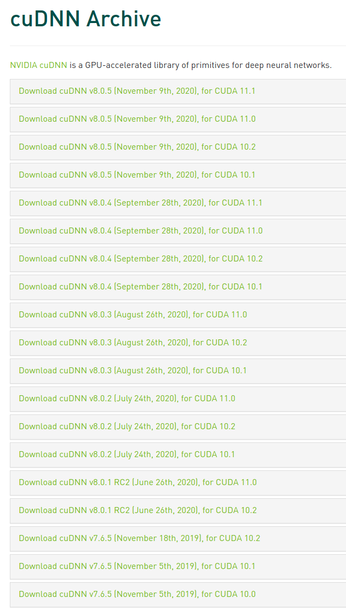
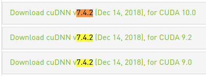
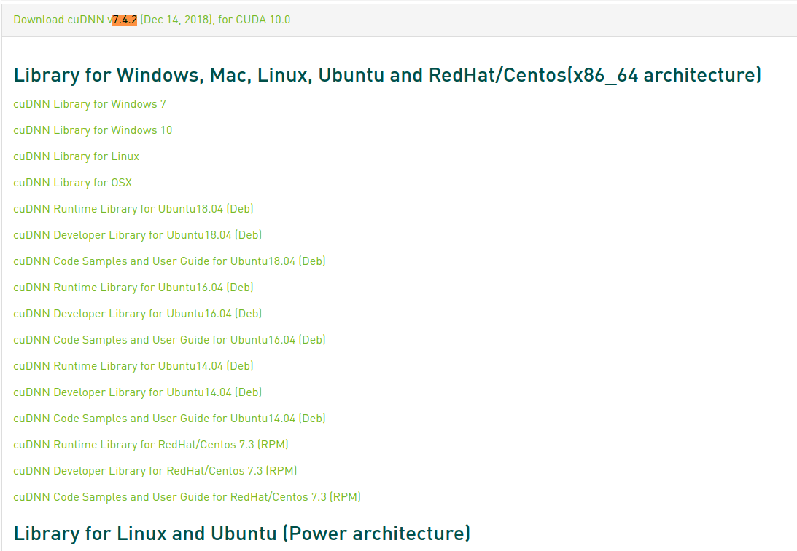
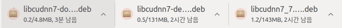

* Draft: 2021-02-14 (Sun)

# GPU 환경 설정하기

* 테스트 환경
  * (base) aimldl@aimldl-home-desktop

## 참고

[Downgrade CUDA for Tensorflow-GPU](https://medium.com/@praveenkrishna/downgrade-cuda-for-tensorflow-gpu-17831db59099), Medium, Praveen Krishna Murthy, Apr 20, 2020

> This short guide helps to understand how to downgrade the `CUDA` version in Ubuntu 18.04 OS. No background knowledge is required for this. The following operations are carried on `distribution : 18.04` and `architecture : x86_64.`
>
> In order to use the `tensorflow-gpu` for training, the `CUDA` version should be compatible with following setups:
>
> - `Python Version`
> - `Compiler (GCC)`
> - `Build Tools (Bazel)`
> - `cuDNN` `(CUDA Deep Neural Network library)`

## 과정 기록

기존에 있는/이전 버전의 `CUDA`를 제거합니다.

```bash
$ sudo apt --purge remove -y "cublas*" "cuda*"
$ sudo apt --purge remove -y "nvidia*"
$ sudo rm -rf /usr/local/cuda*
$ sudo apt-get autoremove -y && sudo apt-get autoclean -y
$ reboot
```

`CUDA10.0`을 다운로드 받고 설치합니다.

```bash
$ sudo apt-get install -y g++ freeglut3-dev build-essential libx11-dev libxmu-dev libxi-dev libglu1-mesa libglu1-mesa-dev
$ wget https://developer.download.nvidia.com/compute/cuda/repos/ubuntu1804/x86_64/cuda-repo-ubuntu1804_10.0.130-1_amd64.deb
$ sudo apt-key adv-fetch-keys https://developer.download.nvidia.com/compute/cuda/repos/ubuntu1804/x86_64/7fa2af80.pub
$ sudo dpkg -i cuda-repo-ubuntu1804_10.0.130-1_amd64.deb
```

다음 명령어를 실행하는데 꽤 많은 시간이 소요됩니다.

```bash
$ sudo apt install -y cuda-10.0
```

환경 변수 설정하기

> ```bash
> echo 'export PATH=/usr/local/cuda-10.0/bin:$PATH' >> ~/.bashrc
> echo 'export LD_LIBRARY_PATH=/usr/local/cuda-10.0/lib64:$LD_LIBRARY_PATH' >> ~/.bashrc
> reboot
> ```

응용

* 제 경우는 `.bashrc`는 기본대로 두고 `.bash_custom`을 불러와서 수정합니다. 그러므로 `.bash_custom`을 수정합니다만 위와 같은 작업입니다.
* `/usr/local/cuda-10.0`가 아닌 `/usr/local/cuda`으로 궁극적으로는 바꿔야하겠지만, 현 단계에서는 다른 버전을 가르키면 안 되기 때문에 명시적으로 버전을 그대로 쓰기로 합니다.
* `source`명령어로 `.bashrc`를 업데이트하는 것 만으로 `PATH`와 `LD_LIBRARY_PATH`를 업데이트할 수 있습니다.

```bash
$ echo 'export PATH=/usr/local/cuda-10.0/bin:$PATH' >> ~/.bash_custom
$ echo 'export LD_LIBRARY_PATH=/usr/local/cuda-10.0/lib64:$LD_LIBRARY_PATH' >> ~/.bash_custom
$ reboot
```

내용을 확인합니다.

```bash
$ tail -n 5 ~/.bash_custom

# TensorFlow 2.0
#export LD_LIBRARY_PATH=$LD_LIBRARY_PATH:/usr/local/cuda/lib64
export PATH=/usr/local/cuda-10.0/bin:$PATH
export LD_LIBRARY_PATH=/usr/local/cuda-10.0/lib64:$LD_LIBRARY_PATH
$
```


```bash
$ echo $PATH
/home/aimldl/anaconda3/bin:/home/aimldl/anaconda3/condabin:/home/aimldl/.local/bin:/home/aimldl/bin:/usr/local/sbin:/usr/local/bin:/usr/sbin:/usr/bin:/sbin:/bin:/usr/games:/usr/local/games:/snap/bin:~/.ruby/bin
$ echo $LD_LIBRARY_PATH
:/usr/local/cuda/lib64
$
```


```bash
$ source ~/.bashrc
2021-02-10 (수) 12:50 (06th week)
  ...
$
```


```bash
$ echo $LD_LIBRARY_PATH
/usr/local/cuda-10.0/lib64::/usr/local/cuda/lib64
$ echo $PATH
/usr/local/cuda-10.0/bin:/home/aimldl/anaconda3/bin:/home/aimldl/anaconda3/condabin:/home/aimldl/.local/bin:/home/aimldl/bin:/usr/local/sbin:/usr/local/bin:/usr/sbin:/usr/bin:/sbin:/bin:/usr/games:/usr/local/games:/snap/bin:~/.ruby/bin:~/.ruby/bin
$ 
```


> The steps that are to be taken to remove and install the required version of CUDA is finished. Now we will head towards installing the CuDNN version. These are again libraries to support Deep Neural Network architecture computations on GPU.

### cuDNN 다운로드 및 설치

#### 다운로드

https://developer.nvidia.com/rdp/cudnn-archive

너무 많은 것이 있습니다. 



웹브라우저의 찾기 기능으로 `7.4.2`을 찾습니다.



`CUDA 10.0`을 선택합니다. `Download cuDNN v7.4.2 (Dec 14, 2018), for CUDA 10.0`




이 중 `Ubuntu18.04`를 위한 파일 3개를 클릭해서 다운로드 받습니다.

[cuDNN Runtime Library for Ubuntu18.04 (Deb)](https://developer.nvidia.com/compute/machine-learning/cudnn/secure/v7.4.2/prod/10.0_20181213/Ubuntu18_04-x64/libcudnn7_7.4.2.24-1%2Bcuda10.0_amd64.deb)

[cuDNN Developer Library for Ubuntu18.04 (Deb)](https://developer.nvidia.com/compute/machine-learning/cudnn/secure/v7.4.2/prod/10.0_20181213/Ubuntu18_04-x64/libcudnn7-dev_7.4.2.24-1%2Bcuda10.0_amd64.deb)

[cuDNN Code Samples and User Guide for Ubuntu18.04 (Deb)](https://developer.nvidia.com/compute/machine-learning/cudnn/secure/v7.4.2/prod/10.0_20181213/Ubuntu18_04-x64/libcudnn7-doc_7.4.2.24-1%2Bcuda10.0_amd64.deb)



그런데 파일명이 다르네요. 

[cuDNN Library for Linux](https://developer.nvidia.com/compute/machine-learning/cudnn/secure/v7.4.2/prod/10.0_20181213/cudnn-10.0-linux-x64-v7.4.2.24.tgz)

를 클릭하니 동일한 파일인 `cudnn-10.0-linux-x64-v7.4.2.24.tgz`를 다운로드 받습니다.


```bash
$ tar -xzvf cudnn-10.0-linux-x64-v7.4.2.24.tgz
$ sudo cp -P cuda/include/cudnn.h /usr/local/cuda-10.0/include
$ sudo cp -P cuda/lib64/libcudnn* /usr/local/cuda-10.0/lib64/
$ sudo chmod a+r /usr/local/cuda-10.0/lib64/libcudnn*
```

위의 명령어를 실행했을 때의 출력은 아래에 있습니다.

```bash
$ tar -xzvf cudnn-10.0-linux-x64-v7.4.2.24.tgz
cuda/include/cudnn.h
cuda/NVIDIA_SLA_cuDNN_Support.txt
cuda/lib64/libcudnn.so
cuda/lib64/libcudnn.so.7
cuda/lib64/libcudnn.so.7.4.2
cuda/lib64/libcudnn_static.a
$ sudo cp -P cuda/include/cudnn.h /usr/local/cuda-10.0/include
[sudo] aimldl의 암호: 
$ sudo cp -P cuda/lib64/libcudnn* /usr/local/cuda-10.0/lib64/
$ sudo chmod a+r /usr/local/cuda-10.0/lib64/libcudnn*
$
```


## CUDNN 설치 확인하기

CUDNN 설치를 확인하기 위한 명령어를 실행해봅니다.

```bash
$ nvcc -V
$ cat /usr/local/cuda/version.txt
$ cat /usr/local/cuda/include/cudnn.h | grep CUDNN_MAJOR -A 2
$ cat /usr/include/cudnn.h | grep CUDNN_MAJOR -A 2
```

위의 명령어가 실행되었을 때 출력의 예가 아래에 있습니다.

```bash
$ nvcc -V
nvcc: NVIDIA (R) Cuda compiler driver
Copyright (c) 2005-2018 NVIDIA Corporation
Built on Sat_Aug_25_21:08:01_CDT_2018
Cuda compilation tools, release 10.0, V10.0.130
$
```

```bash
$ cat /usr/local/cuda/version.txt
CUDA Version 10.0.130
$
```

```bash
$ cat /usr/local/cuda/include/cudnn.h | grep CUDNN_MAJOR -A 2
```

출력에 `File not found`에러가 발생하면 CUDNN 설치가 안 된 것입니다. 

* 한국어로는 `cat: /usr/local/cuda/include/cudn.h: 그런 파일이나 디렉터리가 없습니다`

라는 메세지가 발생합니다. 다행이 아래와 같은 메세지가 나오면 설치가 된 것입니다.

```bash
#define CUDNN_MAJOR 7
#define CUDNN_MINOR 4
#define CUDNN_PATCHLEVEL 2
--
#define CUDNN_VERSION (CUDNN_MAJOR * 1000 + CUDNN_MINOR * 100 + CUDNN_PATCHLEVEL)

#include "driver_types.h"
$
```

참고로 CUDNN의 버전은 7.4.2입니다.

```bash
$ cat /usr/include/cudnn.h | grep CUDNN_MAJOR -A 2
cat: /usr/include/cudnn.h: 그런 파일이나 디렉터리가 없습니다
$
```

> 튜토리얼의 이 단계에서 파일을 `/usr/include/cudnn.h`로 복사하지 않습니다. 그래서 확인 명령어에서
>
> ```bash
> $ cat /usr/include/cudnn.h | grep CUDNN_MAJOR -A 2
> cat: /usr/include/cudnn.h: 그런 파일이나 디렉터리가 없습니다
> $
> ```
>
> 라는 에러 메세지가 발생합니다. 그러므로 저는 아래 명령어를 써서 `cudnn.h`를 복사해줬습니다.
>
> ```bash
> $ sudo cp -P ~/다운로드/cuda/include/cudnn.h /usr/include
> ```
>
> 복사 전에는 `cudnn.h`가 없습니다.
>
> ```bash
> $ cd /usr/include/
> $ ls
> EGL          crypt.h           fstab.h             ifaddrs.h           libv4l2.h        neteconet           pnglibconf.h    sgtty.h        ttyent.h                   wchar.h
> GL           ctype.h           fts.h               inttypes.h          libv4l2rds.h     netinet             poll.h          shadow.h       uchar.h                    wctype.h
> GLES2        dbus-1.0          ftw.h               jasper              libv4lconvert.h  netipx              printf.h        signal.h       ucontext.h                 wordexp.h
> GLES3        dirent.h          gconv.h             jbig.h              limits.h         netiucv             proc_service.h  sound          ulimit.h                   x264.h
> KHR          dlfcn.h           gdk-pixbuf-2.0      jbig85.h            link.h           netpacket           protocols       spawn.h        unicode                    x264_config.h
> X11          drm               getopt.h            jbig_ar.h           linux            netrom              pthread.h       stab.h         unistd.h                   x86_64-linux-gnu
> _G_config.h  eigen3            gio-unix-2.0        jerror.h            locale.h         netrose             pty.h           stdc-predef.h  ustat.h                    xcb
> aio.h        elf.h             glib-2.0            jmorecfg.h          ltdl.h           nfs                 pwd.h           stdint.h       utime.h                    xen
> aliases.h    endian.h          glob.h              jpegint.h           lzma             nl_types.h          python2.7       stdio.h        utmp.h                     xf86drm.h
> alloca.h     envz.h            glvnd               jpeglib.h           lzma.h           nss.h               python3.6       stdio_ext.h    utmpx.h                    xf86drmMode.h
> ar.h         epoxy             gnu-versions.h      langinfo.h          malloc.h         numpy               python3.6m      stdlib.h       values.h                   xkbcommon
> argp.h       err.h             gnumake.h           lastlog.h           math.h           obstack.h           rdma            string.h       video                      xorg
> argz.h       errno.h           graphite2           layout              mcheck.h         orc-0.4             re_comp.h       strings.h      wait.h                     xvid.h
> arpa         error.h           grp.h               libdrm              memory.h         pango-1.0           regex.h         stropts.h      wayland-client-core.h      zconf.h
> asm-generic  execinfo.h        gshadow.h           libgen.h            misc             paths.h             regexp.h        sudo_plugin.h  wayland-client-protocol.h  zlib.h
> assert.h     expat.h           gstreamer-1.0       libintl.h           mntent.h         pcre.h              reglib          syscall.h      wayland-client.h
> at-spi-2.0   expat_external.h  gtk-2.0             libio.h             monetary.h       pcre_scanner.h      resolv.h        sysexits.h     wayland-cursor.h
> at-spi2-atk  fcntl.h           gtk-3.0             libltdl             mqueue.h         pcre_stringpiece.h  rpc             syslog.h       wayland-egl-core.h
> atk-1.0      features.h        gtk-unix-print-2.0  libpng              mtd              pcrecpp.h           rpcsvc          tar.h          wayland-egl.h
> byteswap.h   fenv.h            gtkgl-2.0           libpng16            net              pcrecpparg.h        sched.h         termio.h       wayland-server-core.h
> c++          fmtmsg.h          gtkglext-1.0        libsync.h           netash           pcreposix.h         scsi            termios.h      wayland-server-protocol.h
> cairo        fnmatch.h         harfbuzz            libv4l-plugin.h     netatalk         pixman-1            search.h        tgmath.h       wayland-server.h
> complex.h    fontconfig        iconv.h             libv4l1-videodev.h  netax25          png.h               semaphore.h     thread_db.h    wayland-util.h
> cpio.h       freetype2         icu-le-hb           libv4l1.h           netdb.h          pngconf.h           setjmp.h        time.h         wayland-version.h
> $
> ```
>
> 복사 후에는 있기 때문에 아래의 메세지가 출력됩니다.
>
> ```bash
> $ cat /usr/local/cuda/include/cudnn.h | grep CUDNN_MAJOR -A 2
> #define CUDNN_MAJOR 7
> #define CUDNN_MINOR 4
> #define CUDNN_PATCHLEVEL 2
> --
> #define CUDNN_VERSION (CUDNN_MAJOR * 1000 + CUDNN_MINOR * 100 + CUDNN_PATCHLEVEL)
> 
> #include "driver_types.h"
> $
> ```


> NOTE:
>
> After downgrading the CUDA, the system should never be upgraded or updated when the Linux-Ubuntu system prompts. If it is upgraded, then the system automatically removes `CUDA-10.0` and installs the highest available drivers for GPU.

## 텐서플로 2.x 실행해서 GPU환경 확인해보기

파이썬을 실행한 다음

```bash
(base) $ python
Python 3.8.3 (default, Jul  2 2020, 16:21:59) 
[GCC 7.3.0] :: Anaconda, Inc. on linux
Type "help", "copyright", "credits" or "license" for more information.
>>>
```

텐서플로를 import해봅니다.

```python
>>> import tensorflow as tf
>>> 
```

텐서플로가 설치되어 있네요. 버전을 확인하고

```python
>>> print(tf.__version__)
2.2.0
>>> 
```

[tf.test.is_gpu_available](https://www.tensorflow.org/api_docs/python/tf/test/is_gpu_available)

GPU가 사용가능한지? 가능하면 GPU카드 몇 개를 쓸 수 있는지 확인합니다.

```bash
>>> print("Num GPUs Available: ", len(tf.config.list_physical_devices('GPU')))
2021-02-14 22:25:29.851653: I tensorflow/stream_executor/platform/default/dso_loader.cc:44] Successfully opened dynamic library libcuda.so.1
2021-02-14 22:25:29.883584: I tensorflow/stream_executor/cuda/cuda_gpu_executor.cc:981] successful NUMA node read from SysFS had negative value (-1), but there must be at least one NUMA node, so returning NUMA node zero
2021-02-14 22:25:29.884059: I tensorflow/core/common_runtime/gpu/gpu_device.cc:1561] Found device 0 with properties: 
pciBusID: 0000:01:00.0 name: GeForce GTX 1080 computeCapability: 6.1
coreClock: 1.835GHz coreCount: 20 deviceMemorySize: 7.93GiB deviceMemoryBandwidth: 298.32GiB/s
2021-02-14 22:25:29.885432: I tensorflow/stream_executor/platform/default/dso_loader.cc:44] Successfully opened dynamic library libcudart.so.10.1
2021-02-14 22:25:29.913612: I tensorflow/stream_executor/platform/default/dso_loader.cc:44] Successfully opened dynamic library libcublas.so.10
2021-02-14 22:25:29.930141: I tensorflow/stream_executor/platform/default/dso_loader.cc:44] Successfully opened dynamic library libcufft.so.10
2021-02-14 22:25:29.933966: I tensorflow/stream_executor/platform/default/dso_loader.cc:44] Successfully opened dynamic library libcurand.so.10
2021-02-14 22:25:29.963413: I tensorflow/stream_executor/platform/default/dso_loader.cc:44] Successfully opened dynamic library libcusolver.so.10
2021-02-14 22:25:29.968233: I tensorflow/stream_executor/platform/default/dso_loader.cc:44] Successfully opened dynamic library libcusparse.so.10
2021-02-14 22:25:30.024481: I tensorflow/stream_executor/platform/default/dso_loader.cc:44] Successfully opened dynamic library libcudnn.so.7
2021-02-14 22:25:30.024829: I tensorflow/stream_executor/cuda/cuda_gpu_executor.cc:981] successful NUMA node read from SysFS had negative value (-1), but there must be at least one NUMA node, so returning NUMA node zero
2021-02-14 22:25:30.025987: I tensorflow/stream_executor/cuda/cuda_gpu_executor.cc:981] successful NUMA node read from SysFS had negative value (-1), but there must be at least one NUMA node, so returning NUMA node zero
2021-02-14 22:25:30.027329: I tensorflow/core/common_runtime/gpu/gpu_device.cc:1703] Adding visible gpu devices: 0
Num GPUs Available:  1
>>> 
```

마지막에 나오는 것처럼 `Num GPUs Available:  1` 이 컴퓨터에는 한 개의 GPU카드가 있습니다.  자세한 내용은

* [GPU 사용하기](https://www.tensorflow.org/guide/gpu)
* [Use a GPU](https://www.tensorflow.org/guide/gpu)

를 참고하세요.

### GPU로 간단한 예제 파일 실행해보기

텐서플로를 이용할 때의 `Hello, world` 프로그램에 해당하는 `MNIST 데이터셋`로 hand-written digit recognition문제의 훈련을 진행해 보겠습니다. 

[2_mnist_mlp_keras.py](../source_codes-keras/2_mnist_mlp_keras.py)를 실행해봅니다.

```bash
(base) $ python 2_mnist_mlp_keras.py 
Downloading data from https://storage.googleapis.com/tensorflow/tf-keras-datasets/mnist.npz
11493376/11490434 [==============================] - 0s 0us/step
  ...
Epoch 20/20
192/192 [==============================] - 0s 1ms/step - loss: 0.0711 - accuracy: 0.9800 - val_loss: 0.2554 - val_accuracy: 0.9592
313/313 [==============================] - 0s 871us/step - loss: 0.2457 - accuracy: 0.9609
Test results: Loss = 0.24565546214580536, Accuracy = 0.9609000086784363
(base) $
```

[2_mnist_simple_cnn_keras.py](../source_codes-keras/2_mnist_simple_cnn_keras.py)

GPU를 이용하지 않으면 훈련이 굉장히 늦습니다. 명령어를 실행시키면 우선 GPU에 관한 메세지가 출력됩니다.

```bash
$ python 2_mnist_simple_cnn_keras.py
2021-02-14 22:43:35.741200: I tensorflow/stream_executor/platform/default/dso_loader.cc:44] Successfully opened dynamic library libcuda.so.1
2021-02-14 22:43:35.769883: I tensorflow/stream_executor/cuda/cuda_gpu_executor.cc:981] successful NUMA node read from SysFS had negative value (-1), but there must be at least one NUMA node, so returning NUMA node zero
2021-02-14 22:43:35.770221: I tensorflow/core/common_runtime/gpu/gpu_device.cc:1561] Found device 0 with properties: 
pciBusID: 0000:01:00.0 name: GeForce GTX 1080 computeCapability: 6.1
coreClock: 1.835GHz coreCount: 20 deviceMemorySize: 7.93GiB deviceMemoryBandwidth: 298.32GiB/s
2021-02-14 22:43:35.770391: I tensorflow/stream_executor/platform/default/dso_loader.cc:44] Successfully opened dynamic library libcudart.so.10.1
2021-02-14 22:43:35.771584: I tensorflow/stream_executor/platform/default/dso_loader.cc:44] Successfully opened dynamic library libcublas.so.10
2021-02-14 22:43:35.772689: I tensorflow/stream_executor/platform/default/dso_loader.cc:44] Successfully opened dynamic library libcufft.so.10
2021-02-14 22:43:35.772863: I tensorflow/stream_executor/platform/default/dso_loader.cc:44] Successfully opened dynamic library libcurand.so.10
2021-02-14 22:43:35.774126: I tensorflow/stream_executor/platform/default/dso_loader.cc:44] Successfully opened dynamic library libcusolver.so.10
2021-02-14 22:43:35.774769: I tensorflow/stream_executor/platform/default/dso_loader.cc:44] Successfully opened dynamic library libcusparse.so.10
2021-02-14 22:43:35.777217: I tensorflow/stream_executor/platform/default/dso_loader.cc:44] Successfully opened dynamic library libcudnn.so.7
2021-02-14 22:43:35.777375: I tensorflow/stream_executor/cuda/cuda_gpu_executor.cc:981] successful NUMA node read from SysFS had negative value (-1), but there must be at least one NUMA node, so returning NUMA node zero
2021-02-14 22:43:35.777862: I tensorflow/stream_executor/cuda/cuda_gpu_executor.cc:981] successful NUMA node read from SysFS had negative value (-1), but there must be at least one NUMA node, so returning NUMA node zero
2021-02-14 22:43:35.778201: I tensorflow/core/common_runtime/gpu/gpu_device.cc:1703] Adding visible gpu devices: 0
2021-02-14 22:43:35.778491: I tensorflow/core/platform/cpu_feature_guard.cc:143] Your CPU supports instructions that this TensorFlow binary was not compiled to use: SSE4.1 SSE4.2 AVX AVX2 FMA
2021-02-14 22:43:35.782959: I tensorflow/core/platform/profile_utils/cpu_utils.cc:102] CPU Frequency: 3600000000 Hz
2021-02-14 22:43:35.783334: I tensorflow/compiler/xla/service/service.cc:168] XLA service 0x55613eb3f0d0 initialized for platform Host (this does not guarantee that XLA will be used). Devices:
2021-02-14 22:43:35.783375: I tensorflow/compiler/xla/service/service.cc:176]   StreamExecutor device (0): Host, Default Version
2021-02-14 22:43:35.783551: I tensorflow/stream_executor/cuda/cuda_gpu_executor.cc:981] successful NUMA node read from SysFS had negative value (-1), but there must be at least one NUMA node, so returning NUMA node zero
2021-02-14 22:43:35.783879: I tensorflow/core/common_runtime/gpu/gpu_device.cc:1561] Found device 0 with properties: 
pciBusID: 0000:01:00.0 name: GeForce GTX 1080 computeCapability: 6.1
coreClock: 1.835GHz coreCount: 20 deviceMemorySize: 7.93GiB deviceMemoryBandwidth: 298.32GiB/s
2021-02-14 22:43:35.783920: I tensorflow/stream_executor/platform/default/dso_loader.cc:44] Successfully opened dynamic library libcudart.so.10.1
2021-02-14 22:43:35.783932: I tensorflow/stream_executor/platform/default/dso_loader.cc:44] Successfully opened dynamic library libcublas.so.10
2021-02-14 22:43:35.783942: I tensorflow/stream_executor/platform/default/dso_loader.cc:44] Successfully opened dynamic library libcufft.so.10
2021-02-14 22:43:35.783952: I tensorflow/stream_executor/platform/default/dso_loader.cc:44] Successfully opened dynamic library libcurand.so.10
2021-02-14 22:43:35.783963: I tensorflow/stream_executor/platform/default/dso_loader.cc:44] Successfully opened dynamic library libcusolver.so.10
2021-02-14 22:43:35.783972: I tensorflow/stream_executor/platform/default/dso_loader.cc:44] Successfully opened dynamic library libcusparse.so.10
2021-02-14 22:43:35.783983: I tensorflow/stream_executor/platform/default/dso_loader.cc:44] Successfully opened dynamic library libcudnn.so.7
2021-02-14 22:43:35.784037: I tensorflow/stream_executor/cuda/cuda_gpu_executor.cc:981] successful NUMA node read from SysFS had negative value (-1), but there must be at least one NUMA node, so returning NUMA node zero
2021-02-14 22:43:35.784337: I tensorflow/stream_executor/cuda/cuda_gpu_executor.cc:981] successful NUMA node read from SysFS had negative value (-1), but there must be at least one NUMA node, so returning NUMA node zero
2021-02-14 22:43:35.784593: I tensorflow/core/common_runtime/gpu/gpu_device.cc:1703] Adding visible gpu devices: 0
2021-02-14 22:43:35.784615: I tensorflow/stream_executor/platform/default/dso_loader.cc:44] Successfully opened dynamic library libcudart.so.10.1
2021-02-14 22:43:35.850798: I tensorflow/core/common_runtime/gpu/gpu_device.cc:1102] Device interconnect StreamExecutor with strength 1 edge matrix:
2021-02-14 22:43:35.850820: I tensorflow/core/common_runtime/gpu/gpu_device.cc:1108]      0 
2021-02-14 22:43:35.850843: I tensorflow/core/common_runtime/gpu/gpu_device.cc:1121] 0:   N 
2021-02-14 22:43:35.851063: I tensorflow/stream_executor/cuda/cuda_gpu_executor.cc:981] successful NUMA node read from SysFS had negative value (-1), but there must be at least one NUMA node, so returning NUMA node zero
2021-02-14 22:43:35.851559: I tensorflow/stream_executor/cuda/cuda_gpu_executor.cc:981] successful NUMA node read from SysFS had negative value (-1), but there must be at least one NUMA node, so returning NUMA node zero
2021-02-14 22:43:35.851877: I tensorflow/stream_executor/cuda/cuda_gpu_executor.cc:981] successful NUMA node read from SysFS had negative value (-1), but there must be at least one NUMA node, so returning NUMA node zero
2021-02-14 22:43:35.852131: I tensorflow/core/common_runtime/gpu/gpu_device.cc:1247] Created TensorFlow device (/job:localhost/replica:0/task:0/device:GPU:0 with 6776 MB memory) -> physical GPU (device: 0, name: GeForce GTX 1080, pci bus id: 0000:01:00.0, compute capability: 6.1)
2021-02-14 22:43:35.853309: I tensorflow/compiler/xla/service/service.cc:168] XLA service 0x556142920060 initialized for platform CUDA (this does not guarantee that XLA will be used). Devices:
2021-02-14 22:43:35.853321: I tensorflow/compiler/xla/service/service.cc:176]   StreamExecutor device (0): GeForce GTX 1080, Compute Capability 6.1
```

그리고 파이썬 코드에서 실행하는 출력이 보여집니다.

```bash
Model: "sequential"
_________________________________________________________________
Layer (type)                 Output Shape              Param #   
=================================================================
conv2d (Conv2D)              (None, 26, 26, 32)        320       
_________________________________________________________________
max_pooling2d (MaxPooling2D) (None, 13, 13, 32)        0         
_________________________________________________________________
conv2d_1 (Conv2D)            (None, 11, 11, 64)        18496     
_________________________________________________________________
max_pooling2d_1 (MaxPooling2 (None, 5, 5, 64)          0         
_________________________________________________________________
flatten (Flatten)            (None, 1600)              0         
_________________________________________________________________
dropout (Dropout)            (None, 1600)              0         
_________________________________________________________________
dense (Dense)                (None, 10)                16010     
=================================================================
Total params: 34,826
Trainable params: 34,826
Non-trainable params: 0
_________________________________________________________________
Epoch 1/20
2021-02-14 22:43:36.817188: I tensorflow/stream_executor/platform/default/dso_loader.cc:44] Successfully opened dynamic library libcublas.so.10
2021-02-14 22:43:36.937371: I tensorflow/stream_executor/platform/default/dso_loader.cc:44] Successfully opened dynamic library libcudnn.so.7
1500/1500 [==============================] - 3s 2ms/step - loss: 0.2422 - accuracy: 0.9265 - val_loss: 0.0687 - val_accuracy: 0.9801
  ...
Epoch 20/20
1500/1500 [==============================] - 2s 2ms/step - loss: 0.0227 - accuracy: 0.9926 - val_loss: 0.0302 - val_accuracy: 0.9923
313/313 [==============================] - 0s 1ms/step - loss: 0.0223 - accuracy: 0.9934
$
```

`3_mnist_cnn_keras.py`

마지막으로 하나 더 파이썬 코드를 실행해봅니다.

```bash
$ python 3_mnist_cnn_keras.py
<class 'numpy.ndarray'> <class 'numpy.ndarray'> <class 'numpy.ndarray'> <class 'numpy.ndarray'>
x_train shape: (60000, 28, 28, 1)
60000 train samples
10000 test samples
<class 'numpy.ndarray'> <class 'numpy.ndarray'>
  ...
2021-02-14 22:48:44.079203: I tensorflow/core/common_runtime/gpu/gpu_device.cc:1561] Found device 0 with properties: 
pciBusID: 0000:01:00.0 name: GeForce GTX 1080 computeCapability: 6.1
  ...
```

위와 같이 GPU카드가 인식되었다는 것을 알 수 있습니다.

```bash
Model: "sequential"
_________________________________________________________________
Layer (type)                 Output Shape              Param #   
=================================================================
conv2d (Conv2D)              (None, 26, 26, 32)        320       
_________________________________________________________________
max_pooling2d (MaxPooling2D) (None, 13, 13, 32)        0         
_________________________________________________________________
conv2d_1 (Conv2D)            (None, 11, 11, 64)        18496     
_________________________________________________________________
max_pooling2d_1 (MaxPooling2 (None, 5, 5, 64)          0         
_________________________________________________________________
flatten (Flatten)            (None, 1600)              0         
_________________________________________________________________
dropout (Dropout)            (None, 1600)              0         
_________________________________________________________________
dense (Dense)                (None, 10)                16010     
=================================================================
Total params: 34,826
Trainable params: 34,826
Non-trainable params: 0
_________________________________________________________________
Epoch 1/15
2021-02-14 22:48:45.126423: I tensorflow/stream_executor/platform/default/dso_loader.cc:44] Successfully opened dynamic library libcublas.so.10
2021-02-14 22:48:45.243175: I tensorflow/stream_executor/platform/default/dso_loader.cc:44] Successfully opened dynamic library libcudnn.so.7
422/422 [==============================] - 1s 3ms/step - loss: 0.3929 - accuracy: 0.8789 - val_loss: 0.0902 - val_accuracy: 0.9758
  ...
Epoch 15/15
422/422 [==============================] - 1s 3ms/step - loss: 0.0331 - accuracy: 0.9896 - val_loss: 0.0318 - val_accuracy: 0.9907
Test loss: 0.024631522595882416
Test accuracy: 0.9918000102043152
$
```

## 축하합니다

여기까지 성공적으로 도달했다면 축하드립니다. 

* 로컬컴퓨터에 GPU환경을 성공적으로 설치하고
* 몇 가지 소스코드로 GPU카드가 동작하는 것을 확인해봤습니다.

GPU 환경설정은 경우에 따라 굉장히 도전적일 수 있습니다. 설치의 과정을 잘 기록해두시면 다음에 설정할 때 참고하기 좋습니다.