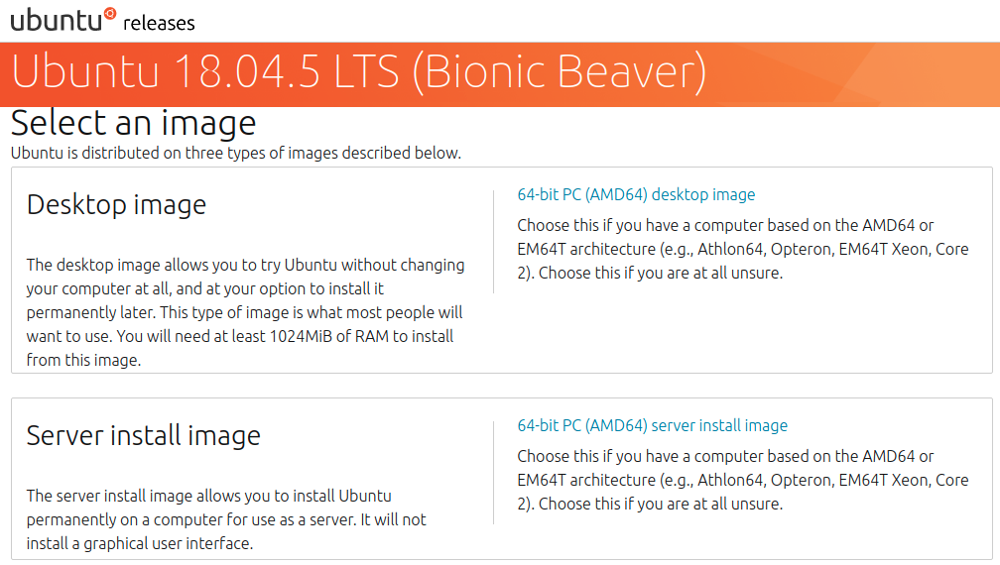

* Draft: 2021-08-04 (Wed)

# New Desktop

## Check the most recent Ubuntu version supported by TensorFlow

[GPU support](https://www.tensorflow.org/install/gpu) > [Install CUDA with apt](https://www.tensorflow.org/install/gpu#install_cuda_with_apt)

Google search: ubuntu download 18.04

https://releases.ubuntu.com/18.04.5/

64-bit PC (AMD64) desktop image
