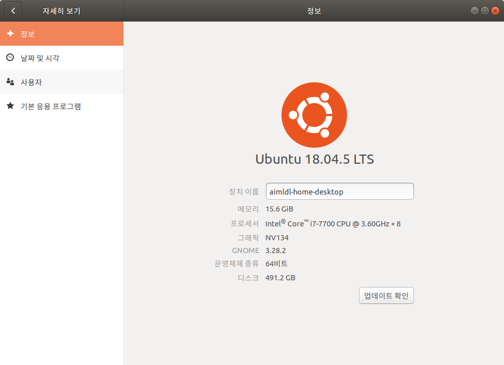
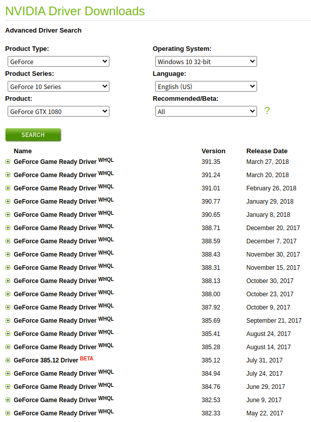

* Draft: 2021-01-10 (Sun)

# 우분투 18.04에서 NVIDIA GeForce 1080을 설정하는 방법

* 테스트 환경
  * (base) k8smaster@k8smaster-Alienware-Aurora-R7

## 개요

GPGPU를 사용을 위한 GPU카드 설정에서 

1. NVIDIA 그래픽 카드 드라이버 설치하기
3. cuDNN 둥 NVIDIA CUDA tools 설치하기

등의 절차를 거쳐야 합니다.

(1) 그래픽 카드에 대한 정보 알아내기

```bash
$ ubuntu-drivers devices
  ...bash
model    : GP104 [GeForce GTX 1080]
  ...
$
```

(2) `설정 > 정보`에서 시스템에 설치된 그래픽 카드 확인하기. 

(NVIDIA의 그래픽 카드 드라이버가 아닐 경우)

(3) 다음 명령어로  드라이버를 수동으로 설치하기

```bash
$ sudo ubuntu-drivers autoinstall
[sudo] aimldl의 암호: 
  ...
완료되었습니다
Processing triggers for initramfs-tools (0.136ubuntu6.3) ...
update-initramfs: Generating /boot/initrd.img-5.8.0-36-generic
$
```

(4) 시스템 재부팅

```bash
$ reboot
```

(5) `설정 > 정보`에서 시스템에 설치된 그래픽 카드 확인하기

(6) 드라이버 버전 등을 `nvidia-smi`명령어로 확인하기

```bash
$ nvidia-smi
```

### 주의 사항

* GPU환경을 구축할 때 텐서프로가 지원하는 `CUDA 버전`은 항상 오래된 것이기 때문에 작은 문제가 발생하기 마련이므로 주의가 필요합니다.
  * 텐서플로는 오래된 `CUDA 버전`인 `10.1`을 지원합니다.
  * 이 문서가 작성된 시점에서 `CUDA 버전`은 `11.2`입니다. 


## 1. NVIDIA 그래픽 카드 드라이버 설치하기 전에

(1) 그래픽 카드에 대한 정보 알아내기

```
$ ubuntu-drivers devices
  ...
model    : GP104 [GeForce GTX 1080]
  ...																																						
$
```

(2) `설정 > 정보`에서 시스템에 설치된 그래픽 카드 확인하기. 



`그래픽`이 `NV134`로 되어있습니다. NVIDIA사의 그래픽 카드 드라이버로 설치해야 합니다.

### 주의 사항

GPU환경을 구축할 때 텐서플로가 지원하는 `CUDA 버전`은 항상 오래된 것이기 때문에 작은 문제가 발생하기 마련이므로 주의가 필요합니다.

* 텐서플로는 오래된 `CUDA 버전`인 `10.1`을 지원합니다.
* 우분투가 제공하는 자동설치 명령어를 쓰면 일반적인 경우에는 편리합니다. 하지만 여러가지 이슈가 발생할 수 있습니다.
  * 이 문서가 작성된 시점에서 `CUDA 버전`은 `11.2`입니다. 
  * [부록: 왜 최신 버전의 우분투와 CUDA를 쓰지 않는가?](appendix/why_not_use_the_newest_ubuntu_and_cuda_versions.md)

### 2. 다운로드

[NVIDIA Driver Downloads](https://www.nvidia.com/Download/Find.aspx)에서

nvidia download

[TensorFlow 2 설치](https://www.tensorflow.org/install)

>  CUDA® 지원 카드에 관한 내용은 [GPU 가이드](https://www.tensorflow.org/install/gpu)를 참조하세요.

[GPU 지원](https://www.tensorflow.org/install/gpu)

https://www.tensorflow.org/install/gpu




