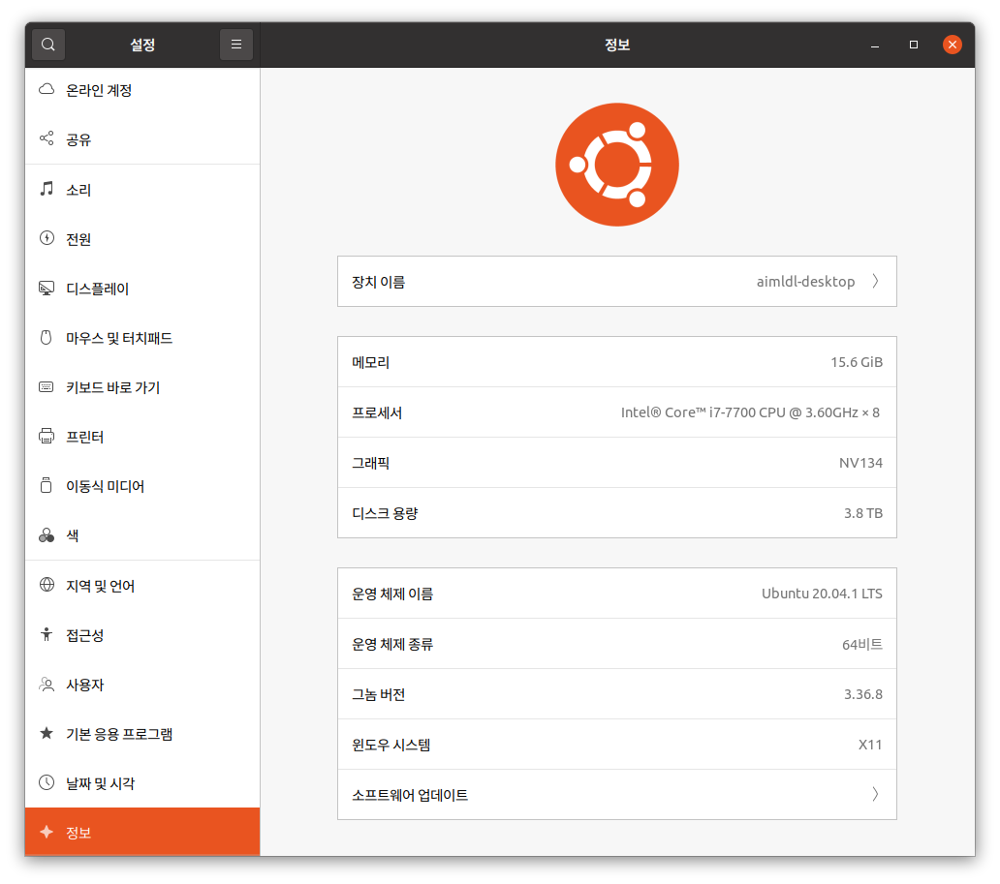

* Draft: 2021-01-10 (Sun)

# 우분투 20.04에 NVIDIA GeForce 1080Ti를  설정하는 방법

# (How to Set up NVIDIA GeForce 1080 Ti on Ubuntu 20.04)

In English, refer to

1. [Install NVIDIA Graphics Card Driver on Ubuntu Automatically](../en/install/nvidia_graphics_card_driver_automatically-ubuntu20_04.md)
2. [Install NVIDIA CUDA Toolkit for Ubuntu 20.04](../en/install/nvidia_cuda_toolkit-ubuntu20_04.md)
3. [Install NVIDIA cuDNN for Ubuntu 20.04](../en/install/nvidia_cudnn-ubuntu20_04.md)

# 우분투 20.04에서 NVIDIA GeForce 1080Ti GPU카드 설정하는 방법

## 개요

GPGPU를 사용을 위한 GPU카드 설정에서 3가지를 해야합니다.

1. NVIDIA 그래픽 카드 드라이버 설치하기
3. model    : GP104 [GeForce GTX 1080]cuDNN 설치하기

## 요약

### 1. NVIDIA 그래픽 카드 드라이버 설치하기

(1) 그래픽 카드에 대한 정보 알아내기

```bash
$ ubuntu-drivers devices
  ...bash
model    : GP104 [GeForce GTX 1080]
  ...
$
```

(2) `설정 > 정보`에서 시스템에 설치된 그래픽 카드 확인하기. 

(NVIDIA의 그래픽 카드 드라이버가 아닐 경우)

(3) 다음 명령어로  드라이버를 자동으로 설치하기

```bash
$ sudo ubuntu-drivers autoinstall
[sudo] aimldl의 암호: 
  ...
완료되었습니다
Processing triggers for initramfs-tools (0.136ubuntu6.3) ...
update-initramfs: Generating /boot/initrd.img-5.8.0-36-generic
$
```

(4) 시스템 재부팅

```bash
$ reboot
```

(5) `설정 > 정보`에서 시스템에 설치된 그래픽 카드 확인하기

(6) 드라이버 버전 등을 `nvidia-smi`명령어로 확인하기

```bash
$ nvidia-smi
```

### 주의 사항

* GPU환경을 구축할 때 텐서프로가 지원하는 `CUDA 버전`은 항상 오래된 것이기 때문에 작은 문제가 발생하기 마련이므로 주의가 필요합니다.
  * 텐서플로는 오래된 `CUDA 버전`인 `10.1`을 지원합니다.
  * 이 문서가 작성된 시점에서 `CUDA 버전`은 `11.2`입니다. 

### 


## 1. NVIDIA 그래픽 카드 드라이버 설치하기

(1) 그래픽 카드에 대한 정보 알아내기

```
$ ubuntu-drivers devices
  ...
model    : GP104 [GeForce GTX 1080]
  ...
$
```

(2) `설정 > 정보`에서 시스템에 설치된 그래픽 카드 확인하기. 



`그래픽`이 `NV134`로 되어있습니다. NVIDIA사의 그래픽 카드 드라이버로 설치해야 합니다.


(NVIDIA의 그래픽 카드 드라이버가 아닐 경우)

(3) 다음 명령어로  드라이버를 자동으로 설치하기

```bash
$ sudo ubuntu-drivers autoinstall
[sudo] aimldl의 암호: 
  ...
완료되었습니다
Processing triggers for initramfs-tools (0.136ubuntu6.3) ...
update-initramfs: Generating /boot/initrd.img-5.8.0-36-generic
$
```

(4) 시스템 재부팅

```bash
$ reboot
```

(5) `설정 > 정보`에서 시스템에 설치된 그래픽 카드 확인하기

빙고! `그래픽`이 `NVIDIA Corporation GP 104 [GeForce GTX 1080]`으로 인식되었습니다.


(6) 드라이버 버전 등을 `nvidia-smi`명령어로 확인하기

```bash
$ nvidia-smi
```

출력 메세지는 아래와 같습니다.

```bash
Sun Jan 10 23:53:02 2021       
+-----------------------------------------------------------------------------+
| NVIDIA-SMI 460.32.03    Driver Version: 460.32.03    CUDA Version: 11.2     |
|-------------------------------+----------------------+----------------------+
| GPU  Name        Persistence-M| Bus-Id        Disp.A | Volatile Uncorr. ECC |
| Fan  Temp  Perf  Pwr:Usage/Cap|         Memory-Usage | GPU-Util  Compute M. |
|                               |                      |               MIG M. |
|===============================+======================+======================|
|   0  GeForce GTX 1080    Off  | 00000000:01:00.0  On |                  N/A |
|  0%   38C    P8    13W / 200W |    384MiB /  8118MiB |      2%      Default |
|                               |                      |                  N/A |
+-------------------------------+----------------------+----------------------+
                                                                               
+-----------------------------------------------------------------------------+
| Processes:                                                                  |
|  GPU   GI   CI        PID   Type   Process name                  GPU Memory |
|        ID   ID                                                   Usage      |
|=============================================================================|
|    0   N/A  N/A      1009      G   /usr/lib/xorg/Xorg                182MiB |
|    0   N/A  N/A      1266      G   /usr/bin/gnome-shell              120MiB |
|    0   N/A  N/A      4302      G   ...AAAAAAAAA= --shared-files       77MiB |
+-----------------------------------------------------------------------------+
$
```

이번에 설치된 

* 드라이버 버전은 `460.32.03`
* CUDA 버전은 `11.2`

입니다.

### 주의 사항

* GPU환경을 구축할 때 텐서프로가 지원하는 `CUDA 버전`은 항상 오래된 것이기 때문에 작은 문제가 발생하기 마련이므로 주의가 필요합니다.
  * 텐서플로는 오래된 `CUDA 버전`인 `10.1`을 지원합니다.
  * 이 문서가 작성된 시점에서 `CUDA 버전`은 `11.2`입니다. 

```bash
$ python3 -c 'import tensorflow as tf'
2021-01-11 17:28:01.246385: W tensorflow/stream_executor/platform/default/dso_loader.cc:60] Could not load dynamic library 'libcudart.so.11.0'; dlerror: libcudart.so.11.0: cannot open shared object file: No such file or directory
2021-01-11 17:28:01.246512: I tensorflow/stream_executor/cuda/cudart_stub.cc:29] Ignore above cudart dlerror if you do not have a GPU set up on your machine.
$
```

### 문제

```bash
Could not load dynamic library 'libcudart.so.11.0'; dlerror: libcudart.so.11.0: cannot open shared object file: No such file or directory
```

### 힌트

> Google search: Could not load dynamic library 'libcudart.so.11.0'; dlerror: libcudart.so.11.0: cannot open shared object file: No such file or directory

* #### [Could not load dynamic library 'libcudart.so.10.1'; dlerror: libcudart.so.10.1: cannot open shared object file: No such file or directory #38578](https://github.com/tensorflow/tensorflow/issues/38578)

> **[gadagashwini](https://github.com/gadagashwini)** commented [on 17 Apr 2020](https://github.com/tensorflow/tensorflow/issues/38578#issuecomment-615184395)
>
> [@domindominik](https://github.com/domindominik), To use CUDA 10.2 with Tensorflow 2.2. Please build the Tensorflow from source. Follow the instructions mentioned [here](https://www.tensorflow.org/install/source). And also take a look at this [comment.](https://github.com/tensorflow/tensorflow/issues/38194#issuecomment-609922803)Thanks

CUDA 10.2으로 업그레이드 하려고 해도 소스를 컴파일해야 하므로 상당히 번거롭습니다. CUDA 10.1을 쓰는게 낫겠습니다.

> **[ozett](https://github.com/ozett)** commented [on 4 Jul 2020](https://github.com/tensorflow/tensorflow/issues/38578#issuecomment-653752758)
>
> [#38578 (comment)](https://github.com/tensorflow/tensorflow/issues/38578#issuecomment-636414914) > `sudo apt-get install cuda-cudart-10-1`install ing "cuda-cudart-10-1" seems not sufficient.. libcublas.so.10 still missing in my ub18. install. i will try intstall complete "cuda-10-1" to solve this issue..

```bash
$ sudo apt install libcudart10.1
패키지 목록을 읽는 중입니다... 완료
의존성 트리를 만드는 중입니다       
상태 정보를 읽는 중입니다... 완료
패키지 libcudart10.1는 이미 최신 버전입니다 (10.1.243-3).
libcudart10.1 패키지는 수동설치로 지정합니다.
0개 업그레이드, 0개 새로 설치, 0개 제거 및 0개 업그레이드 안 함.
$
```

충분하지 않다고 하는데, 위에서 확인해보면 이미 최신 버전이라고 합니다.

> **[ozett](https://github.com/ozett)** commented [on 23 Jul 2020](https://github.com/tensorflow/tensorflow/issues/38578#issuecomment-662920141)
>
> try to look if you have cuda* in your repo `apt search --names-only 'cuda'`and lookup the packages (...10-1/10-2...) like:

명령어를 실행해서 `cuda`라는 이름을 가진 경우를 검색해보면

```bash
$ sudo apt search --names-only 'cuda'
정렬중... 완료
전체 텍스트 검색... 완료
boinc-client-nvidia-cuda/focal 7.16.6+dfsg-1 amd64
  metapackage for CUDA-savvy BOINC client and manager

libcuda1-331/focal 340.108-0ubuntu2 amd64
  Transitional package for libcuda1-340

libcuda1-331-updates/focal 340.108-0ubuntu2 amd64
  Transitional package for libcuda1-340

libcuda1-340/focal 340.108-0ubuntu2 amd64
  NVIDIA CUDA runtime library

libcuda1-340-updates/focal 340.108-0ubuntu2 amd64
  Transitional package for libcuda1-340

libcuda1-384/focal-updates 390.141-0ubuntu0.20.04.1 amd64
  Transitional package for nvidia-headless-390

libcudart10.1/focal,now 10.1.243-3 amd64 [설치됨,자동]
  NVIDIA CUDA Runtime Library

nvidia-cuda-dev/focal,now 10.1.243-3 amd64 [설치됨,자동]
  NVIDIA CUDA development files

nvidia-cuda-doc/focal,focal,now 10.1.243-3 all [설치됨,자동]
  NVIDIA CUDA and OpenCL documentation

nvidia-cuda-gdb/focal,now 10.1.243-3 amd64 [설치됨,자동]
  NVIDIA CUDA Debugger (GDB)

nvidia-cuda-toolkit/focal,now 10.1.243-3 amd64 [설치됨]
  NVIDIA CUDA development toolkit

nvidia-cuda-toolkit-gcc/focal 10.1.243-3 amd64
  NVIDIA CUDA development toolkit (GCC compatibility)

python-pycuda-doc/focal,focal 2018.1.1-4build2 all
  module to access Nvidia‘s CUDA computation API (documentation)

python3-pycuda/focal 2018.1.1-4build2 amd64
  Python 3 module to access Nvidia‘s CUDA parallel computation API

python3-pycuda-dbg/focal 2018.1.1-4build2 amd64
  Python 3 module to access Nvidia‘s CUDA API (debug extensions)

$
```

`libcudart10.1/focal,now 10.1.243-3 amd64 [설치됨,자동]`으로 이미 설치된 것으로 나옵니다.

그런데 왜 문제가 생기는 걸까요?

* [tensorflow-gpu: Could not load dynamic library 'libcudart.so.10.1' #39132](https://github.com/tensorflow/tensorflow/issues/39132)

> ### **[gillouche](https://github.com/gillouche)** commented [on 4 May 2020](https://github.com/tensorflow/tensorflow/issues/39132#issue-611500123)
>
> System information
>
> * Have I written custom code (as opposed to using a stock example script provided in TensorFlow)
>
> ```bash
> import tensorflow as tf
> print("Num GPUs Available: ", len(tf.config.experimental.list_physical_devices('GPU')))
> ```
>
> - **OS Platform and Distribution (e.g., Linux Ubuntu 16.04)**: ArchLinux 64bits
> - **TensorFlow installed from (source or binary)**: binary
> - **TensorFlow version (use command below)**: tensorflow-gpu 2.2.0rc4
> - **Python version**: 3.8.2
> - **CUDA/cuDNN version**: 10.2.89-5 (from Archlinux repo)
>
> Here is the CUDA lib I have installed:
>
> ```bash
> /opt/cuda/doc/man/man7/libcudart.7
> /opt/cuda/doc/man/man7/libcudart.so.7
> /opt/cuda/targets/x86_64-linux/lib/libcudart.so
> /opt/cuda/targets/x86_64-linux/lib/libcudart.so.10
> /opt/cuda/targets/x86_64-linux/lib/libcudart.so.10.2
> /opt/cuda/targets/x86_64-linux/lib/libcudart.so.10.2.89
> /opt/cuda/targets/x86_64-linux/lib/libcudart_static.a
> ```
>
> **Describe the problem**
>
> TensorFlow doesn't use my GPU because there is a bug while trying to load "libcudart.so.10.1". My system has libcudart.so.10.2 installed
> All the other libraries load fine since they look for libcu***.so.10 and not 10.1
>
> **Source code / logs**
>
> ```bash
> Python 3.8.2 (default, Apr  8 2020, 14:31:25) 
> [GCC 9.3.0] on linux
> Type "help", "copyright", "credits" or "license" for more information.
> >>> import tensorflow as tf
> >>> print("Num GPUs Available: ", len(tf.config.experimental.list_physical_devices('GPU')))
> 2020-05-03 22:17:42.422067: I tensorflow/stream_executor/platform/default/dso_loader.cc:44] Successfully opened dynamic library libcuda.so.1
> 2020-05-03 22:17:42.471297: I tensorflow/stream_executor/cuda/cuda_gpu_executor.cc:981] successful NUMA node read from SysFS had negative value (-1), but there must be at least one NUMA node, so returning NUMA node zero
> 2020-05-03 22:17:42.472040: I tensorflow/core/common_runtime/gpu/gpu_device.cc:1561] Found device 0 with properties: 
> pciBusID: 0000:09:00.0 name: GeForce GTX 1080 Ti computeCapability: 6.1
> coreClock: 1.683GHz coreCount: 28 deviceMemorySize: 10.91GiB deviceMemoryBandwidth: 451.17GiB/s
> 2020-05-03 22:17:42.472169: W tensorflow/stream_executor/platform/default/dso_loader.cc:55] Could not load dynamic library 'libcudart.so.10.1'; dlerror: libcudart.so.10.1: cannot open shared object file: No such file or directory
> 2020-05-03 22:17:42.473728: I tensorflow/stream_executor/platform/default/dso_loader.cc:44] Successfully opened dynamic library libcublas.so.10
> 2020-05-03 22:17:42.475267: I tensorflow/stream_executor/platform/default/dso_loader.cc:44] Successfully opened dynamic library libcufft.so.10
> 2020-05-03 22:17:42.475499: I tensorflow/stream_executor/platform/default/dso_loader.cc:44] Successfully opened dynamic library libcurand.so.10
> 2020-05-03 22:17:42.477078: I tensorflow/stream_executor/platform/default/dso_loader.cc:44] Successfully opened dynamic library libcusolver.so.10
> 2020-05-03 22:17:42.478053: I tensorflow/stream_executor/platform/default/dso_loader.cc:44] Successfully opened dynamic library libcusparse.so.10
> 2020-05-03 22:17:42.481446: I tensorflow/stream_executor/platform/default/dso_loader.cc:44] Successfully opened dynamic library libcudnn.so.7
> 2020-05-03 22:17:42.481478: W tensorflow/core/common_runtime/gpu/gpu_device.cc:1598] Cannot dlopen some GPU libraries. Please make sure the missing libraries mentioned above are installed properly if you would like to use GPU. Follow the guide at https://www.tensorflow.org/install/gpu for how to download and setup the required libraries for your platform.
> Skipping registering GPU devices...
> Num GPUs Available:  0
> ```
>
> 


```bash

```

