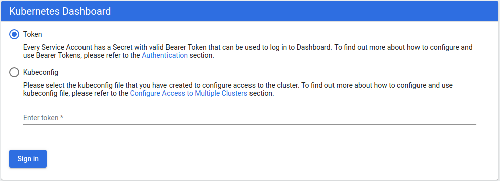
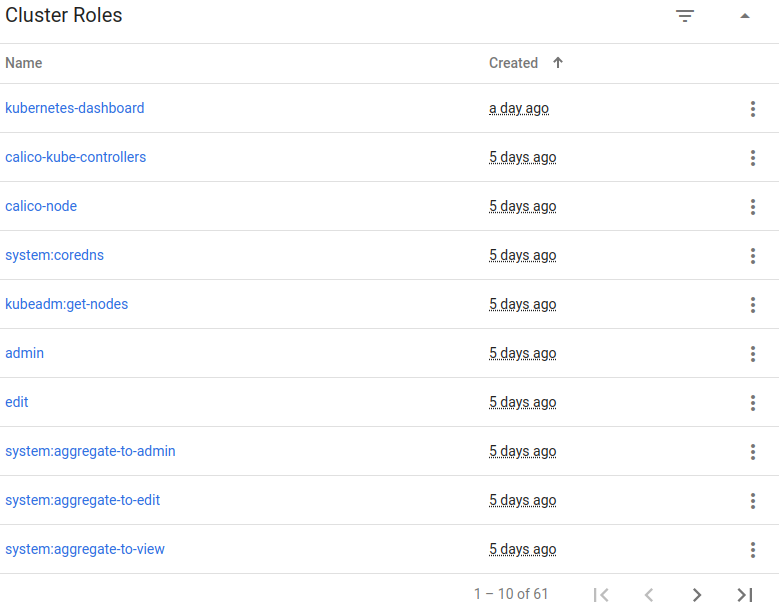
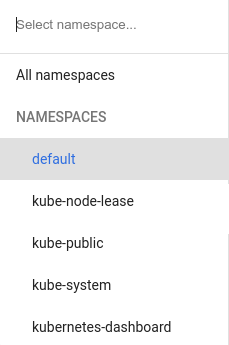
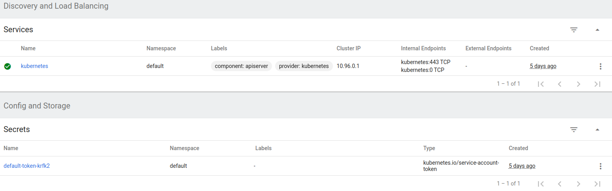
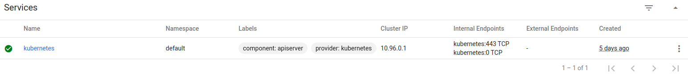
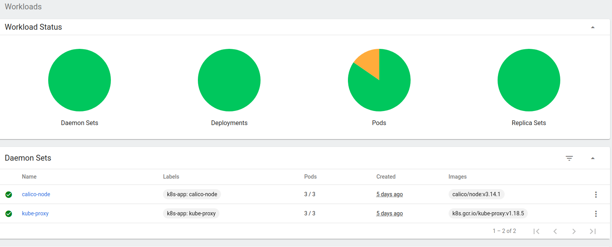
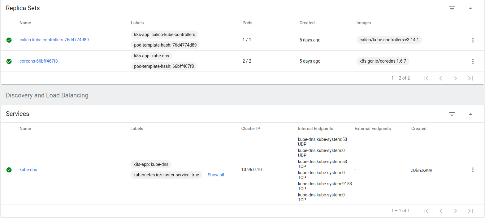
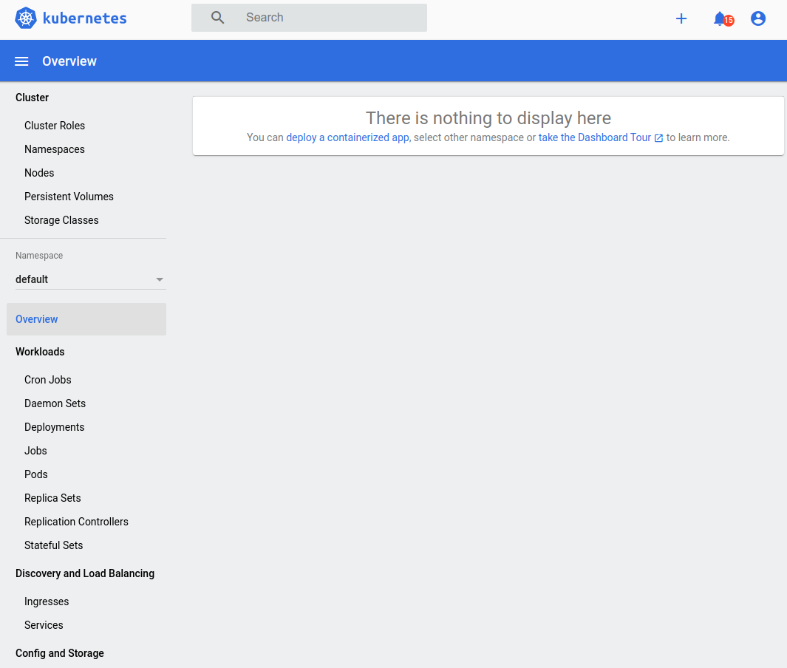

* Rev.3: 2020-08-03 (Mon)
* Rev.3: 2020-07-24 (Fri)
* Rev.2: 2020-07-09 (Thu)
* Rev.1: 2020-07-08 (Wed)
* Draft: 2020-07-07 (Tue)

# 쿠버네티스 대쉬보드 설치하기

## 개요

* 쿠버네티스 대시보드 (Kubernetes Dashboard)는 관리를 위한 웹UI입니다. 

* 커맨드 라인용 UI인 k9s 명령어도 있습니다.
* 대시보드와 k9s 모두 설치하면 편리합니다.

## 요약

로컬 컴퓨터, 즉 베어 메탈, 에 있는 쿠버네티스 클러스터에 대쉬보드를 설치합니다.

```bash
$ kubectl apply -f https://raw.githubusercontent.com/kubernetes/dashboard/v2.0.0/aio/deploy/recommended.yaml
```

토큰을 확인합니다.

```bash
$ kubectl -n kube-system describe $(kubectl -n kube-system get secret -n kube-system -o name | grep namespace) | grep token
```

대쉬보드를 실행합니다.

```bash
$ kubectl proxy
```

웹브라우저의 주소창에 아래 주소를 입력합니다.

http://localhost:8001/api/v1/namespaces/kubernetes-dashboard/services/https:kubernetes-dashboard:/proxy/#!/login



토큰 값을 입력하고 `Sign in`버튼을 누릅니다.


대시보드의 내용을 훑어봅니다. 

아래에서는 동일한 내용을 보다 자세히 설명합니다.

## 설치 (Deployment) 하기

일반적으로 쿠버네티스 클러스터에 설치할 때는 아래와 같은 명령어를 실행합니다.

```bash
$ kubectl apply -f [manifest]
```

쿠버네티스 대쉬보드의 매니페스트는 

```text
https://raw.githubusercontent.com/kubernetes/dashboard/v2.0.3/aio/deploy/recommended.yaml
```

입니다. 최신 버전을 설치하기 위해선 [GitHub의 Kubernetes Dashboard 페이지](https://github.com/kubernetes/dashboard)의 명령어를 확인하세요. 위의 매니페스트와 버전이 다를 수 있습니다.

마스터에서 다음 명령어를 실행하면 설치가 진행됩니다.

```bash
$ kubectl apply -f https://raw.githubusercontent.com/kubernetes/dashboard/v2.0.3/aio/deploy/recommended.yaml
```

설치 시 출력 메세지는

```bash
namespace/kubernetes-dashboard created
serviceaccount/kubernetes-dashboard created
service/kubernetes-dashboard created
secret/kubernetes-dashboard-certs created
secret/kubernetes-dashboard-csrf created
secret/kubernetes-dashboard-key-holder created
configmap/kubernetes-dashboard-settings created
role.rbac.authorization.k8s.io/kubernetes-dashboard created
clusterrole.rbac.authorization.k8s.io/kubernetes-dashboard created
rolebinding.rbac.authorization.k8s.io/kubernetes-dashboard created
clusterrolebinding.rbac.authorization.k8s.io/kubernetes-dashboard created
deployment.apps/kubernetes-dashboard created
service/dashboard-metrics-scraper created
deployment.apps/dashboard-metrics-scraper created
$
```

와 같습니다. 

## 설치 확인하기

대쉬보드의 설치여부를 확인하기 위해 전체 네임스페이스의 파드의 리스트를 확인하면, 새로 두 개의 파드가 추가 되었음을 알 수 있습니다.

```bash
$ kubectl get pods --all-namespaces
NAMESPACE              NAME                                            READY   STATUS    RESTARTS   AGE
  ...
kubernetes-dashboard   dashboard-metrics-scraper-6b4884c9d5-r6fzx      1/1     Running   0          24h
kubernetes-dashboard   kubernetes-dashboard-7b544877d5-bldt8           1/1     Running   0          24h
$
```

## 대쉬보드에 접속하기

대쉬보드에 로그인하기 위해 ID와 Password를 쓰는 대신 인증 토큰 (Authentication Token)을 이용합니다.

### Step 1. 마스터에서 기존 토큰 값을 확인합니다.

```bash
$ kubectl -n kube-system describe $(kubectl -n kube-system get secret -n kube-system -o name | grep namespace) | grep ^token | sed -e 's/^token:[ ]*//'
a1b ... y9z
$
```

`a1b ... y9z`로 표기된 것이 토큰 값입니다. 

참고: 위의 명령어는 쿠버네티스 공식 홈페이지에 있는 아래 명령어를 수정한 것입니다.

```bash
$ kubectl -n kube-system describe $(kubectl -n kube-system get secret -n kube-system -o name | grep namespace) | grep token
Name:         namespace-controller-token-g85r7
Type:  kubernetes.io/service-account-token
token:      a1b ... y9z
$
```

`$( ... )` 안의 명령어는 다음 스트링을 리턴합니다.

```bash
$ kubectl -n kube-system get secret -n kube-system -o name | grep namespace
secret/namespace-controller-token-g85r7
$
```

 토큰 외의 다른 정보가 포함되어 있으므로, 명령어를 수정해서 다른 정보를 제거합니다. 우선 

`grep token`을 `grep ^token`으로 변경하면 "token:"으로 시작되는 행만 남습니다.

```bash
$ kubectl -n kube-system describe $(kubectl -n kube-system get secret -n kube-system -o name | grep namespace) | grep ^token
token:      a1b ... y9z
$
```

`sed`명령어로 `token:`으로 시작하고 스페이스가 이어지는 부분을 제거합니다. 정규표현식으로 `^token:[ ]*에 매칭되는 부분은 a의 앞부분까지인 "token:      "입니다.

참고로 위의 명령어를 두 줄로 표현할 수 있습니다.
```bash
$ SECRET_NAME=$(kubectl -n kube-system get secret -n kube-system -o name | grep namespace)
$ kubectl -n kube-system describe $SECRET_NAME | grep ^token | sed -e 's/^token:[ ]*//'
```
혹은 아래 명령어도 동일한 토큰값을 리턴합니다.
```bash
$ kubectl describe secret $(kubectl get secrets | grep ^default | cut -f1 -d ' ') | grep -E '^token' | cut -f2 -d':' | tr -d " "
```
가독성을 위해 아래처럼 두 줄로 표현할 수도 있습니다.
```bash
$ SECRET_NAME=$(kubectl get secrets | grep ^default | cut -f1 -d ' ')
$ kubectl describe secret $SECRET_NAME | grep -E '^token' | cut -f2 -d':' | tr -d " "
```

### Step 2. `kubectl proxy` 명령어로 대쉬보드를 실행합니다.

```bash
$ kubectl proxy
Starting to serve on 127.0.0.1:8001
```

대쉬보드 서버를 `127.0.0.1`의 `8001`포트로 접속할 수 있게 했습니다. 즉, 대쉬보드는 이 명령어가 실행된 컴퓨터에서만 접속할 수 있습니다. 외부에서 접속하려면 DNS 등의 설정을 별도로 해줘야합니다.

### Step 3. 웹 브라우저의 주소창에 다음 링크를 입력합니다.

```text
http://localhost:8001/api/v1/namespaces/kubernetes-dashboard/services/https:kubernetes-dashboard:/proxy/#!/login
```


참고로 Step 2와 3를 `kubectl proxy` 명령어가 아닌 `kubectl port-forward` 명령어로 대체할 수도 있습니다.
```bash
$ kubectl port-forward -n kubernetes-dashboard service/kubernetes-dashboard 8080:443
```
를 실행하고 웹브라우저에 간단한 링크를 입력해도 됩니다.
```text
https://localhost:8080
```
`kubectl proxy`와 `kubectl port-forward` 명령어 및 링크는 대쉬보드가 설치된 마스터에서만 사용할 수 있습니다. 보다 자세한 내용은 [Accessing Dashboard](https://github.com/kubernetes/dashboard/blob/master/docs/user/accessing-dashboard/README.md)를 참고하세요.

### Step 4. 인증 토큰으로 대쉬보드에 접속합니다. 

토큰 값을 붙여넣기/입력하고, `Sign in`버튼을 누릅니다.


`Sign in`버튼을 누르면 대시보드의 메인 화면이 나옵니다. 


## 대시보드 훑어보기

대시보드 사용에 대한 자세한 내용은 [kubernetes/dashboard의 GitHub 프로젝트 문서](https://github.com/kubernetes/dashboard)를 참고하세요.

### Cluster > Cluster Roles



### Cluster > Namespaces


### Cluster > Nodes


### Namespace

실제 화면에서는 이렇게 전체 네임스페이스가 보이지 않지만, 보기 쉽도록 편집했습니다.




### Overview

Overview에는 선택한 네임 스페이스 아래에 있는 메뉴의 항목들을 모두 볼 수 있습니다.

#### Default 네임스페이스



Default 네임 스페이스의 경우에 두 개의 항목이 있습니다. 각 항목에 해당하는 메뉴의 내용을 비교해 보면 Overview의 내용과 동일하다는 것을 알 수 있습니다.

### Discovery and Load Balancing

#### Services

두 가지 메뉴는 현 상황에서 동일한 내용을 보여줍니다.



### Config and Storage

####   Secrets

두 가지 메뉴는 현 상황에서 동일한 내용을 보여줍니다.


#### kube-system 네임스페이스







### Custom Resource Definitions


### Settings


### About


### 나머지 항목들

```text
There is nothing to display here
      No resources found
```

라는 메세지가 보입니다.

## 다음

[클러스터에 신규 노드 조인 (Join)하기](add_a_new_node_to_the_existing_cluster.md)

## 참고 문서

* [Kubernetes Dashboard](https://github.com/kubernetes/dashboard), kubernetes/dashboard 공식 github repository
* [Kubernetes Dashboard Documentation](https://github.com/kubernetes/dashboard/tree/master/docs), kubernetes/dashboard의 문서
  * [Accessing Dashboard](https://github.com/kubernetes/dashboard/blob/master/docs/user/accessing-dashboard/README.md)
* [Web UI (Dashboard)](https://kubernetes.io/docs/tasks/access-application-cluster/web-ui-dashboard/), 쿠버네티스 공식 문서
* [자습서: Kubernetes 웹 UI 배포(대시보드)](https://docs.aws.amazon.com/ko_kr/eks/latest/userguide/dashboard-tutorial.html), Amazon EKS 사용 설명서

## 부록: 

대쉬보드에 접속하기 위해 토큰을 입력해야 합니다.


이 때 

```bash
$ kubectl -n kube-system describe $(kubectl -n kube-system get secret -n kube-system -o name | grep namespace) | grep token
```

명령어로 토큰을 확인하지 않고, `kubeadm token`명령어를 쓰게 되면 어떻게 될까요?

 `kubeadm token list`명령어를 실행하면 생성된 토큰의 정보가 보입니다. 생성된 토큰은 24시간 후에 소멸되므로, 24시간이 지난 경우엔 아래처럼 보이지 않습니다.

```bash
$ kubeadm token list
```

토큰을 새로 만듭니다. 

```bash
$ kubeadm token create
qioqmq.phvo5rml0cy4bctd
$
```

`kubeadm token list`명령어를 다시 실행하면 신규 생성된 토큰에 대한 정보가 보입니다.

```bash
$ kubeadm token list
TOKEN                    TTL  EXPIRES                    ...  EXTRA GROUPS
qioqmq.phvo5rml0cy4bctd  23h  2020-07-09T14:22:55+09:00  ...  system:bootstrappers:kubeadm:default-node-token
$
```

이 토큰 `qioqmq.phvo5rml0cy4bctd`을 입력하면 


대쉬보드에 접속할 수 있습니다. 하지만 아무 것도 보이지 않습니다. 메뉴의 다른 메뉴를 클릭해도 `There is nothing to display here`라는 메세지만 보입니다.


