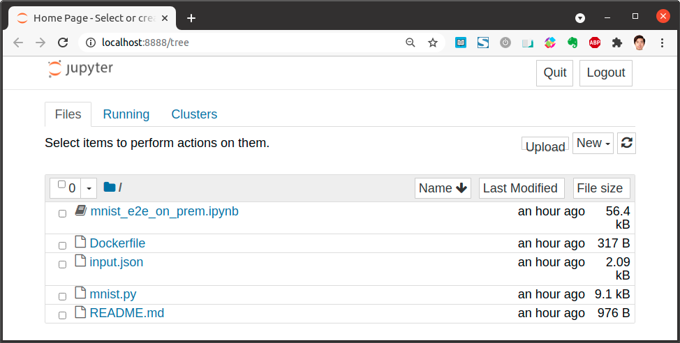

* Draft: 2021-05-18 (Tue)

# E2E MNIST Example

## Overview

This page is a hands-on for [Kubeflow Fairing E2E MNIST Case: Building, Training and Serving](https://github.com/kubeflow/fairing/tree/master/examples/mnist).

In this example, an existing TensorFlow code is modified to support distributed training.

* [tensorflow](https://github.com/tensorflow/tensorflow/tree/9a24e8acfcd8c9046e1abaac9dbf5e146186f4c2)/[tensorflow](https://github.com/tensorflow/tensorflow/tree/9a24e8acfcd8c9046e1abaac9dbf5e146186f4c2/tensorflow)/[examples](https://github.com/tensorflow/tensorflow/tree/9a24e8acfcd8c9046e1abaac9dbf5e146186f4c2/tensorflow/examples)/[learn](https://github.com/tensorflow/tensorflow/tree/9a24e8acfcd8c9046e1abaac9dbf5e146186f4c2/tensorflow/examples/learn)/[mnist.py](https://github.com/tensorflow/tensorflow/blob/9a24e8acfcd8c9046e1abaac9dbf5e146186f4c2/tensorflow/examples/learn/mnist.py)
  * This code trains CNN with MNIST dataset.

Kubeflow Fairing

* builds docker image,
* launches TFJob to train model, and
* deploy the trained model.

Kubeflow Fairing

* creates InferenceService (KFServing CRD) to deploy model service in this process.

`kubeflow-tfjob` and `kfserving` SDK client is used to clean up the `TFJob` and `InferenceService`.

> CRD
>
> * stands for Custom Resource Definition. 
> * enables users to add custom objects to the Kubernetes cluster so they can be used like native Kubernetes objects.

## Steps

1. Launch a Jupyter notebook
2. Open the notebook [mnist_e2e_on_prem.ipynb](https://github.com/kubeflow/fairing/blob/master/examples/mnist/mnist_e2e_on_prem.ipynb)
3. Follow the notebook to train and deploy MNIST on Kubeflow

## Hands-on

* Prerequisite: `kf` virtual environment.
  * If you haven't set up the Conda virtual environment, go to [Environment Setup](1_2-environment_setup.md), set up the environment, and then come back here again.

```bash
(kf) $ cd ~/kubeflow/fairing/examples/mnist
(kf) $ ls
Dockerfile  README.md  input.json  mnist.py  mnist_e2e_on_prem.ipynb
(kf) $
```

Run Jupyter Notebook

```bash
(kf) $ jupyter notebook
```

and a web browser pops up.



Click `mnist_e2e_on_prem.ipynb` to open the .ipynb file.


## Further Reading

* [MNIST on Kubeflow](https://github.com/kubeflow/examples/tree/master/mnist)

> This example guides you through the process of taking an example model, modifying it to run better within Kubeflow, and serving the resulting trained model.
>
> Follow the version of the guide that is specific to how you have deployed Kubeflow
>
> 1. [MNIST on Kubeflow on GCP](https://github.com/kubeflow/examples/tree/master/mnist#gcp)
> 2. [MNIST on Kubeflow on AWS](https://github.com/kubeflow/examples/tree/master/mnist#aws)
> 3. [MNIST on Kubeflow on Azure](https://github.com/kubeflow/examples/tree/master/mnist#azure)
> 4. [MNIST on Kubeflow on IBM Cloud](https://github.com/kubeflow/examples/tree/master/mnist#ibm)
> 5. [MNIST on Kubeflow on vanilla k8s](https://github.com/kubeflow/examples/tree/master/mnist#vanilla)

